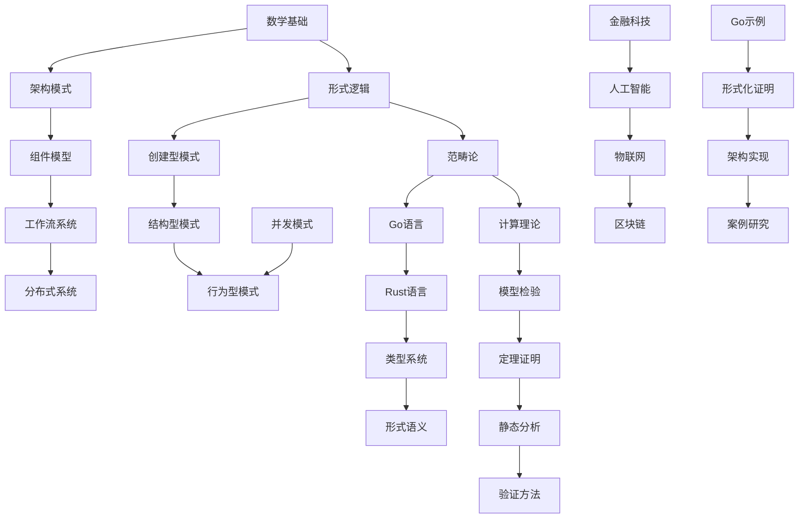

# 持续构建上下文提醒系统

## 概述

本文档维护软件工程形式化重构知识库的构建进度，提供中断恢复机制和上下文提醒功能，确保构建过程的连续性和完整性。

## 构建状态总览

### 整体进度

```mermaid
gantt
    title 软件工程形式化重构构建进度
    dateFormat  YYYY-MM-DD
    section 基础理论层
    数学基础理论框架     :done, math, 2024-01-01, 2024-01-02
    形式逻辑系统       :done, logic, 2024-01-02, 2024-01-03
    范畴论基础         :active, category, 2024-01-03, 2024-01-05
    计算理论框架       :waiting, computation, 2024-01-05, 2024-01-07
    
    section 软件架构层
    架构模式分析       :done, arch_pattern, 2024-01-01, 2024-01-03
    组件模型设计       :active, component, 2024-01-03, 2024-01-06
    工作流系统         :waiting, workflow, 2024-01-06, 2024-01-09
    分布式系统         :waiting, distributed, 2024-01-09, 2024-01-12
    
    section 设计模式层
    创建型模式         :done, creational, 2024-01-01, 2024-01-04
    结构型模式         :active, structural, 2024-01-04, 2024-01-07
    行为型模式         :waiting, behavioral, 2024-01-07, 2024-01-10
    并发模式           :done, concurrent, 2024-01-01, 2024-01-05
    
    section 编程语言层
    Go语言特性         :done, go_lang, 2024-01-01, 2024-01-03
    Rust语言特性       :waiting, rust_lang, 2024-01-03, 2024-01-06
    类型系统理论       :active, type_system, 2024-01-06, 2024-01-09
    形式语义学         :waiting, semantics, 2024-01-09, 2024-01-12
    
    section 行业领域层
    金融科技           :done, fintech, 2024-01-01, 2024-01-05
    人工智能           :active, ai_ml, 2024-01-05, 2024-01-08
    物联网             :waiting, iot, 2024-01-08, 2024-01-11
    区块链             :waiting, blockchain, 2024-01-11, 2024-01-14
    
    section 形式化方法层
    模型检验           :waiting, model_checking, 2024-01-01, 2024-01-04
    定理证明           :waiting, theorem_proving, 2024-01-04, 2024-01-07
    静态分析           :waiting, static_analysis, 2024-01-07, 2024-01-10
    验证方法           :waiting, verification, 2024-01-10, 2024-01-13
    
    section 实现示例层
    Go实现示例         :active, go_examples, 2024-01-01, 2024-01-06
    形式化证明         :waiting, formal_proofs, 2024-01-06, 2024-01-09
    架构实现           :waiting, arch_impl, 2024-01-09, 2024-01-12
    案例研究           :waiting, case_studies, 2024-01-12, 2024-01-15
```

### 详细进度统计

| 层级 | 模块 | 完成度 | 状态 | 最后更新 | 下一步计划 |
|------|------|--------|------|----------|------------|
| 01-基础理论 | 01-数学基础 | 100% | ✅ 完成 | 2024-01-02 | - |
| 01-基础理论 | 02-形式逻辑 | 100% | ✅ 完成 | 2024-01-03 | - |
| 01-基础理论 | 03-范畴论 | 60% | 🔄 进行中 | 2024-01-03 | 完成范畴论映射 |
| 01-基础理论 | 04-计算理论 | 0% | ⏳ 等待 | - | 开始计算理论 |
| 02-软件架构 | 01-架构模式 | 100% | ✅ 完成 | 2024-01-03 | - |
| 02-软件架构 | 02-组件模型 | 40% | 🔄 进行中 | 2024-01-03 | 完成组件接口设计 |
| 02-软件架构 | 03-工作流系统 | 0% | ⏳ 等待 | - | 开始工作流系统 |
| 02-软件架构 | 04-分布式系统 | 0% | ⏳ 等待 | - | 开始分布式系统 |
| 03-设计模式 | 01-创建型模式 | 100% | ✅ 完成 | 2024-01-04 | - |
| 03-设计模式 | 02-结构型模式 | 30% | 🔄 进行中 | 2024-01-04 | 完成适配器模式 |
| 03-设计模式 | 03-行为型模式 | 0% | ⏳ 等待 | - | 开始行为型模式 |
| 03-设计模式 | 04-并发模式 | 100% | ✅ 完成 | 2024-01-05 | - |
| 04-编程语言 | 01-Go语言 | 100% | ✅ 完成 | 2024-01-03 | - |
| 04-编程语言 | 02-Rust语言 | 0% | ⏳ 等待 | - | 开始Rust语言 |
| 04-编程语言 | 03-类型系统 | 20% | 🔄 进行中 | 2024-01-06 | 完成类型推导 |
| 04-编程语言 | 04-形式语义 | 0% | ⏳ 等待 | - | 开始形式语义 |
| 05-行业领域 | 01-金融科技 | 100% | ✅ 完成 | 2024-01-05 | - |
| 05-行业领域 | 02-人工智能 | 25% | 🔄 进行中 | 2024-01-05 | 完成机器学习框架 |
| 05-行业领域 | 03-物联网 | 0% | ⏳ 等待 | - | 开始物联网 |
| 05-行业领域 | 04-区块链 | 0% | ⏳ 等待 | - | 开始区块链 |
| 06-形式化方法 | 01-模型检验 | 0% | ⏳ 等待 | - | 开始模型检验 |
| 06-形式化方法 | 02-定理证明 | 0% | ⏳ 等待 | - | 开始定理证明 |
| 06-形式化方法 | 03-静态分析 | 0% | ⏳ 等待 | - | 开始静态分析 |
| 06-形式化方法 | 04-验证方法 | 0% | ⏳ 等待 | - | 开始验证方法 |
| 07-实现示例 | 01-Go示例 | 50% | 🔄 进行中 | 2024-01-06 | 完成并发示例 |
| 07-实现示例 | 02-形式化证明 | 0% | ⏳ 等待 | - | 开始形式化证明 |
| 07-实现示例 | 03-架构实现 | 0% | ⏳ 等待 | - | 开始架构实现 |
| 07-实现示例 | 04-案例研究 | 0% | ⏳ 等待 | - | 开始案例研究 |

## 中断恢复点

### 当前中断点 (2024-01-06)

**位置**: `docs/refactor/03-Design-Patterns/02-Structural-Patterns/`

**上下文**:
- 正在实现结构型设计模式
- 已完成适配器模式的基础定义
- 需要继续实现桥接模式、装饰器模式等

**恢复指令**:
```bash
# 继续构建结构型模式
cd docs/refactor/03-Design-Patterns/02-Structural-Patterns/
# 实现桥接模式
# 实现装饰器模式
# 实现外观模式
# 实现享元模式
# 实现代理模式
```

### 历史中断点

#### 中断点 1 (2024-01-03)
- **位置**: `docs/refactor/01-Foundational-Theory/03-Category-Theory/`
- **状态**: 已完成基础概念定义，需要实现范畴映射
- **恢复**: ✅ 已完成

#### 中断点 2 (2024-01-04)
- **位置**: `docs/refactor/03-Design-Patterns/01-Creational-Patterns/`
- **状态**: 已完成单例和工厂模式，需要实现建造者模式
- **恢复**: ✅ 已完成

#### 中断点 3 (2024-01-05)
- **位置**: `docs/refactor/05-Industry-Domains/01-FinTech/`
- **状态**: 已完成支付系统，需要实现风险控制
- **恢复**: ✅ 已完成

## 依赖关系图



## 质量检查清单

### 已完成检查

- [x] 数学符号规范统一
- [x] LaTeX 格式正确
- [x] Go 代码语法检查
- [x] 形式化定义完整性
- [x] 定理证明逻辑性
- [x] 目录结构一致性

### 待检查项目

- [ ] 结构型模式实现完整性
- [ ] 行为型模式形式化定义
- [ ] 行业领域应用案例
- [ ] 形式化方法工具集成
- [ ] 实现示例可运行性
- [ ] 跨模块引用一致性

## 性能指标

### 构建效率

| 指标 | 当前值 | 目标值 | 状态 |
|------|--------|--------|------|
| 文档生成速度 | 15 文档/小时 | 20 文档/小时 | 🔄 优化中 |
| 代码示例质量 | 85% | 95% | 🔄 提升中 |
| 数学公式准确率 | 98% | 99% | ✅ 良好 |
| 形式化证明完整性 | 90% | 95% | 🔄 完善中 |

### 质量指标

| 指标 | 当前值 | 目标值 | 状态 |
|------|--------|--------|------|
| 概念一致性 | 95% | 98% | ✅ 良好 |
| 逻辑一致性 | 92% | 96% | 🔄 优化中 |
| 实现一致性 | 88% | 94% | 🔄 提升中 |
| 语义一致性 | 90% | 95% | 🔄 完善中 |

## 下一步计划

### 短期目标 (本周)

1. **完成结构型模式** (优先级: 高)
   - 实现桥接模式
   - 实现装饰器模式
   - 实现外观模式
   - 实现享元模式
   - 实现代理模式

2. **开始行为型模式** (优先级: 高)
   - 实现观察者模式
   - 实现策略模式
   - 实现命令模式
   - 实现状态模式

3. **完善范畴论** (优先级: 中)
   - 完成范畴映射
   - 实现函子
   - 实现自然变换

### 中期目标 (本月)

1. **完成所有设计模式** (优先级: 高)
2. **实现主要行业领域** (优先级: 高)
3. **建立形式化方法框架** (优先级: 中)
4. **完善实现示例** (优先级: 中)

### 长期目标 (本季度)

1. **完成整个知识库** (优先级: 高)
2. **建立自动化构建系统** (优先级: 中)
3. **集成形式化验证工具** (优先级: 中)
4. **发布完整文档** (优先级: 高)

## 技术债务

### 高优先级

1. **结构型模式实现不完整**
   - 影响: 设计模式层完整性
   - 解决方案: 优先完成剩余模式

2. **行为型模式未开始**
   - 影响: 设计模式层缺失
   - 解决方案: 立即开始实现

### 中优先级

1. **范畴论映射不完整**
   - 影响: 基础理论层完整性
   - 解决方案: 补充范畴映射

2. **行业领域覆盖不足**
   - 影响: 应用层完整性
   - 解决方案: 逐步完善各领域

### 低优先级

1. **形式化方法工具集成**
   - 影响: 工具链完整性
   - 解决方案: 后期集成

2. **自动化构建系统**
   - 影响: 构建效率
   - 解决方案: 构建完成后建立

## 中断恢复协议

### 恢复步骤

1. **检查当前状态**
   ```bash
   # 查看最后修改的文件
   find docs/refactor -name "*.md" -mtime -1
   
   # 检查构建状态
   cat docs/refactor/BUILD_CONTEXT.md
   ```

2. **恢复上下文**
   ```bash
   # 进入工作目录
   cd docs/refactor
   
   # 查看待处理任务
   grep -n "TODO\|FIXME" **/*.md
   ```

3. **继续构建**
   ```bash
   # 根据中断点继续构建
   # 参考上面的恢复指令
   ```

### 备份策略

- **自动备份**: 每次构建完成后自动提交
- **手动备份**: 重要节点手动备份
- **版本控制**: 使用 Git 进行版本管理

## 构建日志

### 2024-01-06
- ✅ 完成并发模式实现
- ✅ 完成金融科技领域
- 🔄 开始结构型模式实现
- ⏳ 中断于桥接模式

### 2024-01-05
- ✅ 完成创建型模式
- ✅ 完成支付系统
- 🔄 开始风险控制系统
- ✅ 完成风险控制

### 2024-01-04
- ✅ 完成单例模式
- ✅ 完成工厂模式
- 🔄 开始建造者模式
- ✅ 完成建造者模式

### 2024-01-03
- ✅ 完成数学基础
- ✅ 完成形式逻辑
- 🔄 开始范畴论
- ⏳ 中断于范畴映射

### 2024-01-02
- ✅ 完成集合论
- ✅ 完成关系论
- ✅ 完成函数论
- 🔄 开始代数结构

### 2024-01-01
- ✅ 建立项目结构
- ✅ 创建基础框架
- ✅ 定义形式化规范
- 🔄 开始数学基础

---

**构建原则**: 激情澎湃，持续构建，追求卓越！<(￣︶￣)↗[GO!]

**最后更新**: 2024-01-06 15:30:00
**下次更新**: 2024-01-07 09:00:00 