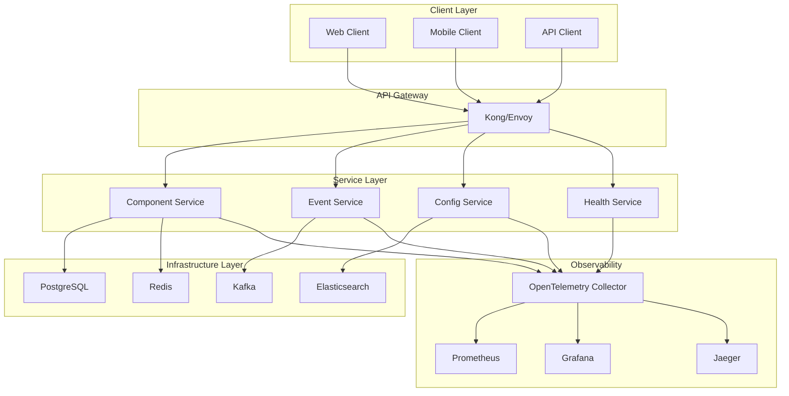

# 项目重构方案 - 基于现代软件工程架构设计

## 🚀 项目概述

本项目是一个Go语言通用库，提供可重用的组件和工具。基于最新的软件工程架构设计理念，我们将对其进行全面重构，引入微服务架构、OpenTelemetry可观测性、云原生设计等现代技术栈。

## 📋 重构目标

### 1. 架构现代化

- **微服务架构**: 将单体组件拆分为独立的微服务
- **云原生设计**: 支持容器化部署和Kubernetes编排
- **事件驱动架构**: 基于事件的松耦合通信机制

### 2. 可观测性增强

- **OpenTelemetry集成**: 统一的遥测数据收集
- **分布式追踪**: 端到端的请求链路追踪
- **指标监控**: 实时性能指标和业务指标
- **日志聚合**: 结构化日志和集中式日志管理

### 3. 性能优化

- **异步处理**: 非阻塞的异步操作
- **缓存策略**: 多级缓存机制
- **连接池**: 高效的资源管理
- **负载均衡**: 智能的负载分发

### 4. 开发体验提升

- **API设计**: RESTful API和GraphQL支持
- **文档生成**: 自动化的API文档
- **测试覆盖**: 全面的单元测试和集成测试
- **CI/CD**: 自动化部署流水线

## 🏗️ 架构设计

### 整体架构图



## 📁 文档结构

```text
docs/refactor/
├── README.md                           # 总体概述
├── architecture/                       # 架构设计文档
│   ├── overview.md                     # 架构概览
│   ├── microservices.md                # 微服务设计
│   ├── observability.md                # 可观测性设计
│   └── deployment.md                   # 部署架构
├── implementation/                     # 实现方案
│   ├── component-system.md             # 组件系统重构
│   ├── event-driven.md                 # 事件驱动架构
│   ├── api-design.md                   # API设计
│   └── database-design.md              # 数据库设计
├── migration/                          # 迁移方案
│   ├── phase-1.md                      # 第一阶段迁移
│   ├── phase-2.md                      # 第二阶段迁移
│   └── phase-3.md                      # 第三阶段迁移
├── testing/                            # 测试策略
│   ├── unit-testing.md                 # 单元测试
│   ├── integration-testing.md          # 集成测试
│   └── performance-testing.md          # 性能测试
└── deployment/                         # 部署方案
    ├── docker.md                       # Docker容器化
    ├── kubernetes.md                   # Kubernetes部署
    └── ci-cd.md                        # CI/CD流水线
```

## 🎯 重构阶段

### 第一阶段：基础架构重构

- [ ] 组件系统现代化
- [ ] OpenTelemetry集成
- [ ] 配置管理重构
- [ ] 日志系统升级

### 第二阶段：微服务拆分

- [ ] 服务边界定义
- [ ] API网关实现
- [ ] 服务发现机制
- [ ] 负载均衡策略

### 第三阶段：高级特性

- [ ] 事件驱动架构
- [ ] 缓存策略实现
- [ ] 监控告警系统
- [ ] 性能优化

### 第四阶段：生产就绪

- [ ] 安全加固
- [ ] 高可用设计
- [ ] 灾难恢复
- [ ] 文档完善

## 🔧 技术栈

### 核心框架

- **Go 1.23+**: 最新版本的Go语言
- **Gin**: 高性能HTTP框架
- **GORM**: ORM框架
- **Zap**: 结构化日志

### 微服务技术

- **gRPC**: 高性能RPC框架
- **Protocol Buffers**: 数据序列化
- **Consul**: 服务发现和配置管理
- **Kong**: API网关

### 可观测性

- **OpenTelemetry**: 统一遥测标准
- **Prometheus**: 指标收集
- **Grafana**: 可视化监控
- **Jaeger**: 分布式追踪

### 数据存储

- **PostgreSQL**: 主数据库
- **Redis**: 缓存和会话存储
- **Elasticsearch**: 日志和搜索
- **Kafka**: 消息队列

### 部署运维

- **Docker**: 容器化
- **Kubernetes**: 容器编排
- **Helm**: 包管理
- **ArgoCD**: GitOps部署

## 📊 成功指标

### 性能指标

- **响应时间**: 平均响应时间 < 100ms
- **吞吐量**: 支持 10,000+ QPS
- **可用性**: 99.9% 服务可用性
- **资源利用率**: CPU < 70%, 内存 < 80%

### 质量指标

- **测试覆盖率**: > 90%
- **代码质量**: SonarQube A级
- **文档完整性**: 100% API文档覆盖
- **安全扫描**: 无高危漏洞

### 运维指标

- **部署频率**: 每日多次部署
- **故障恢复时间**: < 5分钟
- **监控覆盖率**: 100% 服务监控
- **告警准确率**: > 95%

## 🚦 开始使用

1. **环境准备**: 确保安装了Go 1.23+和相关工具
2. **克隆项目**: `git clone <repository-url>`
3. **安装依赖**: `go mod download`
4. **运行测试**: `go test ./...`
5. **启动服务**: `go run cmd/server/main.go`

## 📞 联系我们

- **项目维护者**: [维护者姓名]
- **邮箱**: [邮箱地址]
- **GitHub**: [GitHub链接]
- **文档**: [文档链接]

---

*本重构方案基于最新的软件工程最佳实践，旨在打造一个现代化、高性能、可观测的Go语言通用库。*
