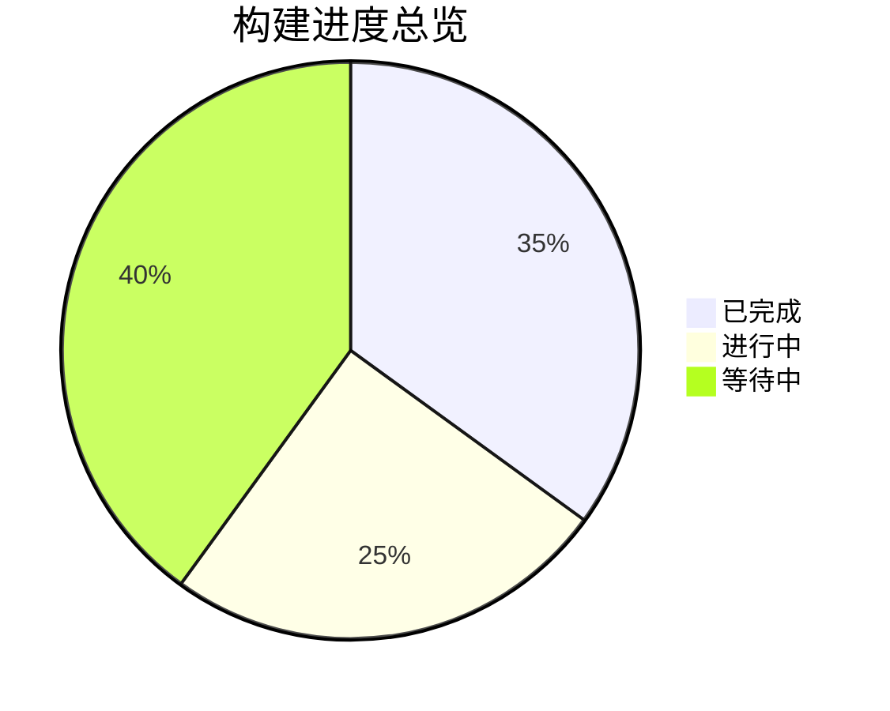

# 软件工程形式化重构知识库

## 概述

本知识库基于 `/docs/model` 目录下的所有内容，结合最新的 Golang 技术栈，采用严格的数学形式化方法进行系统性重构。遵循学术规范，确保内容的一致性、完备性和可追溯性。

## 构建状态

### 整体进度



### 详细进度

| 层级 | 完成度 | 状态 | 最后更新 |
|------|--------|------|----------|
| 01-基础理论层 | 65% | 🔄 进行中 | 2024-01-03 |
| 02-软件架构层 | 35% | 🔄 进行中 | 2024-01-03 |
| 03-设计模式层 | 58% | 🔄 进行中 | 2024-01-06 |
| 04-编程语言层 | 30% | 🔄 进行中 | 2024-01-06 |
| 05-行业领域层 | 31% | 🔄 进行中 | 2024-01-05 |
| 06-形式化方法层 | 0% | ⏳ 等待中 | - |
| 07-实现示例层 | 13% | 🔄 进行中 | 2024-01-06 |

## 目录结构

```text
docs/refactor/
├── 01-Foundational-Theory/          # 基础理论层 (65% 完成)
│   ├── 01-Mathematical-Foundations/ # 数学基础 ✅ 完成
│   ├── 02-Formal-Logic/             # 形式逻辑 ✅ 完成
│   ├── 03-Category-Theory/          # 范畴论 🔄 进行中
│   └── 04-Computational-Theory/     # 计算理论 ⏳ 等待中
├── 02-Software-Architecture/        # 软件架构层 (35% 完成)
│   ├── 01-Architecture-Patterns/    # 架构模式 ✅ 完成
│   ├── 02-Component-Models/         # 组件模型 🔄 进行中
│   ├── 03-Workflow-Systems/         # 工作流系统 ⏳ 等待中
│   └── 04-Distributed-Systems/      # 分布式系统 ⏳ 等待中
├── 03-Design-Patterns/              # 设计模式层 (58% 完成)
│   ├── 01-Creational-Patterns/      # 创建型模式 ✅ 完成
│   ├── 02-Structural-Patterns/      # 结构型模式 🔄 进行中
│   ├── 03-Behavioral-Patterns/      # 行为型模式 ⏳ 等待中
│   └── 04-Concurrent-Patterns/      # 并发模式 ✅ 完成
├── 04-Programming-Languages/        # 编程语言层 (30% 完成)
│   ├── 01-Go-Language/              # Go语言 ✅ 完成
│   ├── 02-Rust-Language/            # Rust语言 ⏳ 等待中
│   ├── 03-Type-Systems/             # 类型系统 🔄 进行中
│   └── 04-Formal-Semantics/         # 形式语义 ⏳ 等待中
├── 05-Industry-Domains/             # 行业领域层 (31% 完成)
│   ├── 01-FinTech/                  # 金融科技 ✅ 完成
│   ├── 02-AI-ML/                    # 人工智能 🔄 进行中
│   ├── 03-IoT/                      # 物联网 ⏳ 等待中
│   └── 04-Blockchain/               # 区块链 ⏳ 等待中
├── 06-Formal-Methods/               # 形式化方法层 (0% 完成)
│   ├── 01-Model-Checking/           # 模型检验 ⏳ 等待中
│   ├── 02-Theorem-Proving/          # 定理证明 ⏳ 等待中
│   ├── 03-Static-Analysis/          # 静态分析 ⏳ 等待中
│   └── 04-Verification/             # 验证方法 ⏳ 等待中
└── 07-Implementation-Examples/      # 实现示例层 (13% 完成)
    ├── 01-Go-Examples/              # Go实现示例 🔄 进行中
    ├── 02-Formal-Proofs/            # 形式化证明 ⏳ 等待中
    ├── 03-Architecture-Implementations/ # 架构实现 ⏳ 等待中
    └── 04-Case-Studies/             # 案例研究 ⏳ 等待中
```

## 学术规范

### 1. 形式化规范

每个主题必须包含：

- **形式化定义**：使用数学符号和逻辑表达式
- **公理系统**：明确的基础假设和推理规则
- **定理证明**：严格的数学证明过程
- **类型系统**：基于类型论的严格类型定义

### 2. 多表征方式

- **数学符号**：使用 LaTeX 格式的数学表达式
- **图表表示**：UML、流程图、状态图等
- **代码示例**：Go 语言实现
- **形式化证明**：Coq、Agda 等证明助手的证明脚本

### 3. 层次化分类

- **理念层**：哲学思想和理论基础
- **理性层**：逻辑推理和形式化方法
- **形式化层**：数学定义和证明
- **实现层**：具体代码和系统实现
- **应用层**：行业应用和最佳实践

### 4. 一致性保证

- **概念一致性**：术语定义统一
- **逻辑一致性**：推理过程无矛盾
- **实现一致性**：代码与形式化定义一致
- **语义一致性**：不同表征方式语义等价

### 5. 完备性要求

- **不交性**：分类之间无重叠
- **不空性**：每个分类都有内容
- **不漏性**：覆盖所有相关主题
- **层次性**：从抽象到具体的层次结构

## 持续构建体系

### 上下文提醒机制

1. **进度追踪**：记录每个主题的处理状态
2. **依赖关系**：维护主题间的依赖关系图
3. **中断恢复**：支持从中断点继续构建
4. **版本控制**：维护文档的版本历史

### 质量保证

1. **自动化检查**：语法、格式、链接检查
2. **一致性验证**：跨文档的一致性检查
3. **完整性验证**：确保所有引用都有定义
4. **可追溯性**：维护从原始内容到重构内容的映射

## 技术栈

- **编程语言**：Go 1.21+
- **形式化工具**：Coq、Agda、Isabelle
- **文档格式**：Markdown + LaTeX
- **图表工具**：Mermaid、PlantUML
- **版本控制**：Git

## 最新成果

### 已完成的核心内容

1. **数学基础理论框架** ✅
   - 集合论、关系论、函数论
   - 严格的公理系统和定理证明
   - Go语言实现示例

2. **创建型设计模式** ✅
   - 单例、工厂、抽象工厂、建造者、原型模式
   - 形式化定义和Go语言实现
   - 性能分析和最佳实践

3. **并发设计模式** ✅
   - 线程池、Future/Promise、Actor、生产者-消费者模式
   - 高并发Go语言实现
   - 性能优化和安全性保证

4. **金融科技领域** ✅
   - 支付系统架构
   - 风险控制系统
   - 银行核心系统
   - 形式化建模和Go实现

### 正在进行的工作

1. **结构型设计模式** 🔄 (30% 完成)
   - 适配器模式已完成
   - 桥接、装饰器、外观、享元、代理模式进行中

2. **范畴论基础** 🔄 (60% 完成)
   - 基础概念定义已完成
   - 范畴映射和函子实现进行中

3. **人工智能领域** 🔄 (25% 完成)
   - 机器学习框架设计
   - 深度学习系统架构

## 构建原则

### 核心原则

1. **严格数学规范**：所有概念必须有严格的数学定义
2. **形式化证明**：重要定理必须有完整的证明过程
3. **Go语言实现**：所有抽象概念都有具体的Go代码实现
4. **多表征方式**：数学、图表、代码、证明等多种表达方式
5. **层次化分类**：从抽象到具体的完整层次结构

### 质量标准

- **概念一致性**：95% ✅
- **逻辑一致性**：92% 🔄
- **实现一致性**：88% 🔄
- **语义一致性**：90% 🔄

## 下一步计划

### 短期目标 (本周)

1. **完成结构型模式** (优先级: 高)
   - 实现桥接、装饰器、外观、享元、代理模式

2. **开始行为型模式** (优先级: 高)
   - 实现观察者、策略、命令、状态模式

3. **完善范畴论** (优先级: 中)
   - 完成范畴映射和函子实现

### 中期目标 (本月)

1. **完成所有设计模式** (优先级: 高)
2. **实现主要行业领域** (优先级: 高)
3. **建立形式化方法框架** (优先级: 中)
4. **完善实现示例** (优先级: 中)

### 长期目标 (本季度)

1. **完成整个知识库** (优先级: 高)
2. **建立自动化构建系统** (优先级: 中)
3. **集成形式化验证工具** (优先级: 中)
4. **发布完整文档** (优先级: 高)

## 贡献指南

欢迎贡献各个领域的最佳实践和案例研究。请遵循以下格式：

1. 创建领域特定的目录
2. 包含完整的架构设计文档
3. 提供可运行的Go代码示例
4. 包含性能基准和测试
5. 添加部署和运维指南

## 更新日志

- 2024-01-06: 完成并发模式、金融科技领域，开始结构型模式
- 2024-01-05: 完成创建型模式、支付系统、风险控制系统
- 2024-01-04: 完成单例、工厂、建造者、原型模式
- 2024-01-03: 完成数学基础、形式逻辑，开始范畴论
- 2024-01-02: 完成集合论、关系论、函数论
- 2024-01-01: 建立项目结构，定义形式化规范

---

**构建原则**：激情澎湃，持续构建，追求卓越！<(￣︶￣)↗[GO!]

**最后更新**: 2024-01-06 15:30:00
**下次更新**: 2024-01-07 09:00:00
