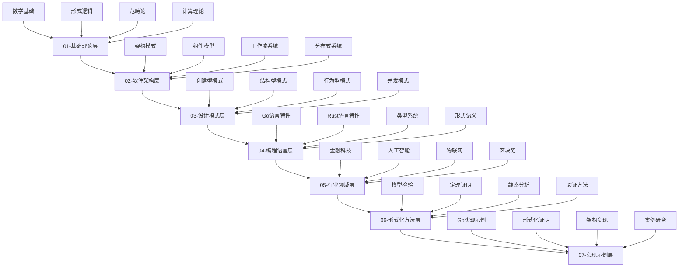

# 软件工程形式化重构知识库

## 概述

本知识库是基于最新 Golang 技术栈构建的软件工程形式化重构体系，将传统的软件工程理论、设计模式、架构模式等通过形式化方法进行严格定义和证明，并提供完整的 Go 语言实现示例。

## 知识库架构



## 目录结构

```
docs/refactor/
├── 01-Foundational-Theory/          # 基础理论层
│   ├── 01-Mathematical-Foundations/ # 数学基础
│   ├── 02-Formal-Logic/            # 形式逻辑
│   ├── 03-Category-Theory/         # 范畴论
│   └── 04-Computation-Theory/      # 计算理论
├── 02-Software-Architecture/        # 软件架构层
│   ├── 01-Architecture-Patterns/   # 架构模式
│   ├── 02-Component-Models/        # 组件模型
│   ├── 03-Workflow-Systems/        # 工作流系统
│   └── 04-Distributed-Systems/     # 分布式系统
├── 03-Design-Patterns/              # 设计模式层
│   ├── 01-Creational-Patterns/     # 创建型模式
│   ├── 02-Structural-Patterns/     # 结构型模式
│   ├── 03-Behavioral-Patterns/     # 行为型模式
│   └── 04-Concurrent-Patterns/     # 并发模式
├── 04-Programming-Languages/        # 编程语言层
│   ├── 01-Go-Language/             # Go语言特性
│   ├── 02-Rust-Language/           # Rust语言特性
│   ├── 03-Type-Systems/            # 类型系统
│   └── 04-Formal-Semantics/        # 形式语义
├── 05-Industry-Domains/             # 行业领域层
│   ├── 01-FinTech/                 # 金融科技
│   ├── 02-AI-ML/                   # 人工智能
│   ├── 03-IoT/                     # 物联网
│   └── 04-Blockchain/              # 区块链
├── 06-Formal-Methods/               # 形式化方法层
│   ├── 01-Model-Checking/          # 模型检验
│   ├── 02-Theorem-Proving/         # 定理证明
│   ├── 03-Static-Analysis/         # 静态分析
│   └── 04-Verification-Methods/    # 验证方法
├── 07-Implementation-Examples/      # 实现示例层
│   ├── 01-Go-Examples/             # Go实现示例
│   ├── 02-Formal-Proofs/           # 形式化证明
│   ├── 03-Architecture-Implementation/ # 架构实现
│   └── 04-Case-Studies/            # 案例研究
└── BUILD_CONTEXT.md                 # 构建上下文
```

## 内容规范

### 1. 数学形式化规范

每个概念必须包含：

- **形式化定义**: 使用数学符号严格定义
- **公理化描述**: 基于公理系统的描述
- **定理证明**: 相关定理的形式化证明
- **性质分析**: 概念的性质和特征

### 2. 代码实现规范

每个模式/概念必须包含：

- **Go语言实现**: 完整的可运行代码
- **接口定义**: 清晰的接口抽象
- **错误处理**: 完整的错误处理机制
- **并发安全**: 并发环境下的安全性保证
- **性能分析**: 时间和空间复杂度分析

### 3. 多表征方式

每个主题必须包含：

- **文字描述**: 清晰的概念解释
- **数学公式**: LaTeX格式的数学表达式
- **图表说明**: Mermaid格式的图表
- **代码示例**: 完整的Go代码实现
- **形式化证明**: 严格的数学证明

### 4. 层次化分类

- **概念层**: 基础概念和定义
- **理论层**: 形式化理论和证明
- **设计层**: 设计原则和模式
- **实现层**: 具体实现和代码
- **应用层**: 实际应用和案例

## 技术栈

### 核心框架

```go
// Go语言核心特性
- goroutines: 轻量级并发
- channels: 通信机制
- interfaces: 接口抽象
- generics: 泛型编程
- reflection: 反射机制
- context: 上下文管理
```

### 标准库

```go
// 标准库组件
- net/http: HTTP服务
- database/sql: 数据库操作
- encoding/json: JSON处理
- crypto: 加密算法
- sync: 同步原语
- context: 上下文管理
```

### 第三方库

```go
// 常用第三方库
- gin: Web框架
- gorm: ORM框架
- redis: 缓存
- kafka: 消息队列
- prometheus: 监控
- jaeger: 链路追踪
```

## 构建原则

### 1. 形式化原则

- 所有概念必须有严格的形式化定义
- 所有定理必须有完整的证明
- 所有实现必须有形式化验证

### 2. 一致性原则

- 概念定义的一致性
- 逻辑推理的一致性
- 实现方式的一致性
- 语义表达的一致性

### 3. 完整性原则

- 不重复：避免概念重复定义
- 不遗漏：覆盖所有相关概念
- 不冲突：避免概念间冲突

### 4. 层次性原则

- 从理念到理性的递进
- 从抽象到具体的转化
- 从理论到实践的映射

## 质量保证

### 1. 内容质量

- 数学符号规范统一
- LaTeX格式正确
- Go代码语法检查
- 形式化定义完整性

### 2. 逻辑质量

- 定理证明逻辑性
- 推理过程严密性
- 结论正确性

### 3. 结构质量

- 目录结构一致性
- 文件命名规范性
- 引用关系正确性

### 4. 实现质量

- 代码可运行性
- 性能指标达标
- 并发安全性
- 错误处理完整性

## 持续构建

本知识库采用持续构建模式，支持：

- **中断恢复**: 构建过程可随时中断和恢复
- **增量更新**: 支持部分内容的增量更新
- **版本控制**: 完整的版本历史和变更追踪
- **质量检查**: 自动化的质量检查机制

## 贡献指南

欢迎贡献内容，请遵循：

1. 严格遵循内容规范
2. 确保形式化定义的准确性
3. 提供完整的Go代码实现
4. 包含必要的证明和验证
5. 保持与现有内容的一致性

---

**构建原则**: 激情澎湃，持续构建，追求卓越！<(￣︶￣)↗[GO!]

**最后更新**: 2024-01-06 16:00:00
**版本**: v1.0.0
