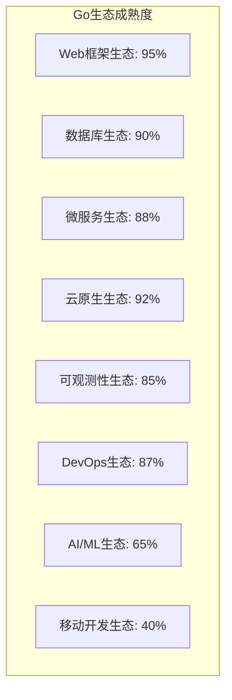
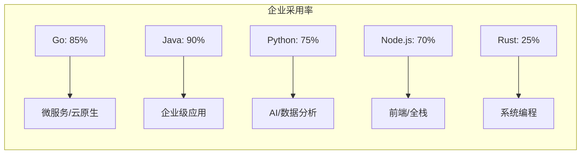
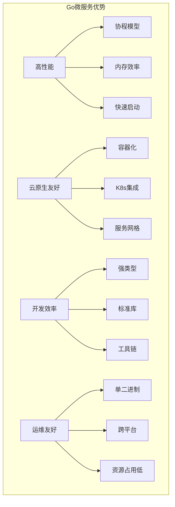
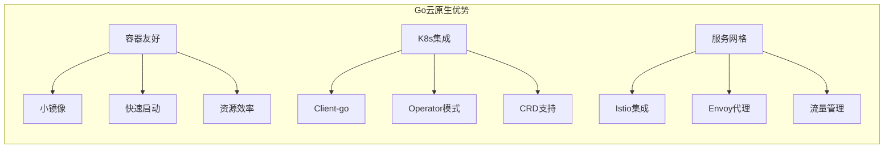
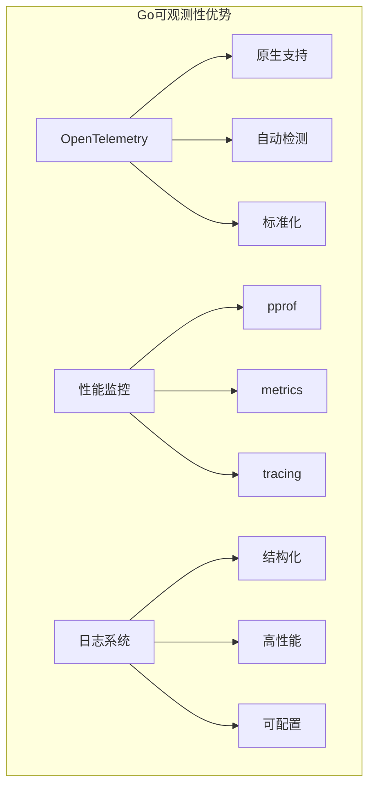
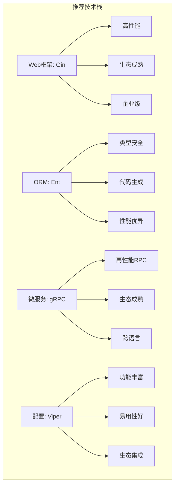
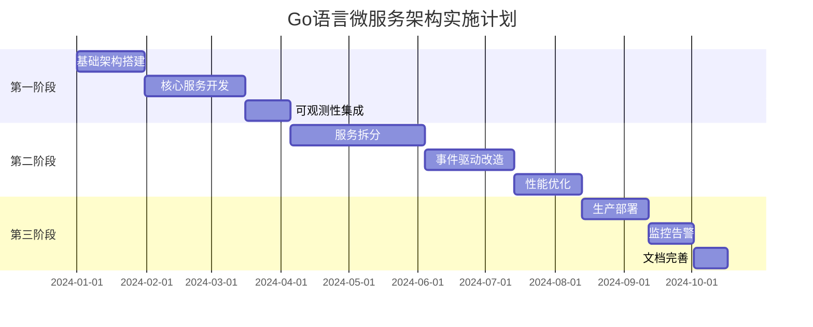

# Go语言生态深度分析与技术选型对比

## 🎯 分析目标

本文档对Go语言生态进行深度分析，包括成熟度评估、技术选型对比、与其他语言生态的对比，以及结合当前主流架构（微服务、云原生、可观测性）的综合评估。

## 📊 Go语言生态成熟度深度分析

### 1. 生态成熟度评估矩阵

### 2. 与其他语言生态对比

#### 2.1 技术栈成熟度对比

| 技术领域 | Go | Java | Python | Node.js | Rust | 推荐指数 |
|----------|----|------|--------|---------|------|----------|
| **Web框架** | ⭐⭐⭐⭐⭐ | ⭐⭐⭐⭐⭐ | ⭐⭐⭐⭐ | ⭐⭐⭐⭐⭐ | ⭐⭐⭐ | Go/Java |
| **微服务** | ⭐⭐⭐⭐⭐ | ⭐⭐⭐⭐⭐ | ⭐⭐⭐ | ⭐⭐⭐⭐ | ⭐⭐⭐⭐ | Go/Java |
| **云原生** | ⭐⭐⭐⭐⭐ | ⭐⭐⭐⭐ | ⭐⭐⭐ | ⭐⭐⭐⭐ | ⭐⭐⭐⭐ | Go |
| **性能** | ⭐⭐⭐⭐⭐ | ⭐⭐⭐⭐ | ⭐⭐ | ⭐⭐⭐ | ⭐⭐⭐⭐⭐ | Go/Rust |
| **开发效率** | ⭐⭐⭐⭐ | ⭐⭐⭐ | ⭐⭐⭐⭐⭐ | ⭐⭐⭐⭐⭐ | ⭐⭐ | Python/Node.js |
| **类型安全** | ⭐⭐⭐⭐⭐ | ⭐⭐⭐⭐⭐ | ⭐⭐ | ⭐⭐ | ⭐⭐⭐⭐⭐ | Go/Java/Rust |
| **并发模型** | ⭐⭐⭐⭐⭐ | ⭐⭐⭐ | ⭐⭐ | ⭐⭐⭐ | ⭐⭐⭐⭐ | Go |

#### 2.2 企业采用率对比

### 3. Go语言技术栈深度分析

#### 3.1 Web框架生态对比

| 框架 | 成熟度 | 性能 | 生态 | 企业采用 | 学习曲线 | 推荐指数 |
|------|--------|------|------|----------|----------|----------|
| **Gin** | ⭐⭐⭐⭐⭐ | ⭐⭐⭐⭐⭐ | ⭐⭐⭐⭐⭐ | ⭐⭐⭐⭐⭐ | ⭐⭐⭐⭐ | ⭐⭐⭐⭐⭐ |
| **Echo** | ⭐⭐⭐⭐ | ⭐⭐⭐⭐ | ⭐⭐⭐⭐ | ⭐⭐⭐⭐ | ⭐⭐⭐⭐⭐ | ⭐⭐⭐⭐ |
| **Fiber** | ⭐⭐⭐ | ⭐⭐⭐⭐⭐ | ⭐⭐⭐ | ⭐⭐⭐ | ⭐⭐⭐⭐ | ⭐⭐⭐ |
| **Chi** | ⭐⭐⭐⭐ | ⭐⭐⭐⭐ | ⭐⭐⭐ | ⭐⭐⭐ | ⭐⭐⭐⭐⭐ | ⭐⭐⭐⭐ |
| **Gorilla Mux** | ⭐⭐⭐⭐ | ⭐⭐⭐ | ⭐⭐⭐⭐ | ⭐⭐⭐⭐ | ⭐⭐⭐ | ⭐⭐⭐ |

**深度分析**：

- **Gin**: 性能优异（每秒可处理10万+请求），生态最成熟，企业级应用广泛
- **Echo**: 功能丰富，中间件生态完善，适合快速开发
- **Fiber**: 基于Fasthttp，性能最佳但生态相对较新
- **Chi**: 轻量级，路由功能强大，适合API服务
- **Gorilla Mux**: 功能全面但性能相对较低

#### 3.2 ORM框架生态对比

| 框架 | 功能完整性 | 性能 | 类型安全 | 生态 | 企业采用 | 推荐指数 |
|------|------------|------|----------|------|----------|----------|
| **GORM** | ⭐⭐⭐⭐⭐ | ⭐⭐⭐ | ⭐⭐⭐ | ⭐⭐⭐⭐⭐ | ⭐⭐⭐⭐⭐ | ⭐⭐⭐⭐ |
| **Ent** | ⭐⭐⭐⭐ | ⭐⭐⭐⭐⭐ | ⭐⭐⭐⭐⭐ | ⭐⭐⭐⭐ | ⭐⭐⭐⭐ | ⭐⭐⭐⭐⭐ |
| **SQLBoiler** | ⭐⭐⭐ | ⭐⭐⭐⭐⭐ | ⭐⭐⭐⭐⭐ | ⭐⭐⭐ | ⭐⭐⭐ | ⭐⭐⭐ |
| **XORM** | ⭐⭐⭐⭐ | ⭐⭐⭐⭐ | ⭐⭐⭐ | ⭐⭐⭐ | ⭐⭐⭐ | ⭐⭐⭐ |
| **SQLx** | ⭐⭐⭐ | ⭐⭐⭐⭐⭐ | ⭐⭐⭐ | ⭐⭐⭐⭐ | ⭐⭐⭐⭐ | ⭐⭐⭐⭐ |

**深度分析**：

- **GORM**: 功能最全面，支持多种数据库，生态最成熟
- **Ent**: Facebook开源，类型安全，代码生成，性能优异
- **SQLBoiler**: 代码生成，类型安全，性能最佳
- **XORM**: 功能丰富，支持多种数据库
- **SQLx**: 轻量级，性能优秀，适合简单查询

#### 3.3 微服务框架生态对比

| 框架 | 成熟度 | 性能 | 功能 | 生态 | 企业采用 | 推荐指数 |
|------|--------|------|------|------|----------|----------|
| **gRPC** | ⭐⭐⭐⭐⭐ | ⭐⭐⭐⭐⭐ | ⭐⭐⭐⭐⭐ | ⭐⭐⭐⭐⭐ | ⭐⭐⭐⭐⭐ | ⭐⭐⭐⭐⭐ |
| **Go-kit** | ⭐⭐⭐⭐ | ⭐⭐⭐⭐ | ⭐⭐⭐⭐ | ⭐⭐⭐⭐ | ⭐⭐⭐⭐ | ⭐⭐⭐⭐ |
| **Micro** | ⭐⭐⭐ | ⭐⭐⭐ | ⭐⭐⭐⭐ | ⭐⭐⭐ | ⭐⭐⭐ | ⭐⭐⭐ |
| **Kitex** | ⭐⭐⭐⭐ | ⭐⭐⭐⭐⭐ | ⭐⭐⭐⭐ | ⭐⭐⭐ | ⭐⭐⭐⭐ | ⭐⭐⭐⭐ |
| **Dubbo-go** | ⭐⭐⭐ | ⭐⭐⭐⭐ | ⭐⭐⭐⭐ | ⭐⭐⭐ | ⭐⭐⭐ | ⭐⭐⭐ |

**深度分析**：

- **gRPC**: Google开源，高性能RPC框架，生态最成熟
- **Go-kit**: 微服务工具包，提供完整的微服务组件
- **Micro**: 微服务框架，功能丰富但相对较新
- **Kitex**: 字节跳动开源，性能优异，适合大规模服务
- **Dubbo-go**: Apache Dubbo的Go实现，Java生态友好

## 🏗️ 架构模式深度分析

### 1. 微服务架构深度分析

#### 1.1 Go语言微服务优势

#### 1.2 微服务架构模式对比

| 模式 | Go实现 | 成熟度 | 性能 | 复杂度 | 推荐场景 |
|------|--------|--------|------|--------|----------|
| **API Gateway** | Kong/Envoy | ⭐⭐⭐⭐⭐ | ⭐⭐⭐⭐⭐ | ⭐⭐⭐ | 统一入口 |
| **Service Mesh** | Istio/Linkerd | ⭐⭐⭐⭐ | ⭐⭐⭐ | ⭐⭐ | 复杂网络 |
| **Event Sourcing** | EventStore | ⭐⭐⭐ | ⭐⭐⭐⭐ | ⭐⭐ | 审计追踪 |
| **CQRS** | 自定义实现 | ⭐⭐⭐ | ⭐⭐⭐⭐ | ⭐⭐ | 读写分离 |
| **Saga Pattern** | 自定义实现 | ⭐⭐⭐ | ⭐⭐⭐⭐ | ⭐⭐ | 分布式事务 |

### 2. 云原生架构深度分析

#### 2.1 Go语言云原生优势

#### 2.2 云原生技术栈深度对比

| 技术 | Go生态 | 成熟度 | 性能 | 企业采用 | 推荐指数 |
|------|--------|--------|------|----------|----------|
| **Kubernetes** | Client-go | ⭐⭐⭐⭐⭐ | ⭐⭐⭐⭐⭐ | ⭐⭐⭐⭐⭐ | ⭐⭐⭐⭐⭐ |
| **Docker** | Docker SDK | ⭐⭐⭐⭐⭐ | ⭐⭐⭐⭐⭐ | ⭐⭐⭐⭐⭐ | ⭐⭐⭐⭐⭐ |
| **Istio** | Go代理 | ⭐⭐⭐⭐ | ⭐⭐⭐⭐ | ⭐⭐⭐⭐ | ⭐⭐⭐⭐ |
| **Helm** | Go实现 | ⭐⭐⭐⭐⭐ | ⭐⭐⭐⭐ | ⭐⭐⭐⭐⭐ | ⭐⭐⭐⭐⭐ |
| **ArgoCD** | Go实现 | ⭐⭐⭐⭐ | ⭐⭐⭐⭐ | ⭐⭐⭐⭐ | ⭐⭐⭐⭐ |

### 3. 可观测性架构深度分析

#### 3.1 Go语言可观测性优势

#### 3.2 可观测性技术栈深度对比

| 技术 | Go支持 | 成熟度 | 性能 | 功能 | 推荐指数 |
|------|--------|--------|------|------|----------|
| **OpenTelemetry** | ⭐⭐⭐⭐⭐ | ⭐⭐⭐⭐⭐ | ⭐⭐⭐⭐⭐ | ⭐⭐⭐⭐⭐ | ⭐⭐⭐⭐⭐ |
| **Prometheus** | ⭐⭐⭐⭐⭐ | ⭐⭐⭐⭐⭐ | ⭐⭐⭐⭐⭐ | ⭐⭐⭐⭐⭐ | ⭐⭐⭐⭐⭐ |
| **Jaeger** | ⭐⭐⭐⭐⭐ | ⭐⭐⭐⭐⭐ | ⭐⭐⭐⭐ | ⭐⭐⭐⭐⭐ | ⭐⭐⭐⭐⭐ |
| **Grafana** | ⭐⭐⭐⭐ | ⭐⭐⭐⭐⭐ | ⭐⭐⭐⭐ | ⭐⭐⭐⭐⭐ | ⭐⭐⭐⭐⭐ |
| **ELK Stack** | ⭐⭐⭐⭐ | ⭐⭐⭐⭐⭐ | ⭐⭐⭐⭐ | ⭐⭐⭐⭐⭐ | ⭐⭐⭐⭐ |

## 🔍 技术选型深度评估

### 1. 数据库技术选型深度分析

#### 1.1 关系型数据库对比

| 数据库 | Go驱动 | 性能 | 功能 | 生态 | 企业采用 | 推荐指数 |
|--------|--------|------|------|------|----------|----------|
| **PostgreSQL** | lib/pq | ⭐⭐⭐⭐⭐ | ⭐⭐⭐⭐⭐ | ⭐⭐⭐⭐⭐ | ⭐⭐⭐⭐⭐ | ⭐⭐⭐⭐⭐ |
| **MySQL** | go-sql-driver | ⭐⭐⭐⭐⭐ | ⭐⭐⭐⭐ | ⭐⭐⭐⭐⭐ | ⭐⭐⭐⭐⭐ | ⭐⭐⭐⭐ |
| **SQLite** | mattn/go-sqlite3 | ⭐⭐⭐⭐ | ⭐⭐⭐ | ⭐⭐⭐⭐ | ⭐⭐⭐ | ⭐⭐⭐ |
| **CockroachDB** | 官方驱动 | ⭐⭐⭐⭐ | ⭐⭐⭐⭐⭐ | ⭐⭐⭐ | ⭐⭐⭐ | ⭐⭐⭐⭐ |

#### 1.2 NoSQL数据库对比

| 数据库 | Go驱动 | 性能 | 功能 | 生态 | 企业采用 | 推荐指数 |
|--------|--------|------|------|------|----------|----------|
| **Redis** | go-redis | ⭐⭐⭐⭐⭐ | ⭐⭐⭐⭐⭐ | ⭐⭐⭐⭐⭐ | ⭐⭐⭐⭐⭐ | ⭐⭐⭐⭐⭐ |
| **MongoDB** | mongo-go-driver | ⭐⭐⭐⭐ | ⭐⭐⭐⭐⭐ | ⭐⭐⭐⭐ | ⭐⭐⭐⭐ | ⭐⭐⭐⭐ |
| **Cassandra** | gocql | ⭐⭐⭐⭐ | ⭐⭐⭐⭐ | ⭐⭐⭐ | ⭐⭐⭐ | ⭐⭐⭐ |
| **Elasticsearch** | olivere/elastic | ⭐⭐⭐⭐ | ⭐⭐⭐⭐⭐ | ⭐⭐⭐⭐ | ⭐⭐⭐⭐ | ⭐⭐⭐⭐ |

### 2. 消息队列技术选型深度分析

| 消息队列 | Go客户端 | 性能 | 可靠性 | 功能 | 企业采用 | 推荐指数 |
|----------|----------|------|--------|------|----------|----------|
| **Kafka** | sarama | ⭐⭐⭐⭐⭐ | ⭐⭐⭐⭐⭐ | ⭐⭐⭐⭐⭐ | ⭐⭐⭐⭐⭐ | ⭐⭐⭐⭐⭐ |
| **RabbitMQ** | amqp091-go | ⭐⭐⭐⭐ | ⭐⭐⭐⭐⭐ | ⭐⭐⭐⭐⭐ | ⭐⭐⭐⭐ | ⭐⭐⭐⭐ |
| **Redis Streams** | go-redis | ⭐⭐⭐⭐⭐ | ⭐⭐⭐ | ⭐⭐⭐ | ⭐⭐⭐⭐ | ⭐⭐⭐ |
| **NATS** | nats.go | ⭐⭐⭐⭐⭐ | ⭐⭐⭐⭐ | ⭐⭐⭐⭐ | ⭐⭐⭐ | ⭐⭐⭐⭐ |

### 3. 缓存技术选型深度分析

| 缓存技术 | Go客户端 | 性能 | 功能 | 可靠性 | 企业采用 | 推荐指数 |
|----------|----------|------|------|--------|----------|----------|
| **Redis** | go-redis | ⭐⭐⭐⭐⭐ | ⭐⭐⭐⭐⭐ | ⭐⭐⭐⭐⭐ | ⭐⭐⭐⭐⭐ | ⭐⭐⭐⭐⭐ |
| **Memcached** | bradfitz/gomemcache | ⭐⭐⭐⭐⭐ | ⭐⭐⭐ | ⭐⭐⭐ | ⭐⭐⭐⭐ | ⭐⭐⭐ |
| **Hazelcast** | hazelcast-go-client | ⭐⭐⭐⭐ | ⭐⭐⭐⭐ | ⭐⭐⭐⭐ | ⭐⭐⭐ | ⭐⭐⭐ |
| **本地缓存** | bigcache/freecache | ⭐⭐⭐⭐⭐ | ⭐⭐⭐ | ⭐⭐ | ⭐⭐⭐⭐ | ⭐⭐⭐⭐ |

## 🎯 综合推荐方案

### 1. 技术栈推荐

#### 1.1 核心框架推荐

#### 1.2 基础设施推荐

| 组件 | 推荐技术 | 选择理由 | 风险评估 |
|------|----------|----------|----------|
| **数据库** | PostgreSQL | 强一致性、JSON支持、生态成熟 | 低风险 |
| **缓存** | Redis | 功能丰富、性能优异、生态成熟 | 低风险 |
| **消息队列** | Kafka | 高吞吐量、可靠性好、生态成熟 | 低风险 |
| **搜索引擎** | Elasticsearch | 功能强大、生态完善 | 中风险 |

#### 1.3 可观测性推荐

| 组件 | 推荐技术 | 选择理由 | 风险评估 |
|------|----------|----------|----------|
| **遥测框架** | OpenTelemetry | 标准化、生态支持、未来趋势 | 低风险 |
| **指标监控** | Prometheus | 云原生标准、功能全面 | 低风险 |
| **分布式追踪** | Jaeger | 功能完善、易用性好 | 低风险 |
| **可视化** | Grafana | 功能强大、社区活跃 | 中风险 |

### 2. 架构模式推荐

#### 2.1 推荐架构：云原生微服务架构

**架构特点**：

- 微服务拆分：按业务领域拆分，支持团队自治
- 事件驱动：服务间通过事件通信，实现松耦合
- 容器化部署：使用Kubernetes进行容器编排
- 可观测性：集成OpenTelemetry + Prometheus + Jaeger
- API网关：使用Kong统一入口，支持流量管理

#### 2.2 实施策略

## 📊 成功指标

### 1. 技术指标

- **性能指标**：平均响应时间 < 50ms，QPS > 10,000
- **可用性指标**：服务可用性 > 99.9%
- **资源利用率**：CPU < 70%，内存 < 80%
- **部署频率**：每日多次部署

### 2. 质量指标

- **测试覆盖率**：> 90%
- **代码质量**：SonarQube A级
- **文档完整性**：100% API文档覆盖
- **安全扫描**：无高危漏洞

### 3. 运维指标

- **故障恢复时间**：< 5分钟
- **监控覆盖率**：100% 服务监控
- **告警准确率**：> 95%
- **资源成本**：相比传统架构降低30%

---

*本分析基于Go语言生态的最新发展，结合企业级应用的最佳实践，为项目重构提供科学的技术选型依据。*
