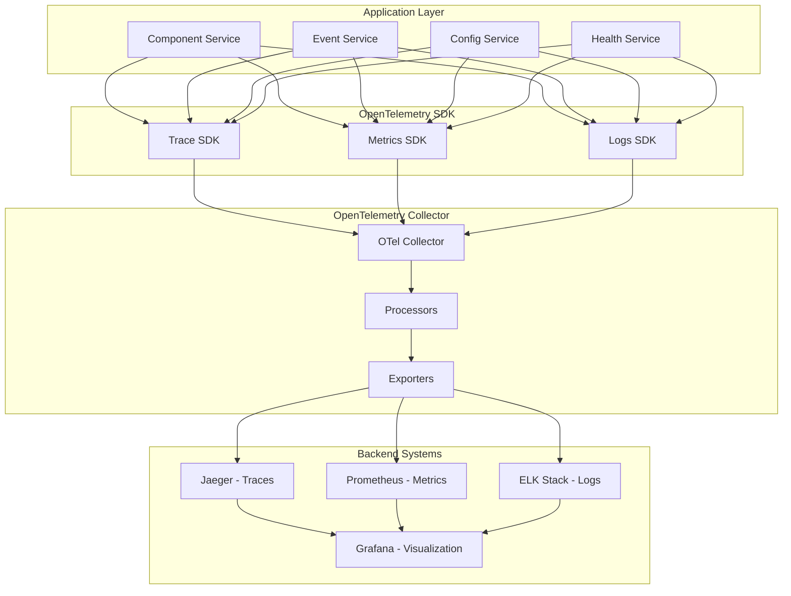
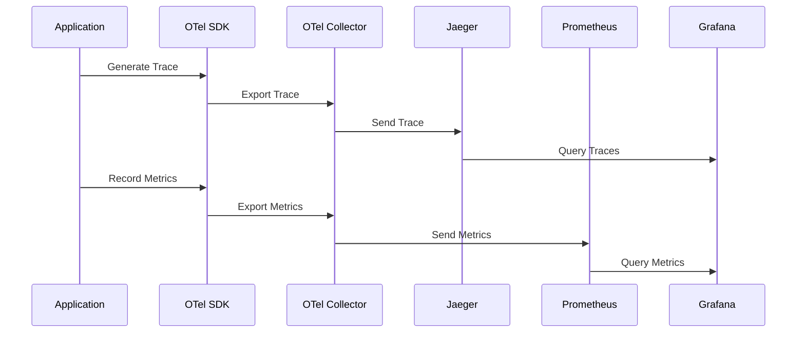

# 可观测性架构设计 - OpenTelemetry集成

## 🎯 可观测性目标

### 1. 核心目标

- **全链路追踪**: 端到端的请求链路追踪
- **实时监控**: 系统性能和业务指标实时监控
- **智能告警**: 基于阈值的智能告警机制
- **问题诊断**: 快速定位和诊断系统问题

### 2. 设计原则

- **统一标准**: 使用OpenTelemetry统一遥测标准
- **自动埋点**: 最小化手动埋点代码
- **低侵入性**: 对业务代码影响最小
- **高性能**: 遥测数据收集不影响系统性能

## 🏗️ OpenTelemetry架构

### 1. 整体架构图



### 2. 数据流图



## 🔧 OpenTelemetry集成

### 1. SDK配置

#### 1.1 初始化配置

```go
// OpenTelemetry初始化
package observability

import (
    "context"
    "fmt"
    "time"
    
    "go.opentelemetry.io/otel"
    "go.opentelemetry.io/otel/exporters/jaeger"
    "go.opentelemetry.io/otel/exporters/prometheus"
    "go.opentelemetry.io/otel/sdk/metric"
    "go.opentelemetry.io/otel/sdk/resource"
    sdktrace "go.opentelemetry.io/otel/sdk/trace"
    semconv "go.opentelemetry.io/otel/semconv/v1.21.0"
    "go.opentelemetry.io/otel/trace"
)

type Config struct {
    ServiceName    string
    ServiceVersion string
    Environment    string
    JaegerEndpoint string
    PrometheusPort int
}

func InitOpenTelemetry(config *Config) (func(), error) {
    ctx := context.Background()
    
    // 创建资源
    res, err := resource.New(ctx,
        resource.WithAttributes(
            semconv.ServiceName(config.ServiceName),
            semconv.ServiceVersion(config.ServiceVersion),
            semconv.DeploymentEnvironment(config.Environment),
        ),
    )
    if err != nil {
        return nil, fmt.Errorf("failed to create resource: %w", err)
    }
    
    // 初始化追踪器
    if err := initTracer(ctx, config, res); err != nil {
        return nil, fmt.Errorf("failed to init tracer: %w", err)
    }
    
    // 初始化指标收集器
    if err := initMeter(ctx, config, res); err != nil {
        return nil, fmt.Errorf("failed to init meter: %w", err)
    }
    
    // 返回清理函数
    cleanup := func() {
        // 优雅关闭
        if err := otel.GetTracerProvider().Shutdown(ctx); err != nil {
            fmt.Printf("failed to shutdown tracer: %v\n", err)
        }
        if err := otel.GetMeterProvider().Shutdown(ctx); err != nil {
            fmt.Printf("failed to shutdown meter: %v\n", err)
        }
    }
    
    return cleanup, nil
}

func initTracer(ctx context.Context, config *Config, res *resource.Resource) error {
    // 创建Jaeger导出器
    exp, err := jaeger.New(jaeger.WithCollectorEndpoint(jaeger.WithEndpoint(config.JaegerEndpoint)))
    if err != nil {
        return fmt.Errorf("failed to create jaeger exporter: %w", err)
    }
    
    // 创建追踪器提供者
    tp := sdktrace.NewTracerProvider(
        sdktrace.WithBatcher(exp),
        sdktrace.WithResource(res),
    )
    
    // 设置全局追踪器提供者
    otel.SetTracerProvider(tp)
    
    // 设置传播器
    otel.SetTextMapPropagator(propagation.NewCompositeTextMapPropagator(
        propagation.TraceContext{},
        propagation.Baggage{},
    ))
    
    return nil
}

func initMeter(ctx context.Context, config *Config, res *resource.Resource) error {
    // 创建Prometheus导出器
    exp, err := prometheus.New()
    if err != nil {
        return fmt.Errorf("failed to create prometheus exporter: %w", err)
    }
    
    // 创建指标提供者
    mp := metric.NewMeterProvider(
        metric.WithReader(exp),
        metric.WithResource(res),
    )
    
    // 设置全局指标提供者
    otel.SetMeterProvider(mp)
    
    return nil
}
```

#### 1.2 中间件集成

```go
// HTTP追踪中间件
func TracingMiddleware(serviceName string) gin.HandlerFunc {
    tracer := otel.Tracer(serviceName)
    
    return func(c *gin.Context) {
        ctx := c.Request.Context()
        
        // 从请求头中提取追踪上下文
        ctx = otel.GetTextMapPropagator().Extract(ctx, propagation.HeaderCarrier(c.Request.Header))
        
        // 创建新的span
        spanName := fmt.Sprintf("%s %s", c.Request.Method, c.Request.URL.Path)
        ctx, span := tracer.Start(ctx, spanName)
        defer span.End()
        
        // 注入追踪上下文到请求
        c.Request = c.Request.WithContext(ctx)
        
        // 记录请求属性
        span.SetAttributes(
            attribute.String("http.method", c.Request.Method),
            attribute.String("http.url", c.Request.URL.String()),
            attribute.String("http.user_agent", c.Request.UserAgent()),
            attribute.String("http.remote_addr", c.ClientIP()),
        )
        
        // 处理请求
        c.Next()
        
        // 记录响应属性
        span.SetAttributes(
            attribute.Int("http.status_code", c.Writer.Status()),
            attribute.Int("http.response_size", c.Writer.Size()),
        )
        
        // 记录错误
        if len(c.Errors) > 0 {
            span.SetStatus(codes.Error, c.Errors.String())
            span.RecordError(c.Errors.Last().Err)
        }
    }
}

// gRPC追踪拦截器
func TracingInterceptor(serviceName string) grpc.UnaryServerInterceptor {
    tracer := otel.Tracer(serviceName)
    
    return func(ctx context.Context, req interface{}, info *grpc.UnaryServerInfo, handler grpc.UnaryHandler) (interface{}, error) {
        // 从元数据中提取追踪上下文
        ctx = otel.GetTextMapPropagator().Extract(ctx, metadata.NewCarrier(metadata.FromIncomingContext(ctx)))
        
        // 创建新的span
        spanName := info.FullMethod
        ctx, span := tracer.Start(ctx, spanName)
        defer span.End()
        
        // 记录请求属性
        span.SetAttributes(
            attribute.String("grpc.method", info.FullMethod),
            attribute.String("grpc.service", info.Server),
        )
        
        // 处理请求
        resp, err := handler(ctx, req)
        
        // 记录错误
        if err != nil {
            span.SetStatus(codes.Error, err.Error())
            span.RecordError(err)
        }
        
        return resp, err
    }
}
```

### 2. 指标收集

#### 2.1 自定义指标

```go
// 指标收集器
type MetricsCollector struct {
    meter                metric.Meter
    httpRequestsTotal    metric.Int64Counter
    httpRequestDuration  metric.Float64Histogram
    activeConnections    metric.Int64UpDownCounter
    errorRate           metric.Float64Gauge
    logger              *zap.Logger
}

func NewMetricsCollector(serviceName string) *MetricsCollector {
    meter := otel.GetMeterProvider().Meter(serviceName)
    
    httpRequestsTotal, err := meter.Int64Counter(
        "http_requests_total",
        metric.WithDescription("Total number of HTTP requests"),
        metric.WithUnit("1"),
    )
    if err != nil {
        panic(fmt.Sprintf("failed to create http_requests_total counter: %v", err))
    }
    
    httpRequestDuration, err := meter.Float64Histogram(
        "http_request_duration_seconds",
        metric.WithDescription("HTTP request duration in seconds"),
        metric.WithUnit("s"),
    )
    if err != nil {
        panic(fmt.Sprintf("failed to create http_request_duration_seconds histogram: %v", err))
    }
    
    activeConnections, err := meter.Int64UpDownCounter(
        "active_connections",
        metric.WithDescription("Number of active connections"),
        metric.WithUnit("1"),
    )
    if err != nil {
        panic(fmt.Sprintf("failed to create active_connections counter: %v", err))
    }
    
    errorRate, err := meter.Float64Gauge(
        "error_rate",
        metric.WithDescription("Error rate percentage"),
        metric.WithUnit("1"),
    )
    if err != nil {
        panic(fmt.Sprintf("failed to create error_rate gauge: %v", err))
    }
    
    return &MetricsCollector{
        meter:               meter,
        httpRequestsTotal:   httpRequestsTotal,
        httpRequestDuration: httpRequestDuration,
        activeConnections:   activeConnections,
        errorRate:           errorRate,
        logger:              zap.L().Named("metrics"),
    }
}

func (mc *MetricsCollector) RecordHTTPRequest(method, endpoint string, status int, duration time.Duration) {
    attributes := []attribute.KeyValue{
        attribute.String("method", method),
        attribute.String("endpoint", endpoint),
        attribute.String("status", strconv.Itoa(status)),
    }
    
    mc.httpRequestsTotal.Add(context.Background(), 1, metric.WithAttributes(attributes...))
    mc.httpRequestDuration.Record(context.Background(), duration.Seconds(), metric.WithAttributes(attributes...))
}

func (mc *MetricsCollector) IncrementActiveConnections() {
    mc.activeConnections.Add(context.Background(), 1)
}

func (mc *MetricsCollector) DecrementActiveConnections() {
    mc.activeConnections.Add(context.Background(), -1)
}

func (mc *MetricsCollector) SetErrorRate(rate float64) {
    mc.errorRate.Set(context.Background(), rate)
}
```

#### 2.2 业务指标

```go
// 业务指标收集器
type BusinessMetricsCollector struct {
    meter                    metric.Meter
    componentCreateTotal     metric.Int64Counter
    componentStartTotal      metric.Int64Counter
    componentStopTotal       metric.Int64Counter
    eventPublishTotal        metric.Int64Counter
    eventProcessTotal        metric.Int64Counter
    configUpdateTotal        metric.Int64Counter
    notificationSendTotal    metric.Int64Counter
}

func NewBusinessMetricsCollector(serviceName string) *BusinessMetricsCollector {
    meter := otel.GetMeterProvider().Meter(serviceName)
    
    componentCreateTotal, _ := meter.Int64Counter(
        "component_create_total",
        metric.WithDescription("Total number of components created"),
    )
    
    componentStartTotal, _ := meter.Int64Counter(
        "component_start_total",
        metric.WithDescription("Total number of components started"),
    )
    
    componentStopTotal, _ := meter.Int64Counter(
        "component_stop_total",
        metric.WithDescription("Total number of components stopped"),
    )
    
    eventPublishTotal, _ := meter.Int64Counter(
        "event_publish_total",
        metric.WithDescription("Total number of events published"),
    )
    
    eventProcessTotal, _ := meter.Int64Counter(
        "event_process_total",
        metric.WithDescription("Total number of events processed"),
    )
    
    configUpdateTotal, _ := meter.Int64Counter(
        "config_update_total",
        metric.WithDescription("Total number of config updates"),
    )
    
    notificationSendTotal, _ := meter.Int64Counter(
        "notification_send_total",
        metric.WithDescription("Total number of notifications sent"),
    )
    
    return &BusinessMetricsCollector{
        meter:                    meter,
        componentCreateTotal:     componentCreateTotal,
        componentStartTotal:      componentStartTotal,
        componentStopTotal:       componentStopTotal,
        eventPublishTotal:        eventPublishTotal,
        eventProcessTotal:        eventProcessTotal,
        configUpdateTotal:        configUpdateTotal,
        notificationSendTotal:    notificationSendTotal,
    }
}

func (bmc *BusinessMetricsCollector) RecordComponentCreate(componentType string) {
    bmc.componentCreateTotal.Add(context.Background(), 1,
        metric.WithAttributes(attribute.String("component_type", componentType)))
}

func (bmc *BusinessMetricsCollector) RecordComponentStart(componentType string) {
    bmc.componentStartTotal.Add(context.Background(), 1,
        metric.WithAttributes(attribute.String("component_type", componentType)))
}

func (bmc *BusinessMetricsCollector) RecordComponentStop(componentType string) {
    bmc.componentStopTotal.Add(context.Background(), 1,
        metric.WithAttributes(attribute.String("component_type", componentType)))
}

func (bmc *BusinessMetricsCollector) RecordEventPublish(eventType string) {
    bmc.eventPublishTotal.Add(context.Background(), 1,
        metric.WithAttributes(attribute.String("event_type", eventType)))
}

func (bmc *BusinessMetricsCollector) RecordEventProcess(eventType string) {
    bmc.eventProcessTotal.Add(context.Background(), 1,
        metric.WithAttributes(attribute.String("event_type", eventType)))
}

func (bmc *BusinessMetricsCollector) RecordConfigUpdate(configType string) {
    bmc.configUpdateTotal.Add(context.Background(), 1,
        metric.WithAttributes(attribute.String("config_type", configType)))
}

func (bmc *BusinessMetricsCollector) RecordNotificationSend(channel string) {
    bmc.notificationSendTotal.Add(context.Background(), 1,
        metric.WithAttributes(attribute.String("channel", channel)))
}
```

### 3. 日志集成

#### 3.1 结构化日志

```go
// 日志中间件
func LoggingMiddleware(serviceName string) gin.HandlerFunc {
    logger := zap.L().Named(serviceName)
    
    return func(c *gin.Context) {
        start := time.Now()
        
        // 创建请求ID
        requestID := uuid.New().String()
        c.Set("request_id", requestID)
        
        // 记录请求日志
        logger.Info("request started",
            zap.String("request_id", requestID),
            zap.String("method", c.Request.Method),
            zap.String("path", c.Request.URL.Path),
            zap.String("query", c.Request.URL.RawQuery),
            zap.String("user_agent", c.Request.UserAgent()),
            zap.String("remote_addr", c.ClientIP()),
        )
        
        // 处理请求
        c.Next()
        
        // 计算处理时间
        duration := time.Since(start)
        
        // 记录响应日志
        logger.Info("request completed",
            zap.String("request_id", requestID),
            zap.Int("status", c.Writer.Status()),
            zap.Int("size", c.Writer.Size()),
            zap.Duration("duration", duration),
        )
        
        // 记录错误
        if len(c.Errors) > 0 {
            logger.Error("request failed",
                zap.String("request_id", requestID),
                zap.Strings("errors", c.Errors.Errors()),
            )
        }
    }
}

// 业务日志记录器
type BusinessLogger struct {
    logger *zap.Logger
}

func NewBusinessLogger(serviceName string) *BusinessLogger {
    return &BusinessLogger{
        logger: zap.L().Named(fmt.Sprintf("business.%s", serviceName)),
    }
}

func (bl *BusinessLogger) ComponentCreated(ctx context.Context, componentID, componentType string) {
    bl.logger.Info("component created",
        zap.String("component_id", componentID),
        zap.String("component_type", componentType),
        zap.String("trace_id", trace.SpanFromContext(ctx).SpanContext().TraceID().String()),
    )
}

func (bl *BusinessLogger) ComponentStarted(ctx context.Context, componentID string) {
    bl.logger.Info("component started",
        zap.String("component_id", componentID),
        zap.String("trace_id", trace.SpanFromContext(ctx).SpanContext().TraceID().String()),
    )
}

func (bl *BusinessLogger) ComponentStopped(ctx context.Context, componentID string) {
    bl.logger.Info("component stopped",
        zap.String("component_id", componentID),
        zap.String("trace_id", trace.SpanFromContext(ctx).SpanContext().TraceID().String()),
    )
}

func (bl *BusinessLogger) EventPublished(ctx context.Context, eventID, eventType string) {
    bl.logger.Info("event published",
        zap.String("event_id", eventID),
        zap.String("event_type", eventType),
        zap.String("trace_id", trace.SpanFromContext(ctx).SpanContext().TraceID().String()),
    )
}

func (bl *BusinessLogger) EventProcessed(ctx context.Context, eventID, eventType string) {
    bl.logger.Info("event processed",
        zap.String("event_id", eventID),
        zap.String("event_type", eventType),
        zap.String("trace_id", trace.SpanFromContext(ctx).SpanContext().TraceID().String()),
    )
}
```

## 📊 监控仪表板

### 1. Grafana仪表板配置

#### 1.1 系统概览仪表板

```json
{
  "dashboard": {
    "title": "System Overview",
    "panels": [
      {
        "title": "HTTP Request Rate",
        "type": "graph",
        "targets": [
          {
            "expr": "rate(http_requests_total[5m])",
            "legendFormat": "{{method}} {{endpoint}}"
          }
        ]
      },
      {
        "title": "HTTP Response Time",
        "type": "graph",
        "targets": [
          {
            "expr": "histogram_quantile(0.95, rate(http_request_duration_seconds_bucket[5m]))",
            "legendFormat": "95th percentile"
          },
          {
            "expr": "histogram_quantile(0.50, rate(http_request_duration_seconds_bucket[5m]))",
            "legendFormat": "50th percentile"
          }
        ]
      },
      {
        "title": "Error Rate",
        "type": "graph",
        "targets": [
          {
            "expr": "rate(http_requests_total{status=~\"5..\"}[5m]) / rate(http_requests_total[5m])",
            "legendFormat": "Error Rate"
          }
        ]
      },
      {
        "title": "Active Connections",
        "type": "stat",
        "targets": [
          {
            "expr": "active_connections",
            "legendFormat": "Active Connections"
          }
        ]
      }
    ]
  }
}
```

#### 1.2 业务指标仪表板

```json
{
  "dashboard": {
    "title": "Business Metrics",
    "panels": [
      {
        "title": "Component Operations",
        "type": "graph",
        "targets": [
          {
            "expr": "rate(component_create_total[5m])",
            "legendFormat": "Components Created"
          },
          {
            "expr": "rate(component_start_total[5m])",
            "legendFormat": "Components Started"
          },
          {
            "expr": "rate(component_stop_total[5m])",
            "legendFormat": "Components Stopped"
          }
        ]
      },
      {
        "title": "Event Processing",
        "type": "graph",
        "targets": [
          {
            "expr": "rate(event_publish_total[5m])",
            "legendFormat": "Events Published"
          },
          {
            "expr": "rate(event_process_total[5m])",
            "legendFormat": "Events Processed"
          }
        ]
      },
      {
        "title": "Config Updates",
        "type": "graph",
        "targets": [
          {
            "expr": "rate(config_update_total[5m])",
            "legendFormat": "Config Updates"
          }
        ]
      },
      {
        "title": "Notifications Sent",
        "type": "graph",
        "targets": [
          {
            "expr": "rate(notification_send_total[5m])",
            "legendFormat": "Notifications Sent"
          }
        ]
      }
    ]
  }
}
```

### 2. 告警规则

#### 2.1 Prometheus告警规则

```yaml
# prometheus-rules.yaml
groups:
  - name: system.rules
    rules:
      - alert: HighErrorRate
        expr: rate(http_requests_total{status=~"5.."}[5m]) / rate(http_requests_total[5m]) > 0.05
        for: 2m
        labels:
          severity: warning
        annotations:
          summary: "High error rate detected"
          description: "Error rate is {{ $value }}% for the last 5 minutes"
      
      - alert: HighResponseTime
        expr: histogram_quantile(0.95, rate(http_request_duration_seconds_bucket[5m])) > 1
        for: 2m
        labels:
          severity: warning
        annotations:
          summary: "High response time detected"
          description: "95th percentile response time is {{ $value }}s"
      
      - alert: HighActiveConnections
        expr: active_connections > 1000
        for: 1m
        labels:
          severity: warning
        annotations:
          summary: "High number of active connections"
          description: "Active connections: {{ $value }}"
      
      - alert: ServiceDown
        expr: up == 0
        for: 1m
        labels:
          severity: critical
        annotations:
          summary: "Service is down"
          description: "Service {{ $labels.instance }} is down"
```

#### 2.2 业务告警规则

```yaml
# business-rules.yaml
groups:
  - name: business.rules
    rules:
      - alert: LowComponentCreationRate
        expr: rate(component_create_total[5m]) < 0.1
        for: 5m
        labels:
          severity: warning
        annotations:
          summary: "Low component creation rate"
          description: "Component creation rate is {{ $value }} per second"
      
      - alert: HighEventProcessingLatency
        expr: rate(event_process_total[5m]) / rate(event_publish_total[5m]) < 0.8
        for: 2m
        labels:
          severity: warning
        annotations:
          summary: "High event processing latency"
          description: "Event processing rate is {{ $value }}% of publish rate"
      
      - alert: ConfigUpdateFailure
        expr: rate(config_update_total{status="failed"}[5m]) > 0
        for: 1m
        labels:
          severity: critical
        annotations:
          summary: "Config update failures detected"
          description: "Config update failure rate: {{ $value }}"
```

## 🔍 分布式追踪

### 1. 追踪配置

#### 1.1 Jaeger配置

```yaml
# jaeger-config.yaml
apiVersion: v1
kind: ConfigMap
metadata:
  name: jaeger-config
data:
  jaeger.yaml: |
    sampling:
      default_strategy:
        type: probabilistic
        param: 0.1
    storage:
      type: elasticsearch
      options:
        es:
          server_urls: http://elasticsearch:9200
          index_prefix: jaeger
    query:
      base_path: /jaeger
---
apiVersion: apps/v1
kind: Deployment
metadata:
  name: jaeger
spec:
  replicas: 1
  selector:
    matchLabels:
      app: jaeger
  template:
    metadata:
      labels:
        app: jaeger
    spec:
      containers:
      - name: jaeger
        image: jaegertracing/all-in-one:latest
        ports:
        - containerPort: 16686
        - containerPort: 14268
        env:
        - name: SPAN_STORAGE_TYPE
          value: elasticsearch
        - name: ES_SERVER_URLS
          value: http://elasticsearch:9200
```

### 2. 追踪最佳实践

#### 2.1 追踪上下文传播

```go
// 追踪上下文传播
func PropagateTraceContext(ctx context.Context, headers map[string]string) {
    otel.GetTextMapPropagator().Inject(ctx, propagation.MapCarrier(headers))
}

func ExtractTraceContext(ctx context.Context, headers map[string]string) context.Context {
    return otel.GetTextMapPropagator().Extract(ctx, propagation.MapCarrier(headers))
}

// HTTP客户端追踪
type TracingHTTPClient struct {
    client *http.Client
    tracer trace.Tracer
}

func NewTracingHTTPClient() *TracingHTTPClient {
    return &TracingHTTPClient{
        client: &http.Client{
            Timeout: 30 * time.Second,
        },
        tracer: otel.Tracer("http-client"),
    }
}

func (thc *TracingHTTPClient) Do(req *http.Request) (*http.Response, error) {
    ctx := req.Context()
    
    // 创建span
    spanName := fmt.Sprintf("HTTP %s", req.Method)
    ctx, span := thc.tracer.Start(ctx, spanName)
    defer span.End()
    
    // 注入追踪上下文
    otel.GetTextMapPropagator().Inject(ctx, propagation.HeaderCarrier(req.Header))
    
    // 记录请求属性
    span.SetAttributes(
        attribute.String("http.method", req.Method),
        attribute.String("http.url", req.URL.String()),
    )
    
    // 执行请求
    resp, err := thc.client.Do(req)
    
    // 记录响应属性
    if resp != nil {
        span.SetAttributes(
            attribute.Int("http.status_code", resp.StatusCode),
        )
    }
    
    // 记录错误
    if err != nil {
        span.SetStatus(codes.Error, err.Error())
        span.RecordError(err)
    }
    
    return resp, err
}
```

#### 2.2 数据库追踪

```go
// 数据库追踪包装器
type TracingDB struct {
    db     *sql.DB
    tracer trace.Tracer
}

func NewTracingDB(db *sql.DB) *TracingDB {
    return &TracingDB{
        db:     db,
        tracer: otel.Tracer("database"),
    }
}

func (tdb *TracingDB) QueryContext(ctx context.Context, query string, args ...interface{}) (*sql.Rows, error) {
    ctx, span := tdb.tracer.Start(ctx, "db.query")
    defer span.End()
    
    span.SetAttributes(
        attribute.String("db.statement", query),
        attribute.String("db.type", "sql"),
    )
    
    rows, err := tdb.db.QueryContext(ctx, query, args...)
    if err != nil {
        span.SetStatus(codes.Error, err.Error())
        span.RecordError(err)
    }
    
    return rows, err
}

func (tdb *TracingDB) ExecContext(ctx context.Context, query string, args ...interface{}) (sql.Result, error) {
    ctx, span := tdb.tracer.Start(ctx, "db.exec")
    defer span.End()
    
    span.SetAttributes(
        attribute.String("db.statement", query),
        attribute.String("db.type", "sql"),
    )
    
    result, err := tdb.db.ExecContext(ctx, query, args...)
    if err != nil {
        span.SetStatus(codes.Error, err.Error())
        span.RecordError(err)
    }
    
    return result, err
}
```

## 🚀 性能优化

### 1. 采样策略

```go
// 自适应采样
type AdaptiveSampler struct {
    baseSampler sdktrace.Sampler
    errorRate   float64
    mu          sync.RWMutex
}

func NewAdaptiveSampler(baseSampler sdktrace.Sampler) *AdaptiveSampler {
    return &AdaptiveSampler{
        baseSampler: baseSampler,
        errorRate:   0.0,
    }
}

func (as *AdaptiveSampler) ShouldSample(params sdktrace.SamplingParameters) sdktrace.SamplingResult {
    // 错误率高的服务增加采样率
    as.mu.RLock()
    errorRate := as.errorRate
    as.mu.RUnlock()
    
    if errorRate > 0.1 {
        // 错误率高时，100%采样
        return sdktrace.SamplingResult{
            Decision: sdktrace.RecordAndSample,
        }
    }
    
    return as.baseSampler.ShouldSample(params)
}

func (as *AdaptiveSampler) UpdateErrorRate(rate float64) {
    as.mu.Lock()
    defer as.mu.Unlock()
    as.errorRate = rate
}
```

### 2. 批量处理

```go
// 批量处理器
type BatchProcessor struct {
    batchSize    int
    batchTimeout time.Duration
    processor    func([]interface{}) error
    items        []interface{}
    mu           sync.Mutex
    timer        *time.Timer
    logger       *zap.Logger
}

func NewBatchProcessor(batchSize int, batchTimeout time.Duration, processor func([]interface{}) error) *BatchProcessor {
    bp := &BatchProcessor{
        batchSize:    batchSize,
        batchTimeout: batchTimeout,
        processor:    processor,
        items:        make([]interface{}, 0, batchSize),
        logger:       zap.L().Named("batch-processor"),
    }
    
    bp.timer = time.AfterFunc(batchTimeout, bp.flush)
    return bp
}

func (bp *BatchProcessor) Add(item interface{}) error {
    bp.mu.Lock()
    defer bp.mu.Unlock()
    
    bp.items = append(bp.items, item)
    
    if len(bp.items) >= bp.batchSize {
        return bp.flushInternal()
    }
    
    // 重置定时器
    bp.timer.Reset(bp.batchTimeout)
    return nil
}

func (bp *BatchProcessor) flush() {
    bp.mu.Lock()
    defer bp.mu.Unlock()
    bp.flushInternal()
}

func (bp *BatchProcessor) flushInternal() error {
    if len(bp.items) == 0 {
        return nil
    }
    
    items := make([]interface{}, len(bp.items))
    copy(items, bp.items)
    bp.items = bp.items[:0]
    
    go func() {
        if err := bp.processor(items); err != nil {
            bp.logger.Error("failed to process batch", zap.Error(err))
        }
    }()
    
    return nil
}
```

---

*本可观测性架构设计基于OpenTelemetry标准，提供了完整的追踪、指标和日志收集能力，确保系统的可观测性和可维护性。*
