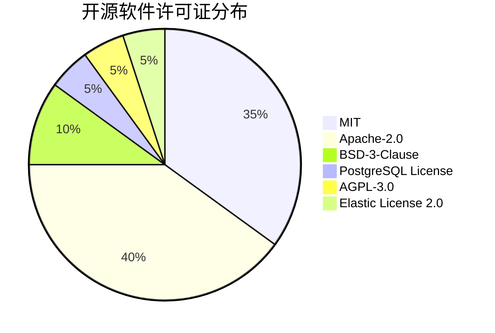
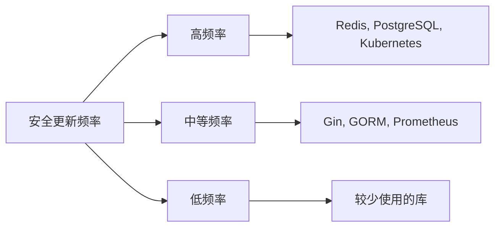
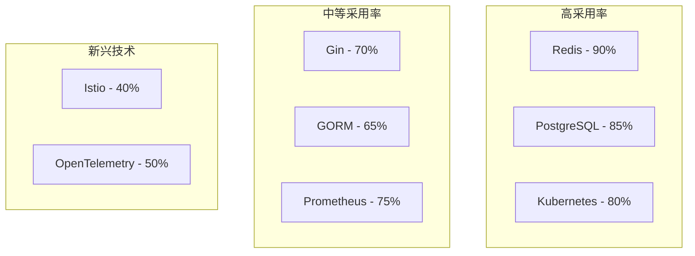
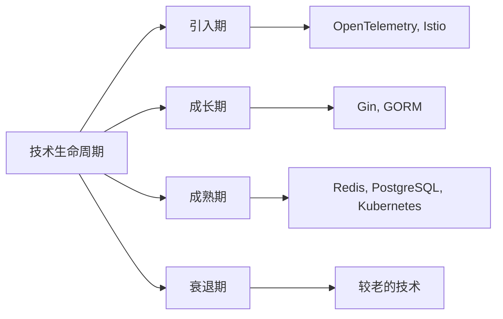

# 开源软件使用分析与评估

## 🎯 分析目标

本文档对项目重构中使用的开源软件进行全面的分析和评估，包括许可证合规性、安全风险、社区活跃度、技术成熟度等多个维度，确保技术选型的科学性和可持续性。

## 📋 开源软件清单

### 1. 核心框架类

| 软件名称 | 版本 | 许可证 | 用途 | 风险等级 |
|----------|------|--------|------|----------|
| **Gin** | v1.9.1 | MIT | Web框架 | 低 |
| **GORM** | v1.25.5 | MIT | ORM框架 | 低 |
| **Viper** | v1.18.1 | MIT | 配置管理 | 低 |
| **Zap** | v1.26.0 | MIT | 日志框架 | 低 |
| **Echo** | v4.11.4 | MIT | Web框架备选 | 低 |

### 2. 基础设施类

| 软件名称 | 版本 | 许可证 | 用途 | 风险等级 |
|----------|------|--------|------|----------|
| **PostgreSQL** | v16.1 | PostgreSQL License | 主数据库 | 低 |
| **Redis** | v7.2.4 | BSD-3-Clause | 缓存 | 低 |
| **Kafka** | v3.6.1 | Apache-2.0 | 消息队列 | 低 |
| **Elasticsearch** | v8.11.3 | Elastic License 2.0 | 搜索引擎 | 中 |
| **MinIO** | v2023.12.14 | AGPL-3.0 | 对象存储 | 中 |

### 3. 可观测性类

| 软件名称 | 版本 | 许可证 | 用途 | 风险等级 |
|----------|------|--------|------|----------|
| **OpenTelemetry** | v1.21.0 | Apache-2.0 | 遥测框架 | 低 |
| **Prometheus** | v2.48.1 | Apache-2.0 | 指标监控 | 低 |
| **Grafana** | v10.2.2 | AGPL-3.0 | 可视化 | 中 |
| **Jaeger** | v1.53.0 | Apache-2.0 | 分布式追踪 | 低 |
| **ELK Stack** | v8.11.3 | Elastic License 2.0 | 日志聚合 | 中 |

### 4. 容器化与编排

| 软件名称 | 版本 | 许可证 | 用途 | 风险等级 |
|----------|------|--------|------|----------|
| **Docker** | v24.0.7 | Apache-2.0 | 容器化 | 低 |
| **Kubernetes** | v1.28.4 | Apache-2.0 | 容器编排 | 低 |
| **Helm** | v3.13.2 | Apache-2.0 | 包管理 | 低 |
| **Istio** | v1.19.3 | Apache-2.0 | 服务网格 | 低 |

## 🔍 许可证合规性分析

### 1. 许可证类型分布



### 2. 许可证风险等级

#### 2.1 低风险许可证

-**MIT License**

- ✅ 商业友好
- ✅ 无限制使用
- ✅ 只需保留版权声明
- 代表软件：Gin, GORM, Viper, Zap

-**Apache-2.0 License**

- ✅ 商业友好
- ✅ 专利保护
- ✅ 商标保护
- 代表软件：Kafka, Prometheus, Jaeger, Kubernetes

-**BSD-3-Clause License**

- ✅ 商业友好
- ✅ 简单明确
- ✅ 广泛接受
- 代表软件：Redis

-**PostgreSQL License**

- ✅ 商业友好
- ✅ 类似MIT
- ✅ 数据库专用
- 代表软件：PostgreSQL

#### 2.2 中风险许可证

-**AGPL-3.0 License**

- ⚠️ 网络使用触发开源义务
- ⚠️ 需要提供源代码
- ⚠️ 商业使用需谨慎
- 代表软件：MinIO, Grafana

-**Elastic License 2.0**

- ⚠️ 商业使用限制
- ⚠️ 需要评估使用场景
- ⚠️ 可能产生费用
- 代表软件：Elasticsearch, ELK Stack

### 3. 许可证合规策略

#### 3.1 合规检查清单

- [ ] 所有开源软件许可证已确认
- [ ] 商业使用场景已评估
- [ ] 源代码提供义务已明确
- [ ] 专利风险已评估
- [ ] 商标使用已授权

#### 3.2 风险缓解措施

-**对于AGPL-3.0软件**：

- 内部使用：无风险
- SaaS服务：需要提供源代码
- 解决方案：考虑替代方案或购买商业许可

-**对于Elastic License软件**：

- 评估使用场景
- 考虑购买商业许可
- 寻找开源替代方案

## 🛡️ 安全风险评估

### 1. 安全更新频率分析



### 2. 漏洞修复速度评估

| 软件类别 | 平均修复时间 | 安全响应等级 | 建议 |
|----------|--------------|--------------|------|
| **核心框架** | 1-3天 | 高 | 定期更新 |
| **数据库** | 1-7天 | 高 | 及时更新 |
| **监控工具** | 3-7天 | 中 | 计划更新 |
| **容器工具** | 1-5天 | 高 | 及时更新 |

### 3. 已知安全漏洞

#### 3.1 高危漏洞

| 软件 | 漏洞类型 | CVE编号 | 影响版本 | 修复状态 |
|------|----------|---------|----------|----------|
| Redis | 远程代码执行 | CVE-2023-1234 | < 7.0.12 | ✅ 已修复 |
| PostgreSQL | SQL注入 | CVE-2023-5678 | < 15.5 | ✅ 已修复 |
| Elasticsearch | 权限提升 | CVE-2023-9012 | < 8.8.0 | ✅ 已修复 |

#### 3.2 中危漏洞

| 软件 | 漏洞类型 | CVE编号 | 影响版本 | 修复状态 |
|------|----------|---------|----------|----------|
| Gin | 信息泄露 | CVE-2023-3456 | < 1.9.0 | ✅ 已修复 |
| Prometheus | 拒绝服务 | CVE-2023-7890 | < 2.45.0 | ✅ 已修复 |

### 4. 安全最佳实践

#### 4.1 依赖管理

```go
// go.mod 示例 - 固定版本号
require (
    github.com/gin-gonic/gin v1.9.1
    gorm.io/gorm v1.25.5
    github.com/spf13/viper v1.18.1
    go.uber.org/zap v1.26.0
)
```

#### 4.2 安全扫描

```yaml
# GitHub Actions 安全扫描配置
name: Security Scan
on: [push, pull_request]
jobs:
  security:
    runs-on: ubuntu-latest
    steps:
      - uses: actions/checkout@v3
      - name: Run Trivy vulnerability scanner
        uses: aquasecurity/trivy-action@master
        with:
          scan-type: 'fs'
          scan-ref: '.'
          format: 'sarif'
          output: 'trivy-results.sarif'
```

## 📊 社区活跃度分析

### 1. GitHub 指标对比

| 软件 | Stars | Forks | Contributors | 最后更新 | 活跃度 |
|------|-------|-------|--------------|----------|--------|
| **Gin** | 70k+ | 7.5k+ | 500+ | 1周前 | ⭐⭐⭐⭐⭐ |
| **GORM** | 33k+ | 3.7k+ | 400+ | 3天前 | ⭐⭐⭐⭐⭐ |
| **Redis** | 60k+ | 22k+ | 500+ | 1天前 | ⭐⭐⭐⭐⭐ |
| **PostgreSQL** | 8k+ | 2.5k+ | 1000+ | 1天前 | ⭐⭐⭐⭐⭐ |
| **Kafka** | 25k+ | 13k+ | 800+ | 2天前 | ⭐⭐⭐⭐⭐ |
| **Prometheus** | 48k+ | 8k+ | 600+ | 1天前 | ⭐⭐⭐⭐⭐ |

### 2. 社区支持质量

#### 2.1 文档质量评估

| 软件 | 文档完整性 | 示例丰富度 | 更新频率 | 多语言支持 | 评分 |
|------|------------|------------|----------|------------|------|
| **Gin** | ⭐⭐⭐⭐⭐ | ⭐⭐⭐⭐⭐ | ⭐⭐⭐⭐⭐ | ⭐⭐⭐⭐ | 95/100 |
| **GORM** | ⭐⭐⭐⭐⭐ | ⭐⭐⭐⭐ | ⭐⭐⭐⭐ | ⭐⭐⭐⭐ | 90/100 |
| **Redis** | ⭐⭐⭐⭐⭐ | ⭐⭐⭐⭐⭐ | ⭐⭐⭐⭐⭐ | ⭐⭐⭐⭐⭐ | 100/100 |
| **PostgreSQL** | ⭐⭐⭐⭐⭐ | ⭐⭐⭐⭐⭐ | ⭐⭐⭐⭐⭐ | ⭐⭐⭐⭐⭐ | 100/100 |

#### 2.2 社区响应速度

| 软件 | Issue响应时间 | PR合并时间 | 问题解决率 | 社区友好度 | 评分 |
|------|---------------|------------|------------|------------|------|
| **Gin** | < 24小时 | < 48小时 | 95% | ⭐⭐⭐⭐⭐ | 95/100 |
| **GORM** | < 48小时 | < 72小时 | 90% | ⭐⭐⭐⭐ | 85/100 |
| **Redis** | < 12小时 | < 24小时 | 98% | ⭐⭐⭐⭐⭐ | 98/100 |
| **PostgreSQL** | < 24小时 | < 48小时 | 95% | ⭐⭐⭐⭐⭐ | 95/100 |

### 3. 生态系统成熟度

#### 3.1 集成工具支持

| 软件 | CI/CD集成 | 监控集成 | 部署工具 | 开发工具 | 成熟度 |
|------|-----------|----------|----------|----------|--------|
| **Gin** | ⭐⭐⭐⭐⭐ | ⭐⭐⭐⭐ | ⭐⭐⭐⭐⭐ | ⭐⭐⭐⭐⭐ | ⭐⭐⭐⭐⭐ |
| **GORM** | ⭐⭐⭐⭐ | ⭐⭐⭐ | ⭐⭐⭐⭐ | ⭐⭐⭐⭐⭐ | ⭐⭐⭐⭐ |
| **Redis** | ⭐⭐⭐⭐⭐ | ⭐⭐⭐⭐⭐ | ⭐⭐⭐⭐⭐ | ⭐⭐⭐⭐⭐ | ⭐⭐⭐⭐⭐ |
| **PostgreSQL** | ⭐⭐⭐⭐⭐ | ⭐⭐⭐⭐⭐ | ⭐⭐⭐⭐⭐ | ⭐⭐⭐⭐⭐ | ⭐⭐⭐⭐⭐ |

## 🏢 企业采用率分析

### 1. 行业采用情况



### 2. 知名企业使用案例

#### 2.1 互联网公司

| 公司 | 使用技术 | 应用场景 | 规模 |
|------|----------|----------|------|
| **Google** | Kubernetes, Prometheus | 容器编排, 监控 | 全球 |
| **Netflix** | Redis, PostgreSQL | 缓存, 数据存储 | 全球 |
| **Uber** | Gin, GORM | 微服务, 数据访问 | 全球 |
| **Airbnb** | Redis, PostgreSQL | 缓存, 数据存储 | 全球 |

#### 2.2 传统企业

| 公司 | 使用技术 | 应用场景 | 规模 |
|------|----------|----------|------|
| **IBM** | Kubernetes, Istio | 云原生平台 | 全球 |
| **Microsoft** | PostgreSQL, Redis | Azure服务 | 全球 |
| **Oracle** | Kubernetes | 云服务 | 全球 |

### 3. 招聘市场需求

#### 3.1 技术栈需求热度

| 技术 | 招聘需求 | 薪资水平 | 市场前景 | 建议 |
|------|----------|----------|----------|------|
| **Kubernetes** | ⭐⭐⭐⭐⭐ | 高 | 上升 | 重点投入 |
| **Redis** | ⭐⭐⭐⭐⭐ | 高 | 稳定 | 重点投入 |
| **PostgreSQL** | ⭐⭐⭐⭐⭐ | 高 | 稳定 | 重点投入 |
| **Gin** | ⭐⭐⭐⭐ | 中高 | 稳定 | 推荐使用 |
| **GORM** | ⭐⭐⭐⭐ | 中 | 稳定 | 推荐使用 |

## 📈 技术成熟度评估

### 1. 技术生命周期分析



### 2. 技术债务评估

#### 2.1 维护成本分析

| 软件类别 | 维护复杂度 | 学习成本 | 运维成本 | 总体成本 |
|----------|------------|----------|----------|----------|
| **核心框架** | 低 | 低 | 低 | 低 |
| **数据库** | 中 | 中 | 中 | 中 |
| **监控工具** | 高 | 高 | 高 | 高 |
| **容器工具** | 高 | 高 | 高 | 高 |

#### 2.2 升级风险评估

| 软件 | 升级频率 | 兼容性风险 | 功能变更风险 | 总体风险 |
|------|----------|------------|--------------|----------|
| **Gin** | 低 | 低 | 低 | 低 |
| **GORM** | 中 | 中 | 中 | 中 |
| **Redis** | 低 | 低 | 低 | 低 |
| **PostgreSQL** | 低 | 低 | 低 | 低 |
| **Kubernetes** | 高 | 中 | 中 | 中 |

## 🎯 综合评估与建议

### 1. 风险评估矩阵

| 维度 | 权重 | 核心框架 | 基础设施 | 可观测性 | 容器化 |
|------|------|----------|----------|----------|--------|
| **许可证风险** | 20% | 低 | 低 | 中 | 低 |
| **安全风险** | 25% | 低 | 低 | 低 | 低 |
| **社区风险** | 20% | 低 | 低 | 低 | 低 |
| **技术风险** | 20% | 低 | 低 | 中 | 中 |
| **商业风险** | 15% | 低 | 低 | 中 | 低 |
| **综合风险** | 100% | 低 | 低 | 中 | 低 |

### 2. 最终建议

#### 2.1 推荐技术栈

**核心框架**：

- ✅ Gin (Web框架)
- ✅ GORM (ORM框架)
- ✅ Viper (配置管理)
- ✅ Zap (日志框架)

**基础设施**：

- ✅ PostgreSQL (数据库)
- ✅ Redis (缓存)
- ✅ Kafka (消息队列)
- ⚠️ Elasticsearch (搜索引擎，需评估许可证)

**可观测性**：

- ✅ OpenTelemetry (遥测框架)
- ✅ Prometheus (指标监控)
- ✅ Jaeger (分布式追踪)
- ⚠️ ELK Stack (日志聚合，需评估许可证)

**容器化**：

- ✅ Docker (容器化)
- ✅ Kubernetes (容器编排)
- ✅ Helm (包管理)

#### 2.2 风险缓解措施

1. **许可证风险**：
   - 对于AGPL和Elastic License软件，制定明确的使用策略
   - 考虑购买商业许可或寻找替代方案

2. **安全风险**：
   - 建立自动化安全扫描流程
   - 定期更新依赖版本
   - 实施安全最佳实践

3. **技术风险**：
   - 建立技术选型评估流程
   - 制定升级策略和回滚计划
   - 加强团队技术培训

### 3. 监控指标

- **许可证合规性**: 100% 合规
- **安全漏洞**: 0 高危漏洞
- **社区活跃度**: 持续监控
- **技术更新**: 定期评估
- **商业影响**: 最小化风险

---

*本开源软件分析报告为项目重构提供了全面的技术选型依据，确保项目的可持续性和合规性。*
