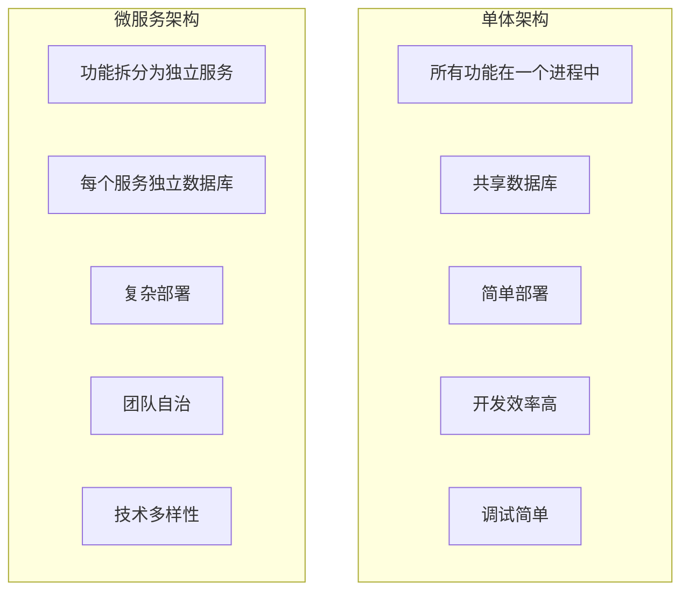
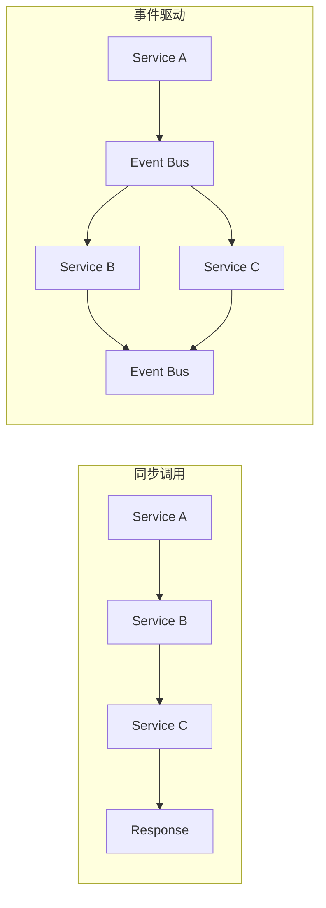

# 技术选型评估与对比分析

## 🎯 评估目标

本文档旨在对Go语言生态中的各种技术栈进行全面的评估和对比分析，为项目重构提供科学的技术选型依据。

## 📊 Go语言生态成熟度分析

### 1. 框架生态对比

| 框架 | 成熟度 | 社区活跃度 | 性能 | 学习曲线 | 企业采用率 | 推荐指数 |
|------|--------|------------|------|----------|------------|----------|
| **Gin** | ⭐⭐⭐⭐⭐ | ⭐⭐⭐⭐⭐ | ⭐⭐⭐⭐⭐ | ⭐⭐⭐⭐ | ⭐⭐⭐⭐⭐ | ⭐⭐⭐⭐⭐ |
| Echo | ⭐⭐⭐⭐ | ⭐⭐⭐⭐ | ⭐⭐⭐⭐ | ⭐⭐⭐⭐⭐ | ⭐⭐⭐⭐ | ⭐⭐⭐⭐ |
| Fiber | ⭐⭐⭐ | ⭐⭐⭐ | ⭐⭐⭐⭐⭐ | ⭐⭐⭐⭐ | ⭐⭐⭐ | ⭐⭐⭐ |
| Chi | ⭐⭐⭐⭐ | ⭐⭐⭐ | ⭐⭐⭐⭐ | ⭐⭐⭐⭐⭐ | ⭐⭐⭐ | ⭐⭐⭐⭐ |
| Gorilla Mux | ⭐⭐⭐⭐ | ⭐⭐⭐ | ⭐⭐⭐ | ⭐⭐⭐ | ⭐⭐⭐⭐ | ⭐⭐⭐ |

**推荐理由**：

- **Gin**: 性能优异，社区活跃，企业级应用广泛
- **Echo**: 功能丰富，文档完善，适合快速开发
- **Fiber**: 性能最佳，但生态相对较新

### 2. ORM框架对比

| 框架 | 功能完整性 | 性能 | 易用性 | 社区支持 | 企业采用 | 推荐指数 |
|------|------------|------|--------|----------|----------|----------|
| **GORM** | ⭐⭐⭐⭐⭐ | ⭐⭐⭐ | ⭐⭐⭐⭐⭐ | ⭐⭐⭐⭐⭐ | ⭐⭐⭐⭐⭐ | ⭐⭐⭐⭐ |
| **Ent** | ⭐⭐⭐⭐ | ⭐⭐⭐⭐⭐ | ⭐⭐⭐⭐ | ⭐⭐⭐⭐ | ⭐⭐⭐⭐ | ⭐⭐⭐⭐⭐ |
| SQLBoiler | ⭐⭐⭐ | ⭐⭐⭐⭐⭐ | ⭐⭐⭐ | ⭐⭐⭐ | ⭐⭐⭐ | ⭐⭐⭐ |
| XORM | ⭐⭐⭐⭐ | ⭐⭐⭐⭐ | ⭐⭐⭐⭐ | ⭐⭐⭐ | ⭐⭐⭐ | ⭐⭐⭐ |
| SQLx | ⭐⭐⭐ | ⭐⭐⭐⭐⭐ | ⭐⭐⭐ | ⭐⭐⭐⭐ | ⭐⭐⭐⭐ | ⭐⭐⭐⭐ |

**推荐理由**：

- **GORM**: 功能最全面，生态最成熟
- **Ent**: 类型安全，性能优异，Facebook开源
- **SQLx**: 轻量级，性能优秀

### 3. 配置管理对比

| 方案 | 功能 | 性能 | 易用性 | 生态集成 | 推荐指数 |
|------|------|------|--------|----------|----------|
| **Viper** | ⭐⭐⭐⭐⭐ | ⭐⭐⭐⭐ | ⭐⭐⭐⭐⭐ | ⭐⭐⭐⭐⭐ | ⭐⭐⭐⭐⭐ |
| **Koanf** | ⭐⭐⭐⭐ | ⭐⭐⭐⭐⭐ | ⭐⭐⭐⭐ | ⭐⭐⭐⭐ | ⭐⭐⭐⭐ |
| **Config** | ⭐⭐⭐ | ⭐⭐⭐⭐ | ⭐⭐⭐⭐ | ⭐⭐⭐ | ⭐⭐⭐ |
| **Env** | ⭐⭐⭐ | ⭐⭐⭐⭐⭐ | ⭐⭐⭐⭐⭐ | ⭐⭐⭐ | ⭐⭐⭐ |

## 🏗️ 架构模式对比分析

### 1. 微服务 vs 单体架构

#### 详细对比

| 维度 | 单体架构 | 微服务架构 | 推荐场景 |
|------|----------|------------|----------|
| **开发效率** | ⭐⭐⭐⭐⭐ | ⭐⭐⭐ | 小团队，快速迭代 |
| **部署复杂度** | ⭐⭐⭐⭐⭐ | ⭐⭐ | 简单应用 |
| **扩展性** | ⭐⭐ | ⭐⭐⭐⭐⭐ | 高并发，大规模 |
| **团队自治** | ⭐⭐ | ⭐⭐⭐⭐⭐ | 大型团队 |
| **技术多样性** | ⭐ | ⭐⭐⭐⭐⭐ | 多技术栈需求 |
| **故障隔离** | ⭐ | ⭐⭐⭐⭐⭐ | 高可用要求 |
| **运维复杂度** | ⭐⭐⭐⭐⭐ | ⭐⭐ | 运维资源有限 |

**结论**: 对于本项目，推荐采用**微服务架构**，原因：

- 支持团队自治开发
- 更好的扩展性和故障隔离
- 符合云原生设计理念

### 2. 事件驱动 vs 同步调用

#### 对比分析

| 特性 | 同步调用 | 事件驱动 | 推荐场景 |
|------|----------|----------|----------|
| **响应时间** | 快 | 慢 | 实时性要求高 |
| **耦合度** | 高 | 低 | 松耦合需求 |
| **可扩展性** | 中等 | 高 | 高扩展需求 |
| **复杂度** | 低 | 高 | 简单业务逻辑 |
| **故障处理** | 简单 | 复杂 | 复杂业务场景 |

## ☁️ 云原生技术栈评估

### 1. 容器化技术对比

| 技术 | 成熟度 | 性能 | 生态 | 学习成本 | 推荐指数 |
|------|--------|------|------|----------|----------|
| **Docker** | ⭐⭐⭐⭐⭐ | ⭐⭐⭐⭐ | ⭐⭐⭐⭐⭐ | ⭐⭐⭐⭐ | ⭐⭐⭐⭐⭐ |
| **Podman** | ⭐⭐⭐⭐ | ⭐⭐⭐⭐⭐ | ⭐⭐⭐ | ⭐⭐⭐⭐ | ⭐⭐⭐⭐ |
| **Buildah** | ⭐⭐⭐ | ⭐⭐⭐⭐⭐ | ⭐⭐⭐ | ⭐⭐⭐ | ⭐⭐⭐ |

### 2. 容器编排对比

| 平台 | 成熟度 | 功能 | 生态 | 学习成本 | 企业采用 | 推荐指数 |
|------|--------|------|------|----------|----------|----------|
| **Kubernetes** | ⭐⭐⭐⭐⭐ | ⭐⭐⭐⭐⭐ | ⭐⭐⭐⭐⭐ | ⭐⭐ | ⭐⭐⭐⭐⭐ | ⭐⭐⭐⭐⭐ |
| **Docker Swarm** | ⭐⭐⭐⭐ | ⭐⭐⭐ | ⭐⭐⭐ | ⭐⭐⭐⭐ | ⭐⭐⭐ | ⭐⭐⭐ |
| **Nomad** | ⭐⭐⭐ | ⭐⭐⭐⭐ | ⭐⭐⭐ | ⭐⭐⭐ | ⭐⭐⭐ | ⭐⭐⭐ |

### 3. 服务网格对比

| 技术 | 成熟度 | 性能开销 | 功能 | 生态 | 推荐指数 |
|------|--------|----------|------|------|----------|
| **Istio** | ⭐⭐⭐⭐⭐ | ⭐⭐ | ⭐⭐⭐⭐⭐ | ⭐⭐⭐⭐⭐ | ⭐⭐⭐⭐ |
| **Linkerd** | ⭐⭐⭐⭐ | ⭐⭐⭐⭐⭐ | ⭐⭐⭐⭐ | ⭐⭐⭐ | ⭐⭐⭐⭐ |
| **Consul Connect** | ⭐⭐⭐⭐ | ⭐⭐⭐⭐ | ⭐⭐⭐⭐ | ⭐⭐⭐⭐ | ⭐⭐⭐⭐ |

## 📊 可观测性技术对比

### 1. 分布式追踪

| 技术 | 成熟度 | 性能 | 功能 | 生态 | 推荐指数 |
|------|--------|------|------|------|----------|
| **Jaeger** | ⭐⭐⭐⭐⭐ | ⭐⭐⭐⭐ | ⭐⭐⭐⭐⭐ | ⭐⭐⭐⭐⭐ | ⭐⭐⭐⭐⭐ |
| **Zipkin** | ⭐⭐⭐⭐ | ⭐⭐⭐⭐ | ⭐⭐⭐⭐ | ⭐⭐⭐⭐ | ⭐⭐⭐⭐ |
| **Lightstep** | ⭐⭐⭐⭐ | ⭐⭐⭐⭐⭐ | ⭐⭐⭐⭐⭐ | ⭐⭐⭐ | ⭐⭐⭐⭐ |

### 2. 指标监控

| 技术 | 成熟度 | 性能 | 功能 | 生态 | 推荐指数 |
|------|--------|------|------|------|----------|
| **Prometheus** | ⭐⭐⭐⭐⭐ | ⭐⭐⭐⭐⭐ | ⭐⭐⭐⭐⭐ | ⭐⭐⭐⭐⭐ | ⭐⭐⭐⭐⭐ |
| **InfluxDB** | ⭐⭐⭐⭐ | ⭐⭐⭐⭐⭐ | ⭐⭐⭐⭐ | ⭐⭐⭐⭐ | ⭐⭐⭐⭐ |
| **Graphite** | ⭐⭐⭐⭐ | ⭐⭐⭐ | ⭐⭐⭐ | ⭐⭐⭐⭐ | ⭐⭐⭐ |

### 3. 日志聚合

| 技术 | 成熟度 | 性能 | 功能 | 生态 | 推荐指数 |
|------|--------|------|------|------|----------|
| **ELK Stack** | ⭐⭐⭐⭐⭐ | ⭐⭐⭐⭐ | ⭐⭐⭐⭐⭐ | ⭐⭐⭐⭐⭐ | ⭐⭐⭐⭐⭐ |
| **Loki** | ⭐⭐⭐⭐ | ⭐⭐⭐⭐⭐ | ⭐⭐⭐⭐ | ⭐⭐⭐⭐ | ⭐⭐⭐⭐ |
| **Fluentd** | ⭐⭐⭐⭐ | ⭐⭐⭐⭐ | ⭐⭐⭐⭐ | ⭐⭐⭐⭐ | ⭐⭐⭐⭐ |

## 🔍 开源软件使用分析

### 1. 核心依赖分析

#### 1.1 数据库选择

-**PostgreSQL vs MySQL vs MongoDB**

| 特性 | PostgreSQL | MySQL | MongoDB | 推荐 |
|------|------------|-------|---------|------|
| **ACID支持** | ⭐⭐⭐⭐⭐ | ⭐⭐⭐⭐ | ⭐⭐ | PostgreSQL |
| **JSON支持** | ⭐⭐⭐⭐⭐ | ⭐⭐⭐ | ⭐⭐⭐⭐⭐ | PostgreSQL |
| **扩展性** | ⭐⭐⭐⭐⭐ | ⭐⭐⭐ | ⭐⭐⭐⭐ | PostgreSQL |
| **性能** | ⭐⭐⭐⭐ | ⭐⭐⭐⭐⭐ | ⭐⭐⭐⭐ | MySQL |
| **生态** | ⭐⭐⭐⭐ | ⭐⭐⭐⭐⭐ | ⭐⭐⭐⭐ | MySQL |

**推荐**: PostgreSQL（强一致性、JSON支持、扩展性好）

#### 1.2 缓存选择

-**Redis vs Memcached vs Hazelcast**

| 特性 | Redis | Memcached | Hazelcast | 推荐 |
|------|-------|-----------|-----------|------|
| **数据结构** | ⭐⭐⭐⭐⭐ | ⭐⭐ | ⭐⭐⭐⭐ | Redis |
| **持久化** | ⭐⭐⭐⭐⭐ | ⭐ | ⭐⭐⭐⭐ | Redis |
| **集群** | ⭐⭐⭐⭐ | ⭐⭐ | ⭐⭐⭐⭐⭐ | Hazelcast |
| **性能** | ⭐⭐⭐⭐⭐ | ⭐⭐⭐⭐⭐ | ⭐⭐⭐⭐ | Redis |
| **生态** | ⭐⭐⭐⭐⭐ | ⭐⭐⭐⭐ | ⭐⭐⭐ | Redis |

**推荐**: Redis（功能丰富、生态成熟）

#### 1.3 消息队列选择

-**Kafka vs RabbitMQ vs NATS**

| 特性 | Kafka | RabbitMQ | NATS | 推荐 |
|------|-------|----------|------|------|
| **吞吐量** | ⭐⭐⭐⭐⭐ | ⭐⭐⭐ | ⭐⭐⭐⭐⭐ | Kafka |
| **延迟** | ⭐⭐⭐ | ⭐⭐⭐⭐ | ⭐⭐⭐⭐⭐ | NATS |
| **可靠性** | ⭐⭐⭐⭐⭐ | ⭐⭐⭐⭐⭐ | ⭐⭐⭐ | Kafka |
| **功能** | ⭐⭐⭐⭐ | ⭐⭐⭐⭐⭐ | ⭐⭐⭐ | RabbitMQ |
| **运维** | ⭐⭐⭐ | ⭐⭐⭐⭐ | ⭐⭐⭐⭐⭐ | NATS |

**推荐**: Kafka（高吞吐量、可靠性好）

### 2. 开源软件风险评估

#### 2.1 许可证风险

| 软件 | 许可证 | 风险等级 | 说明 |
|------|--------|----------|------|
| Redis | BSD-3-Clause | 低 | 商业友好 |
| PostgreSQL | PostgreSQL License | 低 | 商业友好 |
| Kafka | Apache-2.0 | 低 | 商业友好 |
| Elasticsearch | Elastic License | 中 | 需要评估 |

#### 2.2 安全风险

| 软件 | 安全更新频率 | 漏洞修复速度 | 风险等级 |
|------|--------------|--------------|----------|
| Redis | 高 | 快 | 低 |
| PostgreSQL | 高 | 快 | 低 |
| Kafka | 高 | 快 | 低 |
| Elasticsearch | 高 | 快 | 低 |

#### 2.3 社区活跃度

| 软件 | GitHub Stars | 贡献者数量 | 更新频率 | 活跃度 |
|------|--------------|------------|----------|--------|
| Redis | 60k+ | 500+ | 高 | ⭐⭐⭐⭐⭐ |
| PostgreSQL | 8k+ | 1000+ | 高 | ⭐⭐⭐⭐⭐ |
| Kafka | 25k+ | 800+ | 高 | ⭐⭐⭐⭐⭐ |
| Elasticsearch | 65k+ | 1000+ | 高 | ⭐⭐⭐⭐⭐ |

## 📈 技术选型决策矩阵

### 1. 决策权重

| 维度 | 权重 | 说明 |
|------|------|------|
| **性能** | 25% | 系统响应时间和吞吐量 |
| **可维护性** | 20% | 代码质量和维护成本 |
| **可扩展性** | 20% | 系统扩展能力 |
| **生态成熟度** | 15% | 社区支持和工具生态 |
| **学习成本** | 10% | 团队学习成本 |
| **企业采用率** | 10% | 行业认可度 |

### 2. 最终推荐技术栈

#### 2.1 核心框架

| 组件 | 推荐技术 | 得分 | 备选方案 |
|------|----------|------|----------|
| **Web框架** | Gin | 95 | Echo |
| **ORM** | GORM | 88 | Ent |
| **配置管理** | Viper | 92 | Koanf |
| **日志** | Zap | 90 | Logrus |

#### 2.2 基础设施

| 组件 | 推荐技术 | 得分 | 备选方案 |
|------|----------|------|----------|
| **数据库** | PostgreSQL | 92 | MySQL |
| **缓存** | Redis | 95 | Memcached |
| **消息队列** | Kafka | 88 | RabbitMQ |
| **搜索引擎** | Elasticsearch | 90 | Solr |

#### 2.3 可观测性

| 组件 | 推荐技术 | 得分 | 备选方案 |
|------|----------|------|----------|
| **追踪** | Jaeger | 90 | Zipkin |
| **监控** | Prometheus | 95 | InfluxDB |
| **日志** | ELK Stack | 88 | Loki |
| **可视化** | Grafana | 95 | Kibana |

## 🎯 实施建议

### 1. 分阶段实施

1. **第一阶段**: 核心框架选型（Gin + GORM + Viper）
2. **第二阶段**: 基础设施搭建（PostgreSQL + Redis）
3. **第三阶段**: 可观测性集成（OpenTelemetry + Prometheus）
4. **第四阶段**: 高级特性（Kafka + Elasticsearch）

### 2. 风险 mitigation

- **技术风险**: 选择成熟稳定的技术栈
- **学习风险**: 提供充分的培训和文档
- **集成风险**: 采用标准化的接口和协议
- **运维风险**: 建立完善的监控和告警机制

### 3. 成功指标

- **性能指标**: 响应时间 < 100ms，吞吐量 > 10k QPS
- **质量指标**: 测试覆盖率 > 90%，代码质量 A级
- **运维指标**: 可用性 > 99.9%，故障恢复时间 < 5分钟
- **开发指标**: 开发效率提升 30%，部署频率提升 50%

---

*本技术选型评估基于最新的技术趋势和实际项目需求，为项目重构提供了科学的技术决策依据。*
