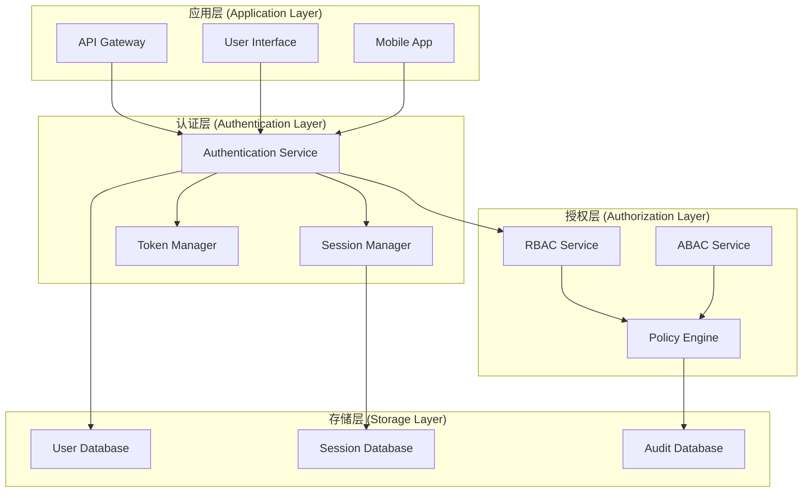

# 认证组件架构 (Auth Component Architecture)

## 目录

- [认证组件架构 (Auth Component Architecture)](#认证组件架构-auth-component-architecture)
  - [目录](#目录)
  - [1. 形式化定义](#1-形式化定义)
    - [1.1 认证组件定义](#11-认证组件定义)
    - [1.2 权限模型](#12-权限模型)
    - [1.3 认证流程](#13-认证流程)
  - [2. 架构模式](#2-架构模式)
    - [2.1 分层认证架构](#21-分层认证架构)
    - [2.2 认证模式](#22-认证模式)
      - [2.2.1 多因素认证 (MFA)](#221-多因素认证-mfa)
      - [2.2.2 OAuth 2.0 & OpenID Connect](#222-oauth-20--openid-connect)
  - [3. Go语言实现](#3-go语言实现)
    - [3.1 核心接口](#31-核心接口)
    - [3.2 密码认证组件](#32-密码认证组件)
    - [3.3 RBAC授权组件](#33-rbac授权组件)
    - [3.4 JWT令牌管理器](#34-jwt令牌管理器)
  - [4. 安全最佳实践](#4-安全最佳实践)
    - [4.1 密码存储](#41-密码存储)
    - [4.2 令牌安全](#42-令牌安全)
    - [4.3 会话管理](#43-会话管理)
  - [5. 总结](#5-总结)

---

## 1. 形式化定义

### 1.1 认证组件定义

**定义 1.1 (认证组件)**
认证组件是一个六元组 $C_{\text{auth}} = (S, I, B, P, T, R)$，其中：

- $S$ 是组件状态集合 (State Set)
- $I$ 是组件接口集合 (Interface Set)
- $B$ 是组件行为集合 (Behavior Set)
- $P$ 是权限集合 (Permission Set)
- $T$ 是令牌集合 (Token Set)
- $R$ 是角色集合 (Role Set)

**定义 1.2 (用户实体)**
用户实体是一个四元组 $U = (\text{id}, \text{credentials}, \text{roles}, \text{permissions})$，其中：

- `id` 是用户唯一标识符
- `credentials` 是认证凭据集合
- `roles` 是用户角色集合
- `permissions` 是用户权限集合

**定义 1.3 (认证会话)**
认证会话是一个五元组 $S_{\text{auth}} = (\text{session_id}, \text{user_id}, \text{token}, \text{expires_at}, \text{metadata})$，其中：

- `session_id` 是会话唯一标识符
- `user_id` 是用户标识符
- `token` 是认证令牌
- `expires_at` 是过期时间
- `metadata` 是会话元数据

### 1.2 权限模型

**定义 1.4 (权限)**
权限是一个三元组 $P = (\text{resource}, \text{action}, \text{conditions})$，其中：

- `resource` 是资源标识符
- `action` 是操作类型 (read, write, delete, execute)
- `conditions` 是权限条件集合

**定义 1.5 (角色)**
角色是一个三元组 $R = (\text{role_id}, \text{permissions}, \text{inheritance})$，其中：

- `role_id` 是角色标识符
- `permissions` 是权限集合
- `inheritance` 是继承关系集合

**定理 1.1 (权限传递性)**
对于任意角色 $R_1, R_2, R_3$，如果 $R_1$ 继承 $R_2$ ($R_1 \rhd R_2$)，并且 $R_2$ 继承 $R_3$ ($R_2 \rhd R_3$)，则 $R_1$ 继承 $R_3$ ($R_1 \rhd R_3$)，且其权限集合满足：
$$
R_1.\text{permissions} \supseteq R_2.\text{permissions} \supseteq R_3.\text{permissions}
$$

### 1.3 认证流程

**定义 1.6 (认证流程)**
认证流程是一个状态机 $A = (Q, \Sigma, \delta, q_0, F)$，其中：

- $Q = \{\text{Unauthenticated, Authenticating, Authenticated, Expired, Revoked}\}$ 是状态集合
- $\Sigma$ 是事件集合
- $\delta: Q \times \Sigma \rightarrow Q$ 是状态转移函数
- $q_0 = \text{Unauthenticated}$ 是初始状态
- $F = \{\text{Authenticated}\}$ 是接受状态集合

---

## 2. 架构模式

### 2.1 分层认证架构



### 2.2 认证模式

#### 2.2.1 多因素认证 (MFA)

```go
package auth

// AuthFactor 认证因子接口
type AuthFactor interface {
    Type() string
    Validate(credential interface{}) error
    IsRequired() bool
}

// PasswordFactor 密码因子
type PasswordFactor struct {
    required bool
    hasher   PasswordHasher
}

func NewPasswordFactor(required bool) *PasswordFactor {
    return &PasswordFactor{
        required: required,
        hasher:   NewBCryptHasher(),
    }
}

func (pf *PasswordFactor) Type() string {
    return "password"
}

func (pf *PasswordFactor) Validate(credential interface{}) error {
    password, ok := credential.(string)
    if !ok {
        return fmt.Errorf("invalid credential type")
    }
    
    // 验证密码强度
    if err := pf.validatePasswordStrength(password); err != nil {
        return err
    }
    
    return nil
}

func (pf *PasswordFactor) IsRequired() bool {
    return pf.required
}

func (pf *PasswordFactor) validatePasswordStrength(password string) error {
    if len(password) < 8 {
        return fmt.Errorf("password too short")
    }
    
    // 检查复杂度要求
    var hasUpper, hasLower, hasDigit, hasSpecial bool
    for _, char := range password {
        switch {
        case unicode.IsUpper(char):
            hasUpper = true
        case unicode.IsLower(char):
            hasLower = true
        case unicode.IsDigit(char):
            hasDigit = true
        case unicode.IsPunct(char) || unicode.IsSymbol(char):
            hasSpecial = true
        }
    }
    
    if !(hasUpper && hasLower && hasDigit && hasSpecial) {
        return fmt.Errorf("password does not meet complexity requirements")
    }
    
    return nil
}
```

#### 2.2.2 OAuth 2.0 & OpenID Connect

- **OAuth 2.0**: 一个授权框架，允许第三方应用代表用户访问其在某个服务上的资源，而无需获取用户的凭证。
- **OpenID Connect (OIDC)**: 在OAuth 2.0之上构建的身份层，提供用户身份验证功能。

---

## 3. Go语言实现

### 3.1 核心接口

```go
package auth

// Authenticator 认证器接口
type Authenticator interface {
    Authenticate(ctx context.Context, credentials map[string]interface{}) (Principal, error)
}

// Authorizer 授权器接口
type Authorizer interface {
    Authorize(ctx context.Context, principal Principal, permission Permission) error
}

// Principal 代表已认证的用户实体
type Principal interface {
    ID() string
    Roles() []string
    Permissions() []Permission
}

// Permission 代表一个操作权限
type Permission string
```

### 3.2 密码认证组件

```go
package auth

type PasswordAuthenticator struct {
    userStore UserStore
    hasher    PasswordHasher
}

func (a *PasswordAuthenticator) Authenticate(ctx context.Context, creds map[string]interface{}) (Principal, error) {
    username, _ := creds["username"].(string)
    password, _ := creds["password"].(string)

    user, err := a.userStore.FindByUsername(ctx, username)
    if err != nil {
        return nil, err
    }

    if err := a.hasher.Compare(user.PasswordHash(), password); err != nil {
        return nil, errors.New("invalid credentials")
    }

    return user, nil
}
```

### 3.3 RBAC授权组件

```go
package auth

type RBACAuthorizer struct {
    roleStore RoleStore
}

func (a *RBACAuthorizer) Authorize(ctx context.Context, principal Principal, permission Permission) error {
    for _, roleName := range principal.Roles() {
        role, err := a.roleStore.FindByName(ctx, roleName)
        if err != nil {
            continue
        }
        if role.HasPermission(permission) {
            return nil
        }
    }
    return errors.New("permission denied")
}
```

### 3.4 JWT令牌管理器

```go
package auth

import "github.com/golang-jwt/jwt/v4"

type JWTManager struct {
    secretKey string
}

func (m *JWTManager) Generate(principal Principal) (string, error) {
    claims := jwt.MapClaims{
        "sub":  principal.ID(),
        "exp":  time.Now().Add(time.Hour * 24).Unix(),
        "roles": principal.Roles(),
    }
    token := jwt.NewWithClaims(jwt.SigningMethodHS256, claims)
    return token.SignedString([]byte(m.secretKey))
}

func (m *JWTManager) Validate(tokenString string) (Principal, error) {
    token, err := jwt.Parse(tokenString, func(token *jwt.Token) (interface{}, error) {
        return []byte(m.secretKey), nil
    })
    if err != nil {
        return nil, err
    }

    if claims, ok := token.Claims.(jwt.MapClaims); ok && token.Valid {
        // 从claims构建Principal
        // ...
        return principal, nil
    }

    return nil, errors.New("invalid token")
}
```

---

## 4. 安全最佳实践

### 4.1 密码存储

- **哈希算法**: 使用强密码哈希函数，如`bcrypt`, `scrypt`, 或 `Argon2`。
- **加盐**: 为每个密码使用唯一的盐值，防止彩虹表攻击。

### 4.2 令牌安全

- **短暂生命周期**: 令牌（特别是访问令牌）应具有较短的生命周期。
- **HTTPS**: 始终通过HTTPS传输令牌。
- **安全存储**: 在客户端安全地存储令牌（例如，使用`HttpOnly`和`Secure`标志的cookie）。

### 4.3 会话管理

- **会话固定**: 登录后重新生成会话ID。
- **超时**: 实现不活动会话超时。
- **安全注销**: 提供安全的注销机制，使服务器端的会话无效。

---

## 5. 总结

认证组件架构通过将认证和授权逻辑模块化，为构建安全、可扩展的应用系统提供了坚实的基础。通过形式化定义、标准架构模式和遵循安全最佳实践，开发者可以设计出能够抵御常见安全威胁的强大认证系统。 