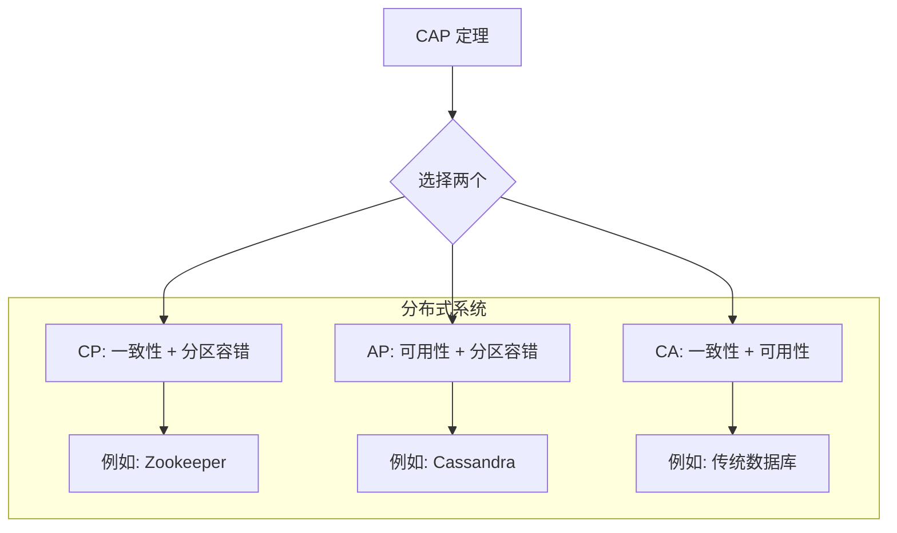
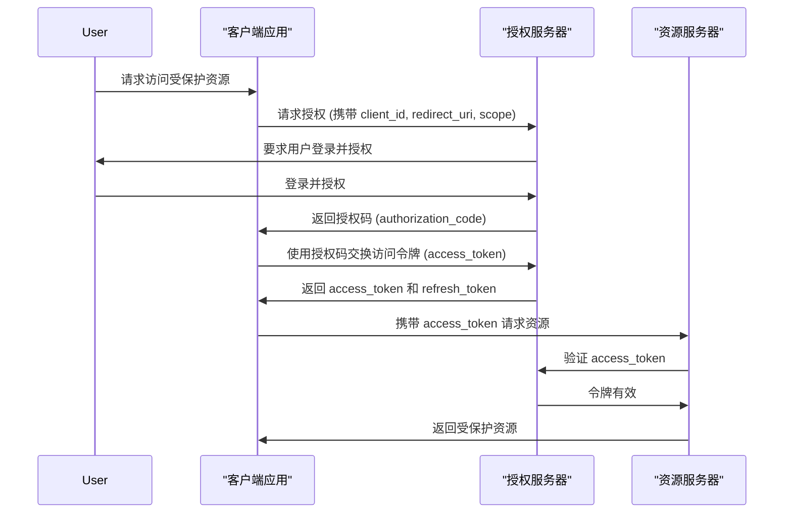

# 4. 工作流集成

## 4.1 集成理论基础

### 4.1.1 集成模式定义

**定义 4.1** (工作流集成): 工作流集成是一个三元组 $$ \mathcal{I} = (W, S, A) $$，其中：

- $$ W $$ 是工作流系统
- $$ S $$ 是外部系统集合
- $$ A $$ 是适配器集合

**集成架构**:

$$
\text{WorkflowIntegration} = \text{AdapterLayer} \times \text{ProtocolLayer} \times \text{DataLayer}
$$

### 4.1.2 集成模式分类

$$
\text{IntegrationPatterns} = \text{Synchronous} \cup \text{Asynchronous} \cup \text{EventDriven} \cup \text{MessageBased}
$$

## 4.2 系统集成实现

### 4.2.1 集成适配器

```go
// IntegrationAdapter 集成适配器接口
type IntegrationAdapter interface {
    // 适配器标识
    GetID() string
    GetName() string
    GetType() AdapterType
    
    // 连接管理
    Connect() error
    Disconnect() error
    IsConnected() bool
    
    // 数据操作
    Send(data interface{}) error
    Receive() (<-chan interface{}, error)
    
    // 配置管理
    GetConfig() AdapterConfig
    UpdateConfig(config AdapterConfig) error
}

// AdapterType 适配器类型
type AdapterType string

const (
    AdapterTypeDatabase  AdapterType = "DATABASE"
    AdapterTypeMessage   AdapterType = "MESSAGE"
    AdapterTypeAPI       AdapterType = "API"
    AdapterTypeFile      AdapterType = "FILE"
    AdapterTypeLegacy    AdapterType = "LEGACY"
)

// AdapterConfig 适配器配置
type AdapterConfig struct {
    ID          string                 `json:"id"`
    Name        string                 `json:"name"`
    Type        AdapterType            `json:"type"`
    Connection  ConnectionConfig       `json:"connection"`
    Mapping     DataMapping            `json:"mapping"`
    Parameters  map[string]interface{} `json:"parameters"`
}

// ConnectionConfig 连接配置
type ConnectionConfig struct {
    URL      string            `json:"url"`
    Username string            `json:"username"`
    Password string            `json:"password"`
    Timeout  time.Duration     `json:"timeout"`
    Headers  map[string]string `json:"headers"`
}

// DataMapping 数据映射
type DataMapping struct {
    InputMapping  map[string]string `json:"input_mapping"`
    OutputMapping map[string]string `json:"output_mapping"`
    Transformers  []Transformer     `json:"transformers"`
}

// Transformer 数据转换器
type Transformer struct {
    Type       string                 `json:"type"`
    Parameters map[string]interface{} `json:"parameters"`
}

// BaseAdapter 基础适配器实现
type BaseAdapter struct {
    id       string
    name     string
    adapterType AdapterType
    config   AdapterConfig
    connected bool
    mutex    sync.RWMutex
}

// NewBaseAdapter 创建基础适配器
func NewBaseAdapter(id, name string, adapterType AdapterType) *BaseAdapter {
    return &BaseAdapter{
        id:         id,
        name:       name,
        adapterType: adapterType,
    }
}

// GetID 获取适配器ID
func (ba *BaseAdapter) GetID() string {
    return ba.id
}

// GetName 获取适配器名称
func (ba *BaseAdapter) GetName() string {
    return ba.name
}

// GetType 获取适配器类型
func (ba *BaseAdapter) GetType() AdapterType {
    return ba.adapterType
}

// IsConnected 检查连接状态
func (ba *BaseAdapter) IsConnected() bool {
    ba.mutex.RLock()
    defer ba.mutex.RUnlock()
    return ba.connected
}

// GetConfig 获取适配器配置
func (ba *BaseAdapter) GetConfig() AdapterConfig {
    ba.mutex.RLock()
    defer ba.mutex.RUnlock()
    return ba.config
}

// UpdateConfig 更新适配器配置
func (ba *BaseAdapter) UpdateConfig(config AdapterConfig) error {
    ba.mutex.Lock()
    defer ba.mutex.Unlock()
    ba.config = config
    return nil
}
```

### 4.2.2 数据库适配器

```go
// DatabaseAdapter 数据库适配器
type DatabaseAdapter struct {
    *BaseAdapter
    db     *sql.DB
    driver string
}

// NewDatabaseAdapter 创建数据库适配器
func NewDatabaseAdapter(id, name, driver string) *DatabaseAdapter {
    return &DatabaseAdapter{
        BaseAdapter: NewBaseAdapter(id, name, AdapterTypeDatabase),
        driver:      driver,
    }
}

// Connect 连接数据库
func (da *DatabaseAdapter) Connect() error {
    da.mutex.Lock()
    defer da.mutex.Unlock()
    
    if da.connected {
        return nil
    }
    
    db, err := sql.Open(da.driver, da.config.Connection.URL)
    if err != nil {
        return fmt.Errorf("failed to open database: %w", err)
    }
    
    // 测试连接
    if err := db.Ping(); err != nil {
        return fmt.Errorf("failed to ping database: %w", err)
    }
    
    da.db = db
    da.connected = true
    return nil
}

// Disconnect 断开数据库连接
func (da *DatabaseAdapter) Disconnect() error {
    da.mutex.Lock()
    defer da.mutex.Unlock()
    
    if !da.connected {
        return nil
    }
    
    if da.db != nil {
        if err := da.db.Close(); err != nil {
            return fmt.Errorf("failed to close database: %w", err)
        }
    }
    
    da.connected = false
    return nil
}

// Send 发送数据到数据库
func (da *DatabaseAdapter) Send(data interface{}) error {
    da.mutex.RLock()
    defer da.mutex.RUnlock()
    
    if !da.connected {
        return fmt.Errorf("not connected to database")
    }
    
    // 根据数据类型执行不同的操作
    switch v := data.(type) {
    case *InsertData:
        return da.insertData(v)
    case *UpdateData:
        return da.updateData(v)
    case *DeleteData:
        return da.deleteData(v)
    case *QueryData:
        return da.queryData(v)
    default:
        return fmt.Errorf("unsupported data type: %T", data)
    }
}

// InsertData 插入数据
type InsertData struct {
    Table   string                 `json:"table"`
    Columns []string               `json:"columns"`
    Values  []interface{}          `json:"values"`
    Metadata map[string]interface{} `json:"metadata"`
}

// insertData 插入数据
func (da *DatabaseAdapter) insertData(data *InsertData) error {
    // 构建插入语句
    query := fmt.Sprintf("INSERT INTO %s (%s) VALUES (%s)",
        data.Table,
        strings.Join(data.Columns, ","),
        strings.Repeat("?,", len(data.Values)-1)+"?")
        
    _, err := da.db.Exec(query, data.Values...)
    return err
}

// UpdateData 更新数据
type UpdateData struct {
    Table    string                 `json:"table"`
    Set      map[string]interface{} `json:"set"`
    Where    map[string]interface{} `json:"where"`
    Metadata map[string]interface{} `json:"metadata"`
}

// updateData 更新数据
func (da *DatabaseAdapter) updateData(data *UpdateData) error {
    // 构建更新语句
    setClauses := make([]string, 0, len(data.Set))
    values := make([]interface{}, 0, len(data.Set)+len(data.Where))
    
    for k, v := range data.Set {
        setClauses = append(setClauses, fmt.Sprintf("%s = ?", k))
        values = append(values, v)
    }
    
    whereClauses := make([]string, 0, len(data.Where))
    for k, v := range data.Where {
        whereClauses = append(whereClauses, fmt.Sprintf("%s = ?", k))
        values = append(values, v)
    }
    
    query := fmt.Sprintf("UPDATE %s SET %s WHERE %s",
        data.Table,
        strings.Join(setClauses, ", "),
        strings.Join(whereClauses, " AND "))
        
    _, err := da.db.Exec(query, values...)
    return err
}

// DeleteData 删除数据
type DeleteData struct {
    Table    string                 `json:"table"`
    Where    map[string]interface{} `json:"where"`
    Metadata map[string]interface{} `json:"metadata"`
}

// deleteData 删除数据
func (da *DatabaseAdapter) deleteData(data *DeleteData) error {
    // 构建删除语句
    whereClauses := make([]string, 0, len(data.Where))
    values := make([]interface{}, 0, len(data.Where))
    
    for k, v := range data.Where {
        whereClauses = append(whereClauses, fmt.Sprintf("%s = ?", k))
        values = append(values, v)
    }
    
    query := fmt.Sprintf("DELETE FROM %s WHERE %s",
        data.Table,
        strings.Join(whereClauses, " AND "))
        
    _, err := da.db.Exec(query, values...)
    return err
}

// QueryData 查询数据
type QueryData struct {
    Table     string                 `json:"table"`
    Columns   []string               `json:"columns"`
    Where     map[string]interface{} `json:"where"`
    ResultChan chan<- *sql.Rows      `json:"-"`
    Metadata  map[string]interface{} `json:"metadata"`
}

// queryData 查询数据
func (da *DatabaseAdapter) queryData(data *QueryData) error {
    // 构建查询语句
    whereClauses := make([]string, 0, len(data.Where))
    values := make([]interface{}, 0, len(data.Where))
    
    for k, v := range data.Where {
        whereClauses = append(whereClauses, fmt.Sprintf("%s = ?", k))
        values = append(values, v)
    }
    
    query := fmt.Sprintf("SELECT %s FROM %s WHERE %s",
        strings.Join(data.Columns, ","),
        data.Table,
        strings.Join(whereClauses, " AND "))
        
    rows, err := da.db.Query(query, values...)
    if err != nil {
        return err
    }
    
    // 将结果发送到通道
    data.ResultChan <- rows
    
    return nil
}

// Receive 从数据库接收数据
func (da *DatabaseAdapter) Receive() (<-chan interface{}, error) {
    // 对于数据库适配器，接收操作通常是查询驱动的
    // 可以实现一个轮询机制或基于事件的触发器
    return nil, fmt.Errorf("receive operation not directly supported, use query-driven approach")
}
```

### 4.2.3 消息队列适配器

```go
// MessageQueueAdapter 消息队列适配器
type MessageQueueAdapter struct {
    *BaseAdapter
    conn   *amqp.Connection
    channel *amqp.Channel
    queue  string
}

// NewMessageQueueAdapter 创建消息队列适配器
func NewMessageQueueAdapter(id, name, queue string) *MessageQueueAdapter {
    return &MessageQueueAdapter{
        BaseAdapter: NewBaseAdapter(id, name, AdapterTypeMessage),
        queue:       queue,
    }
}

// Connect 连接到消息队列
func (mqa *MessageQueueAdapter) Connect() error {
    mqa.mutex.Lock()
    defer mqa.mutex.Unlock()
    
    if mqa.connected {
        return nil
    }
    
    conn, err := amqp.Dial(mqa.config.Connection.URL)
    if err != nil {
        return fmt.Errorf("failed to connect to RabbitMQ: %w", err)
    }
    
    ch, err := conn.Channel()
    if err != nil {
        return fmt.Errorf("failed to open a channel: %w", err)
    }
    
    _, err = ch.QueueDeclare(
        mqa.queue, // name
        true,      // durable
        false,     // delete when unused
        false,     // exclusive
        false,     // no-wait
        nil,       // arguments
    )
    if err != nil {
        return fmt.Errorf("failed to declare a queue: %w", err)
    }
    
    mqa.conn = conn
    mqa.channel = ch
    mqa.connected = true
    return nil
}

// Disconnect 断开消息队列连接
func (mqa *MessageQueueAdapter) Disconnect() error {
    mqa.mutex.Lock()
    defer mqa.mutex.Unlock()
    
    if !mqa.connected {
        return nil
    }
    
    if mqa.channel != nil {
        mqa.channel.Close()
    }
    if mqa.conn != nil {
        mqa.conn.Close()
    }
    
    mqa.connected = false
    return nil
}

// Send 发送消息到队列
func (mqa *MessageQueueAdapter) Send(data interface{}) error {
    mqa.mutex.RLock()
    defer mqa.mutex.RUnlock()
    
    if !mqa.connected {
        return fmt.Errorf("not connected to message queue")
    }
    
    body, err := json.Marshal(data)
    if err != nil {
        return fmt.Errorf("failed to marshal data: %w", err)
    }
    
    err = mqa.channel.Publish(
        "",        // exchange
        mqa.queue, // routing key
        false,     // mandatory
        false,     // immediate
        amqp.Publishing{
            ContentType: "application/json",
            Body:        body,
        })
    if err != nil {
        return fmt.Errorf("failed to publish a message: %w", err)
    }
    
    return nil
}

// Receive 从队列接收消息
func (mqa *MessageQueueAdapter) Receive() (<-chan interface{}, error) {
    mqa.mutex.RLock()
    defer mqa.mutex.RUnlock()
    
    if !mqa.connected {
        return nil, fmt.Errorf("not connected to message queue")
    }
    
    msgs, err := mqa.channel.Consume(
        mqa.queue, // queue
        "",        // consumer
        true,      // auto-ack
        false,     // exclusive
        false,     // no-local
        false,     // no-wait
        nil,       // args
    )
    if err != nil {
        return nil, fmt.Errorf("failed to register a consumer: %w", err)
    }
    
    dataChan := make(chan interface{})
    go func() {
        for d := range msgs {
            var data interface{}
            if err := json.Unmarshal(d.Body, &data); err == nil {
                dataChan <- data
            }
        }
        close(dataChan)
    }()
    
    return dataChan, nil
}
```

### 4.2.4 API 适配器

```go
// APIAdapter API 适配器
type APIAdapter struct {
    *BaseAdapter
    client *http.Client
}

// NewAPIAdapter 创建 API 适配器
func NewAPIAdapter(id, name string) *APIAdapter {
    return &APIAdapter{
        BaseAdapter: NewBaseAdapter(id, name, AdapterTypeAPI),
        client: &http.Client{
            Timeout: 30 * time.Second,
        },
    }
}

// Connect API 适配器不需要显式连接
func (aa *APIAdapter) Connect() error {
    aa.mutex.Lock()
    defer aa.mutex.Unlock()
    aa.connected = true
    return nil
}

// Disconnect API 适配器不需要显式断开连接
func (aa *APIAdapter) Disconnect() error {
    aa.mutex.Lock()
    defer aa.mutex.Unlock()
    aa.connected = false
    return nil
}

// Send 发送 API 请求
func (aa *APIAdapter) Send(data interface{}) error {
    aa.mutex.RLock()
    defer aa.mutex.RUnlock()
    
    if !aa.connected {
        return fmt.Errorf("adapter is not connected")
    }
    
    reqData, ok := data.(*APIRequestData)
    if !ok {
        return fmt.Errorf("unsupported data type for API adapter: %T", data)
    }
    
    // 创建请求
    var reqBody io.Reader
    if reqData.Body != nil {
        bodyBytes, err := json.Marshal(reqData.Body)
        if err != nil {
            return fmt.Errorf("failed to marshal request body: %w", err)
        }
        reqBody = bytes.NewBuffer(bodyBytes)
    }
    
    req, err := http.NewRequest(reqData.Method, reqData.URL, reqBody)
    if err != nil {
        return fmt.Errorf("failed to create request: %w", err)
    }
    
    // 设置请求头
    for k, v := range reqData.Headers {
        req.Header.Set(k, v)
    }
    
    // 发送请求
    resp, err := aa.client.Do(req)
    if err != nil {
        return fmt.Errorf("failed to send request: %w", err)
    }
    defer resp.Body.Close()
    
    // 处理响应
    if resp.StatusCode >= 400 {
        return fmt.Errorf("received error response: %s", resp.Status)
    }
    
    // 如果需要，可以处理响应体
    
    return nil
}

// Receive API 适配器通常不用于接收异步消息
func (aa *APIAdapter) Receive() (<-chan interface{}, error) {
    return nil, fmt.Errorf("receive operation not supported for API adapter")
}

// APIRequestData API 请求数据
type APIRequestData struct {
    Method  string                 `json:"method"`
    URL     string                 `json:"url"`
    Headers map[string]string      `json:"headers"`
    Body    interface{}            `json:"body"`
    Metadata map[string]interface{} `json:"metadata"`
}
```

## 4.3 集成策略与治理

### 4.3.1 数据一致性

**最终一致性 (Eventual Consistency)**

$$
\forall t > T, \text{read}(x_i, t) = \text{last\_write}(x, t_w)
$$

其中 $$ T $$ 是一个时间界限。

**CAP 定理**: 在分布式系统中，一致性 (Consistency)、可用性 (Availability)、分区容错性 (Partition tolerance) 最多只能同时满足两个。



### 4.3.2 错误处理与重试

**重试策略 (Retry Policy)**

$$
\text{Retry}(N, \Delta t, S)
$$

- $$ N $$: 最大重试次数
- $$ \Delta t $$: 重试间隔
- $$ S $$: 重试策略 (例如: 固定间隔，指数退避)

**指数退避 (Exponential Backoff)**

$$
\Delta t_i = \text{base} \times 2^i
$$

其中 $$ i $$ 是重试次数。

### 4.3.3 安全与认证

**OAuth 2.0 流程**



### 4.3.4 监控与日志

**监控指标 (Monitoring Metrics)**

- **吞吐量 (Throughput)**: 单位时间处理的请求数
- **延迟 (Latency)**: 请求响应时间
- **错误率 (Error Rate)**: 失败请求的比例
- **饱和度 (Saturation)**: 系统资源的利用率

$$
\text{Throughput} = \frac{\text{TotalRequests}}{\Delta T}
$$

$$
\text{ErrorRate} = \frac{\text{FailedRequests}}{\text{TotalRequests}}
$$

**日志结构 (Structured Logging)**

```json
{
  "timestamp": "2023-10-27T10:00:00Z",
  "level": "INFO",
  "service": "workflow-integrator",
  "adapter_id": "db-adapter-01",
  "trace_id": "abc-123-xyz-789",
  "message": "Successfully processed data",
  "data": {
    "table": "orders",
    "operation": "insert",
    "rows_affected": 1
  }
}
```
