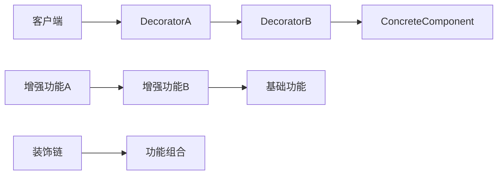
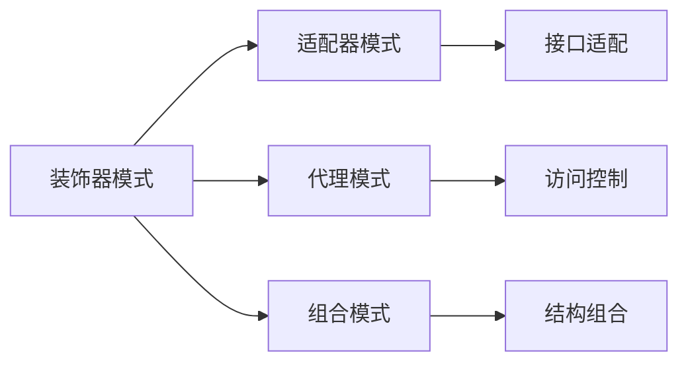

# 04-装饰器模式 (Decorator Pattern)

## 1. 形式化定义

### 1.1 数学定义

设 $$ C $$ 为组件接口，$$ D $$ 为装饰器集合，装饰器模式满足以下公理：

$$
\forall c \in C, \forall d \in D: \text{decorate}(c, d) \rightarrow C
$$

**形式化约束**：

- **接口保持**: $$ \text{interface}(\text{decorate}(c, d)) = \text{interface}(c) $$
- **功能增强**: $$ \text{function}(\text{decorate}(c, d)) \supset \text{function}(c) $$
- **组合性**: $$ \text{decorate}(\text{decorate}(c, d_1), d_2) = \text{decorate}(c, d_1 \circ d_2) $$

### 1.2 类型理论定义

```go
// 组件接口
type Component interface {
    Operation() string
}

// 具体组件
type ConcreteComponent struct{}

// 装饰器基类
type Decorator struct {
    component Component
}
```

## 2. 实现原理

### 2.1 动态增强保证

**定理**: 装饰器模式实现了组件功能的动态增强。

**证明**:

1. 装饰器实现组件接口
2. 装饰器持有组件引用
3. 装饰器在调用组件前后添加行为

```go
// 组件接口
type Component interface {
    Operation() string
}

// 具体组件
type ConcreteComponent struct{}

func (c *ConcreteComponent) Operation() string {
    return "ConcreteComponent operation"
}

// 装饰器基类
type Decorator struct {
    component Component
}

func NewDecorator(component Component) *Decorator {
    return &Decorator{
        component: component,
    }
}

func (d *Decorator) Operation() string {
    return d.component.Operation()
}

// 具体装饰器A
type ConcreteDecoratorA struct {
    *Decorator
}

func NewConcreteDecoratorA(component Component) *ConcreteDecoratorA {
    return &ConcreteDecoratorA{
        Decorator: NewDecorator(component),
    }
}

func (d *ConcreteDecoratorA) Operation() string {
    return fmt.Sprintf("ConcreteDecoratorA(%s)", d.component.Operation())
}
```

### 2.2 装饰链分析



## 3. Go语言实现

### 3.1 基础实现

```go
package decorator

import (
    "fmt"
    "time"
)

// Component 组件接口
type Component interface {
    Operation() string
    GetID() string
}

// ConcreteComponent 具体组件
type ConcreteComponent struct {
    id        string
    createdAt time.Time
}

func NewConcreteComponent(id string) *ConcreteComponent {
    return &ConcreteComponent{
        id:        id,
        createdAt: time.Now(),
    }
}

func (c *ConcreteComponent) Operation() string {
    return fmt.Sprintf("ConcreteComponent[%s] operation", c.id)
}

func (c *ConcreteComponent) GetID() string {
    return c.id
}

// Decorator 装饰器基类
type Decorator struct {
    component Component
}

func NewDecorator(component Component) *Decorator {
    return &Decorator{
        component: component,
    }
}

func (d *Decorator) Operation() string {
    return d.component.Operation()
}

func (d *Decorator) GetID() string {
    return d.component.GetID()
}

// ConcreteDecoratorA 具体装饰器A
type ConcreteDecoratorA struct {
    *Decorator
}

func NewConcreteDecoratorA(component Component) *ConcreteDecoratorA {
    return &ConcreteDecoratorA{
        Decorator: NewDecorator(component),
    }
}

func (d *ConcreteDecoratorA) Operation() string {
    return fmt.Sprintf("DecoratorA[%s](%s)", d.GetID(), d.component.Operation())
}

// ConcreteDecoratorB 具体装饰器B
type ConcreteDecoratorB struct {
    *Decorator
}

func NewConcreteDecoratorB(component Component) *ConcreteDecoratorB {
    return &ConcreteDecoratorB{
        Decorator: NewDecorator(component),
    }
}

func (d *ConcreteDecoratorB) Operation() string {
    return fmt.Sprintf("DecoratorB[%s](%s)", d.GetID(), d.component.Operation())
}
```

### 3.2 高级实现（带状态）

```go
// StatefulDecorator 带状态的装饰器
type StatefulDecorator struct {
    *Decorator
    state map[string]interface{}
}

func NewStatefulDecorator(component Component) *StatefulDecorator {
    return &StatefulDecorator{
        Decorator: NewDecorator(component),
        state:     make(map[string]interface{}),
    }
}

func (d *StatefulDecorator) Operation() string {
    // 记录调用次数
    count := d.state["count"].(int)
    d.state["count"] = count + 1
    
    return fmt.Sprintf("StatefulDecorator[count=%d](%s)", count+1, d.component.Operation())
}

func (d *StatefulDecorator) SetState(key string, value interface{}) {
    d.state[key] = value
}

func (d *StatefulDecorator) GetState(key string) interface{} {
    return d.state[key]
}

// LoggingDecorator 日志装饰器
type LoggingDecorator struct {
    *Decorator
    logger func(string)
}

func NewLoggingDecorator(component Component, logger func(string)) *LoggingDecorator {
    return &LoggingDecorator{
        Decorator: NewDecorator(component),
        logger:    logger,
    }
}

func (d *LoggingDecorator) Operation() string {
    d.logger(fmt.Sprintf("Before operation: %s", d.GetID()))
    
    result := d.component.Operation()
    
    d.logger(fmt.Sprintf("After operation: %s, result: %s", d.GetID(), result))
    
    return result
}

// CachingDecorator 缓存装饰器
type CachingDecorator struct {
    *Decorator
    cache map[string]string
}

func NewCachingDecorator(component Component) *CachingDecorator {
    return &CachingDecorator{
        Decorator: NewDecorator(component),
        cache:     make(map[string]string),
    }
}

func (d *CachingDecorator) Operation() string {
    cacheKey := d.GetID()
    
    if cached, exists := d.cache[cacheKey]; exists {
        return fmt.Sprintf("Cached: %s", cached)
    }
    
    result := d.component.Operation()
    d.cache[cacheKey] = result
    
    return fmt.Sprintf("Fresh: %s", result)
}
```

### 3.3 配置化装饰器

```go
// ConfigurableDecorator 可配置装饰器
type ConfigurableDecorator struct {
    *Decorator
    config map[string]interface{}
}

func NewConfigurableDecorator(component Component, config map[string]interface{}) *ConfigurableDecorator {
    return &ConfigurableDecorator{
        Decorator: NewDecorator(component),
        config:    config,
    }
}

func (d *ConfigurableDecorator) Operation() string {
    prefix := "Default"
    if p, exists := d.config["prefix"]; exists {
        prefix = p.(string)
    }
    
    suffix := ""
    if s, exists := d.config["suffix"]; exists {
        suffix = s.(string)
    }
    
    result := d.component.Operation()
    
    if transform, exists := d.config["transform"]; exists && transform.(bool) {
        result = fmt.Sprintf("TRANSFORMED: %s", result)
    }
    
    return fmt.Sprintf("%s[%s]%s", prefix, result, suffix)
}

func (d *ConfigurableDecorator) GetConfig() map[string]interface{} {
    return d.config
}

// ChainableDecorator 链式装饰器
type ChainableDecorator struct {
    *Decorator
}

func NewChainableDecorator(component Component) *ChainableDecorator {
    return &ChainableDecorator{
        Decorator: NewDecorator(component),
    }
}

func (d *ChainableDecorator) WithLogging(logger func(string)) *ChainableDecorator {
    return &ChainableDecorator{
        Decorator: NewLoggingDecorator(d.component, logger),
    }
}

func (d *ChainableDecorator) WithCaching() *ChainableDecorator {
    return &ChainableDecorator{
        Decorator: NewCachingDecorator(d.component),
    }
}

func (d *ChainableDecorator) WithConfig(config map[string]interface{}) *ChainableDecorator {
    return &ChainableDecorator{
        Decorator: NewConfigurableDecorator(d.component, config),
    }
}
```

## 4. 使用示例

### 4.1 基础使用

```go
package main

import (
    "fmt"
    
    "github.com/your-project/decorator"
)

func main() {
    // 创建基础组件
    component := decorator.NewConcreteComponent("base")
    
    // 使用装饰器A
    decoratedA := decorator.NewConcreteDecoratorA(component)
    fmt.Printf("Decorated A: %s\n", decoratedA.Operation())
    
    // 使用装饰器B
    decoratedB := decorator.NewConcreteDecoratorB(component)
    fmt.Printf("Decorated B: %s\n", decoratedB.Operation())
    
    // 组合装饰器
    decoratedAB := decorator.NewConcreteDecoratorB(
        decorator.NewConcreteDecoratorA(component),
    )
    fmt.Printf("Decorated A+B: %s\n", decoratedAB.Operation())
}
```

### 4.2 高级装饰器使用

```go
func advancedDecoratorExample() {
    component := decorator.NewConcreteComponent("advanced")
    
    // 带状态的装饰器
    stateful := decorator.NewStatefulDecorator(component)
    stateful.SetState("count", 0)
    
    fmt.Printf("Stateful 1: %s\n", stateful.Operation())
    fmt.Printf("Stateful 2: %s\n", stateful.Operation())
    
    // 日志装饰器
    logger := func(msg string) {
        fmt.Printf("LOG: %s\n", msg)
    }
    
    logging := decorator.NewLoggingDecorator(component, logger)
    fmt.Printf("Logging: %s\n", logging.Operation())
    
    // 缓存装饰器
    caching := decorator.NewCachingDecorator(component)
    fmt.Printf("Caching 1: %s\n", caching.Operation())
    fmt.Printf("Caching 2: %s\n", caching.Operation())
}
```

### 4.3 配置化装饰器使用

```go
func configurableDecoratorExample() {
    component := decorator.NewConcreteComponent("config")
    
    configs := []map[string]interface{}{
        {"prefix": "Custom", "suffix": "!", "transform": true},
        {"prefix": "Simple", "suffix": "", "transform": false},
    }
    
    for i, config := range configs {
        decorated := decorator.NewConfigurableDecorator(component, config)
        fmt.Printf("Config %d: %s\n", i+1, decorated.Operation())
    }
    
    // 链式装饰器
    chainable := decorator.NewChainableDecorator(component)
    
    logger := func(msg string) {
        fmt.Printf("CHAIN LOG: %s\n", msg)
    }
    
    final := chainable.
        WithLogging(logger).
        WithCaching().
        WithConfig(map[string]interface{}{"prefix": "Chain"})
    
    fmt.Printf("Chainable: %s\n", final.Operation())
}
```

## 5. 性能分析

### 5.1 时间复杂度

| 操作 | 时间复杂度 | 说明 |
|------|------------|------|
| 装饰器创建 | O(1) | 直接实例化 |
| 装饰器调用 | O(n) | n为装饰器链长度 |
| 缓存查找 | O(1) | 哈希表查找 |

### 5.2 空间复杂度

- **内存占用**: O(n) - n为装饰器链长度
- **缓存开销**: O(m) - m为缓存条目数量
- **状态开销**: O(1) - 装饰器状态

## 6. 应用场景

### 6.1 适用场景

1. **日志记录**: 为组件添加日志功能
2. **性能监控**: 为组件添加性能统计
3. **缓存机制**: 为组件添加缓存功能
4. **权限控制**: 为组件添加权限检查
5. **数据转换**: 为组件添加数据转换

### 6.2 不适用场景

1. **简单对象**: 不需要功能增强
2. **性能敏感**: 装饰器链开销过大
3. **频繁变化**: 装饰器经常变化

## 7. 设计模式关系

### 7.1 与其他模式的关系



### 7.2 组合使用

```go
// 装饰器 + 工厂模式
type DecoratorFactory interface {
    CreateDecorator(decoratorType string, component Component) Component
}

type ConcreteDecoratorFactory struct{}

func (f *ConcreteDecoratorFactory) CreateDecorator(decoratorType string, component Component) Component {
    switch decoratorType {
    case "logging":
        return NewLoggingDecorator(component, func(msg string) {
            fmt.Printf("Factory LOG: %s\n", msg)
        })
    case "caching":
        return NewCachingDecorator(component)
    case "configurable":
        return NewConfigurableDecorator(component, map[string]interface{}{
            "prefix": "Factory",
        })
    default:
        return component
    }
}

// 装饰器 + 策略模式
type DecoratorStrategy interface {
    Decorate(component Component) Component
}

type LoggingStrategy struct {
    logger func(string)
}

func (s *LoggingStrategy) Decorate(component Component) Component {
    return NewLoggingDecorator(component, s.logger)
}

type CachingStrategy struct{}

func (s *CachingStrategy) Decorate(component Component) Component {
    return NewCachingDecorator(component)
}
```

## 8. 形式化验证

### 8.1 装饰一致性验证

```go
// 验证装饰一致性
func VerifyDecoratorConsistency(component Component, decorator Component) bool {
    if component == nil || decorator == nil {
        return false
    }
    
    // 验证装饰器实现了相同接口
    if component.Operation() == "" {
        return false
    }
    
    if decorator.Operation() == "" {
        return false
    }
    
    // 验证装饰器增强了功能
    originalResult := component.Operation()
    decoratedResult := decorator.Operation()
    
    if len(decoratedResult) <= len(originalResult) {
        return false
    }
    
    return true
}
```

### 8.2 装饰链验证

```go
func TestDecoratorChain(t *testing.T) {
    component := NewConcreteComponent("test")
    
    // 创建装饰器链
    decorated := NewConcreteDecoratorB(
        NewConcreteDecoratorA(component),
    )
    
    result := decorated.Operation()
    
    // 验证包含所有装饰器
    if !contains(result, "DecoratorA") {
        t.Error("Missing DecoratorA in chain")
    }
    
    if !contains(result, "DecoratorB") {
        t.Error("Missing DecoratorB in chain")
    }
    
    if !contains(result, "test") {
        t.Error("Missing original component in chain")
    }
}

func contains(s, substr string) bool {
    return len(s) >= len(substr) && (s == substr || 
        (len(s) > len(substr) && (s[:len(substr)] == substr || 
         s[len(s)-len(substr):] == substr || 
         contains(s[1:], substr))))
}
```

## 9. 总结

装饰器模式是结构型模式中的重要模式，它通过装饰器对象动态地增强组件的功能，提供了灵活的功能扩展机制。

### 9.1 关键要点

1. **动态增强**: 运行时增强组件功能
2. **接口保持**: 装饰器实现相同接口
3. **组合性**: 支持装饰器链组合
4. **透明性**: 客户端无需了解装饰过程

### 9.2 最佳实践

1. 合理设计装饰器接口
2. 考虑装饰器链的性能
3. 使用配置化装饰器
4. 注意装饰器的顺序

### 9.3 与Go语言的结合

Go语言的接口和组合机制非常适合装饰器模式：

- 接口定义统一契约
- 结构体实现装饰逻辑
- 组合优于继承
- 简洁的类型系统

---

**下一模式**: [05-外观模式](./05-Facade-Pattern.md)

**返回**: [结构型模式目录](./README.md)
