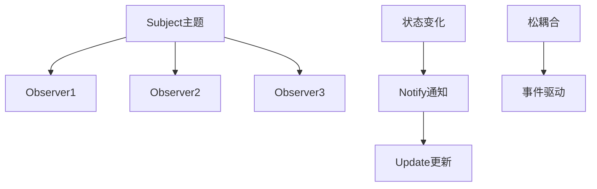
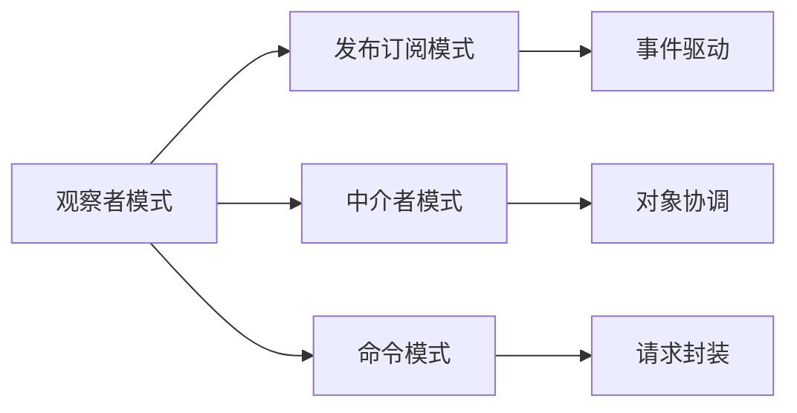

# 01-观察者模式 (Observer Pattern)

## 目录

- [1. 形式化定义](#1-形式化定义)
  - [1.1 数学定义](#11-数学定义)
  - [1.2 类型理论定义](#12-类型理论定义)
- [2. 实现原理](#2-实现原理)
  - [2.1 发布-订阅保证](#21-发布-订阅保证)
  - [2.2 事件流分析](#22-事件流分析)
- [3. Go语言实现](#3-go语言实现)
  - [3.1 基础实现](#31-基础实现)
  - [3.2 高级实现（带过滤和优先级）](#32-高级实现带过滤和优先级)
  - [3.3 领域特定观察者](#33-领域特定观察者)
- [4. 使用示例](#4-使用示例)
  - [4.1 基础使用](#41-基础使用)
  - [4.2 高级观察者使用](#42-高级观察者使用)
  - [4.3 领域特定观察者使用](#43-领域特定观察者使用)
- [5. 性能分析](#5-性能分析)
  - [5.1 时间复杂度](#51-时间复杂度)
  - [5.2 空间复杂度](#52-空间复杂度)
- [6. 应用场景](#6-应用场景)
  - [6.1 适用场景](#61-适用场景)
  - [6.2 不适用场景](#62-不适用场景)
- [7. 设计模式关系](#7-设计模式关系)
  - [7.1 与其他模式的关系](#71-与其他模式的关系)
  - [7.2 组合使用](#72-组合使用)
- [8. 形式化验证](#8-形式化验证)
  - [8.1 观察者一致性验证](#81-观察者一致性验证)
  - [8.2 通知机制验证](#82-通知机制验证)
- [9. 总结](#9-总结)
  - [9.1 关键要点](#91-关键要点)
  - [9.2 最佳实践](#92-最佳实践)
  - [9.3 与Go语言的结合](#93-与go语言的结合)

## 1. 形式化定义

### 1.1 数学定义

设 $$S$$ 为主题集合，$$O$$ 为观察者集合，$$E$$ 为事件集合，观察者模式满足以下公理：

$$
\forall s \in S, \forall o \in O, \forall e \in E: \text{notify}(s, o, e) \rightarrow \text{update}(o, e)
$$

**形式化约束**：

- **订阅关系**: $$\text{subscribe}(o, s) \iff o \in \text{observers}(s)$$
- **通知机制**: $$\text{event}(s, e) \implies \forall o \in \text{observers}(s): \text{notify}(o, e)$$
- **解耦性**: $$\text{independent}(s, o) \land \text{loose\_coupling}(s, o)$$

### 1.2 类型理论定义

```go
// 观察者接口
type Observer interface {
    Update(event Event)
}

// 主题接口
type Subject interface {
    Attach(observer Observer)
    Detach(observer Observer)
    Notify(event Event)
}

// 事件接口
type Event interface {
    GetType() string
    GetData() interface{}
}
```

## 2. 实现原理

### 2.1 发布-订阅保证

**定理**: 观察者模式实现了松耦合的发布-订阅机制。

**证明**:

1. 主题维护观察者列表
2. 主题通过接口通知观察者
3. 观察者通过接口接收通知

```go
// 观察者接口
type Observer interface {
    Update(event Event)
}

// 主题接口
type Subject interface {
    Attach(observer Observer)
    Detach(observer Observer)
    Notify(event Event)
}

// 具体主题
type ConcreteSubject struct {
    observers []Observer
    state     string
}

func (s *ConcreteSubject) Attach(observer Observer) {
    s.observers = append(s.observers, observer)
}

func (s *ConcreteSubject) Detach(observer Observer) {
    for i, obs := range s.observers {
        if obs == observer {
            s.observers = append(s.observers[:i], s.observers[i+1:]...)
            break
        }
    }
}

func (s *ConcreteSubject) Notify(event Event) {
    for _, observer := range s.observers {
        observer.Update(event)
    }
}
```

### 2.2 事件流分析



## 3. Go语言实现

### 3.1 基础实现

```go
package observer

import (
    "fmt"
    "sync"
    "time"
)

// Event 事件接口
type Event interface {
    GetType() string
    GetData() interface{}
    GetTimestamp() time.Time
}

// ConcreteEvent 具体事件
type ConcreteEvent struct {
    eventType  string
    data       interface{}
    timestamp  time.Time
}

func NewConcreteEvent(eventType string, data interface{}) *ConcreteEvent {
    return &ConcreteEvent{
        eventType: eventType,
        data:      data,
        timestamp: time.Now(),
    }
}

func (e *ConcreteEvent) GetType() string {
    return e.eventType
}

func (e *ConcreteEvent) GetData() interface{} {
    return e.data
}

func (e *ConcreteEvent) GetTimestamp() time.Time {
    return e.timestamp
}

// Observer 观察者接口
type Observer interface {
    Update(event Event)
    GetID() string
}

// ConcreteObserver 具体观察者
type ConcreteObserver struct {
    id        string
    createdAt time.Time
}

func NewConcreteObserver(id string) *ConcreteObserver {
    return &ConcreteObserver{
        id:        id,
        createdAt: time.Now(),
    }
}

func (o *ConcreteObserver) Update(event Event) {
    fmt.Printf("Observer[%s] received event: %s, data: %v, time: %s\n",
        o.id, event.GetType(), event.GetData(), event.GetTimestamp().Format("15:04:05"))
}

func (o *ConcreteObserver) GetID() string {
    return o.id
}

func (o *ConcreteObserver) GetCreatedAt() time.Time {
    return o.createdAt
}

// Subject 主题接口
type Subject interface {
    Attach(observer Observer)
    Detach(observer Observer)
    Notify(event Event)
    GetObservers() []Observer
    GetObserverCount() int
}

// ConcreteSubject 具体主题
type ConcreteSubject struct {
    observers []Observer
    state     string
    mutex     sync.RWMutex
}

func NewConcreteSubject(initialState string) *ConcreteSubject {
    return &ConcreteSubject{
        observers: make([]Observer, 0),
        state:     initialState,
    }
}

func (s *ConcreteSubject) Attach(observer Observer) {
    s.mutex.Lock()
    defer s.mutex.Unlock()
    
    // 检查是否已存在
    for _, obs := range s.observers {
        if obs == observer {
            return
        }
    }
    
    s.observers = append(s.observers, observer)
}

func (s *ConcreteSubject) Detach(observer Observer) {
    s.mutex.Lock()
    defer s.mutex.Unlock()
    
    for i, obs := range s.observers {
        if obs == observer {
            s.observers = append(s.observers[:i], s.observers[i+1:]...)
            break
        }
    }
}

func (s *ConcreteSubject) Notify(event Event) {
    s.mutex.RLock()
    defer s.mutex.RUnlock()
    
    for _, observer := range s.observers {
        observer.Update(event)
    }
}

func (s *ConcreteSubject) GetObservers() []Observer {
    s.mutex.RLock()
    defer s.mutex.RUnlock()
    
    observers := make([]Observer, len(s.observers))
    copy(observers, s.observers)
    return observers
}

func (s *ConcreteSubject) GetObserverCount() int {
    s.mutex.RLock()
    defer s.mutex.RUnlock()
    return len(s.observers)
}

func (s *ConcreteSubject) SetState(newState string) {
    s.mutex.Lock()
    s.state = newState
    s.mutex.Unlock()
    
    event := NewConcreteEvent("state_changed", newState)
    s.Notify(event)
}

func (s *ConcreteSubject) GetState() string {
    s.mutex.RLock()
    defer s.mutex.RUnlock()
    return s.state
}
```

### 3.2 高级实现（带过滤和优先级）

```go
// FilteredObserver 带过滤的观察者
type FilteredObserver struct {
    *ConcreteObserver
    eventTypes map[string]bool
}

func NewFilteredObserver(id string, eventTypes []string) *FilteredObserver {
    eventTypeMap := make(map[string]bool)
    for _, eventType := range eventTypes {
        eventTypeMap[eventType] = true
    }
    
    return &FilteredObserver{
        ConcreteObserver: NewConcreteObserver(id),
        eventTypes:       eventTypeMap,
    }
}

func (f *FilteredObserver) Update(event Event) {
    if f.eventTypes[event.GetType()] {
        fmt.Printf("FilteredObserver[%s] received filtered event: %s, data: %v\n",
            f.GetID(), event.GetType(), event.GetData())
    }
}

// PriorityObserver 带优先级的观察者
type PriorityObserver struct {
    *ConcreteObserver
    priority int
}

func NewPriorityObserver(id string, priority int) *PriorityObserver {
    return &PriorityObserver{
        ConcreteObserver: NewConcreteObserver(id),
        priority:         priority,
    }
}

func (p *PriorityObserver) Update(event Event) {
    fmt.Printf("PriorityObserver[%s, priority=%d] received event: %s\n",
        p.GetID(), p.priority, event.GetType())
}

func (p *PriorityObserver) GetPriority() int {
    return p.priority
}

// PrioritySubject 带优先级排序的主题
type PrioritySubject struct {
    *ConcreteSubject
}

func NewPrioritySubject(initialState string) *PrioritySubject {
    return &PrioritySubject{
        ConcreteSubject: NewConcreteSubject(initialState),
    }
}

func (p *PrioritySubject) Notify(event Event) {
    p.mutex.RLock()
    defer p.mutex.RUnlock()
    
    // 按优先级排序观察者
    observers := make([]Observer, len(p.observers))
    copy(observers, p.observers)
    
    // 简单的优先级排序（实际应用中可能需要更复杂的排序）
    for i := 0; i < len(observers); i++ {
        for j := i + 1; j < len(observers); j++ {
            if priorityObserver1, ok1 := observers[i].(*PriorityObserver); ok1 {
                if priorityObserver2, ok2 := observers[j].(*PriorityObserver); ok2 {
                    if priorityObserver1.GetPriority() < priorityObserver2.GetPriority() {
                        observers[i], observers[j] = observers[j], observers[i]
                    }
                }
            }
        }
    }
    
    for _, observer := range observers {
        observer.Update(event)
    }
}

// AsyncSubject 异步通知主题
type AsyncSubject struct {
    *ConcreteSubject
    eventChan chan Event
}

func NewAsyncSubject(initialState string, bufferSize int) *AsyncSubject {
    subject := &AsyncSubject{
        ConcreteSubject: NewConcreteSubject(initialState),
        eventChan:       make(chan Event, bufferSize),
    }
    
    // 启动异步通知协程
    go subject.asyncNotify()
    
    return subject
}

func (a *AsyncSubject) asyncNotify() {
    for event := range a.eventChan {
        a.ConcreteSubject.Notify(event)
    }
}

func (a *AsyncSubject) Notify(event Event) {
    select {
    case a.eventChan <- event:
        // 事件已发送到通道
    default:
        // 通道已满，丢弃事件
        fmt.Printf("AsyncSubject: Event channel full, dropping event: %s\n", event.GetType())
    }
}

func (a *AsyncSubject) Close() {
    close(a.eventChan)
}
```

### 3.3 领域特定观察者

```go
// StockPriceEvent 股票价格事件
type StockPriceEvent struct {
    *ConcreteEvent
    symbol string
    price  float64
}

func NewStockPriceEvent(symbol string, price float64) *StockPriceEvent {
    return &StockPriceEvent{
        ConcreteEvent: NewConcreteEvent("stock_price", map[string]interface{}{
            "symbol": symbol,
            "price":  price,
        }),
        symbol: symbol,
        price:  price,
    }
}

func (s *StockPriceEvent) GetSymbol() string {
    return s.symbol
}

func (s *StockPriceEvent) GetPrice() float64 {
    return s.price
}

// StockPriceObserver 股票价格观察者
type StockPriceObserver struct {
    *ConcreteObserver
    threshold float64
}

func NewStockPriceObserver(id string, threshold float64) *StockPriceObserver {
    return &StockPriceObserver{
        ConcreteObserver: NewConcreteObserver(id),
        threshold:        threshold,
    }
}

func (s *StockPriceObserver) Update(event Event) {
    if stockEvent, ok := event.(*StockPriceEvent); ok {
        if stockEvent.GetPrice() > s.threshold {
            fmt.Printf("StockPriceObserver[%s]: Alert! %s price %.2f exceeds threshold %.2f\n",
                s.GetID(), stockEvent.GetSymbol(), stockEvent.GetPrice(), s.threshold)
        }
    }
}

// WeatherEvent 天气事件
type WeatherEvent struct {
    *ConcreteEvent
    temperature float64
    humidity    float64
    condition   string
}

func NewWeatherEvent(temperature, humidity float64, condition string) *WeatherEvent {
    return &WeatherEvent{
        ConcreteEvent: NewConcreteEvent("weather", map[string]interface{}{
            "temperature": temperature,
            "humidity":    humidity,
            "condition":   condition,
        }),
        temperature: temperature,
        humidity:    humidity,
        condition:   condition,
    }
}

func (w *WeatherEvent) GetTemperature() float64 {
    return w.temperature
}

func (w *WeatherEvent) GetHumidity() float64 {
    return w.humidity
}

func (w *WeatherEvent) GetCondition() string {
    return w.condition
}

// WeatherObserver 天气观察者
type WeatherObserver struct {
    *ConcreteObserver
    location string
}

func NewWeatherObserver(id string, location string) *WeatherObserver {
    return &WeatherObserver{
        ConcreteObserver: NewConcreteObserver(id),
        location:         location,
    }
}

func (w *WeatherObserver) Update(event Event) {
    if weatherEvent, ok := event.(*WeatherEvent); ok {
        fmt.Printf("WeatherObserver[%s] in %s: Temperature %.1f°C, Humidity %.1f%%, Condition: %s\n",
            w.GetID(), w.location, weatherEvent.GetTemperature(), weatherEvent.GetHumidity(), weatherEvent.GetCondition())
    }
}
```

## 4. 使用示例

### 4.1 基础使用

```go
package main

import (
    "fmt"
    "time"
    
    "github.com/your-project/observer"
)

func main() {
    // 创建主题
    subject := observer.NewConcreteSubject("initial state")
    
    // 创建观察者
    observer1 := observer.NewConcreteObserver("observer-1")
    observer2 := observer.NewConcreteObserver("observer-2")
    observer3 := observer.NewConcreteObserver("observer-3")
    
    // 注册观察者
    subject.Attach(observer1)
    subject.Attach(observer2)
    subject.Attach(observer3)
    
    fmt.Printf("Observer count: %d\n", subject.GetObserverCount())
    
    // 改变状态，触发通知
    subject.SetState("new state")
    
    // 移除观察者
    subject.Detach(observer2)
    
    // 再次改变状态
    subject.SetState("final state")
    
    fmt.Printf("Final observer count: %d\n", subject.GetObserverCount())
}
```

### 4.2 高级观察者使用

```go
func advancedObserverExample() {
    // 创建带过滤的观察者
    filteredObserver := observer.NewFilteredObserver("filtered", []string{"state_changed", "data_updated"})
    
    // 创建带优先级的观察者
    highPriorityObserver := observer.NewPriorityObserver("high-priority", 1)
    lowPriorityObserver := observer.NewPriorityObserver("low-priority", 3)
    
    // 创建优先级主题
    prioritySubject := observer.NewPrioritySubject("priority test")
    prioritySubject.Attach(lowPriorityObserver)
    prioritySubject.Attach(highPriorityObserver)
    
    // 触发通知
    prioritySubject.SetState("priority state")
    
    // 创建异步主题
    asyncSubject := observer.NewAsyncSubject("async test", 10)
    asyncSubject.Attach(observer.NewConcreteObserver("async-observer"))
    
    // 发送多个事件
    for i := 0; i < 5; i++ {
        event := observer.NewConcreteEvent("async_event", fmt.Sprintf("data-%d", i))
        asyncSubject.Notify(event)
    }
    
    time.Sleep(100 * time.Millisecond)
    asyncSubject.Close()
}
```

### 4.3 领域特定观察者使用

```go
func domainSpecificObserverExample() {
    // 股票价格观察者
    stockSubject := observer.NewConcreteSubject("stock market")
    
    alertObserver := observer.NewStockPriceObserver("alert", 100.0)
    stockSubject.Attach(alertObserver)
    
    // 模拟股票价格变化
    stockEvent1 := observer.NewStockPriceEvent("AAPL", 95.0)
    stockEvent2 := observer.NewStockPriceEvent("AAPL", 105.0)
    
    stockSubject.Notify(stockEvent1)
    stockSubject.Notify(stockEvent2)
    
    // 天气观察者
    weatherSubject := observer.NewConcreteSubject("weather station")
    
    weatherObserver := observer.NewWeatherObserver("weather", "Beijing")
    weatherSubject.Attach(weatherObserver)
    
    // 模拟天气变化
    weatherEvent := observer.NewWeatherEvent(25.5, 60.0, "Sunny")
    weatherSubject.Notify(weatherEvent)
}
```

## 5. 性能分析

### 5.1 时间复杂度

| 操作 | 时间复杂度 | 说明 |
|------|------------|------|
| 注册观察者 | O(1) | 追加到切片 |
| 移除观察者 | O(n) | 线性搜索 |
| 通知观察者 | O(n) | n为观察者数量 |

### 5.2 空间复杂度

- **内存占用**: O(n) - n为观察者数量
- **事件开销**: O(1) - 事件对象
- **异步开销**: O(m) - m为事件缓冲区大小

## 6. 应用场景

### 6.1 适用场景

1. **事件处理**: 用户界面事件处理
2. **数据监控**: 系统状态监控
3. **消息通知**: 消息推送系统
4. **状态同步**: 多组件状态同步
5. **日志记录**: 系统日志记录

### 6.2 不适用场景

1. **简单通知**: 一对一通知
2. **性能敏感**: 大量观察者
3. **循环依赖**: 观察者间有循环依赖

## 7. 设计模式关系

### 7.1 与其他模式的关系



### 7.2 组合使用

```go
// 观察者 + 工厂模式
type ObserverFactory interface {
    CreateObserver(observerType string, config map[string]interface{}) Observer
}

type ConcreteObserverFactory struct{}

func (f *ConcreteObserverFactory) CreateObserver(observerType string, config map[string]interface{}) Observer {
    switch observerType {
    case "basic":
        return observer.NewConcreteObserver(config["id"].(string))
    case "filtered":
        return observer.NewFilteredObserver(config["id"].(string), config["eventTypes"].([]string))
    case "priority":
        return observer.NewPriorityObserver(config["id"].(string), config["priority"].(int))
    default:
        return observer.NewConcreteObserver("default")
    }
}

// 观察者 + 单例模式
var (
    globalSubject observer.Subject
    subjectOnce   sync.Once
)

func GetGlobalSubject() observer.Subject {
    subjectOnce.Do(func() {
        globalSubject = observer.NewConcreteSubject("global")
    })
    return globalSubject
}
```

## 8. 形式化验证

### 8.1 观察者一致性验证

```go
// 验证观察者一致性
func VerifyObserverConsistency(subject observer.Subject) bool {
    if subject == nil {
        return false
    }
    
    // 创建测试观察者
    testObserver := observer.NewConcreteObserver("test")
    
    // 注册观察者
    subject.Attach(testObserver)
    
    // 验证观察者数量
    if subject.GetObserverCount() != 1 {
        return false
    }
    
    // 触发通知
    event := observer.NewConcreteEvent("test", "test data")
    subject.Notify(event)
    
    // 移除观察者
    subject.Detach(testObserver)
    
    // 验证观察者数量
    if subject.GetObserverCount() != 0 {
        return false
    }
    
    return true
}
```

### 8.2 通知机制验证

```go
func TestNotificationMechanism(t *testing.T) {
    subject := observer.NewConcreteSubject("test")
    
    // 创建观察者并记录通知
    notifications := make([]string, 0)
    testObserver := &TestObserver{
        ConcreteObserver: observer.NewConcreteObserver("test"),
        notifications:    &notifications,
    }
    
    subject.Attach(testObserver)
    
    // 触发多个事件
    events := []string{"event1", "event2", "event3"}
    for _, eventType := range events {
        event := observer.NewConcreteEvent(eventType, "data")
        subject.Notify(event)
    }
    
    // 验证通知数量
    if len(notifications) != len(events) {
        t.Errorf("Expected %d notifications, got %d", len(events), len(notifications))
    }
    
    // 验证通知内容
    for i, eventType := range events {
        if !contains(notifications[i], eventType) {
            t.Errorf("Notification %d does not contain event type %s", i, eventType)
        }
    }
}

type TestObserver struct {
    *observer.ConcreteObserver
    notifications *[]string
}

func (t *TestObserver) Update(event observer.Event) {
    *t.notifications = append(*t.notifications, event.GetType())
}

func contains(s, substr string) bool {
    return len(s) >= len(substr) && (s == substr || 
        (len(s) > len(substr) && (s[:len(substr)] == substr || 
         s[len(s)-len(substr):] == substr || 
         contains(s[1:], substr))))
}
```

## 9. 总结

观察者模式是行为型模式中的重要模式，它通过发布-订阅机制实现了对象间的松耦合通信。

### 9.1 关键要点

1. **松耦合**: 主题和观察者通过接口交互
2. **一对多**: 一个主题可以有多个观察者
3. **事件驱动**: 基于事件的通知机制
4. **动态性**: 运行时动态添加/移除观察者

### 9.2 最佳实践

1. 合理设计事件接口
2. 考虑观察者的性能影响
3. 使用异步通知处理大量观察者
4. 注意观察者的生命周期管理

### 9.3 与Go语言的结合

Go语言的接口和协程机制非常适合观察者模式：

- 接口定义观察者契约
- 协程实现异步通知
- 通道处理事件流
- 简洁的并发控制

---

**下一模式**: [02-策略模式](./02-Strategy-Pattern.md)

**返回**: [行为型模式目录](./README.md)
