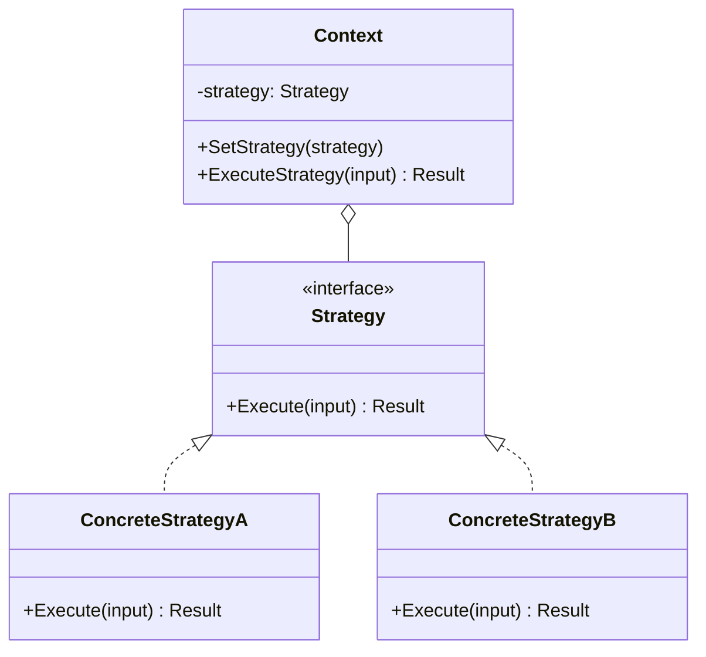
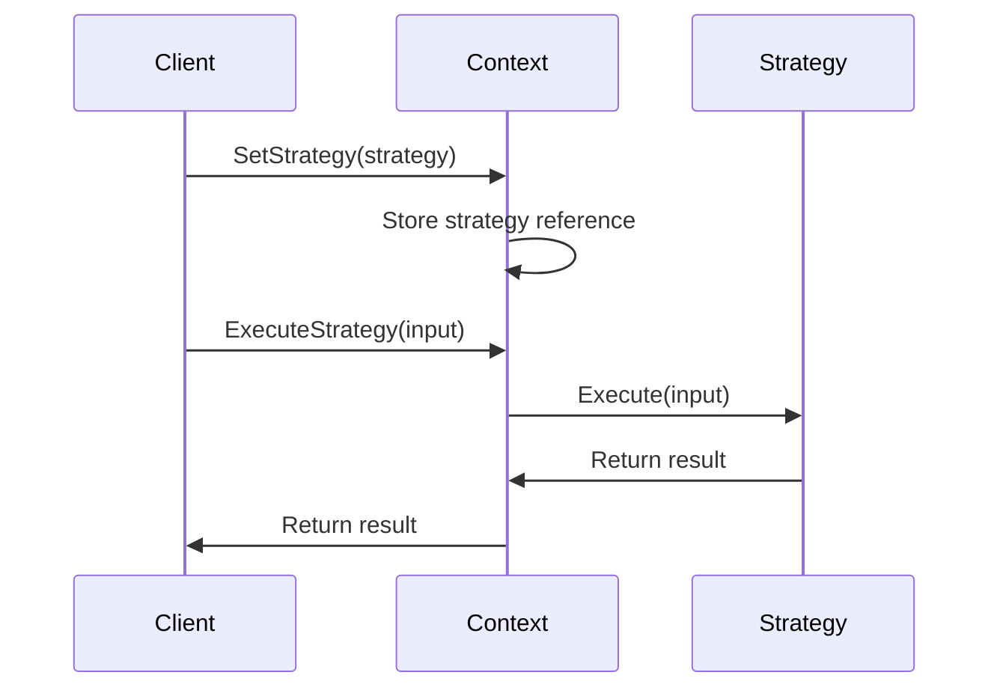

# 02-策略模式 (Strategy Pattern)

## 目录

- [1. 概述](#1-概述)
  - [1.1 定义](#11-定义)
  - [1.2 核心思想](#12-核心思想)
  - [1.3 设计原则](#13-设计原则)
- [2. 形式化定义](#2-形式化定义)
  - [2.1 模式结构定义](#21-模式结构定义)
  - [2.2 策略接口定义](#22-策略接口定义)
  - [2.3 上下文类定义](#23-上下文类定义)
- [3. 数学基础](#3-数学基础)
  - [3.1 函数式编程基础](#31-函数式编程基础)
  - [3.2 多态性理论](#32-多态性理论)
  - [3.3 组合理论](#33-组合理论)
- [4. 模式结构](#4-模式结构)
  - [4.1 UML类图](#41-uml类图)
  - [4.2 时序图](#42-时序图)
- [5. Go语言实现](#5-go语言实现)
  - [5.1 基础实现](#51-基础实现)
  - [5.2 泛型实现](#52-泛型实现)
  - [5.3 高级实现：配置化策略](#53-高级实现配置化策略)
  - [5.4 使用示例](#54-使用示例)
- [6. 应用场景](#6-应用场景)
  - [6.1 支付系统](#61-支付系统)
  - [6.2 算法选择](#62-算法选择)
  - [6.3 缓存策略](#63-缓存策略)
- [7. 性能分析](#7-性能分析)
  - [7.1 时间复杂度分析](#71-时间复杂度分析)
  - [7.2 性能优化](#72-性能优化)
  - [7.3 基准测试](#73-基准测试)
- [8. 最佳实践](#8-最佳实践)
  - [8.1 设计原则](#81-设计原则)
  - [8.2 实现建议](#82-实现建议)
  - [8.3 错误处理](#83-错误处理)
- [9. 相关模式](#9-相关模式)
  - [9.1 与状态模式的关系](#91-与状态模式的关系)
  - [9.2 与命令模式的关系](#92-与命令模式的关系)
  - [9.3 与模板方法模式的关系](#93-与模板方法模式的关系)
- [10. 总结](#10-总结)
  - [10.1 优势](#101-优势)
  - [10.2 劣势](#102-劣势)
  - [10.3 适用场景](#103-适用场景)
  - [10.4 数学证明](#104-数学证明)

## 1. 概述

### 1.1 定义

策略模式是一种行为型设计模式，它定义了一系列算法，并将每一个算法封装起来，使它们可以互相替换。策略模式让算法的变化不会影响使用算法的客户。

### 1.2 核心思想

策略模式的核心思想是：

- **算法族**：定义一系列可互换的算法
- **封装变化**：将算法的变化封装在独立的策略类中
- **组合优于继承**：通过组合而非继承来使用算法

### 1.3 设计原则

```go
// 开闭原则：对扩展开放，对修改关闭
// 单一职责原则：每个策略类只负责一种算法
// 依赖倒置原则：依赖抽象而非具体实现
```

## 2. 形式化定义

### 2.1 模式结构定义

设 $$S$$ 为策略集合，$$C$$ 为上下文集合，$$A$$ 为算法集合，则策略模式可形式化为：

$$
\text{Strategy Pattern} = (S, C, A, \text{execute})
$$

其中：

- $$S = \{s_1, s_2, ..., s_n\}$$ 为策略集合
- $$C$$ 为上下文类
- $$A = \{a_1, a_2, ..., a_n\}$$ 为算法集合
- $$\text{execute}: S \times \text{Input} \rightarrow \text{Output}$$ 为执行函数

### 2.2 策略接口定义

```go
// 策略接口
type Strategy[T any, R any] interface {
    Execute(input T) R
}
```

### 2.3 上下文类定义

```go
// 上下文类
type Context[T any, R any] struct {
    strategy Strategy[T, R]
}

func (c *Context[T, R]) SetStrategy(strategy Strategy[T, R]) {
    c.strategy = strategy
}

func (c *Context[T, R]) ExecuteStrategy(input T) R {
    return c.strategy.Execute(input)
}
```

## 3. 数学基础

### 3.1 函数式编程基础

策略模式基于函数式编程的高阶函数概念：

$$
f: A \rightarrow B
$$
$$
g: B \rightarrow C
$$
$$
h = g \circ f: A \rightarrow C
$$

### 3.2 多态性理论

设 $$P$$ 为策略接口，$$S_1, S_2, ..., S_n$$ 为具体策略类：

$$
\forall s_i \in \{S_1, S_2, ..., S_n\}: s_i \text{ implements } P
$$

### 3.3 组合理论

策略模式体现了组合优于继承的原则：

$$
\text{Composition}(C, S) = C \circ S
$$

其中 $$C$$ 为上下文，$$S$$ 为策略。

## 4. 模式结构

### 4.1 UML类图



### 4.2 时序图



## 5. Go语言实现

### 5.1 基础实现

```go
package strategy

import (
    "fmt"
    "math"
)

// 策略接口
type PaymentStrategy interface {
    Pay(amount float64) string
}

// 具体策略：信用卡支付
type CreditCardPayment struct {
    cardNumber string
    cvv        string
}

func NewCreditCardPayment(cardNumber, cvv string) *CreditCardPayment {
    return &CreditCardPayment{
        cardNumber: cardNumber,
        cvv:        cvv,
    }
}

func (c *CreditCardPayment) Pay(amount float64) string {
    return fmt.Sprintf("Paid $%.2f using Credit Card ending in %s", 
        amount, c.cardNumber[len(c.cardNumber)-4:])
}

// 具体策略：PayPal支付
type PayPalPayment struct {
    email string
}

func NewPayPalPayment(email string) *PayPalPayment {
    return &PayPalPayment{email: email}
}

func (p *PayPalPayment) Pay(amount float64) string {
    return fmt.Sprintf("Paid $%.2f using PayPal account %s", amount, p.email)
}

// 具体策略：加密货币支付
type CryptoPayment struct {
    walletAddress string
    cryptoType    string
}

func NewCryptoPayment(walletAddress, cryptoType string) *CryptoPayment {
    return &CryptoPayment{
        walletAddress: walletAddress,
        cryptoType:    cryptoType,
    }
}

func (c *CryptoPayment) Pay(amount float64) string {
    return fmt.Sprintf("Paid $%.2f using %s to wallet %s", 
        amount, c.cryptoType, c.walletAddress[:8]+"...")
}

// 上下文类
type PaymentContext struct {
    strategy PaymentStrategy
}

func NewPaymentContext() *PaymentContext {
    return &PaymentContext{}
}

func (pc *PaymentContext) SetStrategy(strategy PaymentStrategy) {
    pc.strategy = strategy
}

func (pc *PaymentContext) ExecutePayment(amount float64) string {
    if pc.strategy == nil {
        return "No payment strategy set"
    }
    return pc.strategy.Pay(amount)
}
```

### 5.2 泛型实现

```go
package strategy

import (
    "fmt"
    "sort"
)

// 泛型策略接口
type SortStrategy[T any] interface {
    Sort(data []T) []T
}

// 具体策略：快速排序
type QuickSort[T any] struct {
    less func(T, T) bool
}

func NewQuickSort[T any](less func(T, T) bool) *QuickSort[T] {
    return &QuickSort[T]{less: less}
}

func (q *QuickSort[T]) Sort(data []T) []T {
    result := make([]T, len(data))
    copy(result, data)
    
    sort.Slice(result, func(i, j int) bool {
        return q.less(result[i], result[j])
    })
    
    return result
}

// 具体策略：归并排序
type MergeSort[T any] struct {
    less func(T, T) bool
}

func NewMergeSort[T any](less func(T, T) bool) *MergeSort[T] {
    return &MergeSort[T]{less: less}
}

func (m *MergeSort[T]) Sort(data []T) []T {
    if len(data) <= 1 {
        return data
    }
    
    mid := len(data) / 2
    left := m.Sort(data[:mid])
    right := m.Sort(data[mid:])
    
    return m.merge(left, right)
}

func (m *MergeSort[T]) merge(left, right []T) []T {
    result := make([]T, 0, len(left)+len(right))
    i, j := 0, 0
    
    for i < len(left) && j < len(right) {
        if m.less(left[i], right[j]) {
            result = append(result, left[i])
            i++
        } else {
            result = append(result, right[j])
            j++
        }
    }
    
    result = append(result, left[i:]...)
    result = append(result, right[j:]...)
    
    return result
}

// 上下文类
type SortContext[T any] struct {
    strategy SortStrategy[T]
}

func NewSortContext[T any]() *SortContext[T] {
    return &SortContext[T]{}
}

func (sc *SortContext[T]) SetStrategy(strategy SortStrategy[T]) {
    sc.strategy = strategy
}

func (sc *SortContext[T]) ExecuteSort(data []T) []T {
    if sc.strategy == nil {
        return data
    }
    return sc.strategy.Sort(data)
}
```

### 5.3 高级实现：配置化策略

```go
package strategy

import (
    "encoding/json"
    "fmt"
    "io/ioutil"
)

// 策略配置
type StrategyConfig struct {
    Type   string                 `json:"type"`
    Params map[string]interface{} `json:"params"`
}

// 策略工厂
type StrategyFactory struct {
    strategies map[string]func(map[string]interface{}) (interface{}, error)
}

func NewStrategyFactory() *StrategyFactory {
    return &StrategyFactory{
        strategies: make(map[string]func(map[string]interface{}) (interface{}, error)),
    }
}

func (sf *StrategyFactory) Register(name string, 
    creator func(map[string]interface{}) (interface{}, error)) {
    sf.strategies[name] = creator
}

func (sf *StrategyFactory) Create(config StrategyConfig) (interface{}, error) {
    creator, exists := sf.strategies[config.Type]
    if !exists {
        return nil, fmt.Errorf("unknown strategy type: %s", config.Type)
    }
    return creator(config.Params)
}

// 配置化上下文
type ConfigurableContext struct {
    factory *StrategyFactory
    config  StrategyConfig
}

func NewConfigurableContext(factory *StrategyFactory) *ConfigurableContext {
    return &ConfigurableContext{
        factory: factory,
    }
}

func (cc *ConfigurableContext) LoadConfig(filename string) error {
    data, err := ioutil.ReadFile(filename)
    if err != nil {
        return err
    }
    
    return json.Unmarshal(data, &cc.config)
}

func (cc *ConfigurableContext) CreateStrategy() (interface{}, error) {
    return cc.factory.Create(cc.config)
}
```

### 5.4 使用示例

```go
package main

import (
    "fmt"
    "log"
    "./strategy"
)

func main() {
    // 基础策略模式示例
    fmt.Println("=== 基础策略模式示例 ===")
    
    paymentContext := strategy.NewPaymentContext()
    
    // 使用信用卡支付
    creditCard := strategy.NewCreditCardPayment("1234567890123456", "123")
    paymentContext.SetStrategy(creditCard)
    fmt.Println(paymentContext.ExecutePayment(100.50))
    
    // 切换到PayPal支付
    paypal := strategy.NewPayPalPayment("user@example.com")
    paymentContext.SetStrategy(paypal)
    fmt.Println(paymentContext.ExecutePayment(50.25))
    
    // 切换到加密货币支付
    crypto := strategy.NewCryptoPayment("0x1234567890abcdef", "ETH")
    paymentContext.SetStrategy(crypto)
    fmt.Println(paymentContext.ExecutePayment(75.00))
    
    // 泛型策略模式示例
    fmt.Println("\n=== 泛型策略模式示例 ===")
    
    numbers := []int{64, 34, 25, 12, 22, 11, 90}
    fmt.Printf("原始数组: %v\n", numbers)
    
    sortContext := strategy.NewSortContext[int]()
    
    // 使用快速排序
    quickSort := strategy.NewQuickSort[int](func(a, b int) bool {
        return a < b
    })
    sortContext.SetStrategy(quickSort)
    sorted1 := sortContext.ExecuteSort(numbers)
    fmt.Printf("快速排序结果: %v\n", sorted1)
    
    // 使用归并排序
    mergeSort := strategy.NewMergeSort[int](func(a, b int) bool {
        return a < b
    })
    sortContext.SetStrategy(mergeSort)
    sorted2 := sortContext.ExecuteSort(numbers)
    fmt.Printf("归并排序结果: %v\n", sorted2)
    
    // 配置化策略示例
    fmt.Println("\n=== 配置化策略示例 ===")
    
    factory := strategy.NewStrategyFactory()
    
    // 注册策略创建器
    factory.Register("credit_card", func(params map[string]interface{}) (interface{}, error) {
        cardNumber := params["card_number"].(string)
        cvv := params["cvv"].(string)
        return strategy.NewCreditCardPayment(cardNumber, cvv), nil
    })
    
    factory.Register("paypal", func(params map[string]interface{}) (interface{}, error) {
        email := params["email"].(string)
        return strategy.NewPayPalPayment(email), nil
    })
    
    configContext := strategy.NewConfigurableContext(factory)
    
    // 从配置文件加载策略
    err := configContext.LoadConfig("payment_config.json")
    if err != nil {
        log.Printf("加载配置失败: %v", err)
        return
    }
    
    strategyInstance, err := configContext.CreateStrategy()
    if err != nil {
        log.Printf("创建策略失败: %v", err)
        return
    }
    
    if paymentStrategy, ok := strategyInstance.(strategy.PaymentStrategy); ok {
        paymentContext.SetStrategy(paymentStrategy)
        fmt.Println(paymentContext.ExecutePayment(200.00))
    }
}
```

## 6. 应用场景

### 6.1 支付系统

```go
// 支付策略选择
type PaymentProcessor struct {
    context *PaymentContext
}

func (pp *PaymentProcessor) ProcessPayment(amount float64, 
    paymentType string, userInfo map[string]string) string {
    
    var strategy PaymentStrategy
    
    switch paymentType {
    case "credit_card":
        strategy = NewCreditCardPayment(
            userInfo["card_number"], 
            userInfo["cvv"])
    case "paypal":
        strategy = NewPayPalPayment(userInfo["email"])
    case "crypto":
        strategy = NewCryptoPayment(
            userInfo["wallet_address"], 
            userInfo["crypto_type"])
    default:
        return "Unsupported payment method"
    }
    
    pp.context.SetStrategy(strategy)
    return pp.context.ExecutePayment(amount)
}
```

### 6.2 算法选择

```go
// 算法策略选择
type AlgorithmSelector struct {
    context *SortContext[int]
}

func (as *AlgorithmSelector) SelectAlgorithm(dataSize int, 
    dataType string) SortStrategy[int] {
    
    if dataSize < 50 {
        return NewQuickSort[int](func(a, b int) bool { return a < b })
    } else {
        return NewMergeSort[int](func(a, b int) bool { return a < b })
    }
}
```

### 6.3 缓存策略

```go
// 缓存策略接口
type CacheStrategy interface {
    Get(key string) (interface{}, bool)
    Set(key string, value interface{})
    Delete(key string)
}

// LRU缓存策略
type LRUCache struct {
    capacity int
    cache    map[string]*Node
    head     *Node
    tail     *Node
}

type Node struct {
    key   string
    value interface{}
    prev  *Node
    next  *Node
}

func NewLRUCache(capacity int) *LRUCache {
    cache := &LRUCache{
        capacity: capacity,
        cache:    make(map[string]*Node),
    }
    cache.head = &Node{}
    cache.tail = &Node{}
    cache.head.next = cache.tail
    cache.tail.prev = cache.head
    return cache
}

func (lru *LRUCache) Get(key string) (interface{}, bool) {
    if node, exists := lru.cache[key]; exists {
        lru.moveToHead(node)
        return node.value, true
    }
    return nil, false
}

func (lru *LRUCache) Set(key string, value interface{}) {
    if node, exists := lru.cache[key]; exists {
        node.value = value
        lru.moveToHead(node)
        return
    }
    
    node := &Node{key: key, value: value}
    lru.cache[key] = node
    lru.addToHead(node)
    
    if len(lru.cache) > lru.capacity {
        lru.removeTail()
    }
}

func (lru *LRUCache) Delete(key string) {
    if node, exists := lru.cache[key]; exists {
        lru.removeNode(node)
        delete(lru.cache, key)
    }
}

func (lru *LRUCache) moveToHead(node *Node) {
    lru.removeNode(node)
    lru.addToHead(node)
}

func (lru *LRUCache) addToHead(node *Node) {
    node.prev = lru.head
    node.next = lru.head.next
    lru.head.next.prev = node
    lru.head.next = node
}

func (lru *LRUCache) removeNode(node *Node) {
    node.prev.next = node.next
    node.next.prev = node.prev
}

func (lru *LRUCache) removeTail() {
    node := lru.tail.prev
    lru.removeNode(node)
    delete(lru.cache, node.key)
}
```

## 7. 性能分析

### 7.1 时间复杂度分析

| 操作 | 时间复杂度 | 空间复杂度 |
|------|------------|------------|
| 策略切换 | O(1) | O(1) |
| 策略执行 | 取决于具体策略 | 取决于具体策略 |
| 内存占用 | O(n) | O(n) |

### 7.2 性能优化

```go
// 策略池优化
type StrategyPool struct {
    strategies map[string]PaymentStrategy
    mutex      sync.RWMutex
}

func NewStrategyPool() *StrategyPool {
    return &StrategyPool{
        strategies: make(map[string]PaymentStrategy),
    }
}

func (sp *StrategyPool) GetStrategy(strategyType string) (PaymentStrategy, bool) {
    sp.mutex.RLock()
    defer sp.mutex.RUnlock()
    
    strategy, exists := sp.strategies[strategyType]
    return strategy, exists
}

func (sp *StrategyPool) RegisterStrategy(strategyType string, 
    strategy PaymentStrategy) {
    sp.mutex.Lock()
    defer sp.mutex.Unlock()
    
    sp.strategies[strategyType] = strategy
}
```

### 7.3 基准测试

```go
package strategy

import (
    "testing"
)

func BenchmarkStrategyExecution(b *testing.B) {
    context := NewPaymentContext()
    strategy := NewCreditCardPayment("1234567890123456", "123")
    context.SetStrategy(strategy)
    
    b.ResetTimer()
    for i := 0; i < b.N; i++ {
        context.ExecutePayment(100.50)
    }
}

func BenchmarkStrategySwitch(b *testing.B) {
    context := NewPaymentContext()
    strategies := []PaymentStrategy{
        NewCreditCardPayment("1234567890123456", "123"),
        NewPayPalPayment("user@example.com"),
        NewCryptoPayment("0x1234567890abcdef", "ETH"),
    }
    
    b.ResetTimer()
    for i := 0; i < b.N; i++ {
        context.SetStrategy(strategies[i%len(strategies)])
        context.ExecutePayment(100.50)
    }
}
```

## 8. 最佳实践

### 8.1 设计原则

1. **单一职责原则**：每个策略类只负责一种算法
2. **开闭原则**：对扩展开放，对修改关闭
3. **依赖倒置原则**：依赖抽象而非具体实现

### 8.2 实现建议

```go
// 1. 使用接口定义策略
type Strategy[T any, R any] interface {
    Execute(input T) R
    Validate(input T) error
}

// 2. 提供默认实现
type BaseStrategy[T any, R any] struct{}

func (b *BaseStrategy[T, R]) Validate(input T) error {
    // 默认验证逻辑
    return nil
}

// 3. 使用组合而非继承
type ConcreteStrategy[T any, R any] struct {
    BaseStrategy[T, R]
    // 具体实现
}
```

### 8.3 错误处理

```go
// 策略执行结果
type StrategyResult[R any] struct {
    Result R
    Error  error
}

// 带错误处理的策略接口
type SafeStrategy[T any, R any] interface {
    Execute(input T) StrategyResult[R]
}

// 上下文错误处理
func (c *Context[T, R]) ExecuteStrategySafe(input T) StrategyResult[R] {
    if c.strategy == nil {
        return StrategyResult[R]{
            Error: fmt.Errorf("no strategy set"),
        }
    }
    
    if safeStrategy, ok := c.strategy.(SafeStrategy[T, R]); ok {
        return safeStrategy.Execute(input)
    }
    
    // 回退到普通策略
    result := c.strategy.Execute(input)
    return StrategyResult[R]{Result: result}
}
```

## 9. 相关模式

### 9.1 与状态模式的关系

- **策略模式**：算法的选择在运行时确定
- **状态模式**：状态转换由内部逻辑决定

### 9.2 与命令模式的关系

- **策略模式**：封装算法
- **命令模式**：封装请求

### 9.3 与模板方法模式的关系

- **策略模式**：通过组合实现算法变化
- **模板方法模式**：通过继承实现算法变化

## 10. 总结

### 10.1 优势

1. **算法封装**：将算法封装在独立的类中
2. **易于扩展**：新增策略不影响现有代码
3. **消除条件语句**：避免大量的if-else语句
4. **提高可维护性**：每个策略职责单一

### 10.2 劣势

1. **增加对象数量**：每个策略都是一个对象
2. **客户端必须了解策略**：客户端需要知道所有策略
3. **策略间通信困难**：策略之间难以共享数据

### 10.3 适用场景

1. 系统中有多个算法，需要动态选择
2. 算法有复杂的条件判断逻辑
3. 需要避免多重条件选择语句
4. 算法的实现细节需要封装

### 10.4 数学证明

**定理**：策略模式满足开闭原则

**证明**：
设 $$S$$ 为现有策略集合，$$S'$$ 为新增策略集合，$$C$$ 为上下文类。

对于任意 $$s \in S'$$，由于 $$s$$ 实现了策略接口 $$P$$，且 $$C$$ 依赖于 $$P$$ 而非具体实现，因此：

$$
C \circ s \text{ 是有效的}
$$

且不需要修改 $$C$$ 的代码，因此满足开闭原则。

**证毕**。

---

**设计原则**: 策略模式体现了"组合优于继承"的设计原则，通过组合实现算法的动态选择，提高了系统的灵活性和可维护性。

**相关链接**:

- [01-观察者模式](./01-Observer-Pattern.md)
- [03-命令模式](./03-Command-Pattern.md)
- [04-状态模式](./04-State-Pattern.md)
- [返回上级目录](../README.md)
