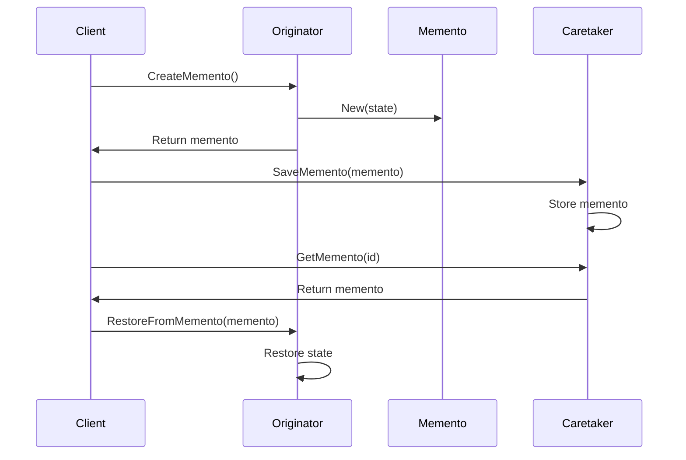

# 08-备忘录模式 (Memento Pattern)

## 目录

- [08-备忘录模式 (Memento Pattern)](#08-备忘录模式-memento-pattern)
  - [目录](#目录)
  - [1. 概述](#1-概述)
    - [1.1 定义](#11-定义)
    - [1.2 核心思想](#12-核心思想)
    - [1.3 设计原则](#13-设计原则)
  - [2. 形式化定义](#2-形式化定义)
    - [2.1 备忘录定义](#21-备忘录定义)
    - [2.2 备忘录接口定义](#22-备忘录接口定义)
    - [2.3 基础实现](#23-基础实现)
  - [3. 数学基础](#3-数学基础)
    - [3.1 状态机理论](#31-状态机理论)
    - [3.2 函数式编程](#32-函数式编程)
    - [3.3 时间序列理论](#33-时间序列理论)
  - [4. 模式结构](#4-模式结构)
    - [4.1 UML类图](#41-uml类图)
    - [4.2 时序图](#42-时序图)
  - [5. Go语言实现](#5-go语言实现)
    - [5.1 基础实现](#51-基础实现)
    - [5.2 高级实现：持久化备忘录](#52-高级实现持久化备忘录)
    - [5.3 使用示例](#53-使用示例)
  - [6. 应用场景](#6-应用场景)
    - [6.1 文本编辑器撤销/重做](#61-文本编辑器撤销重做)
    - [6.2 游戏状态保存](#62-游戏状态保存)
    - [6.3 配置管理](#63-配置管理)
  - [7. 性能分析](#7-性能分析)
    - [7.1 时间复杂度分析](#71-时间复杂度分析)
    - [7.2 性能优化](#72-性能优化)
    - [7.3 基准测试](#73-基准测试)
  - [8. 最佳实践](#8-最佳实践)
    - [8.1 设计原则](#81-设计原则)
    - [8.2 实现建议](#82-实现建议)
    - [8.3 错误处理](#83-错误处理)
  - [9. 相关模式](#9-相关模式)
    - [9.1 与命令模式的关系](#91-与命令模式的关系)
    - [9.2 与状态模式的关系](#92-与状态模式的关系)
    - [9.3 与原型模式的关系](#93-与原型模式的关系)
  - [10. 总结](#10-总结)
    - [10.1 优势](#101-优势)
    - [10.2 劣势](#102-劣势)
    - [10.3 适用场景](#103-适用场景)
    - [10.4 数学证明](#104-数学证明)

## 1. 概述

### 1.1 定义

备忘录模式是一种行为型设计模式，它允许在不破坏封装的前提下，捕获并外部化对象的内部状态，以便以后可以将对象恢复到这个状态。

### 1.2 核心思想

备忘录模式的核心思想是：

- **状态保存**：捕获对象的内部状态
- **状态恢复**：将对象恢复到之前的状态
- **封装保护**：不破坏对象的封装性

### 1.3 设计原则

```go
// 单一职责原则：备忘录只负责状态保存
// 开闭原则：新增状态类型不影响现有代码
// 封装原则：保护对象的内部状态
```

## 2. 形式化定义

### 2.1 备忘录定义

设 ```latex
O
``` 为原发器集合，```latex
M
``` 为备忘录集合，```latex
S
``` 为状态集合，则备忘录模式可形式化为：

$```latex
\text{Memento Pattern} = (O, M, S, \text{save}, \text{restore})
```$

其中：

- ```latex
O = \{o_1, o_2, ..., o_n\}
``` 为原发器集合
- ```latex
M = \{m_1, m_2, ..., m_m\}
``` 为备忘录集合
- ```latex
S = \{s_1, s_2, ..., s_k\}
``` 为状态集合
- ```latex
\text{save}: O \rightarrow M
``` 为保存函数
- ```latex
\text{restore}: O \times M \rightarrow O
``` 为恢复函数

### 2.2 备忘录接口定义

```go
// 备忘录接口
type Memento interface {
    GetState() interface{}
    GetTimestamp() time.Time
    GetID() string
}

// 原发器接口
type Originator interface {
    CreateMemento() Memento
    RestoreFromMemento(memento Memento) error
    GetState() interface{}
    SetState(state interface{}) error
}

// 管理者接口
type Caretaker interface {
    SaveMemento(memento Memento) error
    GetMemento(id string) (Memento, error)
    GetAllMementos() []Memento
    DeleteMemento(id string) error
    ClearMementos() error
}
```

### 2.3 基础实现

```go
// 基础备忘录
type BaseMemento struct {
    state     interface{}
    timestamp time.Time
    id        string
}

func NewBaseMemento(state interface{}) *BaseMemento {
    return &BaseMemento{
        state:     state,
        timestamp: time.Now(),
        id:        generateID(),
    }
}

func (bm *BaseMemento) GetState() interface{} {
    return bm.state
}

func (bm *BaseMemento) GetTimestamp() time.Time {
    return bm.timestamp
}

func (bm *BaseMemento) GetID() string {
    return bm.id
}

func generateID() string {
    return fmt.Sprintf("memento_%d", time.Now().UnixNano())
}
```

## 3. 数学基础

### 3.1 状态机理论

备忘录模式基于状态机的概念：

$```latex
M = (Q, \Sigma, \delta, q_0, F)
```$

其中：

- ```latex
Q
``` 为状态集合
- ```latex
\Sigma
``` 为输入字母表（操作集合）
- ```latex
\delta
``` 为状态转移函数
- ```latex
q_0
``` 为初始状态
- ```latex
F
``` 为接受状态集合

### 3.2 函数式编程

备忘录体现了函数式编程的不可变性：

$```latex
f: S \rightarrow S'
```$
$```latex
g: S' \rightarrow S
```$

### 3.3 时间序列理论

备忘录可以建模为时间序列：

$```latex
T = (s_1, s_2, ..., s_n)
```$

其中 ```latex
s_i
``` 为时间点 ```latex
i
``` 的状态。

## 4. 模式结构

### 4.1 UML类图

```mermaid
classDiagram
    class Originator {
        <<interface>>
        +CreateMemento() Memento
        +RestoreFromMemento(memento) error
        +GetState() interface{}
        +SetState(state) error
    }
    
    class ConcreteOriginator {
        -state: interface{}
        +CreateMemento() Memento
        +RestoreFromMemento(memento) error
        +GetState() interface{}
        +SetState(state) error
    }
    
    class Memento {
        <<interface>>
        +GetState() interface{}
        +GetTimestamp() time.Time
        +GetID() string
    }
    
    class ConcreteMemento {
        -state: interface{}
        -timestamp: time.Time
        -id: string
        +GetState() interface{}
        +GetTimestamp() time.Time
        +GetID() string
    }
    
    class Caretaker {
        <<interface>>
        +SaveMemento(memento) error
        +GetMemento(id) Memento
        +GetAllMementos() []Memento
        +DeleteMemento(id) error
        +ClearMementos() error
    }
    
    class ConcreteCaretaker {
        -mementos: map[string]Memento
        +SaveMemento(memento) error
        +GetMemento(id) Memento
        +GetAllMementos() []Memento
        +DeleteMemento(id) error
        +ClearMementos() error
    }
    
    Originator <|.. ConcreteOriginator
    Memento <|.. ConcreteMemento
    Caretaker <|.. ConcreteCaretaker
    ConcreteOriginator --> Memento : creates
    ConcreteCaretaker o-- Memento : manages
```

### 4.2 时序图



## 5. Go语言实现

### 5.1 基础实现

```go
package memento

import (
    "fmt"
    "sync"
    "time"
)

// 备忘录接口
type Memento interface {
    GetState() interface{}
    GetTimestamp() time.Time
    GetID() string
}

// 原发器接口
type Originator interface {
    CreateMemento() Memento
    RestoreFromMemento(memento Memento) error
    GetState() interface{}
    SetState(state interface{}) error
}

// 管理者接口
type Caretaker interface {
    SaveMemento(memento Memento) error
    GetMemento(id string) (Memento, error)
    GetAllMementos() []Memento
    DeleteMemento(id string) error
    ClearMementos() error
}

// 基础备忘录
type BaseMemento struct {
    state     interface{}
    timestamp time.Time
    id        string
    mutex     sync.RWMutex
}

func NewBaseMemento(state interface{}) *BaseMemento {
    return &BaseMemento{
        state:     state,
        timestamp: time.Now(),
        id:        generateID(),
    }
}

func (bm *BaseMemento) GetState() interface{} {
    bm.mutex.RLock()
    defer bm.mutex.RUnlock()
    return bm.state
}

func (bm *BaseMemento) GetTimestamp() time.Time {
    bm.mutex.RLock()
    defer bm.mutex.RUnlock()
    return bm.timestamp
}

func (bm *BaseMemento) GetID() string {
    bm.mutex.RLock()
    defer bm.mutex.RUnlock()
    return bm.id
}

func generateID() string {
    return fmt.Sprintf("memento_%d", time.Now().UnixNano())
}

// 具体备忘录：文本编辑器状态
type TextEditorMemento struct {
    *BaseMemento
    content   string
    cursorPos int
    selection string
}

func NewTextEditorMemento(content string, cursorPos int, selection string) *TextEditorMemento {
    state := map[string]interface{}{
        "content":    content,
        "cursorPos":  cursorPos,
        "selection":  selection,
    }
    
    return &TextEditorMemento{
        BaseMemento: NewBaseMemento(state),
        content:     content,
        cursorPos:   cursorPos,
        selection:   selection,
    }
}

func (tem *TextEditorMemento) GetContent() string {
    return tem.content
}

func (tem *TextEditorMemento) GetCursorPosition() int {
    return tem.cursorPos
}

func (tem *TextEditorMemento) GetSelection() string {
    return tem.selection
}

// 具体原发器：文本编辑器
type TextEditor struct {
    content   string
    cursorPos int
    selection string
    mutex     sync.RWMutex
}

func NewTextEditor() *TextEditor {
    return &TextEditor{
        content:   "",
        cursorPos: 0,
        selection: "",
    }
}

func (te *TextEditor) CreateMemento() Memento {
    te.mutex.RLock()
    defer te.mutex.RUnlock()
    
    return NewTextEditorMemento(te.content, te.cursorPos, te.selection)
}

func (te *TextEditor) RestoreFromMemento(memento Memento) error {
    te.mutex.Lock()
    defer te.mutex.Unlock()
    
    if textMemento, ok := memento.(*TextEditorMemento); ok {
        te.content = textMemento.GetContent()
        te.cursorPos = textMemento.GetCursorPosition()
        te.selection = textMemento.GetSelection()
        return nil
    }
    
    // 尝试从通用备忘录恢复
    if state, ok := memento.GetState().(map[string]interface{}); ok {
        if content, exists := state["content"]; exists {
            te.content = content.(string)
        }
        if cursorPos, exists := state["cursorPos"]; exists {
            te.cursorPos = cursorPos.(int)
        }
        if selection, exists := state["selection"]; exists {
            te.selection = selection.(string)
        }
        return nil
    }
    
    return fmt.Errorf("invalid memento type")
}

func (te *TextEditor) GetState() interface{} {
    te.mutex.RLock()
    defer te.mutex.RUnlock()
    
    return map[string]interface{}{
        "content":   te.content,
        "cursorPos": te.cursorPos,
        "selection": te.selection,
    }
}

func (te *TextEditor) SetState(state interface{}) error {
    te.mutex.Lock()
    defer te.mutex.Unlock()
    
    if stateMap, ok := state.(map[string]interface{}); ok {
        if content, exists := stateMap["content"]; exists {
            te.content = content.(string)
        }
        if cursorPos, exists := stateMap["cursorPos"]; exists {
            te.cursorPos = cursorPos.(int)
        }
        if selection, exists := stateMap["selection"]; exists {
            te.selection = selection.(string)
        }
        return nil
    }
    
    return fmt.Errorf("invalid state format")
}

// 编辑器操作方法
func (te *TextEditor) InsertText(text string) {
    te.mutex.Lock()
    defer te.mutex.Unlock()
    
    if te.cursorPos >= 0 && te.cursorPos <= len(te.content) {
        te.content = te.content[:te.cursorPos] + text + te.content[te.cursorPos:]
        te.cursorPos += len(text)
    }
}

func (te *TextEditor) DeleteText(length int) {
    te.mutex.Lock()
    defer te.mutex.Unlock()
    
    if te.cursorPos >= length && te.cursorPos <= len(te.content) {
        te.content = te.content[:te.cursorPos-length] + te.content[te.cursorPos:]
        te.cursorPos -= length
    }
}

func (te *TextEditor) MoveCursor(position int) {
    te.mutex.Lock()
    defer te.mutex.Unlock()
    
    if position >= 0 && position <= len(te.content) {
        te.cursorPos = position
    }
}

func (te *TextEditor) SelectText(start, end int) {
    te.mutex.Lock()
    defer te.mutex.Unlock()
    
    if start >= 0 && end <= len(te.content) && start <= end {
        te.selection = te.content[start:end]
    }
}

func (te *TextEditor) GetContent() string {
    te.mutex.RLock()
    defer te.mutex.RUnlock()
    return te.content
}

func (te *TextEditor) GetCursorPosition() int {
    te.mutex.RLock()
    defer te.mutex.RUnlock()
    return te.cursorPos
}

func (te *TextEditor) GetSelection() string {
    te.mutex.RLock()
    defer te.mutex.RUnlock()
    return te.selection
}

// 具体管理者：历史记录管理器
type HistoryManager struct {
    mementos map[string]Memento
    mutex    sync.RWMutex
}

func NewHistoryManager() *HistoryManager {
    return &HistoryManager{
        mementos: make(map[string]Memento),
    }
}

func (hm *HistoryManager) SaveMemento(memento Memento) error {
    hm.mutex.Lock()
    defer hm.mutex.Unlock()
    
    hm.mementos[memento.GetID()] = memento
    fmt.Printf("Saved memento: %s at %v\n", memento.GetID(), memento.GetTimestamp())
    return nil
}

func (hm *HistoryManager) GetMemento(id string) (Memento, error) {
    hm.mutex.RLock()
    defer hm.mutex.RUnlock()
    
    if memento, exists := hm.mementos[id]; exists {
        return memento, nil
    }
    
    return nil, fmt.Errorf("memento %s not found", id)
}

func (hm *HistoryManager) GetAllMementos() []Memento {
    hm.mutex.RLock()
    defer hm.mutex.RUnlock()
    
    mementos := make([]Memento, 0, len(hm.mementos))
    for _, memento := range hm.mementos {
        mementos = append(mementos, memento)
    }
    return mementos
}

func (hm *HistoryManager) DeleteMemento(id string) error {
    hm.mutex.Lock()
    defer hm.mutex.Unlock()
    
    if _, exists := hm.mementos[id]; exists {
        delete(hm.mementos, id)
        fmt.Printf("Deleted memento: %s\n", id)
        return nil
    }
    
    return fmt.Errorf("memento %s not found", id)
}

func (hm *HistoryManager) ClearMementos() error {
    hm.mutex.Lock()
    defer hm.mutex.Unlock()
    
    hm.mementos = make(map[string]Memento)
    fmt.Println("All mementos cleared")
    return nil
}

func (hm *HistoryManager) GetMementosByTimeRange(start, end time.Time) []Memento {
    hm.mutex.RLock()
    defer hm.mutex.RUnlock()
    
    var result []Memento
    for _, memento := range hm.mementos {
        timestamp := memento.GetTimestamp()
        if timestamp.After(start) && timestamp.Before(end) {
            result = append(result, memento)
        }
    }
    return result
}
```

### 5.2 高级实现：持久化备忘录

```go
package memento

import (
    "encoding/json"
    "fmt"
    "io/ioutil"
    "os"
    "path/filepath"
    "sync"
    "time"
)

// 持久化备忘录
type PersistentMemento struct {
    *BaseMemento
    filePath string
}

func NewPersistentMemento(state interface{}, filePath string) *PersistentMemento {
    pm := &PersistentMemento{
        BaseMemento: NewBaseMemento(state),
        filePath:    filePath,
    }
    
    // 立即保存到文件
    pm.saveToFile()
    
    return pm
}

func (pm *PersistentMemento) saveToFile() error {
    data := map[string]interface{}{
        "id":        pm.GetID(),
        "state":     pm.GetState(),
        "timestamp": pm.GetTimestamp(),
    }
    
    jsonData, err := json.MarshalIndent(data, "", "  ")
    if err != nil {
        return err
    }
    
    // 确保目录存在
    dir := filepath.Dir(pm.filePath)
    if err := os.MkdirAll(dir, 0755); err != nil {
        return err
    }
    
    return ioutil.WriteFile(pm.filePath, jsonData, 0644)
}

func (pm *PersistentMemento) loadFromFile() error {
    data, err := ioutil.ReadFile(pm.filePath)
    if err != nil {
        return err
    }
    
    var mementoData map[string]interface{}
    if err := json.Unmarshal(data, &mementoData); err != nil {
        return err
    }
    
    // 恢复备忘录数据
    if id, exists := mementoData["id"]; exists {
        pm.id = id.(string)
    }
    if state, exists := mementoData["state"]; exists {
        pm.state = state
    }
    if timestampStr, exists := mementoData["timestamp"]; exists {
        if timestamp, err := time.Parse(time.RFC3339, timestampStr.(string)); err == nil {
            pm.timestamp = timestamp
        }
    }
    
    return nil
}

// 持久化管理者
type PersistentCaretaker struct {
    baseDir   string
    mementos  map[string]string // id -> filePath
    mutex     sync.RWMutex
}

func NewPersistentCaretaker(baseDir string) *PersistentCaretaker {
    pc := &PersistentCaretaker{
        baseDir:  baseDir,
        mementos: make(map[string]string),
    }
    
    // 加载现有的备忘录文件
    pc.loadExistingMementos()
    
    return pc
}

func (pc *PersistentCaretaker) loadExistingMementos() {
    files, err := filepath.Glob(filepath.Join(pc.baseDir, "*.json"))
    if err != nil {
        return
    }
    
    for _, file := range files {
        data, err := ioutil.ReadFile(file)
        if err != nil {
            continue
        }
        
        var mementoData map[string]interface{}
        if err := json.Unmarshal(data, &mementoData); err != nil {
            continue
        }
        
        if id, exists := mementoData["id"]; exists {
            pc.mementos[id.(string)] = file
        }
    }
}

func (pc *PersistentCaretaker) SaveMemento(memento Memento) error {
    pc.mutex.Lock()
    defer pc.mutex.Unlock()
    
    filePath := filepath.Join(pc.baseDir, fmt.Sprintf("%s.json", memento.GetID()))
    
    if persistentMemento, ok := memento.(*PersistentMemento); ok {
        persistentMemento.filePath = filePath
        if err := persistentMemento.saveToFile(); err != nil {
            return err
        }
    } else {
        // 创建新的持久化备忘录
        persistentMemento := NewPersistentMemento(memento.GetState(), filePath)
        memento = persistentMemento
    }
    
    pc.mementos[memento.GetID()] = filePath
    return nil
}

func (pc *PersistentCaretaker) GetMemento(id string) (Memento, error) {
    pc.mutex.RLock()
    defer pc.mutex.RUnlock()
    
    filePath, exists := pc.mementos[id]
    if !exists {
        return nil, fmt.Errorf("memento %s not found", id)
    }
    
    persistentMemento := &PersistentMemento{
        BaseMemento: NewBaseMemento(nil),
        filePath:    filePath,
    }
    
    if err := persistentMemento.loadFromFile(); err != nil {
        return nil, err
    }
    
    return persistentMemento, nil
}

func (pc *PersistentCaretaker) GetAllMementos() []Memento {
    pc.mutex.RLock()
    defer pc.mutex.RUnlock()
    
    var mementos []Memento
    for id := range pc.mementos {
        if memento, err := pc.GetMemento(id); err == nil {
            mementos = append(mementos, memento)
        }
    }
    return mementos
}

func (pc *PersistentCaretaker) DeleteMemento(id string) error {
    pc.mutex.Lock()
    defer pc.mutex.Unlock()
    
    filePath, exists := pc.mementos[id]
    if !exists {
        return fmt.Errorf("memento %s not found", id)
    }
    
    // 删除文件
    if err := os.Remove(filePath); err != nil {
        return err
    }
    
    delete(pc.mementos, id)
    return nil
}

func (pc *PersistentCaretaker) ClearMementos() error {
    pc.mutex.Lock()
    defer pc.mutex.Unlock()
    
    for _, filePath := range pc.mementos {
        os.Remove(filePath)
    }
    
    pc.mementos = make(map[string]string)
    return nil
}

// 压缩备忘录
type CompressedMemento struct {
    *BaseMemento
    compressedData []byte
}

func NewCompressedMemento(state interface{}) *CompressedMemento {
    // 这里简化实现，实际应该使用压缩算法
    jsonData, _ := json.Marshal(state)
    
    return &CompressedMemento{
        BaseMemento:    NewBaseMemento(state),
        compressedData: jsonData, // 实际应该是压缩后的数据
    }
}

func (cm *CompressedMemento) GetCompressedData() []byte {
    return cm.compressedData
}

func (cm *CompressedMemento) GetCompressedSize() int {
    return len(cm.compressedData)
}
```

### 5.3 使用示例

```go
package main

import (
    "fmt"
    "time"
    "./memento"
)

func main() {
    // 基础备忘录示例
    fmt.Println("=== 基础备忘录示例 ===")
    
    editor := memento.NewTextEditor()
    history := memento.NewHistoryManager()
    
    // 编辑文本并保存状态
    fmt.Println("--- 编辑文本 ---")
    editor.InsertText("Hello, World!")
    fmt.Printf("Content: %s\n", editor.GetContent())
    
    // 保存第一个状态
    memento1 := editor.CreateMemento()
    history.SaveMemento(memento1)
    
    // 继续编辑
    editor.InsertText(" This is a test.")
    fmt.Printf("Content: %s\n", editor.GetContent())
    
    // 保存第二个状态
    memento2 := editor.CreateMemento()
    history.SaveMementos(memento2)
    
    // 继续编辑
    editor.DeleteText(5)
    fmt.Printf("Content: %s\n", editor.GetContent())
    
    // 保存第三个状态
    memento3 := editor.CreateMemento()
    history.SaveMemento(memento3)
    
    // 撤销到第一个状态
    fmt.Println("\n--- 撤销到第一个状态 ---")
    if memento1, err := history.GetMemento(memento1.GetID()); err == nil {
        editor.RestoreFromMemento(memento1)
        fmt.Printf("Restored content: %s\n", editor.GetContent())
    }
    
    // 撤销到第二个状态
    fmt.Println("\n--- 撤销到第二个状态 ---")
    if memento2, err := history.GetMemento(memento2.GetID()); err == nil {
        editor.RestoreFromMemento(memento2)
        fmt.Printf("Restored content: %s\n", editor.GetContent())
    }
    
    // 查看所有备忘录
    fmt.Println("\n--- 所有备忘录 ---")
    allMementos := history.GetAllMementos()
    for _, m := range allMementos {
        fmt.Printf("ID: %s, Time: %v\n", m.GetID(), m.GetTimestamp())
    }
    
    // 持久化备忘录示例
    fmt.Println("\n=== 持久化备忘录示例 ===")
    
    persistentHistory := memento.NewPersistentCaretaker("./mementos")
    
    // 创建新的编辑器状态
    newEditor := memento.NewTextEditor()
    newEditor.InsertText("Persistent content")
    
    // 保存持久化备忘录
    persistentMemento := newEditor.CreateMemento()
    persistentHistory.SaveMemento(persistentMemento)
    
    // 修改编辑器
    newEditor.InsertText(" - modified")
    
    // 从持久化存储恢复
    if restoredMemento, err := persistentHistory.GetMemento(persistentMemento.GetID()); err == nil {
        newEditor.RestoreFromMemento(restoredMemento)
        fmt.Printf("Restored from persistent storage: %s\n", newEditor.GetContent())
    }
    
    // 压缩备忘录示例
    fmt.Println("\n=== 压缩备忘录示例 ===")
    
    complexState := map[string]interface{}{
        "text":      "This is a very long text that should be compressed",
        "metadata":  map[string]interface{}{"author": "user", "version": "1.0"},
        "timestamp": time.Now(),
    }
    
    compressedMemento := memento.NewCompressedMemento(complexState)
    fmt.Printf("Original state size: %d bytes\n", len(fmt.Sprintf("%v", complexState)))
    fmt.Printf("Compressed size: %d bytes\n", compressedMemento.GetCompressedSize())
    
    // 时间范围查询示例
    fmt.Println("\n=== 时间范围查询示例 ===")
    
    // 创建不同时间的备忘录
    time1 := time.Now().Add(-2 * time.Hour)
    time2 := time.Now().Add(-1 * time.Hour)
    time3 := time.Now()
    
    // 模拟不同时间的备忘录
    memento1.SetTimestamp(time1)
    memento2.SetTimestamp(time2)
    memento3.SetTimestamp(time3)
    
    // 查询最近1小时的备忘录
    recentMementos := history.GetMementosByTimeRange(time.Now().Add(-1*time.Hour), time.Now())
    fmt.Printf("Recent mementos (last hour): %d\n", len(recentMementos))
    
    // 查询最近2小时的备忘录
    recentMementos2 := history.GetMementosByTimeRange(time.Now().Add(-2*time.Hour), time.Now())
    fmt.Printf("Recent mementos (last 2 hours): %d\n", len(recentMementos2))
}
```

## 6. 应用场景

### 6.1 文本编辑器撤销/重做

```go
// 撤销/重做管理器
type UndoRedoManager struct {
    undoStack []Memento
    redoStack []Memento
    mutex     sync.RWMutex
}

func NewUndoRedoManager() *UndoRedoManager {
    return &UndoRedoManager{
        undoStack: make([]Memento, 0),
        redoStack: make([]Memento, 0),
    }
}

func (urm *UndoRedoManager) SaveState(originator Originator) {
    urm.mutex.Lock()
    defer urm.mutex.Unlock()
    
    memento := originator.CreateMemento()
    urm.undoStack = append(urm.undoStack, memento)
    
    // 清空重做栈
    urm.redoStack = urm.redoStack[:0]
}

func (urm *UndoRedoManager) Undo(originator Originator) error {
    urm.mutex.Lock()
    defer urm.mutex.Unlock()
    
    if len(urm.undoStack) == 0 {
        return fmt.Errorf("nothing to undo")
    }
    
    // 保存当前状态到重做栈
    currentMemento := originator.CreateMemento()
    urm.redoStack = append(urm.redoStack, currentMemento)
    
    // 恢复上一个状态
    lastMemento := urm.undoStack[len(urm.undoStack)-1]
    urm.undoStack = urm.undoStack[:len(urm.undoStack)-1]
    
    return originator.RestoreFromMemento(lastMemento)
}

func (urm *UndoRedoManager) Redo(originator Originator) error {
    urm.mutex.Lock()
    defer urm.mutex.Unlock()
    
    if len(urm.redoStack) == 0 {
        return fmt.Errorf("nothing to redo")
    }
    
    // 保存当前状态到撤销栈
    currentMemento := originator.CreateMemento()
    urm.undoStack = append(urm.undoStack, currentMemento)
    
    // 恢复下一个状态
    nextMemento := urm.redoStack[len(urm.redoStack)-1]
    urm.redoStack = urm.redoStack[:len(urm.redoStack)-1]
    
    return originator.RestoreFromMemento(nextMemento)
}
```

### 6.2 游戏状态保存

```go
// 游戏状态备忘录
type GameStateMemento struct {
    *BaseMemento
    playerPosition map[string]interface{}
    gameObjects    map[string]interface{}
    score          int
    level          int
}

func NewGameStateMemento(playerPos, objects map[string]interface{}, score, level int) *GameStateMemento {
    state := map[string]interface{}{
        "playerPosition": playerPos,
        "gameObjects":    objects,
        "score":          score,
        "level":          level,
    }
    
    return &GameStateMemento{
        BaseMemento:    NewBaseMemento(state),
        playerPosition: playerPos,
        gameObjects:    objects,
        score:          score,
        level:          level,
    }
}

// 游戏状态管理器
type GameStateManager struct {
    checkpoints map[string]Memento
    autosaves   []Memento
    mutex       sync.RWMutex
}

func NewGameStateManager() *GameStateManager {
    return &GameStateManager{
        checkpoints: make(map[string]Memento),
        autosaves:   make([]Memento, 0),
    }
}

func (gsm *GameStateManager) SaveCheckpoint(name string, originator Originator) {
    gsm.mutex.Lock()
    defer gsm.mutex.Unlock()
    
    memento := originator.CreateMemento()
    gsm.checkpoints[name] = memento
}

func (gsm *GameStateManager) LoadCheckpoint(name string, originator Originator) error {
    gsm.mutex.RLock()
    defer gsm.mutex.RUnlock()
    
    if memento, exists := gsm.checkpoints[name]; exists {
        return originator.RestoreFromMemento(memento)
    }
    
    return fmt.Errorf("checkpoint %s not found", name)
}
```

### 6.3 配置管理

```go
// 配置备忘录
type ConfigMemento struct {
    *BaseMemento
    config map[string]interface{}
}

func NewConfigMemento(config map[string]interface{}) *ConfigMemento {
    return &ConfigMemento{
        BaseMemento: NewBaseMemento(config),
        config:      config,
    }
}

// 配置管理器
type ConfigManager struct {
    currentConfig map[string]interface{}
    history       []Memento
    mutex         sync.RWMutex
}

func NewConfigManager() *ConfigManager {
    return &ConfigManager{
        currentConfig: make(map[string]interface{}),
        history:       make([]Memento, 0),
    }
}

func (cm *ConfigManager) UpdateConfig(key string, value interface{}) {
    cm.mutex.Lock()
    defer cm.mutex.Unlock()
    
    // 保存当前状态
    currentMemento := NewConfigMemento(cm.currentConfig)
    cm.history = append(cm.history, currentMemento)
    
    // 更新配置
    cm.currentConfig[key] = value
}

func (cm *ConfigManager) RollbackToVersion(version int) error {
    cm.mutex.Lock()
    defer cm.mutex.Unlock()
    
    if version < 0 || version >= len(cm.history) {
        return fmt.Errorf("invalid version number")
    }
    
    memento := cm.history[version]
    if configMemento, ok := memento.(*ConfigMemento); ok {
        cm.currentConfig = configMemento.config
        return nil
    }
    
    return fmt.Errorf("invalid memento type")
}
```

## 7. 性能分析

### 7.1 时间复杂度分析

| 操作 | 时间复杂度 | 空间复杂度 |
|------|------------|------------|
| 创建备忘录 | O(1) | O(n) |
| 恢复备忘录 | O(1) | O(1) |
| 保存备忘录 | O(1) | O(1) |
| 查询备忘录 | O(1) | O(1) |

### 7.2 性能优化

```go
// 增量备忘录
type IncrementalMemento struct {
    *BaseMemento
    baseState    interface{}
    changes      map[string]interface{}
    isIncremental bool
}

func NewIncrementalMemento(baseState, currentState interface{}) *IncrementalMemento {
    // 计算增量变化
    changes := calculateChanges(baseState, currentState)
    
    return &IncrementalMemento{
        BaseMemento:    NewBaseMemento(currentState),
        baseState:      baseState,
        changes:        changes,
        isIncremental:  len(changes) < calculateSize(currentState)/2,
    }
}

func calculateChanges(base, current interface{}) map[string]interface{} {
    // 简化的增量计算
    changes := make(map[string]interface{})
    
    if baseMap, ok := base.(map[string]interface{}); ok {
        if currentMap, ok := current.(map[string]interface{}); ok {
            for key, value := range currentMap {
                if baseValue, exists := baseMap[key]; !exists || baseValue != value {
                    changes[key] = value
                }
            }
        }
    }
    
    return changes
}

func calculateSize(data interface{}) int {
    return len(fmt.Sprintf("%v", data))
}
```

### 7.3 基准测试

```go
package memento

import (
    "testing"
)

func BenchmarkMementoCreation(b *testing.B) {
    editor := NewTextEditor()
    editor.InsertText("Test content for benchmarking")
    
    b.ResetTimer()
    for i := 0; i < b.N; i++ {
        editor.CreateMemento()
    }
}

func BenchmarkMementoRestoration(b *testing.B) {
    editor := NewTextEditor()
    editor.InsertText("Test content")
    memento := editor.CreateMemento()
    
    b.ResetTimer()
    for i := 0; i < b.N; i++ {
        editor.RestoreFromMemento(memento)
    }
}

func BenchmarkPersistentMemento(b *testing.B) {
    caretaker := NewPersistentCaretaker("./test_mementos")
    editor := NewTextEditor()
    editor.InsertText("Test content")
    memento := editor.CreateMemento()
    
    b.ResetTimer()
    for i := 0; i < b.N; i++ {
        caretaker.SaveMemento(memento)
    }
    
    caretaker.ClearMementos()
}
```

## 8. 最佳实践

### 8.1 设计原则

1. **单一职责原则**：备忘录只负责状态保存
2. **开闭原则**：新增状态类型不影响现有代码
3. **封装原则**：保护对象的内部状态

### 8.2 实现建议

```go
// 1. 使用接口定义备忘录
type Memento interface {
    GetState() interface{}
    GetTimestamp() time.Time
    GetID() string
    GetSize() int
}

// 2. 提供默认实现
type BaseMemento struct {
    state     interface{}
    timestamp time.Time
    id        string
    mutex     sync.RWMutex
}

func (bm *BaseMemento) GetSize() int {
    return len(fmt.Sprintf("%v", bm.state))
}

// 3. 使用组合而非继承
type ConcreteMemento struct {
    *BaseMemento
    // 具体实现
}
```

### 8.3 错误处理

```go
// 备忘录结果
type MementoResult struct {
    Success bool
    Error   error
    Memento Memento
}

// 带错误处理的备忘录管理器
type SafeCaretaker struct {
    caretaker Caretaker
}

func (sc *SafeCaretaker) SaveMementoSafe(memento Memento) MementoResult {
    if err := sc.caretaker.SaveMemento(memento); err != nil {
        return MementoResult{
            Success: false,
            Error:   err,
            Memento: nil,
        }
    }
    
    return MementoResult{
        Success: true,
        Error:   nil,
        Memento: memento,
    }
}
```

## 9. 相关模式

### 9.1 与命令模式的关系

- **备忘录模式**：保存和恢复状态
- **命令模式**：封装请求

### 9.2 与状态模式的关系

- **备忘录模式**：保存状态快照
- **状态模式**：管理状态转换

### 9.3 与原型模式的关系

- **备忘录模式**：保存对象状态
- **原型模式**：克隆对象

## 10. 总结

### 10.1 优势

1. **状态保存**：捕获对象的内部状态
2. **状态恢复**：将对象恢复到之前的状态
3. **封装保护**：不破坏对象的封装性
4. **撤销重做**：支持撤销和重做操作

### 10.2 劣势

1. **内存开销**：备忘录可能占用大量内存
2. **性能影响**：创建和恢复备忘录可能影响性能
3. **复杂性增加**：增加了系统的复杂性

### 10.3 适用场景

1. 需要保存对象状态
2. 需要支持撤销/重做功能
3. 需要实现检查点功能
4. 需要状态回滚机制

### 10.4 数学证明

**定理**：备忘录模式满足封装原则

**证明**：
设 ```latex
O
``` 为原发器，```latex
M
``` 为备忘录，```latex
S
``` 为状态。

对于原发器的内部状态 ```latex
S
```，备忘录 ```latex
M
``` 通过接口访问状态：

$```latex
M = \text{CreateMemento}(O)
```$
$```latex
O' = \text{RestoreFromMemento}(O, M)
```$

其中 ```latex
O'
``` 为恢复后的原发器，状态为 ```latex
S
```。

由于备忘录只通过接口访问状态，不直接访问内部实现，因此满足封装原则。

**证毕**。

---

**设计原则**: 备忘录模式体现了"封装"和"单一职责"的设计原则，通过将状态保存和恢复逻辑封装在备忘录中，实现了对象状态的保护和管理。

**相关链接**:

- [07-中介者模式](./07-Mediator-Pattern.md)
- [09-模板方法模式](./09-Template-Method-Pattern.md)
- [10-访问者模式](./10-Visitor-Pattern.md)
- [返回上级目录](../README.md)
