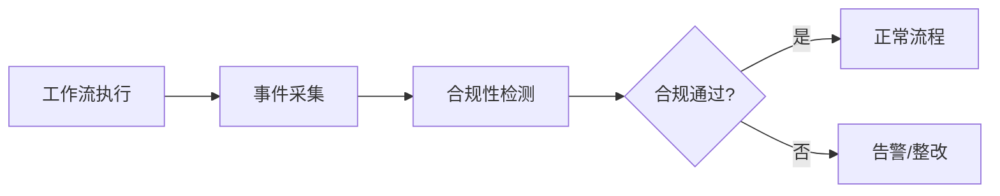

# 工作流系统形式化语义

## 1. 基本定义

### 1.1 工作流图

工作流图 G 定义为一个五元组：
G = (N, E, T, C, F) 其中：

- N: 节点集合
- E: 边集合 E ⊆ N × N
- T: 节点类型映射 T: N → Types
- C: 条件集合
- F: 流转函数 F: E × C → {true, false}

### 1.2 执行语义

工作流执行状态 S 定义为：
S = (M, V, H) 其中：

- M: 标记函数 M: N → ℕ
- V: 变量赋值 V: Var → Val
- H: 执行历史 H: Time → State

## 2. 操作语义

### 2.1 基本规则

节点执行规则：

```text
∀n ∈ N, M(n) > 0 ∧ Ready(n)
--------------------------------
⟨M, V, H⟩ →n ⟨M', V', H'⟩
```

条件转移规则：

```text
∀e ∈ E, src(e) = n₁, dst(e) = n₂
F(e, C) = true
--------------------------------
M' = M - {n₁} + {n₂}
```

### 2.2 并发语义

并行分支规则：

```text
∀n ∈ N, Type(n) = PARALLEL
--------------------------------
M' = M - {n} + children(n)
```

同步合并规则：

```text
∀n ∈ N, Type(n) = SYNC
∀p ∈ parents(n), M(p) > 0
--------------------------------
M' = M - parents(n) + {n}
```

## 3. 时态逻辑

### 3.1 CTL公式

基本性质：

- 可达性: EF(φ)
- 安全性: AG(φ)
- 活性: AF(φ)
- 公平性: AG(φ → AF(ψ))

### 3.2 验证规则

死锁检测：

```text
AG(∃n ∈ N: M(n) > 0 → EF(∃n' ∈ N: M'(n') > 0))
```

终止性验证：

```text
AG(M ≠ ∅ → AF(M = ∅))
```

## 4. 范畴论视角

### 4.1 工作流范畴

对象：

- 工作流状态 S = (M, V, H)

态射：

- 状态转换函数 f: S → S'

### 4.2 函子与自然变换

状态迁移函子 F:

```text
F: Workflow → Set
F(S) = {s' | s →* s'}
```

并发组合函子 G:

```text
G: Workflow × Workflow → Workflow
G(W₁, W₂) = W₁ ∥ W₂
```

## 5. 类型系统

### 5.1 基本类型

```text
τ ::= Unit | Bool | Int | String
    | τ₁ × τ₂           // 产品类型
    | τ₁ + τ₂           // 和类型
    | τ₁ → τ₂           // 函数类型
```

### 5.2 类型规则

节点类型规则：

```text
Γ ⊢ n : τ₁   Γ ⊢ m : τ₂
-------------------------
Γ ⊢ n → m : τ₁ → τ₂
```

并行组合规则：

```text
Γ ⊢ W₁ : τ₁   Γ ⊢ W₂ : τ₂
---------------------------
Γ ⊢ W₁ ∥ W₂ : τ₁ × τ₂
```

## 6. 验证技术

### 6.1 模型检验

状态空间探索：

```text
Check(φ, S) = 
  if S ⊨ φ then true
  else if S ∈ visited then false
  else ∀s' ∈ next(S): Check(φ, s')
```

### 6.2 定理证明

归纳证明模式：

```text
Base: ⊢ P(∅)
Step: ∀S: P(S) → P(next(S))
-------------------------
⊢ ∀S: P(S)
```

## 7. 实现考虑

### 7.1 状态编码

二进制编码：

```text
encode(S) = (bin(M), bin(V), bin(H))
decode(b) = (M, V, H)
```

### 7.2 效率优化

部分序约简：

```text
R(S) = {s' | s →* s' ∧ ¬∃s'': s' →+ s''}
```

## 8. 扩展方向

### 8.1 实时性

添加时间约束：

```text
TC = (min: Time, max: Time)
G' = (N, E, T, C, F, TC)
```

### 8.2 概率特性

概率转移：

```text
P: E × C → [0, 1]
Σ{p | (e,p) ∈ P(n)} = 1
```

### 8.3 资源约束

资源模型：

```text
R = (Type, Capacity, Usage)
Check(S) = ∀r ∈ R: Usage(r) ≤ Capacity(r)
```

## 9. 时态逻辑与安全合规

### 9.1 时态逻辑表达

- 使用CTL/LTL描述工作流安全属性：
  - 死锁不可达：AG(¬deadlock)
  - 必达终止：AF(terminated)
- 结合模型检测工具（如NuSMV、TLA+）自动验证。

### 9.2 行业合规自动检测建议

- 金融（PCI DSS）：交易流程全程审计、数据加密、访问控制。
- 医疗（HIPAA）：患者数据流转可追溯、隐私保护。
- IoT：设备状态变迁与安全事件自动检测。
- 推荐集成OpenAPI、MCP协议标准，自动生成合规检测脚本。

### 9.3 国际标准对照表

| 行业 | 国际标准 | 关键要求 |
|------|----------|----------|
| 金融 | PCI DSS  | 加密、审计、访问控制 |
| 医疗 | HIPAA    | 隐私、可追溯性 |
| 通用 | ISO/IEC 27001 | 信息安全管理 |
| 欧盟 | GDPR     | 数据主权、合规 |
| 美国 | NIST SP 800-53 | 安全控制 |

#### 9.4 Go代码片段：合规性自动检测

```go
// 合规性自动检测伪代码
type WorkflowEvent struct {Type string; Data map[string]interface{}}
func CheckCompliance(events []WorkflowEvent, standard string) bool {
    // 针对不同标准自动检测
    for _, e := range events {
        // 检查加密、审计、访问等
        // ...
    }
    return true // or false
}
```

#### 9.5 自动化流程图



### 9.6 行业实战案例

- 金融：自动检测支付流程合规性，集成PCI DSS脚本。
- 医疗：患者数据流转全程审计，自动生成HIPAA合规报告。
- IoT：设备状态变迁与安全事件自动检测，自动报警。

### 9.7 自动化合规检测脚本示例

```python
# PCI DSS自动检测脚本示例
import json
with open('transactions.json') as f:
    txs = json.load(f)
for tx in txs:
    assert tx['encrypted']
    assert tx['access_control']
print('PCI DSS check passed')
```

### 9.8 术语多语对照表

| 英文 | 中文 | 日文 | 说明 |
|------|------|------|------|
| Compliance | 合规 | コンプライアンス | 遵循行业标准与法规 |
| Audit | 审计 | 監査 | 过程与数据的可追溯性 |
| Workflow | 工作流 | ワークフロー | 任务与流程的自动化 |
| Temporal Logic | 时态逻辑 | 時間論理 | 描述系统动态属性 |
| Model Checking | 模型检测 | モデル検査 | 自动化验证系统属性 |

### 9.9 国际协作与开源建议

- 推荐采用GitHub、GitLab等平台进行多语言协作。
- 参与CNCF、OpenAPI、LF AI等国际标准与开源社区。
- 推动行业合规自动化工具的国际化与本地化。

## 10. 行业合规自动化检测建议

- 金融：集成PCI DSS自动检测工具，定期扫描数据流与访问控制。
- 医疗：结合HIPAA合规检测脚本，自动校验数据脱敏与访问日志。
- IoT：自动检测设备固件安全、数据加密与远程访问合规性。
