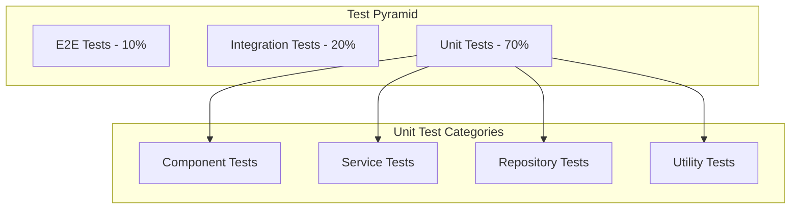

# 单元测试策略

## 🎯 测试目标

### 1. 核心目标

- **代码质量保证**: 确保代码的正确性和可靠性
- **回归测试**: 防止新功能引入的回归问题
- **文档作用**: 测试代码作为活文档
- **重构支持**: 支持安全的重构和优化

### 2. 测试原则

- **FIRST原则**: Fast, Independent, Repeatable, Self-validating, Timely
- **AAA模式**: Arrange, Act, Assert
- **测试驱动开发**: TDD和BDD结合
- **高覆盖率**: 目标90%以上的代码覆盖率

## 🏗️ 测试架构

### 1. 测试层次结构



### 2. 测试工具栈

```yaml
# 测试工具配置
testing:
  framework: "testify"
  coverage:
    target: 90
    exclude:
      - "cmd/"
      - "docs/"
      - "vendor/"
  mocking: "gomock"
  benchmarking: "builtin"
  assertions: "testify/assert"
  suites: "testify/suite"
```

## 🔧 测试实现

### 1. 组件测试

#### 1.1 基础组件测试

```go
// component_test.go
package component

import (
    "context"
    "testing"
    "time"
    
    "github.com/stretchr/testify/assert"
    "github.com/stretchr/testify/suite"
    "go.uber.org/zap"
)

// 组件测试套件
type ComponentTestSuite struct {
    suite.Suite
    container *DependencyContainer
    manager   *ComponentManager
}

func (cts *ComponentTestSuite) SetupSuite() {
    // 初始化测试环境
    cts.container = NewDependencyContainer()
    cts.manager = NewComponentManager(cts.container)
}

func (cts *ComponentTestSuite) SetupTest() {
    // 每个测试前的清理
    cts.manager.StopAll(context.Background())
    cts.container.Clear()
}

func (cts *ComponentTestSuite) TearDownTest() {
    // 每个测试后的清理
    cts.manager.StopAll(context.Background())
}

// 测试组件创建
func (cts *ComponentTestSuite) TestComponentCreation() {
    config := ComponentConfig{
        ID:          "test-component",
        Name:        "Test Component",
        Version:     "1.0.0",
        Type:        TypeService,
        Dependencies: []string{},
        Properties:  map[string]interface{}{
            "port": 8080,
        },
    }
    
    component := NewBaseComponent(config, cts.container)
    
    cts.Assert().Equal("test-component", component.ID())
    cts.Assert().Equal("Test Component", component.Name())
    cts.Assert().Equal("1.0.0", component.Version())
    cts.Assert().Equal(TypeService, component.Type())
    cts.Assert().Equal(StatusCreated, component.Status())
}

// 测试组件生命周期
func (cts *ComponentTestSuite) TestComponentLifecycle() {
    config := ComponentConfig{
        ID:          "lifecycle-test",
        Name:        "Lifecycle Test Component",
        Version:     "1.0.0",
        Type:        TypeService,
        Dependencies: []string{},
    }
    
    component := NewBaseComponent(config, cts.container)
    ctx := context.Background()
    
    // 测试启动
    err := component.Start(ctx)
    cts.Assert().NoError(err)
    cts.Assert().Equal(StatusRunning, component.Status())
    
    // 测试健康状态
    health := component.Health()
    cts.Assert().Equal("healthy", health.Status)
    
    // 测试指标
    metrics := component.Metrics()
    cts.Assert().NotZero(metrics.StartTime)
    cts.Assert().Equal(int64(1), metrics.RestartCount)
    
    // 测试停止
    err = component.Stop(ctx)
    cts.Assert().NoError(err)
    cts.Assert().Equal(StatusStopped, component.Status())
}

// 测试组件依赖
func (cts *ComponentTestSuite) TestComponentDependencies() {
    // 创建依赖组件
    depConfig := ComponentConfig{
        ID:          "dependency",
        Name:        "Dependency Component",
        Version:     "1.0.0",
        Type:        TypeService,
        Dependencies: []string{},
    }
    
    depComponent := NewBaseComponent(depConfig, cts.container)
    cts.manager.RegisterComponent(depComponent)
    
    // 创建依赖它的组件
    config := ComponentConfig{
        ID:          "dependent",
        Name:        "Dependent Component",
        Version:     "1.0.0",
        Type:        TypeService,
        Dependencies: []string{"dependency"},
    }
    
    component := NewBaseComponent(config, cts.container)
    cts.manager.RegisterComponent(component)
    
    ctx := context.Background()
    
    // 启动所有组件
    err := cts.manager.StartAll(ctx)
    cts.Assert().NoError(err)
    
    // 验证依赖顺序
    cts.Assert().Equal(StatusRunning, depComponent.Status())
    cts.Assert().Equal(StatusRunning, component.Status())
}

// 测试组件配置更新
func (cts *ComponentTestSuite) TestComponentConfigUpdate() {
    config := ComponentConfig{
        ID:          "config-test",
        Name:        "Config Test Component",
        Version:     "1.0.0",
        Type:        TypeService,
        Dependencies: []string{},
        Properties:  map[string]interface{}{
            "initial_value": "old",
        },
    }
    
    component := NewBaseComponent(config, cts.container)
    
    // 更新配置
    newConfig := config
    newConfig.Properties["initial_value"] = "new"
    
    err := component.UpdateConfig(newConfig)
    cts.Assert().NoError(err)
    
    updatedConfig := component.Config()
    cts.Assert().Equal("new", updatedConfig.Properties["initial_value"])
}

// 测试组件错误处理
func (cts *ComponentTestSuite) TestComponentErrorHandling() {
    // 测试无效配置
    invalidConfig := ComponentConfig{
        ID:   "", // 无效ID
        Name: "Invalid Component",
        Type: TypeService,
    }
    
    component := NewBaseComponent(invalidConfig, cts.container)
    
    // 测试启动失败
    ctx := context.Background()
    err := component.Start(ctx)
    cts.Assert().Error(err)
    cts.Assert().Equal(StatusError, component.Status())
}

// 运行测试套件
func TestComponentTestSuite(t *testing.T) {
    suite.Run(t, new(ComponentTestSuite))
}
```

#### 1.2 服务组件测试

```go
// service_component_test.go
package component

import (
    "context"
    "testing"
    "time"
    
    "github.com/stretchr/testify/assert"
    "github.com/stretchr/testify/mock"
)

// Mock健康检查器
type MockHealthChecker struct {
    mock.Mock
}

func (mhc *MockHealthChecker) Start(ctx context.Context) error {
    args := mhc.Called(ctx)
    return args.Error(0)
}

func (mhc *MockHealthChecker) Stop(ctx context.Context) error {
    args := mhc.Called(ctx)
    return args.Error(0)
}

func (mhc *MockHealthChecker) Check() HealthStatus {
    args := mhc.Called()
    return args.Get(0).(HealthStatus)
}

// Mock负载均衡器
type MockLoadBalancer struct {
    mock.Mock
}

func (mlb *MockLoadBalancer) Start(ctx context.Context) error {
    args := mlb.Called(ctx)
    return args.Error(0)
}

func (mlb *MockLoadBalancer) Stop(ctx context.Context) error {
    args := mlb.Called(ctx)
    return args.Error(0)
}

func (mlb *MockLoadBalancer) Select() string {
    args := mlb.Called()
    return args.String(0)
}

// 服务组件测试
func TestServiceComponent(t *testing.T) {
    container := NewDependencyContainer()
    
    config := ComponentConfig{
        ID:          "service-test",
        Name:        "Service Test Component",
        Version:     "1.0.0",
        Type:        TypeService,
        Dependencies: []string{},
        Properties:  map[string]interface{}{
            "service_name": "test-service",
            "port":         8080,
            "endpoints":    []string{"http://localhost:8080"},
        },
    }
    
    component := NewServiceComponent(config, container)
    
    // 测试基本信息
    assert.Equal(t, "service-test", component.ID())
    assert.Equal(t, "Service Test Component", component.Name())
    assert.Equal(t, TypeService, component.Type())
    
    // 测试启动
    ctx := context.Background()
    err := component.Start(ctx)
    assert.NoError(t, err)
    assert.Equal(t, StatusRunning, component.Status())
    
    // 测试停止
    err = component.Stop(ctx)
    assert.NoError(t, err)
    assert.Equal(t, StatusStopped, component.Status())
}

// 测试服务组件依赖
func TestServiceComponentDependencies(t *testing.T) {
    container := NewDependencyContainer()
    
    // 创建依赖组件
    depConfig := ComponentConfig{
        ID:          "database",
        Name:        "Database Component",
        Version:     "1.0.0",
        Type:        TypeInfrastructure,
        Dependencies: []string{},
    }
    
    depComponent := NewBaseComponent(depConfig, container)
    
    // 创建服务组件
    serviceConfig := ComponentConfig{
        ID:          "user-service",
        Name:        "User Service",
        Version:     "1.0.0",
        Type:        TypeService,
        Dependencies: []string{"database"},
        Properties:  map[string]interface{}{
            "service_name": "user-service",
        },
    }
    
    serviceComponent := NewServiceComponent(serviceConfig, container)
    
    // 注册组件
    manager := NewComponentManager(container)
    manager.RegisterComponent(depComponent)
    manager.RegisterComponent(serviceComponent)
    
    // 启动所有组件
    ctx := context.Background()
    err := manager.StartAll(ctx)
    assert.NoError(t, err)
    
    // 验证依赖关系
    assert.Equal(t, StatusRunning, depComponent.Status())
    assert.Equal(t, StatusRunning, serviceComponent.Status())
}
```

### 2. 管理器测试

#### 2.1 组件管理器测试

```go
// manager_test.go
package component

import (
    "context"
    "testing"
    "time"
    
    "github.com/stretchr/testify/assert"
    "github.com/stretchr/testify/suite"
)

type ManagerTestSuite struct {
    suite.Suite
    manager   *ComponentManager
    container *DependencyContainer
}

func (mts *ManagerTestSuite) SetupSuite() {
    mts.container = NewDependencyContainer()
    mts.manager = NewComponentManager(mts.container)
}

func (mts *ManagerTestSuite) SetupTest() {
    mts.manager.StopAll(context.Background())
    mts.container.Clear()
}

func (mts *ManagerTestSuite) TearDownTest() {
    mts.manager.StopAll(context.Background())
}

// 测试组件注册
func (mts *ManagerTestSuite) TestComponentRegistration() {
    config := ComponentConfig{
        ID:          "test-registration",
        Name:        "Test Registration",
        Version:     "1.0.0",
        Type:        TypeService,
        Dependencies: []string{},
    }
    
    component := NewBaseComponent(config, mts.container)
    
    // 注册组件
    err := mts.manager.RegisterComponent(component)
    mts.Assert().NoError(err)
    
    // 验证注册
    registeredComponent, err := mts.manager.GetComponent("test-registration")
    mts.Assert().NoError(err)
    mts.Assert().Equal(component, registeredComponent)
    
    // 测试重复注册
    err = mts.manager.RegisterComponent(component)
    mts.Assert().Error(err)
}

// 测试组件注销
func (mts *ManagerTestSuite) TestComponentUnregistration() {
    config := ComponentConfig{
        ID:          "test-unregistration",
        Name:        "Test Unregistration",
        Version:     "1.0.0",
        Type:        TypeService,
        Dependencies: []string{},
    }
    
    component := NewBaseComponent(config, mts.container)
    mts.manager.RegisterComponent(component)
    
    // 注销组件
    err := mts.manager.UnregisterComponent("test-unregistration")
    mts.Assert().NoError(err)
    
    // 验证注销
    _, err = mts.manager.GetComponent("test-unregistration")
    mts.Assert().Error(err)
}

// 测试依赖排序
func (mts *ManagerTestSuite) TestDependencySorting() {
    // 创建有依赖关系的组件
    config1 := ComponentConfig{
        ID:          "component-1",
        Name:        "Component 1",
        Version:     "1.0.0",
        Type:        TypeService,
        Dependencies: []string{},
    }
    
    config2 := ComponentConfig{
        ID:          "component-2",
        Name:        "Component 2",
        Version:     "1.0.0",
        Type:        TypeService,
        Dependencies: []string{"component-1"},
    }
    
    config3 := ComponentConfig{
        ID:          "component-3",
        Name:        "Component 3",
        Version:     "1.0.0",
        Type:        TypeService,
        Dependencies: []string{"component-2"},
    }
    
    component1 := NewBaseComponent(config1, mts.container)
    component2 := NewBaseComponent(config2, mts.container)
    component3 := NewBaseComponent(config3, mts.container)
    
    mts.manager.RegisterComponent(component1)
    mts.manager.RegisterComponent(component2)
    mts.manager.RegisterComponent(component3)
    
    // 启动所有组件
    ctx := context.Background()
    err := mts.manager.StartAll(ctx)
    mts.Assert().NoError(err)
    
    // 验证启动顺序
    mts.Assert().Equal(StatusRunning, component1.Status())
    mts.Assert().Equal(StatusRunning, component2.Status())
    mts.Assert().Equal(StatusRunning, component3.Status())
}

// 测试循环依赖检测
func (mts *ManagerTestSuite) TestCircularDependencyDetection() {
    config1 := ComponentConfig{
        ID:          "circular-1",
        Name:        "Circular 1",
        Version:     "1.0.0",
        Type:        TypeService,
        Dependencies: []string{"circular-2"},
    }
    
    config2 := ComponentConfig{
        ID:          "circular-2",
        Name:        "Circular 2",
        Version:     "1.0.0",
        Type:        TypeService,
        Dependencies: []string{"circular-1"},
    }
    
    component1 := NewBaseComponent(config1, mts.container)
    component2 := NewBaseComponent(config2, mts.container)
    
    mts.manager.RegisterComponent(component1)
    mts.manager.RegisterComponent(component2)
    
    // 尝试启动（应该检测到循环依赖）
    ctx := context.Background()
    err := mts.manager.StartAll(ctx)
    mts.Assert().Error(err)
    mts.Assert().Contains(err.Error(), "circular dependency")
}

// 测试组件类型过滤
func (mts *ManagerTestSuite) TestComponentTypeFiltering() {
    config1 := ComponentConfig{
        ID:          "service-1",
        Name:        "Service 1",
        Version:     "1.0.0",
        Type:        TypeService,
        Dependencies: []string{},
    }
    
    config2 := ComponentConfig{
        ID:          "repository-1",
        Name:        "Repository 1",
        Version:     "1.0.0",
        Type:        TypeRepository,
        Dependencies: []string{},
    }
    
    config3 := ComponentConfig{
        ID:          "service-2",
        Name:        "Service 2",
        Version:     "1.0.0",
        Type:        TypeService,
        Dependencies: []string{},
    }
    
    component1 := NewBaseComponent(config1, mts.container)
    component2 := NewBaseComponent(config2, mts.container)
    component3 := NewBaseComponent(config3, mts.container)
    
    mts.manager.RegisterComponent(component1)
    mts.manager.RegisterComponent(component2)
    mts.manager.RegisterComponent(component3)
    
    // 按类型获取组件
    serviceComponents := mts.manager.GetComponentsByType(TypeService)
    mts.Assert().Len(serviceComponents, 2)
    
    repositoryComponents := mts.manager.GetComponentsByType(TypeRepository)
    mts.Assert().Len(repositoryComponents, 1)
}

func TestManagerTestSuite(t *testing.T) {
    suite.Run(t, new(ManagerTestSuite))
}
```

### 3. 事件系统测试

```go
// event_bus_test.go
package component

import (
    "testing"
    "time"
    
    "github.com/stretchr/testify/assert"
    "github.com/stretchr/testify/suite"
)

type EventBusTestSuite struct {
    suite.Suite
    eventBus *EventBus
}

func (ebts *EventBusTestSuite) SetupSuite() {
    ebts.eventBus = NewEventBus()
}

func (ebts *EventBusTestSuite) SetupTest() {
    // 清理事件总线
    ebts.eventBus = NewEventBus()
}

// 测试事件订阅
func (ebts *EventBusTestSuite) TestEventSubscription() {
    eventType := "test.event"
    
    // 订阅事件
    ch, err := ebts.eventBus.Subscribe(eventType)
    ebts.Assert().NoError(err)
    ebts.Assert().NotNil(ch)
    
    // 发布事件
    eventData := map[string]interface{}{
        "message": "Hello, World!",
        "timestamp": time.Now(),
    }
    
    ebts.eventBus.Publish(eventType, eventData)
    
    // 接收事件
    select {
    case event := <-ch:
        ebts.Assert().Equal(eventType, event.Type)
        ebts.Assert().Equal(eventData["message"], event.Data["message"])
    case <-time.After(1 * time.Second):
        ebts.T().Fatal("timeout waiting for event")
    }
}

// 测试事件取消订阅
func (ebts *EventBusTestSuite) TestEventUnsubscription() {
    eventType := "test.unsubscribe"
    
    // 订阅事件
    ch, err := ebts.eventBus.Subscribe(eventType)
    ebts.Assert().NoError(err)
    
    // 取消订阅
    err = ebts.eventBus.Unsubscribe(eventType, ch)
    ebts.Assert().NoError(err)
    
    // 发布事件（不应该收到）
    ebts.eventBus.Publish(eventType, map[string]interface{}{"test": "data"})
    
    // 验证没有收到事件
    select {
    case <-ch:
        ebts.T().Fatal("should not receive event after unsubscription")
    case <-time.After(100 * time.Millisecond):
        // 正常情况，没有收到事件
    }
}

// 测试多个订阅者
func (ebts *EventBusTestSuite) TestMultipleSubscribers() {
    eventType := "test.multiple"
    
    // 创建多个订阅者
    ch1, _ := ebts.eventBus.Subscribe(eventType)
    ch2, _ := ebts.eventBus.Subscribe(eventType)
    ch3, _ := ebts.eventBus.Subscribe(eventType)
    
    // 发布事件
    eventData := map[string]interface{}{"count": 1}
    ebts.eventBus.Publish(eventType, eventData)
    
    // 验证所有订阅者都收到事件
    received := 0
    for i := 0; i < 3; i++ {
        select {
        case <-ch1:
            received++
        case <-ch2:
            received++
        case <-ch3:
            received++
        case <-time.After(100 * time.Millisecond):
        }
    }
    
    ebts.Assert().Equal(3, received)
}

// 测试事件类型不存在
func (ebts *EventBusTestSuite) TestNonExistentEventType() {
    // 发布到不存在的事件类型
    ebts.eventBus.Publish("non.existent", map[string]interface{}{"test": "data"})
    
    // 应该不会崩溃
    ebts.Assert().True(true)
}

func TestEventBusTestSuite(t *testing.T) {
    suite.Run(t, new(EventBusTestSuite))
}
```

### 4. 指标测试

```go
// metrics_test.go
package component

import (
    "testing"
    "time"
    
    "github.com/stretchr/testify/assert"
)

func TestComponentMetrics(t *testing.T) {
    componentID := "test-metrics"
    metrics := NewComponentMetrics(componentID)
    
    // 测试初始状态
    initialMetrics := metrics.GetMetrics()
    assert.Equal(t, time.Time{}, initialMetrics.StartTime)
    assert.Equal(t, time.Time{}, initialMetrics.StopTime)
    assert.Equal(t, time.Duration(0), initialMetrics.Uptime)
    assert.Equal(t, int64(0), initialMetrics.RestartCount)
    assert.Equal(t, int64(0), initialMetrics.ErrorCount)
    assert.Equal(t, int64(0), initialMetrics.RequestCount)
    
    // 测试记录启动
    metrics.RecordStart()
    startMetrics := metrics.GetMetrics()
    assert.NotZero(t, startMetrics.StartTime)
    assert.Equal(t, int64(1), startMetrics.RestartCount)
    
    // 测试记录错误
    metrics.RecordError()
    errorMetrics := metrics.GetMetrics()
    assert.Equal(t, int64(1), errorMetrics.ErrorCount)
    
    // 测试记录请求
    requestDuration := 100 * time.Millisecond
    metrics.RecordRequest(requestDuration)
    requestMetrics := metrics.GetMetrics()
    assert.Equal(t, int64(1), requestMetrics.RequestCount)
    assert.Equal(t, requestDuration, requestMetrics.ResponseTime)
    
    // 测试记录停止
    time.Sleep(10 * time.Millisecond) // 确保有运行时间
    metrics.RecordStop()
    stopMetrics := metrics.GetMetrics()
    assert.NotZero(t, stopMetrics.StopTime)
    assert.NotZero(t, stopMetrics.Uptime)
    
    // 测试内存和CPU使用
    metrics.UpdateMemoryUsage(1024 * 1024) // 1MB
    metrics.UpdateCPUUsage(25.5)
    
    finalMetrics := metrics.GetMetrics()
    assert.Equal(t, int64(1024*1024), finalMetrics.MemoryUsage)
    assert.Equal(t, 25.5, finalMetrics.CPUUsage)
}
```

## 📊 测试覆盖率

### 1. 覆盖率配置

```yaml
# .coveragerc
[run]
source = .
omit = 
    */vendor/*
    */test/*
    */mock/*
    */docs/*
    cmd/main.go

[html]
directory = coverage

[report]
exclude_lines =
    pragma: no cover
    func main\(\)
    if err != nil
    return err
    panic\(
```

### 2. 覆盖率报告

```bash
#!/bin/bash
# run-tests.sh

echo "Running unit tests with coverage..."

# 运行测试并生成覆盖率报告
go test -v -coverprofile=coverage.out ./...

# 生成HTML覆盖率报告
go tool cover -html=coverage.out -o coverage.html

# 显示覆盖率统计
go tool cover -func=coverage.out

# 检查覆盖率是否达到目标
COVERAGE=$(go tool cover -func=coverage.out | grep total | awk '{print $3}' | sed 's/%//')
TARGET=90

if (( $(echo "$COVERAGE >= $TARGET" | bc -l) )); then
    echo "✅ Coverage target met: $COVERAGE% >= $TARGET%"
    exit 0
else
    echo "❌ Coverage target not met: $COVERAGE% < $TARGET%"
    exit 1
fi
```

### 3. 覆盖率监控

```go
// coverage_monitor.go
package testing

import (
    "fmt"
    "os/exec"
    "strconv"
    "strings"
)

type CoverageMonitor struct {
    target float64
}

func NewCoverageMonitor(target float64) *CoverageMonitor {
    return &CoverageMonitor{
        target: target,
    }
}

func (cm *CoverageMonitor) CheckCoverage() (float64, error) {
    cmd := exec.Command("go", "tool", "cover", "-func=coverage.out")
    output, err := cmd.Output()
    if err != nil {
        return 0, fmt.Errorf("failed to run coverage command: %w", err)
    }
    
    lines := strings.Split(string(output), "\n")
    for _, line := range lines {
        if strings.Contains(line, "total:") {
            parts := strings.Fields(line)
            if len(parts) >= 3 {
                coverageStr := strings.TrimSuffix(parts[2], "%")
                coverage, err := strconv.ParseFloat(coverageStr, 64)
                if err != nil {
                    return 0, fmt.Errorf("failed to parse coverage: %w", err)
                }
                return coverage, nil
            }
        }
    }
    
    return 0, fmt.Errorf("coverage not found in output")
}

func (cm *CoverageMonitor) IsTargetMet(coverage float64) bool {
    return coverage >= cm.target
}
```

## 🚀 性能测试

### 1. 基准测试

```go
// benchmark_test.go
package component

import (
    "context"
    "testing"
)

// 组件创建基准测试
func BenchmarkComponentCreation(b *testing.B) {
    container := NewDependencyContainer()
    
    config := ComponentConfig{
        ID:          "benchmark-component",
        Name:        "Benchmark Component",
        Version:     "1.0.0",
        Type:        TypeService,
        Dependencies: []string{},
    }
    
    b.ResetTimer()
    for i := 0; i < b.N; i++ {
        NewBaseComponent(config, container)
    }
}

// 组件启动基准测试
func BenchmarkComponentStart(b *testing.B) {
    container := NewDependencyContainer()
    
    config := ComponentConfig{
        ID:          "benchmark-start",
        Name:        "Benchmark Start Component",
        Version:     "1.0.0",
        Type:        TypeService,
        Dependencies: []string{},
    }
    
    b.ResetTimer()
    for i := 0; i < b.N; i++ {
        component := NewBaseComponent(config, container)
        ctx := context.Background()
        component.Start(ctx)
        component.Stop(ctx)
    }
}

// 事件发布基准测试
func BenchmarkEventPublish(b *testing.B) {
    eventBus := NewEventBus()
    
    // 订阅事件
    eventBus.Subscribe("benchmark.event")
    
    eventData := map[string]interface{}{
        "message": "benchmark test",
        "count":   1,
    }
    
    b.ResetTimer()
    for i := 0; i < b.N; i++ {
        eventBus.Publish("benchmark.event", eventData)
    }
}

// 并发组件操作基准测试
func BenchmarkConcurrentComponentOperations(b *testing.B) {
    container := NewDependencyContainer()
    manager := NewComponentManager(container)
    
    b.ResetTimer()
    b.RunParallel(func(pb *testing.PB) {
        for pb.Next() {
            config := ComponentConfig{
                ID:          fmt.Sprintf("concurrent-%d", b.N),
                Name:        "Concurrent Component",
                Version:     "1.0.0",
                Type:        TypeService,
                Dependencies: []string{},
            }
            
            component := NewBaseComponent(config, container)
            manager.RegisterComponent(component)
            
            ctx := context.Background()
            component.Start(ctx)
            component.Stop(ctx)
            
            manager.UnregisterComponent(component.ID())
        }
    })
}
```

### 2. 性能监控

```go
// performance_monitor.go
package testing

import (
    "context"
    "fmt"
    "runtime"
    "time"
)

type PerformanceMetrics struct {
    StartTime    time.Time
    EndTime      time.Time
    Duration     time.Duration
    MemoryBefore uint64
    MemoryAfter  uint64
    MemoryDelta  int64
    Goroutines   int
}

type PerformanceMonitor struct {
    metrics PerformanceMetrics
}

func NewPerformanceMonitor() *PerformanceMonitor {
    return &PerformanceMonitor{}
}

func (pm *PerformanceMonitor) Start() {
    pm.metrics.StartTime = time.Now()
    pm.metrics.MemoryBefore = pm.getMemoryUsage()
    pm.metrics.Goroutines = runtime.NumGoroutine()
}

func (pm *PerformanceMonitor) Stop() {
    pm.metrics.EndTime = time.Now()
    pm.metrics.Duration = pm.metrics.EndTime.Sub(pm.metrics.StartTime)
    pm.metrics.MemoryAfter = pm.getMemoryUsage()
    pm.metrics.MemoryDelta = int64(pm.metrics.MemoryAfter - pm.metrics.MemoryBefore)
}

func (pm *PerformanceMonitor) GetMetrics() PerformanceMetrics {
    return pm.metrics
}

func (pm *PerformanceMonitor) getMemoryUsage() uint64 {
    var m runtime.MemStats
    runtime.ReadMemStats(&m)
    return m.Alloc
}

func (pm *PerformanceMonitor) PrintReport() {
    fmt.Printf("Performance Report:\n")
    fmt.Printf("  Duration: %v\n", pm.metrics.Duration)
    fmt.Printf("  Memory Delta: %d bytes\n", pm.metrics.MemoryDelta)
    fmt.Printf("  Goroutines: %d\n", pm.metrics.Goroutines)
}
```

## 🔄 持续集成

### 1. CI配置

```yaml
# .github/workflows/test.yml
name: Unit Tests

on:
  push:
    branches: [ main, develop ]
  pull_request:
    branches: [ main ]

jobs:
  test:
    runs-on: ubuntu-latest
    
    steps:
    - uses: actions/checkout@v3
    
    - name: Set up Go
      uses: actions/setup-go@v4
      with:
        go-version: '1.23'
    
    - name: Download dependencies
      run: go mod download
    
    - name: Run linter
      run: |
        go install github.com/golangci/golangci-lint/cmd/golangci-lint@latest
        golangci-lint run
    
    - name: Run unit tests
      run: |
        go test -v -coverprofile=coverage.out ./...
        go tool cover -func=coverage.out
    
    - name: Check coverage
      run: |
        COVERAGE=$(go tool cover -func=coverage.out | grep total | awk '{print $3}' | sed 's/%//')
        if (( $(echo "$COVERAGE < 90" | bc -l) )); then
          echo "Coverage is below 90%: $COVERAGE%"
          exit 1
        fi
    
    - name: Upload coverage to Codecov
      uses: codecov/codecov-action@v3
      with:
        file: ./coverage.out
        flags: unittests
        name: codecov-umbrella
```

### 2. 测试报告

```go
// test_reporter.go
package testing

import (
    "encoding/json"
    "fmt"
    "os"
    "time"
)

type TestReport struct {
    Timestamp   time.Time     `json:"timestamp"`
    Duration    time.Duration `json:"duration"`
    TotalTests  int           `json:"total_tests"`
    PassedTests int           `json:"passed_tests"`
    FailedTests int           `json:"failed_tests"`
    Coverage    float64       `json:"coverage"`
    Performance PerformanceMetrics `json:"performance"`
}

type TestReporter struct {
    report TestReport
}

func NewTestReporter() *TestReporter {
    return &TestReporter{
        report: TestReport{
            Timestamp: time.Now(),
        },
    }
}

func (tr *TestReporter) SetTestResults(total, passed, failed int) {
    tr.report.TotalTests = total
    tr.report.PassedTests = passed
    tr.report.FailedTests = failed
}

func (tr *TestReporter) SetCoverage(coverage float64) {
    tr.report.Coverage = coverage
}

func (tr *TestReporter) SetPerformance(metrics PerformanceMetrics) {
    tr.report.Performance = metrics
}

func (tr *TestReporter) SetDuration(duration time.Duration) {
    tr.report.Duration = duration
}

func (tr *TestReporter) SaveReport(filename string) error {
    file, err := os.Create(filename)
    if err != nil {
        return fmt.Errorf("failed to create report file: %w", err)
    }
    defer file.Close()
    
    encoder := json.NewEncoder(file)
    encoder.SetIndent("", "  ")
    
    if err := encoder.Encode(tr.report); err != nil {
        return fmt.Errorf("failed to encode report: %w", err)
    }
    
    return nil
}

func (tr *TestReporter) PrintSummary() {
    fmt.Printf("Test Summary:\n")
    fmt.Printf("  Total Tests: %d\n", tr.report.TotalTests)
    fmt.Printf("  Passed: %d\n", tr.report.PassedTests)
    fmt.Printf("  Failed: %d\n", tr.report.FailedTests)
    fmt.Printf("  Coverage: %.2f%%\n", tr.report.Coverage)
    fmt.Printf("  Duration: %v\n", tr.report.Duration)
}
```

---

*本单元测试策略提供了全面的测试覆盖，确保代码质量和系统可靠性，支持持续集成和自动化测试流程。*
