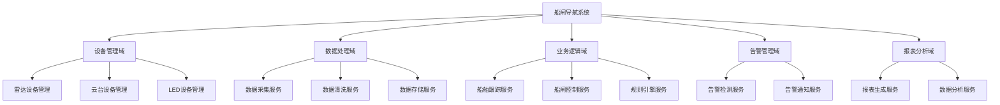

# 3. 微服务架构设计

## 3.1 微服务概述

### 3.1.1 微服务定义

微服务架构是一种将单体应用拆分为一组小型、独立服务的架构风格。对于葛洲坝船闸导航系统，微服务架构将提供：

- **服务独立性**：每个服务独立开发、部署和扩展
- **技术多样性**：不同服务可以使用不同的技术栈
- **故障隔离**：单个服务故障不影响整体系统
- **团队自治**：不同团队可以独立负责不同服务
- **可扩展性**：根据负载独立扩展服务

### 3.1.2 架构演进

```text
单体架构 → 服务拆分 → 微服务架构 → 云原生微服务
    ↓         ↓          ↓           ↓
  所有功能   按模块拆分  独立服务    容器化部署
  集中部署   共享数据库  独立数据库   服务网格
  技术统一   技术统一    技术多样    可观测性
```

## 3.2 服务边界定义

### 3.2.1 领域驱动设计(DDD)

基于DDD原则，将船闸导航系统划分为以下领域：



### 3.2.2 服务拆分策略

-**1. 按业务领域拆分**

- 设备管理服务：负责所有IoT设备的管理
- 数据处理服务：负责数据采集、清洗、存储
- 业务逻辑服务：负责核心业务逻辑
- 告警服务：负责异常检测和通知
- 报表服务：负责数据分析和报表生成

-**2. 按数据边界拆分**

- 每个服务拥有自己的数据存储
- 通过API进行数据交互
- 避免跨服务直接访问数据库

-**3. 按团队组织拆分**

- 设备团队：负责设备管理服务
- 数据团队：负责数据处理服务
- 业务团队：负责业务逻辑服务
- 运维团队：负责告警和监控服务

## 3.3 服务设计

### 3.3.1 设备管理服务

```go
// 设备管理服务接口
type DeviceManagementService interface {
    // 设备注册
    RegisterDevice(ctx context.Context, device *Device) error
    
    // 设备状态查询
    GetDeviceStatus(ctx context.Context, deviceID string) (*DeviceStatus, error)
    
    // 设备控制
    ControlDevice(ctx context.Context, deviceID string, command *DeviceCommand) error
    
    // 设备配置
    UpdateDeviceConfig(ctx context.Context, deviceID string, config *DeviceConfig) error
    
    // 设备健康检查
    HealthCheck(ctx context.Context, deviceID string) (*HealthStatus, error)
}

// 设备管理服务实现
type deviceManagementService struct {
    deviceRepo    DeviceRepository
    deviceClient  DeviceClient
    eventBus      EventBus
    logger        *zap.Logger
    tracer        trace.Tracer
    metrics       *MetricsCollector
}

func NewDeviceManagementService(deps Dependencies) DeviceManagementService {
    return &deviceManagementService{
        deviceRepo:   deps.DeviceRepository,
        deviceClient: deps.DeviceClient,
        eventBus:     deps.EventBus,
        logger:       deps.Logger,
        tracer:       deps.Tracer,
        metrics:      deps.Metrics,
    }
}

func (s *deviceManagementService) RegisterDevice(ctx context.Context, device *Device) error {
    ctx, span := s.tracer.Start(ctx, "register_device")
    defer span.End()
    
    span.SetAttributes(
        attribute.String("device.id", device.ID),
        attribute.String("device.type", device.Type),
    )
    
    s.logger.Info("注册设备",
        zap.String("device_id", device.ID),
        zap.String("device_type", device.Type),
    )
    
    // 保存设备信息
    if err := s.deviceRepo.Save(ctx, device); err != nil {
        s.metrics.RecordError(ctx, "register_device", "database_error")
        return fmt.Errorf("failed to save device: %w", err)
    }
    
    // 发布设备注册事件
    event := &DeviceRegisteredEvent{
        DeviceID:   device.ID,
        DeviceType: device.Type,
        Timestamp:  time.Now(),
    }
    
    if err := s.eventBus.Publish(ctx, "device.registered", event); err != nil {
        s.logger.Warn("发布设备注册事件失败",
            zap.Error(err),
            zap.String("device_id", device.ID),
        )
    }
    
    s.metrics.RecordDeviceRegistration(ctx, device.Type)
    
    return nil
}

func (s *deviceManagementService) GetDeviceStatus(ctx context.Context, deviceID string) (*DeviceStatus, error) {
    ctx, span := s.tracer.Start(ctx, "get_device_status")
    defer span.End()
    
    span.SetAttributes(attribute.String("device.id", deviceID))
    
    // 查询设备状态
    status, err := s.deviceClient.GetStatus(ctx, deviceID)
    if err != nil {
        s.metrics.RecordError(ctx, "get_device_status", "device_error")
        return nil, fmt.Errorf("failed to get device status: %w", err)
    }
    
    // 更新数据库中的状态
    if err := s.deviceRepo.UpdateStatus(ctx, deviceID, status); err != nil {
        s.logger.Warn("更新设备状态失败",
            zap.Error(err),
            zap.String("device_id", deviceID),
        )
    }
    
    s.metrics.RecordDeviceStatusQuery(ctx, deviceID)
    
    return status, nil
}
```

### 3.3.2 数据处理服务

```go
// 数据处理服务接口
type DataProcessingService interface {
    // 数据采集
    CollectData(ctx context.Context, source string) (*RawData, error)
    
    // 数据清洗
    CleanData(ctx context.Context, rawData *RawData) (*CleanData, error)
    
    // 数据存储
    StoreData(ctx context.Context, data *CleanData) error
    
    // 数据查询
    QueryData(ctx context.Context, query *DataQuery) (*DataResult, error)
    
    // 数据流处理
    ProcessDataStream(ctx context.Context, stream *DataStream) error
}

// 数据处理服务实现
type dataProcessingService struct {
    dataCollector DataCollector
    dataCleaner   DataCleaner
    dataStore     DataStore
    eventBus      EventBus
    logger        *zap.Logger
    tracer        trace.Tracer
    metrics       *MetricsCollector
}

func NewDataProcessingService(deps Dependencies) DataProcessingService {
    return &dataProcessingService{
        dataCollector: deps.DataCollector,
        dataCleaner:   deps.DataCleaner,
        dataStore:     deps.DataStore,
        eventBus:      deps.EventBus,
        logger:        deps.Logger,
        tracer:        deps.Tracer,
        metrics:       deps.Metrics,
    }
}

func (s *dataProcessingService) CollectData(ctx context.Context, source string) (*RawData, error) {
    ctx, span := s.tracer.Start(ctx, "collect_data")
    defer span.End()
    
    span.SetAttributes(attribute.String("data.source", source))
    
    s.logger.Info("开始数据采集",
        zap.String("source", source),
    )
    
    // 采集原始数据
    rawData, err := s.dataCollector.Collect(ctx, source)
    if err != nil {
        s.metrics.RecordError(ctx, "collect_data", "collection_error")
        return nil, fmt.Errorf("failed to collect data: %w", err)
    }
    
    // 发布数据采集事件
    event := &DataCollectedEvent{
        Source:    source,
        DataSize:  len(rawData.Payload),
        Timestamp: time.Now(),
    }
    
    if err := s.eventBus.Publish(ctx, "data.collected", event); err != nil {
        s.logger.Warn("发布数据采集事件失败",
            zap.Error(err),
            zap.String("source", source),
        )
    }
    
    s.metrics.RecordDataCollection(ctx, source, len(rawData.Payload))
    
    return rawData, nil
}

func (s *dataProcessingService) CleanData(ctx context.Context, rawData *RawData) (*CleanData, error) {
    ctx, span := s.tracer.Start(ctx, "clean_data")
    defer span.End()
    
    span.SetAttributes(
        attribute.String("data.source", rawData.Source),
        attribute.Int("data.size", len(rawData.Payload)),
    )
    
    // 数据清洗
    cleanData, err := s.dataCleaner.Clean(ctx, rawData)
    if err != nil {
        s.metrics.RecordError(ctx, "clean_data", "cleaning_error")
        return nil, fmt.Errorf("failed to clean data: %w", err)
    }
    
    s.metrics.RecordDataCleaning(ctx, rawData.Source, len(cleanData.Payload))
    
    return cleanData, nil
}
```

### 3.3.3 业务逻辑服务

```go
// 业务逻辑服务接口
type BusinessLogicService interface {
    // 船舶跟踪
    TrackShip(ctx context.Context, shipID string) (*ShipTrackingResult, error)
    
    // 船闸控制
    ControlLock(ctx context.Context, lockID string, command *LockCommand) error
    
    // 规则执行
    ExecuteRule(ctx context.Context, ruleID string, context *RuleContext) (*RuleResult, error)
    
    // 业务决策
    MakeDecision(ctx context.Context, decision *DecisionRequest) (*DecisionResult, error)
}

// 业务逻辑服务实现
type businessLogicService struct {
    shipTracker   ShipTracker
    lockController LockController
    ruleEngine    RuleEngine
    decisionEngine DecisionEngine
    eventBus      EventBus
    logger        *zap.Logger
    tracer        trace.Tracer
    metrics       *MetricsCollector
}

func NewBusinessLogicService(deps Dependencies) BusinessLogicService {
    return &businessLogicService{
        shipTracker:    deps.ShipTracker,
        lockController: deps.LockController,
        ruleEngine:     deps.RuleEngine,
        decisionEngine: deps.DecisionEngine,
        eventBus:       deps.EventBus,
        logger:         deps.Logger,
        tracer:         deps.Tracer,
        metrics:        deps.Metrics,
    }
}

func (s *businessLogicService) TrackShip(ctx context.Context, shipID string) (*ShipTrackingResult, error) {
    ctx, span := s.tracer.Start(ctx, "track_ship")
    defer span.End()
    
    span.SetAttributes(attribute.String("ship.id", shipID))
    
    s.logger.Info("开始跟踪船舶",
        zap.String("ship_id", shipID),
    )
    
    // 船舶跟踪
    result, err := s.shipTracker.Track(ctx, shipID)
    if err != nil {
        s.metrics.RecordError(ctx, "track_ship", "tracking_error")
        return nil, fmt.Errorf("failed to track ship: %w", err)
    }
    
    // 发布船舶跟踪事件
    event := &ShipTrackedEvent{
        ShipID:    shipID,
        Position:  result.Position,
        Speed:     result.Speed,
        Timestamp: time.Now(),
    }
    
    if err := s.eventBus.Publish(ctx, "ship.tracked", event); err != nil {
        s.logger.Warn("发布船舶跟踪事件失败",
            zap.Error(err),
            zap.String("ship_id", shipID),
        )
    }
    
    s.metrics.RecordShipTracking(ctx, shipID, result.Speed)
    
    return result, nil
}

func (s *businessLogicService) ControlLock(ctx context.Context, lockID string, command *LockCommand) error {
    ctx, span := s.tracer.Start(ctx, "control_lock")
    defer span.End()
    
    span.SetAttributes(
        attribute.String("lock.id", lockID),
        attribute.String("command.type", command.Type),
    )
    
    s.logger.Info("执行船闸控制命令",
        zap.String("lock_id", lockID),
        zap.String("command_type", command.Type),
    )
    
    // 执行船闸控制
    if err := s.lockController.Execute(ctx, lockID, command); err != nil {
        s.metrics.RecordError(ctx, "control_lock", "control_error")
        return fmt.Errorf("failed to control lock: %w", err)
    }
    
    // 发布船闸控制事件
    event := &LockControlledEvent{
        LockID:    lockID,
        Command:   command.Type,
        Timestamp: time.Now(),
    }
    
    if err := s.eventBus.Publish(ctx, "lock.controlled", event); err != nil {
        s.logger.Warn("发布船闸控制事件失败",
            zap.Error(err),
            zap.String("lock_id", lockID),
        )
    }
    
    s.metrics.RecordLockControl(ctx, lockID, command.Type)
    
    return nil
}
```

## 3.4 API网关设计

### 3.4.1 API网关架构

```yaml
# API网关配置
apiVersion: networking.k8s.io/v1
kind: Ingress
metadata:
  name: navlock-api-gateway
  namespace: navlock-system
  annotations:
    kubernetes.io/ingress.class: "istio"
    istio.io/v1alpha3/route: |
      - match:
          - uri:
              prefix: /api/v1/devices
        route:
          - destination:
              host: device-management-service
              port:
                number: 8080
      - match:
          - uri:
              prefix: /api/v1/data
        route:
          - destination:
              host: data-processing-service
              port:
                number: 8080
      - match:
          - uri:
              prefix: /api/v1/business
        route:
          - destination:
              host: business-logic-service
              port:
                number: 8080
spec:
  rules:
  - host: navlock-api.example.com
    http:
      paths:
      - path: /api/v1/devices
        pathType: Prefix
        backend:
          service:
            name: device-management-service
            port:
              number: 8080
      - path: /api/v1/data
        pathType: Prefix
        backend:
          service:
            name: data-processing-service
            port:
              number: 8080
      - path: /api/v1/business
        pathType: Prefix
        backend:
          service:
            name: business-logic-service
            port:
              number: 8080
```

### 3.4.2 网关功能

-**1. 路由转发**

- 根据URL路径转发到不同服务
- 支持负载均衡和故障转移
- 支持A/B测试和金丝雀发布

-**2. 认证授权**

- JWT Token验证
- API Key认证
- 权限控制

-**3. 限流熔断**

- 请求频率限制
- 熔断器保护
- 降级策略

-**4. 监控日志**

- 请求日志记录
- 性能指标收集
- 错误追踪

### 3.4.3 网关实现

```go
// API网关中间件
type APIGateway struct {
    router        *mux.Router
    authService   AuthService
    rateLimiter   RateLimiter
    circuitBreaker CircuitBreaker
    logger        *zap.Logger
    tracer        trace.Tracer
    metrics       *MetricsCollector
}

func NewAPIGateway(deps Dependencies) *APIGateway {
    router := mux.NewRouter()
    
    gateway := &APIGateway{
        router:        router,
        authService:   deps.AuthService,
        rateLimiter:   deps.RateLimiter,
        circuitBreaker: deps.CircuitBreaker,
        logger:        deps.Logger,
        tracer:        deps.Tracer,
        metrics:       deps.Metrics,
    }
    
    // 注册中间件
    router.Use(gateway.AuthMiddleware)
    router.Use(gateway.RateLimitMiddleware)
    router.Use(gateway.CircuitBreakerMiddleware)
    router.Use(gateway.LoggingMiddleware)
    router.Use(gateway.TracingMiddleware)
    
    // 注册路由
    gateway.registerRoutes()
    
    return gateway
}

func (g *APIGateway) registerRoutes() {
    // 设备管理路由
    deviceRouter := g.router.PathPrefix("/api/v1/devices").Subrouter()
    deviceRouter.HandleFunc("/", g.handleDeviceList).Methods("GET")
    deviceRouter.HandleFunc("/{id}", g.handleDeviceGet).Methods("GET")
    deviceRouter.HandleFunc("/{id}/status", g.handleDeviceStatus).Methods("GET")
    deviceRouter.HandleFunc("/{id}/control", g.handleDeviceControl).Methods("POST")
    
    // 数据处理路由
    dataRouter := g.router.PathPrefix("/api/v1/data").Subrouter()
    dataRouter.HandleFunc("/collect", g.handleDataCollect).Methods("POST")
    dataRouter.HandleFunc("/query", g.handleDataQuery).Methods("GET")
    
    // 业务逻辑路由
    businessRouter := g.router.PathPrefix("/api/v1/business").Subrouter()
    businessRouter.HandleFunc("/ships/{id}/track", g.handleShipTrack).Methods("GET")
    businessRouter.HandleFunc("/locks/{id}/control", g.handleLockControl).Methods("POST")
}

// 认证中间件
func (g *APIGateway) AuthMiddleware(next http.Handler) http.Handler {
    return http.HandlerFunc(func(w http.ResponseWriter, r *http.Request) {
        ctx, span := g.tracer.Start(r.Context(), "auth_middleware")
        defer span.End()
        
        // 提取Token
        token := r.Header.Get("Authorization")
        if token == "" {
            http.Error(w, "Unauthorized", http.StatusUnauthorized)
            return
        }
        
        // 验证Token
        claims, err := g.authService.ValidateToken(ctx, token)
        if err != nil {
            g.logger.Warn("Token验证失败",
                zap.Error(err),
                zap.String("token", token),
            )
            http.Error(w, "Unauthorized", http.StatusUnauthorized)
            return
        }
        
        // 设置用户信息到上下文
        ctx = context.WithValue(ctx, "user", claims)
        r = r.WithContext(ctx)
        
        span.SetAttributes(
            attribute.String("user.id", claims.UserID),
            attribute.String("user.role", claims.Role),
        )
        
        next.ServeHTTP(w, r)
    })
}

// 限流中间件
func (g *APIGateway) RateLimitMiddleware(next http.Handler) http.Handler {
    return http.HandlerFunc(func(w http.ResponseWriter, r *http.Request) {
        ctx, span := g.tracer.Start(r.Context(), "rate_limit_middleware")
        defer span.End()
        
        // 获取用户信息
        user, ok := r.Context().Value("user").(*Claims)
        if !ok {
            http.Error(w, "Unauthorized", http.StatusUnauthorized)
            return
        }
        
        // 检查限流
        allowed, err := g.rateLimiter.Allow(ctx, user.UserID, r.URL.Path)
        if err != nil {
            g.logger.Error("限流检查失败",
                zap.Error(err),
                zap.String("user_id", user.UserID),
            )
            http.Error(w, "Internal Server Error", http.StatusInternalServerError)
            return
        }
        
        if !allowed {
            g.metrics.RecordRateLimit(ctx, user.UserID, r.URL.Path)
            http.Error(w, "Too Many Requests", http.StatusTooManyRequests)
            return
        }
        
        next.ServeHTTP(w, r)
    })
}

// 熔断器中间件
func (g *APIGateway) CircuitBreakerMiddleware(next http.Handler) http.Handler {
    return http.HandlerFunc(func(w http.ResponseWriter, r *http.Request) {
        ctx, span := g.tracer.Start(r.Context(), "circuit_breaker_middleware")
        defer span.End()
        
        // 检查熔断器状态
        if !g.circuitBreaker.Ready(ctx, r.URL.Path) {
            g.metrics.RecordCircuitBreaker(ctx, r.URL.Path)
            http.Error(w, "Service Unavailable", http.StatusServiceUnavailable)
            return
        }
        
        // 包装ResponseWriter以捕获状态码
        wrappedWriter := &responseWriter{ResponseWriter: w, statusCode: 200}
        
        next.ServeHTTP(wrappedWriter, r)
        
        // 更新熔断器状态
        g.circuitBreaker.RecordResult(ctx, r.URL.Path, wrappedWriter.statusCode)
    })
}
```

## 3.5 服务发现

### 3.5.1 Kubernetes服务发现

```yaml
# 服务定义
apiVersion: v1
kind: Service
metadata:
  name: device-management-service
  namespace: navlock-devices
  labels:
    app: device-management
spec:
  type: ClusterIP
  ports:
  - port: 8080
    targetPort: 8080
    protocol: TCP
    name: http
  selector:
    app: device-management
---
apiVersion: v1
kind: Service
metadata:
  name: data-processing-service
  namespace: navlock-data
  labels:
    app: data-processing
spec:
  type: ClusterIP
  ports:
  - port: 8080
    targetPort: 8080
    protocol: TCP
    name: http
  selector:
    app: data-processing
---
apiVersion: v1
kind: Service
metadata:
  name: business-logic-service
  namespace: navlock-business
  labels:
    app: business-logic
spec:
  type: ClusterIP
  ports:
  - port: 8080
    targetPort: 8080
    protocol: TCP
    name: http
  selector:
    app: business-logic
```

### 3.5.2 服务注册

```go
// 服务注册接口
type ServiceRegistry interface {
    // 注册服务
    Register(ctx context.Context, service *ServiceInfo) error
    
    // 注销服务
    Deregister(ctx context.Context, serviceID string) error
    
    // 查询服务
    GetService(ctx context.Context, serviceName string) (*ServiceInfo, error)
    
    // 查询服务列表
    ListServices(ctx context.Context, filter *ServiceFilter) ([]*ServiceInfo, error)
    
    // 健康检查
    HealthCheck(ctx context.Context, serviceID string) error
}

// 服务信息
type ServiceInfo struct {
    ID          string            `json:"id"`
    Name        string            `json:"name"`
    Version     string            `json:"version"`
    Endpoint    string            `json:"endpoint"`
    HealthURL   string            `json:"health_url"`
    Metadata    map[string]string `json:"metadata"`
    Status      ServiceStatus     `json:"status"`
    LastUpdated time.Time         `json:"last_updated"`
}

type ServiceStatus string

const (
    ServiceStatusHealthy   ServiceStatus = "healthy"
    ServiceStatusUnhealthy ServiceStatus = "unhealthy"
    ServiceStatusUnknown   ServiceStatus = "unknown"
)

// Kubernetes服务注册实现
type k8sServiceRegistry struct {
    k8sClient    kubernetes.Interface
    namespace    string
    logger       *zap.Logger
    tracer       trace.Tracer
}

func NewK8sServiceRegistry(k8sClient kubernetes.Interface, namespace string, logger *zap.Logger, tracer trace.Tracer) ServiceRegistry {
    return &k8sServiceRegistry{
        k8sClient: k8sClient,
        namespace: namespace,
        logger:    logger,
        tracer:    tracer,
    }
}

func (r *k8sServiceRegistry) Register(ctx context.Context, service *ServiceInfo) error {
    ctx, span := r.tracer.Start(ctx, "register_service")
    defer span.End()
    
    span.SetAttributes(
        attribute.String("service.name", service.Name),
        attribute.String("service.version", service.Version),
    )
    
    r.logger.Info("注册服务",
        zap.String("service_name", service.Name),
        zap.String("service_version", service.Version),
        zap.String("endpoint", service.Endpoint),
    )
    
    // 创建或更新Service
    k8sService := &corev1.Service{
        ObjectMeta: metav1.ObjectMeta{
            Name:      service.Name,
            Namespace: r.namespace,
            Labels: map[string]string{
                "app": service.Name,
            },
        },
        Spec: corev1.ServiceSpec{
            Ports: []corev1.ServicePort{
                {
                    Port:       8080,
                    TargetPort: intstr.FromInt(8080),
                    Protocol:   corev1.ProtocolTCP,
                    Name:       "http",
                },
            },
            Selector: map[string]string{
                "app": service.Name,
            },
        },
    }
    
    _, err := r.k8sClient.CoreV1().Services(r.namespace).Create(ctx, k8sService, metav1.CreateOptions{})
    if err != nil {
        if k8serrors.IsAlreadyExists(err) {
            _, err = r.k8sClient.CoreV1().Services(r.namespace).Update(ctx, k8sService, metav1.UpdateOptions{})
        }
    }
    
    return err
}

func (r *k8sServiceRegistry) GetService(ctx context.Context, serviceName string) (*ServiceInfo, error) {
    ctx, span := r.tracer.Start(ctx, "get_service")
    defer span.End()
    
    span.SetAttributes(attribute.String("service.name", serviceName))
    
    k8sService, err := r.k8sClient.CoreV1().Services(r.namespace).Get(ctx, serviceName, metav1.GetOptions{})
    if err != nil {
        return nil, err
    }
    
    service := &ServiceInfo{
        ID:       string(k8sService.UID),
        Name:     k8sService.Name,
        Endpoint: fmt.Sprintf("%s.%s.svc.cluster.local:%d", k8sService.Name, r.namespace, 8080),
        Status:   ServiceStatusHealthy,
    }
    
    return service, nil
}
```

## 3.6 负载均衡

### 3.6.1 负载均衡策略

```go
// 负载均衡器接口
type LoadBalancer interface {
    // 选择服务实例
    Select(ctx context.Context, serviceName string) (*ServiceInstance, error)
    
    // 更新服务实例列表
    UpdateInstances(ctx context.Context, serviceName string, instances []*ServiceInstance) error
    
    // 健康检查
    HealthCheck(ctx context.Context, instance *ServiceInstance) error
}

// 服务实例
type ServiceInstance struct {
    ID       string            `json:"id"`
    Address  string            `json:"address"`
    Port     int               `json:"port"`
    Weight   int               `json:"weight"`
    Metadata map[string]string `json:"metadata"`
    Status   InstanceStatus    `json:"status"`
}

type InstanceStatus string

const (
    InstanceStatusHealthy   InstanceStatus = "healthy"
    InstanceStatusUnhealthy InstanceStatus = "unhealthy"
    InstanceStatusUnknown   InstanceStatus = "unknown"
)

// 轮询负载均衡器
type roundRobinLoadBalancer struct {
    instances map[string][]*ServiceInstance
    counters  map[string]int64
    mu        sync.RWMutex
    logger    *zap.Logger
    tracer    trace.Tracer
}

func NewRoundRobinLoadBalancer(logger *zap.Logger, tracer trace.Tracer) LoadBalancer {
    return &roundRobinLoadBalancer{
        instances: make(map[string][]*ServiceInstance),
        counters:  make(map[string]int64),
        logger:    logger,
        tracer:    tracer,
    }
}

func (lb *roundRobinLoadBalancer) Select(ctx context.Context, serviceName string) (*ServiceInstance, error) {
    ctx, span := lb.tracer.Start(ctx, "select_instance")
    defer span.End()
    
    span.SetAttributes(attribute.String("service.name", serviceName))
    
    lb.mu.RLock()
    instances, exists := lb.instances[serviceName]
    lb.mu.RUnlock()
    
    if !exists || len(instances) == 0 {
        return nil, fmt.Errorf("no instances available for service: %s", serviceName)
    }
    
    // 过滤健康实例
    healthyInstances := make([]*ServiceInstance, 0)
    for _, instance := range instances {
        if instance.Status == InstanceStatusHealthy {
            healthyInstances = append(healthyInstances, instance)
        }
    }
    
    if len(healthyInstances) == 0 {
        return nil, fmt.Errorf("no healthy instances available for service: %s", serviceName)
    }
    
    // 轮询选择
    lb.mu.Lock()
    counter := lb.counters[serviceName]
    lb.counters[serviceName] = (counter + 1) % int64(len(healthyInstances))
    selectedIndex := int(counter % int64(len(healthyInstances)))
    lb.mu.Unlock()
    
    selectedInstance := healthyInstances[selectedIndex]
    
    span.SetAttributes(
        attribute.String("instance.id", selectedInstance.ID),
        attribute.String("instance.address", selectedInstance.Address),
    )
    
    lb.logger.Debug("选择服务实例",
        zap.String("service_name", serviceName),
        zap.String("instance_id", selectedInstance.ID),
        zap.String("instance_address", selectedInstance.Address),
    )
    
    return selectedInstance, nil
}

// 加权轮询负载均衡器
type weightedRoundRobinLoadBalancer struct {
    instances map[string][]*ServiceInstance
    counters  map[string]int64
    weights   map[string]int64
    mu        sync.RWMutex
    logger    *zap.Logger
    tracer    trace.Tracer
}

func NewWeightedRoundRobinLoadBalancer(logger *zap.Logger, tracer trace.Tracer) LoadBalancer {
    return &weightedRoundRobinLoadBalancer{
        instances: make(map[string][]*ServiceInstance),
        counters:  make(map[string]int64),
        weights:   make(map[string]int64),
        logger:    logger,
        tracer:    tracer,
    }
}

func (lb *weightedRoundRobinLoadBalancer) Select(ctx context.Context, serviceName string) (*ServiceInstance, error) {
    ctx, span := lb.tracer.Start(ctx, "select_weighted_instance")
    defer span.End()
    
    span.SetAttributes(attribute.String("service.name", serviceName))
    
    lb.mu.RLock()
    instances, exists := lb.instances[serviceName]
    lb.mu.RUnlock()
    
    if !exists || len(instances) == 0 {
        return nil, fmt.Errorf("no instances available for service: %s", serviceName)
    }
    
    // 过滤健康实例
    healthyInstances := make([]*ServiceInstance, 0)
    totalWeight := int64(0)
    for _, instance := range instances {
        if instance.Status == InstanceStatusHealthy {
            healthyInstances = append(healthyInstances, instance)
            totalWeight += int64(instance.Weight)
        }
    }
    
    if len(healthyInstances) == 0 {
        return nil, fmt.Errorf("no healthy instances available for service: %s", serviceName)
    }
    
    // 加权轮询选择
    lb.mu.Lock()
    counter := lb.counters[serviceName]
    lb.counters[serviceName] = (counter + 1) % totalWeight
    currentWeight := counter % totalWeight
    lb.mu.Unlock()
    
    var selectedInstance *ServiceInstance
    currentSum := int64(0)
    for _, instance := range healthyInstances {
        currentSum += int64(instance.Weight)
        if currentWeight < currentSum {
            selectedInstance = instance
            break
        }
    }
    
    if selectedInstance == nil {
        selectedInstance = healthyInstances[0]
    }
    
    span.SetAttributes(
        attribute.String("instance.id", selectedInstance.ID),
        attribute.String("instance.address", selectedInstance.Address),
        attribute.Int("instance.weight", selectedInstance.Weight),
    )
    
    lb.logger.Debug("选择加权服务实例",
        zap.String("service_name", serviceName),
        zap.String("instance_id", selectedInstance.ID),
        zap.String("instance_address", selectedInstance.Address),
        zap.Int("instance_weight", selectedInstance.Weight),
    )
    
    return selectedInstance, nil
}
```

## 3.7 服务通信

### 3.7.1 gRPC通信

```protobuf
// 服务定义
syntax = "proto3";

package navlock.v1;

import "google/protobuf/timestamp.proto";

// 设备管理服务
service DeviceManagementService {
    rpc RegisterDevice(RegisterDeviceRequest) returns (RegisterDeviceResponse);
    rpc GetDeviceStatus(GetDeviceStatusRequest) returns (GetDeviceStatusResponse);
    rpc ControlDevice(ControlDeviceRequest) returns (ControlDeviceResponse);
    rpc UpdateDeviceConfig(UpdateDeviceConfigRequest) returns (UpdateDeviceConfigResponse);
    rpc HealthCheck(HealthCheckRequest) returns (HealthCheckResponse);
}

// 数据处理服务
service DataProcessingService {
    rpc CollectData(CollectDataRequest) returns (CollectDataResponse);
    rpc CleanData(CleanDataRequest) returns (CleanDataResponse);
    rpc StoreData(StoreDataRequest) returns (StoreDataResponse);
    rpc QueryData(QueryDataRequest) returns (QueryDataResponse);
}

// 业务逻辑服务
service BusinessLogicService {
    rpc TrackShip(TrackShipRequest) returns (TrackShipResponse);
    rpc ControlLock(ControlLockRequest) returns (ControlLockResponse);
    rpc ExecuteRule(ExecuteRuleRequest) returns (ExecuteRuleResponse);
    rpc MakeDecision(MakeDecisionRequest) returns (MakeDecisionResponse);
}

// 请求/响应消息
message RegisterDeviceRequest {
    string device_id = 1;
    string device_type = 2;
    map<string, string> metadata = 3;
}

message RegisterDeviceResponse {
    bool success = 1;
    string message = 2;
    google.protobuf.Timestamp timestamp = 3;
}

message GetDeviceStatusRequest {
    string device_id = 1;
}

message GetDeviceStatusResponse {
    string device_id = 1;
    string status = 2;
    map<string, string> metrics = 3;
    google.protobuf.Timestamp timestamp = 4;
}

message TrackShipRequest {
    string ship_id = 1;
}

message TrackShipResponse {
    string ship_id = 1;
    Position position = 2;
    double speed = 3;
    string direction = 4;
    google.protobuf.Timestamp timestamp = 5;
}

message Position {
    double x = 1;
    double y = 2;
    double z = 3;
}
```

### 3.7.2 事件驱动通信

```go
// 事件总线接口
type EventBus interface {
    // 发布事件
    Publish(ctx context.Context, topic string, event interface{}) error
    
    // 订阅事件
    Subscribe(ctx context.Context, topic string, handler EventHandler) error
    
    // 取消订阅
    Unsubscribe(ctx context.Context, topic string, handler EventHandler) error
}

// 事件处理器
type EventHandler func(ctx context.Context, event interface{}) error

// 事件定义
type DeviceRegisteredEvent struct {
    DeviceID   string    `json:"device_id"`
    DeviceType string    `json:"device_type"`
    Timestamp  time.Time `json:"timestamp"`
}

type DeviceStatusChangedEvent struct {
    DeviceID string    `json:"device_id"`
    Status   string    `json:"status"`
    Timestamp time.Time `json:"timestamp"`
}

type ShipTrackedEvent struct {
    ShipID    string    `json:"ship_id"`
    Position  Position  `json:"position"`
    Speed     float64   `json:"speed"`
    Timestamp time.Time `json:"timestamp"`
}

type LockControlledEvent struct {
    LockID    string    `json:"lock_id"`
    Command   string    `json:"command"`
    Timestamp time.Time `json:"timestamp"`
}

// Kafka事件总线实现
type kafkaEventBus struct {
    producer sarama.SyncProducer
    consumer sarama.Consumer
    handlers map[string][]EventHandler
    logger   *zap.Logger
    tracer   trace.Tracer
}

func NewKafkaEventBus(brokers []string, logger *zap.Logger, tracer trace.Tracer) (EventBus, error) {
    config := sarama.NewConfig()
    config.Producer.Return.Successes = true
    config.Producer.RequiredAcks = sarama.WaitForAll
    config.Producer.Retry.Max = 5
    
    producer, err := sarama.NewSyncProducer(brokers, config)
    if err != nil {
        return nil, err
    }
    
    consumer, err := sarama.NewConsumer(brokers, nil)
    if err != nil {
        return nil, err
    }
    
    return &kafkaEventBus{
        producer: producer,
        consumer: consumer,
        handlers: make(map[string][]EventHandler),
        logger:   logger,
        tracer:   tracer,
    }, nil
}

func (eb *kafkaEventBus) Publish(ctx context.Context, topic string, event interface{}) error {
    ctx, span := eb.tracer.Start(ctx, "publish_event")
    defer span.End()
    
    span.SetAttributes(
        attribute.String("event.topic", topic),
        attribute.String("event.type", fmt.Sprintf("%T", event)),
    )
    
    // 序列化事件
    data, err := json.Marshal(event)
    if err != nil {
        return fmt.Errorf("failed to marshal event: %w", err)
    }
    
    // 发布消息
    msg := &sarama.ProducerMessage{
        Topic: topic,
        Value: sarama.ByteEncoder(data),
    }
    
    partition, offset, err := eb.producer.SendMessage(msg)
    if err != nil {
        eb.metrics.RecordEventPublishError(ctx, topic)
        return fmt.Errorf("failed to send message: %w", err)
    }
    
    span.SetAttributes(
        attribute.Int32("kafka.partition", partition),
        attribute.Int64("kafka.offset", offset),
    )
    
    eb.logger.Info("事件发布成功",
        zap.String("topic", topic),
        zap.Int32("partition", partition),
        zap.Int64("offset", offset),
    )
    
    return nil
}

func (eb *kafkaEventBus) Subscribe(ctx context.Context, topic string, handler EventHandler) error {
    ctx, span := eb.tracer.Start(ctx, "subscribe_event")
    defer span.End()
    
    span.SetAttributes(attribute.String("event.topic", topic))
    
    // 添加处理器
    eb.handlers[topic] = append(eb.handlers[topic], handler)
    
    // 启动消费者
    go eb.consumeMessages(ctx, topic)
    
    eb.logger.Info("事件订阅成功",
        zap.String("topic", topic),
    )
    
    return nil
}

func (eb *kafkaEventBus) consumeMessages(ctx context.Context, topic string) {
    partitionConsumer, err := eb.consumer.ConsumePartition(topic, 0, sarama.OffsetNewest)
    if err != nil {
        eb.logger.Error("创建分区消费者失败",
            zap.Error(err),
            zap.String("topic", topic),
        )
        return
    }
    defer partitionConsumer.Close()
    
    for {
        select {
        case msg := <-partitionConsumer.Messages():
            eb.handleMessage(ctx, topic, msg)
        case <-ctx.Done():
            return
        }
    }
}

func (eb *kafkaEventBus) handleMessage(ctx context.Context, topic string, msg *sarama.ConsumerMessage) {
    ctx, span := eb.tracer.Start(ctx, "handle_message")
    defer span.End()
    
    span.SetAttributes(
        attribute.String("event.topic", topic),
        attribute.Int32("kafka.partition", msg.Partition),
        attribute.Int64("kafka.offset", msg.Offset),
    )
    
    // 获取处理器
    handlers, exists := eb.handlers[topic]
    if !exists {
        eb.logger.Warn("未找到事件处理器",
            zap.String("topic", topic),
        )
        return
    }
    
    // 调用所有处理器
    for _, handler := range handlers {
        if err := handler(ctx, msg.Value); err != nil {
            eb.logger.Error("事件处理失败",
                zap.Error(err),
                zap.String("topic", topic),
            )
        }
    }
}
```

## 3.8 总结

微服务架构设计为葛洲坝船闸导航系统提供了灵活、可扩展的服务架构。通过合理的服务拆分、API网关、服务发现、负载均衡等技术，系统获得了：

**核心优势：**

1. **服务独立性**：每个服务独立开发、部署和扩展
2. **技术多样性**：不同服务可以使用不同的技术栈
3. **故障隔离**：单个服务故障不影响整体系统
4. **团队自治**：不同团队可以独立负责不同服务
5. **可扩展性**：根据负载独立扩展服务

**实施建议：**

1. 渐进式拆分，先拆分核心服务
2. 建立完善的API网关和监控
3. 制定服务间通信规范
4. 建立服务治理机制
5. 培训团队掌握微服务技术

这个微服务架构为系统的长期发展提供了灵活的技术基础，使其能够更好地适应业务需求的变化和技术的演进。
