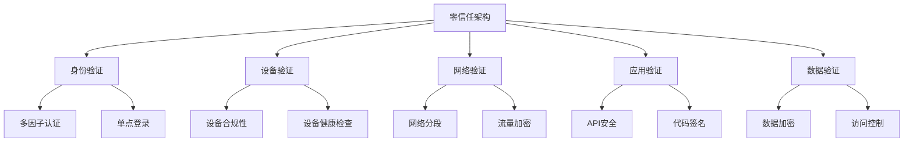

# 5. 安全架构设计

## 5.1 安全架构概述

### 5.1.1 安全威胁分析

葛洲坝船闸导航系统作为关键基础设施，面临以下安全威胁：

**外部威胁：**

- 网络攻击：DDoS、中间人攻击、SQL注入
- 恶意软件：病毒、木马、勒索软件
- 社会工程学：钓鱼攻击、身份欺骗
- 物理攻击：设备破坏、数据窃取

**内部威胁：**

- 权限滥用：越权访问、数据泄露
- 误操作：配置错误、数据丢失
- 恶意行为：内部人员恶意破坏
- 供应链攻击：第三方组件漏洞

### 5.1.2 安全架构目标

**核心目标：**

- **零信任架构**：不信任任何实体，持续验证
- **纵深防御**：多层安全防护
- **最小权限**：最小化访问权限
- **安全监控**：实时安全监控和响应
- **合规性**：满足相关安全标准和法规

## 5.2 零信任架构

### 5.2.1 零信任原则



### 5.2.2 身份认证体系

```go
// 身份认证服务
type IdentityService struct {
    jwtSecret    []byte
    userRepo     UserRepository
    roleRepo     RoleRepository
    auditLogger  AuditLogger
    logger       *zap.Logger
    tracer       trace.Tracer
    metrics      *MetricsCollector
}

func NewIdentityService(deps Dependencies) *IdentityService {
    return &IdentityService{
        jwtSecret:   deps.JWTSecret,
        userRepo:    deps.UserRepository,
        roleRepo:    deps.RoleRepository,
        auditLogger: deps.AuditLogger,
        logger:      deps.Logger,
        tracer:      deps.Tracer,
        metrics:     deps.Metrics,
    }
}

// 用户认证
func (is *IdentityService) Authenticate(ctx context.Context, credentials *Credentials) (*AuthResult, error) {
    ctx, span := is.tracer.Start(ctx, "authenticate_user")
    defer span.End()
    
    span.SetAttributes(attribute.String("username", credentials.Username))
    
    // 1. 验证用户名密码
    user, err := is.userRepo.GetByUsername(ctx, credentials.Username)
    if err != nil {
        is.metrics.RecordAuthFailure(ctx, "invalid_username")
        return nil, fmt.Errorf("invalid credentials")
    }
    
    // 验证密码
    if !is.verifyPassword(credentials.Password, user.PasswordHash) {
        is.metrics.RecordAuthFailure(ctx, "invalid_password")
        return nil, fmt.Errorf("invalid credentials")
    }
    
    // 2. 检查账户状态
    if user.Status != UserStatusActive {
        is.metrics.RecordAuthFailure(ctx, "inactive_account")
        return nil, fmt.Errorf("account is not active")
    }
    
    // 3. 多因子认证
    if user.MFAEnabled {
        if err := is.verifyMFA(ctx, user.ID, credentials.MFACode); err != nil {
            is.metrics.RecordAuthFailure(ctx, "invalid_mfa")
            return nil, fmt.Errorf("invalid MFA code")
        }
    }
    
    // 4. 生成JWT Token
    token, err := is.generateJWT(ctx, user)
    if err != nil {
        return nil, fmt.Errorf("failed to generate token: %w", err)
    }
    
    // 5. 记录审计日志
    is.auditLogger.LogAuthSuccess(ctx, &AuthEvent{
        UserID:    user.ID,
        Username:  user.Username,
        IPAddress: credentials.IPAddress,
        UserAgent: credentials.UserAgent,
        Timestamp: time.Now(),
    })
    
    is.metrics.RecordAuthSuccess(ctx, user.ID)
    
    return &AuthResult{
        Token:     token,
        User:      user,
        ExpiresAt: time.Now().Add(24 * time.Hour),
    }, nil
}

// JWT Token生成
func (is *IdentityService) generateJWT(ctx context.Context, user *User) (string, error) {
    claims := &JWTClaims{
        UserID:   user.ID,
        Username: user.Username,
        Roles:    user.Roles,
        StandardClaims: jwt.StandardClaims{
            ExpiresAt: time.Now().Add(24 * time.Hour).Unix(),
            IssuedAt:  time.Now().Unix(),
            Issuer:    "navlock-system",
            Subject:   user.ID,
        },
    }
    
    token := jwt.NewWithClaims(jwt.SigningMethodHS256, claims)
    return token.SignedString(is.jwtSecret)
}

// Token验证
func (is *IdentityService) ValidateToken(ctx context.Context, tokenString string) (*JWTClaims, error) {
    ctx, span := is.tracer.Start(ctx, "validate_token")
    defer span.End()
    
    token, err := jwt.ParseWithClaims(tokenString, &JWTClaims{}, func(token *jwt.Token) (interface{}, error) {
        if _, ok := token.Method.(*jwt.SigningMethodHMAC); !ok {
            return nil, fmt.Errorf("unexpected signing method: %v", token.Header["alg"])
        }
        return is.jwtSecret, nil
    })
    
    if err != nil {
        is.metrics.RecordTokenValidationFailure(ctx, "parse_error")
        return nil, fmt.Errorf("invalid token: %w", err)
    }
    
    if claims, ok := token.Claims.(*JWTClaims); ok && token.Valid {
        // 检查用户是否仍然存在且活跃
        user, err := is.userRepo.GetByID(ctx, claims.UserID)
        if err != nil || user.Status != UserStatusActive {
            is.metrics.RecordTokenValidationFailure(ctx, "user_inactive")
            return nil, fmt.Errorf("user is not active")
        }
        
        return claims, nil
    }
    
    is.metrics.RecordTokenValidationFailure(ctx, "invalid_claims")
    return nil, fmt.Errorf("invalid token claims")
}
```

### 5.2.3 设备认证

```go
// 设备认证服务
type DeviceAuthService struct {
    deviceRepo   DeviceRepository
    certManager  CertificateManager
    auditLogger  AuditLogger
    logger       *zap.Logger
    tracer       trace.Tracer
    metrics      *MetricsCollector
}

func NewDeviceAuthService(deps Dependencies) *DeviceAuthService {
    return &DeviceAuthService{
        deviceRepo:   deps.DeviceRepository,
        certManager:  deps.CertificateManager,
        auditLogger:  deps.AuditLogger,
        logger:       deps.Logger,
        tracer:       deps.Tracer,
        metrics:      deps.Metrics,
    }
}

// 设备认证
func (das *DeviceAuthService) AuthenticateDevice(ctx context.Context, deviceCert []byte, deviceID string) (*DeviceAuthResult, error) {
    ctx, span := das.tracer.Start(ctx, "authenticate_device")
    defer span.End()
    
    span.SetAttributes(attribute.String("device.id", deviceID))
    
    // 1. 验证设备证书
    cert, err := das.certManager.ValidateCertificate(ctx, deviceCert)
    if err != nil {
        das.metrics.RecordDeviceAuthFailure(ctx, "invalid_certificate")
        return nil, fmt.Errorf("invalid device certificate: %w", err)
    }
    
    // 2. 检查设备是否注册
    device, err := das.deviceRepo.GetByID(ctx, deviceID)
    if err != nil {
        das.metrics.RecordDeviceAuthFailure(ctx, "device_not_found")
        return nil, fmt.Errorf("device not found")
    }
    
    // 3. 验证证书指纹
    if device.CertificateFingerprint != cert.Fingerprint {
        das.metrics.RecordDeviceAuthFailure(ctx, "certificate_mismatch")
        return nil, fmt.Errorf("certificate fingerprint mismatch")
    }
    
    // 4. 检查设备状态
    if device.Status != DeviceStatusActive {
        das.metrics.RecordDeviceAuthFailure(ctx, "device_inactive")
        return nil, fmt.Errorf("device is not active")
    }
    
    // 5. 生成设备Token
    deviceToken, err := das.generateDeviceToken(ctx, device)
    if err != nil {
        return nil, fmt.Errorf("failed to generate device token: %w", err)
    }
    
    // 6. 记录审计日志
    das.auditLogger.LogDeviceAuth(ctx, &DeviceAuthEvent{
        DeviceID:  deviceID,
        IPAddress: cert.IPAddress,
        Timestamp: time.Now(),
        Success:   true,
    })
    
    das.metrics.RecordDeviceAuthSuccess(ctx, deviceID)
    
    return &DeviceAuthResult{
        DeviceToken: deviceToken,
        Device:      device,
        ExpiresAt:   time.Now().Add(7 * 24 * time.Hour), // 设备Token有效期7天
    }, nil
}

// 设备健康检查
func (das *DeviceAuthService) HealthCheck(ctx context.Context, deviceID string) (*DeviceHealthStatus, error) {
    ctx, span := das.tracer.Start(ctx, "device_health_check")
    defer span.End()
    
    span.SetAttributes(attribute.String("device.id", deviceID))
    
    device, err := das.deviceRepo.GetByID(ctx, deviceID)
    if err != nil {
        return nil, fmt.Errorf("device not found")
    }
    
    // 检查设备连接状态
    isOnline, err := das.checkDeviceConnectivity(ctx, device)
    if err != nil {
        das.logger.Warn("设备连接性检查失败",
            zap.Error(err),
            zap.String("device_id", deviceID),
        )
    }
    
    // 检查设备资源使用情况
    resourceUsage, err := das.getDeviceResourceUsage(ctx, device)
    if err != nil {
        das.logger.Warn("设备资源使用检查失败",
            zap.Error(err),
            zap.String("device_id", deviceID),
        )
    }
    
    healthStatus := &DeviceHealthStatus{
        DeviceID:     deviceID,
        IsOnline:     isOnline,
        ResourceUsage: resourceUsage,
        LastCheck:    time.Now(),
    }
    
    // 更新设备健康状态
    if err := das.deviceRepo.UpdateHealthStatus(ctx, deviceID, healthStatus); err != nil {
        das.logger.Warn("更新设备健康状态失败",
            zap.Error(err),
            zap.String("device_id", deviceID),
        )
    }
    
    return healthStatus, nil
}
```

## 5.3 网络安全

### 5.3.1 网络分段

```yaml
# 网络策略配置
apiVersion: networking.k8s.io/v1
kind: NetworkPolicy
metadata:
  name: navlock-network-policy
  namespace: navlock-system
spec:
  podSelector:
    matchLabels:
      app: navlock-service
  policyTypes:
  - Ingress
  - Egress
  ingress:
  # 允许来自API网关的流量
  - from:
    - namespaceSelector:
        matchLabels:
          name: navlock-gateway
    ports:
    - protocol: TCP
      port: 8080
  # 允许来自监控系统的流量
  - from:
    - namespaceSelector:
        matchLabels:
          name: navlock-monitoring
    ports:
    - protocol: TCP
      port: 8080
  # 允许来自设备管理系统的流量
  - from:
    - namespaceSelector:
        matchLabels:
          name: navlock-devices
    ports:
    - protocol: TCP
      port: 8080
  egress:
  # 允许访问数据库
  - to:
    - namespaceSelector:
        matchLabels:
          name: navlock-data
    ports:
    - protocol: TCP
      port: 5432
  # 允许访问缓存
  - to:
    - namespaceSelector:
        matchLabels:
          name: navlock-cache
    ports:
    - protocol: TCP
      port: 6379
  # 允许访问消息队列
  - to:
    - namespaceSelector:
        matchLabels:
          name: navlock-messaging
    ports:
    - protocol: TCP
      port: 9092
---
# 设备管理网络策略
apiVersion: networking.k8s.io/v1
kind: NetworkPolicy
metadata:
  name: device-management-network-policy
  namespace: navlock-devices
spec:
  podSelector:
    matchLabels:
      app: device-management
  policyTypes:
  - Ingress
  - Egress
  ingress:
  # 只允许来自API网关的流量
  - from:
    - namespaceSelector:
        matchLabels:
          name: navlock-gateway
    ports:
    - protocol: TCP
      port: 8080
  egress:
  # 允许访问设备
  - to:
    - ipBlock:
        cidr: 192.168.1.0/24
    ports:
    - protocol: TCP
      port: 80
    - protocol: TCP
      port: 443
  # 允许访问数据库
  - to:
    - namespaceSelector:
        matchLabels:
          name: navlock-data
    ports:
    - protocol: TCP
      port: 5432
```

### 5.3.2 TLS/SSL配置

```yaml
# TLS证书配置
apiVersion: cert-manager.io/v1
kind: Certificate
metadata:
  name: navlock-tls-cert
  namespace: navlock-system
spec:
  secretName: navlock-tls-secret
  issuerRef:
    name: letsencrypt-prod
    kind: ClusterIssuer
  dnsNames:
  - navlock-api.example.com
  - navlock-admin.example.com
  - navlock-monitor.example.com
---
# Istio TLS配置
apiVersion: networking.istio.io/v1alpha3
kind: Gateway
metadata:
  name: navlock-gateway
  namespace: navlock-system
spec:
  selector:
    istio: ingressgateway
  servers:
  - port:
      number: 443
      name: https
      protocol: HTTPS
    tls:
      mode: SIMPLE
      credentialName: navlock-tls-secret
    hosts:
    - navlock-api.example.com
    - navlock-admin.example.com
    - navlock-monitor.example.com
  - port:
      number: 80
      name: http
      protocol: HTTP
    hosts:
    - navlock-api.example.com
    - navlock-admin.example.com
    - navlock-monitor.example.com
    tls:
      httpsRedirect: true
```

### 5.3.3 流量加密

```go
// 流量加密中间件
type TrafficEncryptionMiddleware struct {
    cipherSuite  *tls.Config
    logger       *zap.Logger
    tracer       trace.Tracer
    metrics      *MetricsCollector
}

func NewTrafficEncryptionMiddleware(deps Dependencies) *TrafficEncryptionMiddleware {
    return &TrafficEncryptionMiddleware{
        cipherSuite: deps.TLSConfig,
        logger:      deps.Logger,
        tracer:      deps.Tracer,
        metrics:     deps.Metrics,
    }
}

// HTTP流量加密
func (tem *TrafficEncryptionMiddleware) EncryptHTTP(next http.Handler) http.Handler {
    return http.HandlerFunc(func(w http.ResponseWriter, r *http.Request) {
        ctx, span := tem.tracer.Start(r.Context(), "encrypt_http_traffic")
        defer span.End()
        
        // 检查是否已经使用HTTPS
        if r.TLS == nil {
            tem.metrics.RecordSecurityViolation(ctx, "http_without_tls")
            http.Error(w, "HTTPS required", http.StatusForbidden)
            return
        }
        
        // 检查TLS版本
        if r.TLS.Version < tls.VersionTLS12 {
            tem.metrics.RecordSecurityViolation(ctx, "weak_tls_version")
            http.Error(w, "TLS 1.2 or higher required", http.StatusForbidden)
            return
        }
        
        // 检查加密套件
        if !tem.isSecureCipherSuite(r.TLS.CipherSuite) {
            tem.metrics.RecordSecurityViolation(ctx, "weak_cipher_suite")
            http.Error(w, "Weak cipher suite not allowed", http.StatusForbidden)
            return
        }
        
        next.ServeHTTP(w, r)
    })
}

// gRPC流量加密
func (tem *TrafficEncryptionMiddleware) EncryptGRPC() grpc.ServerOption {
    return grpc.Creds(credentials.NewTLS(tem.cipherSuite))
}

// 检查加密套件安全性
func (tem *TrafficEncryptionMiddleware) isSecureCipherSuite(cipherSuite uint16) bool {
    secureCiphers := map[uint16]bool{
        tls.TLS_ECDHE_RSA_WITH_AES_256_GCM_SHA384:   true,
        tls.TLS_ECDHE_RSA_WITH_AES_128_GCM_SHA256:   true,
        tls.TLS_ECDHE_ECDSA_WITH_AES_256_GCM_SHA384: true,
        tls.TLS_ECDHE_ECDSA_WITH_AES_128_GCM_SHA256: true,
        tls.TLS_ECDHE_RSA_WITH_CHACHA20_POLY1305:    true,
        tls.TLS_ECDHE_ECDSA_WITH_CHACHA20_POLY1305:  true,
    }
    
    return secureCiphers[cipherSuite]
}
```

## 5.4 应用安全

### 5.4.1 API安全

```go
// API安全中间件
type APISecurityMiddleware struct {
    rateLimiter  RateLimiter
    validator    RequestValidator
    sanitizer    InputSanitizer
    logger       *zap.Logger
    tracer       trace.Tracer
    metrics      *MetricsCollector
}

func NewAPISecurityMiddleware(deps Dependencies) *APISecurityMiddleware {
    return &APISecurityMiddleware{
        rateLimiter: deps.RateLimiter,
        validator:   deps.RequestValidator,
        sanitizer:   deps.InputSanitizer,
        logger:      deps.Logger,
        tracer:      deps.Tracer,
        metrics:     deps.Metrics,
    }
}

// 请求验证中间件
func (asm *APISecurityMiddleware) ValidateRequest(next http.Handler) http.Handler {
    return http.HandlerFunc(func(w http.ResponseWriter, r *http.Request) {
        ctx, span := asm.tracer.Start(r.Context(), "validate_request")
        defer span.End()
        
        // 1. 验证请求大小
        if r.ContentLength > 10*1024*1024 { // 10MB限制
            asm.metrics.RecordSecurityViolation(ctx, "request_too_large")
            http.Error(w, "Request too large", http.StatusRequestEntityTooLarge)
            return
        }
        
        // 2. 验证Content-Type
        if r.Method == "POST" || r.Method == "PUT" {
            contentType := r.Header.Get("Content-Type")
            if !asm.isValidContentType(contentType) {
                asm.metrics.RecordSecurityViolation(ctx, "invalid_content_type")
                http.Error(w, "Invalid Content-Type", http.StatusBadRequest)
                return
            }
        }
        
        // 3. 验证请求头
        if err := asm.validateHeaders(r); err != nil {
            asm.metrics.RecordSecurityViolation(ctx, "invalid_headers")
            http.Error(w, "Invalid headers", http.StatusBadRequest)
            return
        }
        
        // 4. 清理和验证请求参数
        if err := asm.sanitizeAndValidateParams(r); err != nil {
            asm.metrics.RecordSecurityViolation(ctx, "invalid_params")
            http.Error(w, "Invalid parameters", http.StatusBadRequest)
            return
        }
        
        next.ServeHTTP(w, r)
    })
}

// 输入清理
func (asm *APISecurityMiddleware) sanitizeAndValidateParams(r *http.Request) error {
    // 清理查询参数
    for key, values := range r.URL.Query() {
        for i, value := range values {
            // 防止SQL注入
            if asm.containsSQLInjection(value) {
                return fmt.Errorf("potential SQL injection detected")
            }
            
            // 防止XSS攻击
            cleanedValue := asm.sanitizer.SanitizeHTML(value)
            values[i] = cleanedValue
        }
        r.URL.Query()[key] = values
    }
    
    // 清理请求体
    if r.Body != nil {
        body, err := io.ReadAll(r.Body)
        if err != nil {
            return fmt.Errorf("failed to read request body: %w", err)
        }
        
        // 检查JSON注入
        if r.Header.Get("Content-Type") == "application/json" {
            if asm.containsJSONInjection(body) {
                return fmt.Errorf("potential JSON injection detected")
            }
        }
        
        // 重新设置请求体
        r.Body = io.NopCloser(bytes.NewBuffer(body))
    }
    
    return nil
}

// SQL注入检测
func (asm *APISecurityMiddleware) containsSQLInjection(input string) bool {
    sqlPatterns := []string{
        `(?i)(union|select|insert|update|delete|drop|create|alter|exec|execute)`,
        `(?i)(--|#|/\*|\*/)`,
        `(?i)(xp_|sp_)`,
        `(?i)(waitfor|delay)`,
        `(?i)(char|nchar|varchar|nvarchar)`,
    }
    
    for _, pattern := range sqlPatterns {
        if matched, _ := regexp.MatchString(pattern, input); matched {
            return true
        }
    }
    
    return false
}

// XSS攻击检测
func (asm *APISecurityMiddleware) containsXSS(input string) bool {
    xssPatterns := []string{
        `(?i)<script[^>]*>.*?</script>`,
        `(?i)javascript:`,
        `(?i)onload=`,
        `(?i)onerror=`,
        `(?i)onclick=`,
        `(?i)onmouseover=`,
    }
    
    for _, pattern := range xssPatterns {
        if matched, _ := regexp.MatchString(pattern, input); matched {
            return true
        }
    }
    
    return false
}
```

### 5.4.2 代码签名

```go
// 代码签名验证
type CodeSignatureVerifier struct {
    publicKey    *rsa.PublicKey
    logger       *zap.Logger
    tracer       trace.Tracer
    metrics      *MetricsCollector
}

func NewCodeSignatureVerifier(deps Dependencies) *CodeSignatureVerifier {
    return &CodeSignatureVerifier{
        publicKey: deps.CodeSigningPublicKey,
        logger:    deps.Logger,
        tracer:    deps.Tracer,
        metrics:   deps.Metrics,
    }
}

// 验证代码签名
func (csv *CodeSignatureVerifier) VerifySignature(ctx context.Context, code []byte, signature []byte) error {
    ctx, span := csv.tracer.Start(ctx, "verify_code_signature")
    defer span.End()
    
    // 计算代码哈希
    hash := sha256.Sum256(code)
    
    // 验证签名
    err := rsa.VerifyPKCS1v15(csv.publicKey, crypto.SHA256, hash[:], signature)
    if err != nil {
        csv.metrics.RecordSecurityViolation(ctx, "invalid_code_signature")
        return fmt.Errorf("invalid code signature: %w", err)
    }
    
    csv.metrics.RecordCodeSignatureVerified(ctx)
    
    return nil
}

// 验证容器镜像签名
func (csv *CodeSignatureVerifier) VerifyContainerImage(ctx context.Context, imageRef string) error {
    ctx, span := csv.tracer.Start(ctx, "verify_container_image")
    defer span.End()
    
    span.SetAttributes(attribute.String("image.ref", imageRef))
    
    // 使用cosign验证镜像签名
    cmd := exec.CommandContext(ctx, "cosign", "verify", "--key", "/etc/cosign/public.key", imageRef)
    
    if err := cmd.Run(); err != nil {
        csv.metrics.RecordSecurityViolation(ctx, "invalid_image_signature")
        return fmt.Errorf("invalid container image signature: %w", err)
    }
    
    csv.metrics.RecordImageSignatureVerified(ctx)
    
    return nil
}
```

## 5.5 数据安全

### 5.5.1 数据加密

```go
// 数据加密服务
type DataEncryptionService struct {
    masterKey    []byte
    keyManager   KeyManager
    logger       *zap.Logger
    tracer       trace.Tracer
    metrics      *MetricsCollector
}

func NewDataEncryptionService(deps Dependencies) *DataEncryptionService {
    return &DataEncryptionService{
        masterKey:  deps.MasterKey,
        keyManager: deps.KeyManager,
        logger:     deps.Logger,
        tracer:     deps.Tracer,
        metrics:    deps.Metrics,
    }
}

// 加密敏感数据
func (des *DataEncryptionService) EncryptSensitiveData(ctx context.Context, data []byte) (*EncryptedData, error) {
    ctx, span := des.tracer.Start(ctx, "encrypt_sensitive_data")
    defer span.End()
    
    // 生成数据加密密钥
    dataKey := make([]byte, 32)
    if _, err := rand.Read(dataKey); err != nil {
        return nil, fmt.Errorf("failed to generate data key: %w", err)
    }
    
    // 使用AES-GCM加密数据
    block, err := aes.NewCipher(dataKey)
    if err != nil {
        return nil, fmt.Errorf("failed to create cipher: %w", err)
    }
    
    gcm, err := cipher.NewGCM(block)
    if err != nil {
        return nil, fmt.Errorf("failed to create GCM: %w", err)
    }
    
    nonce := make([]byte, gcm.NonceSize())
    if _, err := rand.Read(nonce); err != nil {
        return nil, fmt.Errorf("failed to generate nonce: %w", err)
    }
    
    ciphertext := gcm.Seal(nil, nonce, data, nil)
    
    // 使用主密钥加密数据密钥
    encryptedKey, err := des.encryptDataKey(ctx, dataKey)
    if err != nil {
        return nil, fmt.Errorf("failed to encrypt data key: %w", err)
    }
    
    encryptedData := &EncryptedData{
        Ciphertext:   ciphertext,
        EncryptedKey: encryptedKey,
        Nonce:        nonce,
        Algorithm:    "AES-256-GCM",
        Version:      "1.0",
    }
    
    des.metrics.RecordDataEncrypted(ctx, len(data))
    
    return encryptedData, nil
}

// 解密敏感数据
func (des *DataEncryptionService) DecryptSensitiveData(ctx context.Context, encryptedData *EncryptedData) ([]byte, error) {
    ctx, span := des.tracer.Start(ctx, "decrypt_sensitive_data")
    defer span.End()
    
    // 解密数据密钥
    dataKey, err := des.decryptDataKey(ctx, encryptedData.EncryptedKey)
    if err != nil {
        return nil, fmt.Errorf("failed to decrypt data key: %w", err)
    }
    
    // 使用AES-GCM解密数据
    block, err := aes.NewCipher(dataKey)
    if err != nil {
        return nil, fmt.Errorf("failed to create cipher: %w", err)
    }
    
    gcm, err := cipher.NewGCM(block)
    if err != nil {
        return nil, fmt.Errorf("failed to create GCM: %w", err)
    }
    
    plaintext, err := gcm.Open(nil, encryptedData.Nonce, encryptedData.Ciphertext, nil)
    if err != nil {
        return nil, fmt.Errorf("failed to decrypt data: %w", err)
    }
    
    des.metrics.RecordDataDecrypted(ctx, len(plaintext))
    
    return plaintext, nil
}

// 加密数据密钥
func (des *DataEncryptionService) encryptDataKey(ctx context.Context, dataKey []byte) ([]byte, error) {
    block, err := aes.NewCipher(des.masterKey)
    if err != nil {
        return nil, fmt.Errorf("failed to create master cipher: %w", err)
    }
    
    gcm, err := cipher.NewGCM(block)
    if err != nil {
        return nil, fmt.Errorf("failed to create master GCM: %w", err)
    }
    
    nonce := make([]byte, gcm.NonceSize())
    if _, err := rand.Read(nonce); err != nil {
        return nil, fmt.Errorf("failed to generate master nonce: %w", err)
    }
    
    ciphertext := gcm.Seal(nonce, nonce, dataKey, nil)
    
    return ciphertext, nil
}

// 解密数据密钥
func (des *DataEncryptionService) decryptDataKey(ctx context.Context, encryptedKey []byte) ([]byte, error) {
    block, err := aes.NewCipher(des.masterKey)
    if err != nil {
        return nil, fmt.Errorf("failed to create master cipher: %w", err)
    }
    
    gcm, err := cipher.NewGCM(block)
    if err != nil {
        return nil, fmt.Errorf("failed to create master GCM: %w", err)
    }
    
    nonceSize := gcm.NonceSize()
    if len(encryptedKey) < nonceSize {
        return nil, fmt.Errorf("encrypted key too short")
    }
    
    nonce, ciphertext := encryptedKey[:nonceSize], encryptedKey[nonceSize:]
    
    plaintext, err := gcm.Open(nil, nonce, ciphertext, nil)
    if err != nil {
        return nil, fmt.Errorf("failed to decrypt data key: %w", err)
    }
    
    return plaintext, nil
}
```

### 5.5.2 数据脱敏

```go
// 数据脱敏服务
type DataMaskingService struct {
    logger   *zap.Logger
    tracer   trace.Tracer
    metrics  *MetricsCollector
}

func NewDataMaskingService(deps Dependencies) *DataMaskingService {
    return &DataMaskingService{
        logger:  deps.Logger,
        tracer:  deps.Tracer,
        metrics: deps.Metrics,
    }
}

// 脱敏船舶信息
func (dms *DataMaskingService) MaskShipInfo(ctx context.Context, shipInfo *ShipInfo) *ShipInfo {
    ctx, span := dms.tracer.Start(ctx, "mask_ship_info")
    defer span.End()
    
    maskedInfo := &ShipInfo{
        ID:       shipInfo.ID,
        Name:     dms.maskString(shipInfo.Name, 2, 2), // 保留前2后2位
        CallSign: dms.maskString(shipInfo.CallSign, 3, 1), // 保留前3后1位
        MMSI:     dms.maskString(shipInfo.MMSI, 3, 3), // 保留前3后3位
        IMO:      dms.maskString(shipInfo.IMO, 3, 3), // 保留前3后3位
        Type:     shipInfo.Type, // 不脱敏
        Length:   shipInfo.Length, // 不脱敏
        Width:    shipInfo.Width, // 不脱敏
        Draft:    shipInfo.Draft, // 不脱敏
    }
    
    dms.metrics.RecordDataMasked(ctx, "ship_info")
    
    return maskedInfo
}

// 脱敏用户信息
func (dms *DataMaskingService) MaskUserInfo(ctx context.Context, userInfo *UserInfo) *UserInfo {
    ctx, span := dms.tracer.Start(ctx, "mask_user_info")
    defer span.End()
    
    maskedInfo := &UserInfo{
        ID:       userInfo.ID,
        Username: userInfo.Username, // 不脱敏
        Email:    dms.maskEmail(userInfo.Email),
        Phone:    dms.maskPhone(userInfo.Phone),
        Name:     dms.maskString(userInfo.Name, 1, 1), // 保留前1后1位
        Role:     userInfo.Role, // 不脱敏
    }
    
    dms.metrics.RecordDataMasked(ctx, "user_info")
    
    return maskedInfo
}

// 字符串脱敏
func (dms *DataMaskingService) maskString(input string, prefixLen, suffixLen int) string {
    if len(input) <= prefixLen+suffixLen {
        return strings.Repeat("*", len(input))
    }
    
    prefix := input[:prefixLen]
    suffix := input[len(input)-suffixLen:]
    middle := strings.Repeat("*", len(input)-prefixLen-suffixLen)
    
    return prefix + middle + suffix
}

// 邮箱脱敏
func (dms *DataMaskingService) maskEmail(email string) string {
    parts := strings.Split(email, "@")
    if len(parts) != 2 {
        return strings.Repeat("*", len(email))
    }
    
    username := parts[0]
    domain := parts[1]
    
    if len(username) <= 2 {
        maskedUsername := strings.Repeat("*", len(username))
    } else {
        maskedUsername := username[:1] + strings.Repeat("*", len(username)-2) + username[len(username)-1:]
    }
    
    return maskedUsername + "@" + domain
}

// 手机号脱敏
func (dms *DataMaskingService) maskPhone(phone string) string {
    if len(phone) < 7 {
        return strings.Repeat("*", len(phone))
    }
    
    return phone[:3] + strings.Repeat("*", len(phone)-7) + phone[len(phone)-4:]
}
```

## 5.6 安全监控

### 5.6.1 安全事件监控

```go
// 安全事件监控器
type SecurityEventMonitor struct {
    eventCollector EventCollector
    alertManager   AlertManager
    logger         *zap.Logger
    tracer         trace.Tracer
    metrics        *MetricsCollector
}

func NewSecurityEventMonitor(deps Dependencies) *SecurityEventMonitor {
    return &SecurityEventMonitor{
        eventCollector: deps.EventCollector,
        alertManager:   deps.AlertManager,
        logger:         deps.Logger,
        tracer:         deps.Tracer,
        metrics:        deps.Metrics,
    }
}

// 监控安全事件
func (sem *SecurityEventMonitor) MonitorSecurityEvents(ctx context.Context) error {
    ctx, span := sem.tracer.Start(ctx, "monitor_security_events")
    defer span.End()
    
    // 订阅安全事件
    events, err := sem.eventCollector.Subscribe(ctx, "security.events")
    if err != nil {
        return fmt.Errorf("failed to subscribe to security events: %w", err)
    }
    
    for {
        select {
        case event := <-events:
            if err := sem.processSecurityEvent(ctx, event); err != nil {
                sem.logger.Error("处理安全事件失败",
                    zap.Error(err),
                    zap.Any("event", event),
                )
            }
        case <-ctx.Done():
            return nil
        }
    }
}

// 处理安全事件
func (sem *SecurityEventMonitor) processSecurityEvent(ctx context.Context, event *SecurityEvent) error {
    ctx, span := sem.tracer.Start(ctx, "process_security_event")
    defer span.End()
    
    span.SetAttributes(
        attribute.String("event.type", event.Type),
        attribute.String("event.severity", event.Severity),
    )
    
    // 记录安全事件
    sem.metrics.RecordSecurityEvent(ctx, event.Type, event.Severity)
    
    // 根据严重程度处理
    switch event.Severity {
    case "critical":
        return sem.handleCriticalEvent(ctx, event)
    case "high":
        return sem.handleHighEvent(ctx, event)
    case "medium":
        return sem.handleMediumEvent(ctx, event)
    case "low":
        return sem.handleLowEvent(ctx, event)
    default:
        sem.logger.Warn("未知的安全事件严重程度",
            zap.String("severity", event.Severity),
            zap.Any("event", event),
        )
    }
    
    return nil
}

// 处理严重安全事件
func (sem *SecurityEventMonitor) handleCriticalEvent(ctx context.Context, event *SecurityEvent) error {
    // 立即发送告警
    alert := &SecurityAlert{
        Type:        "critical_security_event",
        Title:       "严重安全事件",
        Description: event.Description,
        Severity:    "critical",
        Source:      event.Source,
        Timestamp:   time.Now(),
        Event:       event,
    }
    
    if err := sem.alertManager.SendAlert(ctx, alert); err != nil {
        sem.logger.Error("发送严重安全告警失败",
            zap.Error(err),
            zap.Any("alert", alert),
        )
    }
    
    // 记录审计日志
    sem.logger.Error("严重安全事件",
        zap.String("event_type", event.Type),
        zap.String("source", event.Source),
        zap.String("description", event.Description),
        zap.Any("event", event),
    )
    
    return nil
}

// 处理高危安全事件
func (sem *SecurityEventMonitor) handleHighEvent(ctx context.Context, event *SecurityEvent) error {
    // 发送告警
    alert := &SecurityAlert{
        Type:        "high_security_event",
        Title:       "高危安全事件",
        Description: event.Description,
        Severity:    "high",
        Source:      event.Source,
        Timestamp:   time.Now(),
        Event:       event,
    }
    
    if err := sem.alertManager.SendAlert(ctx, alert); err != nil {
        sem.logger.Error("发送高危安全告警失败",
            zap.Error(err),
            zap.Any("alert", alert),
        )
    }
    
    // 记录审计日志
    sem.logger.Warn("高危安全事件",
        zap.String("event_type", event.Type),
        zap.String("source", event.Source),
        zap.String("description", event.Description),
        zap.Any("event", event),
    )
    
    return nil
}
```

### 5.6.2 入侵检测

```go
// 入侵检测系统
type IntrusionDetectionSystem struct {
    ruleEngine   RuleEngine
    alertManager AlertManager
    logger       *zap.Logger
    tracer       trace.Tracer
    metrics      *MetricsCollector
}

func NewIntrusionDetectionSystem(deps Dependencies) *IntrusionDetectionSystem {
    return &IntrusionDetectionSystem{
        ruleEngine:   deps.RuleEngine,
        alertManager: deps.AlertManager,
        logger:       deps.Logger,
        tracer:       deps.Tracer,
        metrics:      deps.Metrics,
    }
}

// 检测网络入侵
func (ids *IntrusionDetectionSystem) DetectNetworkIntrusion(ctx context.Context, networkEvent *NetworkEvent) error {
    ctx, span := ids.tracer.Start(ctx, "detect_network_intrusion")
    defer span.End()
    
    span.SetAttributes(
        attribute.String("source_ip", networkEvent.SourceIP),
        attribute.String("dest_ip", networkEvent.DestIP),
        attribute.Int("port", networkEvent.Port),
    )
    
    // 应用入侵检测规则
    rules := []string{
        "brute_force_attack",
        "port_scanning",
        "ddos_attack",
        "suspicious_traffic",
        "unauthorized_access",
    }
    
    for _, rule := range rules {
        if matched, err := ids.ruleEngine.EvaluateRule(ctx, rule, networkEvent); err != nil {
            ids.logger.Error("评估入侵检测规则失败",
                zap.Error(err),
                zap.String("rule", rule),
            )
        } else if matched {
            ids.handleIntrusionDetection(ctx, rule, networkEvent)
        }
    }
    
    return nil
}

// 处理入侵检测结果
func (ids *IntrusionDetectionSystem) handleIntrusionDetection(ctx context.Context, rule string, event *NetworkEvent) error {
    ctx, span := ids.tracer.Start(ctx, "handle_intrusion_detection")
    defer span.End()
    
    span.SetAttributes(
        attribute.String("rule", rule),
        attribute.String("source_ip", event.SourceIP),
    )
    
    // 记录入侵检测事件
    ids.metrics.RecordIntrusionDetected(ctx, rule, event.SourceIP)
    
    // 发送告警
    alert := &SecurityAlert{
        Type:        "intrusion_detected",
        Title:       "检测到入侵行为",
        Description: fmt.Sprintf("规则 %s 检测到来自 %s 的可疑行为", rule, event.SourceIP),
        Severity:    "high",
        Source:      "ids",
        Timestamp:   time.Now(),
        Metadata: map[string]interface{}{
            "rule":      rule,
            "source_ip": event.SourceIP,
            "dest_ip":   event.DestIP,
            "port":      event.Port,
        },
    }
    
    if err := ids.alertManager.SendAlert(ctx, alert); err != nil {
        ids.logger.Error("发送入侵检测告警失败",
            zap.Error(err),
            zap.Any("alert", alert),
        )
    }
    
    // 记录审计日志
    ids.logger.Warn("检测到入侵行为",
        zap.String("rule", rule),
        zap.String("source_ip", event.SourceIP),
        zap.String("dest_ip", event.DestIP),
        zap.Int("port", event.Port),
        zap.Any("event", event),
    )
    
    return nil
}
```

## 5.7 总结

安全架构设计为葛洲坝船闸导航系统提供了全面的安全防护能力。通过零信任架构、网络安全、应用安全、数据安全等技术，系统获得了：

**核心优势：**

1. **零信任安全**：持续验证，最小权限
2. **多层防护**：网络、应用、数据全方位保护
3. **实时监控**：安全事件实时检测和响应
4. **数据保护**：敏感数据加密和脱敏
5. **合规性**：满足相关安全标准和法规

**实施建议：**

1. 渐进式实施，先核心安全再全面防护
2. 建立完善的安全监控和告警体系
3. 制定详细的安全策略和流程
4. 定期进行安全评估和渗透测试
5. 培训团队掌握安全最佳实践

这个安全架构为系统的安全运行提供了强有力的保障，是现代化IoT系统不可或缺的重要组成部分。
