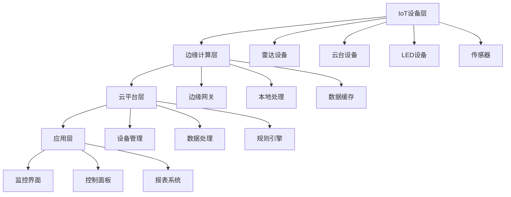

# 7. IoT设备集成

## 7.1 IoT设备集成概述

### 7.1.1 IoT架构设计

葛洲坝船闸导航系统的IoT设备集成采用现代化的边缘计算架构，实现设备管理、数据采集、实时处理和安全控制：



### 7.1.2 设备集成目标

**核心目标：**

- **统一管理**：所有IoT设备的统一管理和监控
- **实时通信**：低延迟的设备数据采集和控制
- **协议适配**：支持多种设备通信协议
- **边缘计算**：本地数据处理和决策
- **安全可靠**：设备安全和通信安全

## 7.2 设备管理平台

### 7.2.1 设备注册和管理

```go
// 设备管理服务
type DeviceManagementService struct {
    deviceRepo     DeviceRepository
    protocolAdapter ProtocolAdapter
    edgeManager    EdgeManager
    securityManager SecurityManager
    logger         *zap.Logger
    tracer         trace.Tracer
    metrics        *MetricsCollector
}

func NewDeviceManagementService(deps Dependencies) *DeviceManagementService {
    return &DeviceManagementService{
        deviceRepo:      deps.DeviceRepository,
        protocolAdapter: deps.ProtocolAdapter,
        edgeManager:     deps.EdgeManager,
        securityManager: deps.SecurityManager,
        logger:          deps.Logger,
        tracer:          deps.Tracer,
        metrics:         deps.Metrics,
    }
}

// 设备注册
func (dms *DeviceManagementService) RegisterDevice(ctx context.Context, request *DeviceRegistrationRequest) (*Device, error) {
    ctx, span := dms.tracer.Start(ctx, "register_device")
    defer span.End()
    
    span.SetAttributes(
        attribute.String("device.type", request.Type),
        attribute.String("device.protocol", request.Protocol),
    )
    
    // 1. 验证设备信息
    if err := dms.validateDeviceInfo(request); err != nil {
        dms.metrics.RecordDeviceRegistrationFailure(ctx, "validation_error")
        return nil, fmt.Errorf("device validation failed: %w", err)
    }
    
    // 2. 生成设备ID和密钥
    deviceID := dms.generateDeviceID(request.Type, request.SerialNumber)
    deviceKey := dms.securityManager.GenerateDeviceKey()
    
    // 3. 创建设备记录
    device := &Device{
        ID:           deviceID,
        Name:         request.Name,
        Type:         request.Type,
        Protocol:     request.Protocol,
        SerialNumber: request.SerialNumber,
        IPAddress:    request.IPAddress,
        Port:         request.Port,
        Status:       DeviceStatusInactive,
        Metadata:     request.Metadata,
        CreatedAt:    time.Now(),
        UpdatedAt:    time.Now(),
    }
    
    // 4. 保存设备信息
    if err := dms.deviceRepo.Save(ctx, device); err != nil {
        dms.metrics.RecordDeviceRegistrationFailure(ctx, "database_error")
        return nil, fmt.Errorf("failed to save device: %w", err)
    }
    
    // 5. 配置设备通信
    if err := dms.protocolAdapter.ConfigureDevice(ctx, device); err != nil {
        dms.logger.Warn("设备通信配置失败",
            zap.Error(err),
            zap.String("device_id", device.ID),
        )
    }
    
    // 6. 注册到边缘管理器
    if err := dms.edgeManager.RegisterDevice(ctx, device); err != nil {
        dms.logger.Warn("边缘设备注册失败",
            zap.Error(err),
            zap.String("device_id", device.ID),
        )
    }
    
    dms.metrics.RecordDeviceRegistrationSuccess(ctx, device.Type)
    
    dms.logger.Info("设备注册成功",
        zap.String("device_id", device.ID),
        zap.String("device_type", device.Type),
        zap.String("protocol", device.Protocol),
    )
    
    return device, nil
}

// 设备状态管理
func (dms *DeviceManagementService) UpdateDeviceStatus(ctx context.Context, deviceID string, status DeviceStatus) error {
    ctx, span := dms.tracer.Start(ctx, "update_device_status")
    defer span.End()
    
    span.SetAttributes(
        attribute.String("device.id", deviceID),
        attribute.String("status", string(status)),
    )
    
    // 更新设备状态
    if err := dms.deviceRepo.UpdateStatus(ctx, deviceID, status); err != nil {
        dms.metrics.RecordDeviceStatusUpdateFailure(ctx, deviceID)
        return fmt.Errorf("failed to update device status: %w", err)
    }
    
    // 通知边缘管理器
    if err := dms.edgeManager.UpdateDeviceStatus(ctx, deviceID, status); err != nil {
        dms.logger.Warn("边缘设备状态更新失败",
            zap.Error(err),
            zap.String("device_id", deviceID),
        )
    }
    
    dms.metrics.RecordDeviceStatusUpdateSuccess(ctx, deviceID)
    
    return nil
}

// 设备健康检查
func (dms *DeviceManagementService) HealthCheck(ctx context.Context, deviceID string) (*DeviceHealthStatus, error) {
    ctx, span := dms.tracer.Start(ctx, "device_health_check")
    defer span.End()
    
    span.SetAttributes(attribute.String("device.id", deviceID))
    
    // 获取设备信息
    device, err := dms.deviceRepo.GetByID(ctx, deviceID)
    if err != nil {
        return nil, fmt.Errorf("device not found: %w", err)
    }
    
    // 执行健康检查
    healthStatus := &DeviceHealthStatus{
        DeviceID:   deviceID,
        Timestamp:  time.Now(),
        IsOnline:   false,
        LastSeen:   time.Time{},
        ErrorCount: 0,
    }
    
    // 检查设备连接性
    if err := dms.protocolAdapter.PingDevice(ctx, device); err != nil {
        healthStatus.IsOnline = false
        healthStatus.LastError = err.Error()
        healthStatus.ErrorCount++
    } else {
        healthStatus.IsOnline = true
        healthStatus.LastSeen = time.Now()
    }
    
    // 检查设备资源使用情况
    if resourceUsage, err := dms.protocolAdapter.GetDeviceResources(ctx, device); err == nil {
        healthStatus.CPUUsage = resourceUsage.CPUUsage
        healthStatus.MemoryUsage = resourceUsage.MemoryUsage
        healthStatus.DiskUsage = resourceUsage.DiskUsage
        healthStatus.Temperature = resourceUsage.Temperature
    }
    
    // 更新健康状态
    if err := dms.deviceRepo.UpdateHealthStatus(ctx, deviceID, healthStatus); err != nil {
        dms.logger.Warn("更新设备健康状态失败",
            zap.Error(err),
            zap.String("device_id", deviceID),
        )
    }
    
    dms.metrics.RecordDeviceHealthCheck(ctx, deviceID, healthStatus.IsOnline)
    
    return healthStatus, nil
}
```

### 7.2.2 设备配置管理

```go
// 设备配置管理器
type DeviceConfigManager struct {
    configRepo    ConfigRepository
    deviceRepo    DeviceRepository
    logger        *zap.Logger
    tracer        trace.Tracer
    metrics       *MetricsCollector
}

func NewDeviceConfigManager(deps Dependencies) *DeviceConfigManager {
    return &DeviceConfigManager{
        configRepo: deps.ConfigRepository,
        deviceRepo: deps.DeviceRepository,
        logger:     deps.Logger,
        tracer:     deps.Tracer,
        metrics:    deps.Metrics,
    }
}

// 更新设备配置
func (dcm *DeviceConfigManager) UpdateDeviceConfig(ctx context.Context, deviceID string, config *DeviceConfig) error {
    ctx, span := dcm.tracer.Start(ctx, "update_device_config")
    defer span.End()
    
    span.SetAttributes(attribute.String("device.id", deviceID))
    
    // 验证配置
    if err := dcm.validateConfig(config); err != nil {
        dcm.metrics.RecordConfigUpdateFailure(ctx, "validation_error")
        return fmt.Errorf("config validation failed: %w", err)
    }
    
    // 获取设备信息
    device, err := dcm.deviceRepo.GetByID(ctx, deviceID)
    if err != nil {
        return fmt.Errorf("device not found: %w", err)
    }
    
    // 保存配置
    config.DeviceID = deviceID
    config.UpdatedAt = time.Now()
    
    if err := dcm.configRepo.Save(ctx, config); err != nil {
        dcm.metrics.RecordConfigUpdateFailure(ctx, "database_error")
        return fmt.Errorf("failed to save config: %w", err)
    }
    
    // 应用配置到设备
    if err := dcm.applyConfigToDevice(ctx, device, config); err != nil {
        dcm.logger.Warn("设备配置应用失败",
            zap.Error(err),
            zap.String("device_id", deviceID),
        )
    }
    
    dcm.metrics.RecordConfigUpdateSuccess(ctx, deviceID)
    
    dcm.logger.Info("设备配置更新成功",
        zap.String("device_id", deviceID),
        zap.String("config_type", config.Type),
    )
    
    return nil
}

// 批量配置更新
func (dcm *DeviceConfigManager) BatchUpdateConfig(ctx context.Context, deviceIDs []string, config *DeviceConfig) error {
    ctx, span := dcm.tracer.Start(ctx, "batch_update_config")
    defer span.End()
    
    span.SetAttributes(attribute.Int("device.count", len(deviceIDs)))
    
    var errors []error
    
    for _, deviceID := range deviceIDs {
        if err := dcm.UpdateDeviceConfig(ctx, deviceID, config); err != nil {
            errors = append(errors, fmt.Errorf("device %s: %w", deviceID, err))
        }
    }
    
    if len(errors) > 0 {
        dcm.metrics.RecordBatchConfigUpdateFailure(ctx, len(errors))
        return fmt.Errorf("batch update failed: %v", errors)
    }
    
    dcm.metrics.RecordBatchConfigUpdateSuccess(ctx, len(deviceIDs))
    
    return nil
}

// 配置模板管理
func (dcm *DeviceConfigManager) CreateConfigTemplate(ctx context.Context, template *ConfigTemplate) error {
    ctx, span := dcm.tracer.Start(ctx, "create_config_template")
    defer span.End()
    
    span.SetAttributes(attribute.String("template.name", template.Name))
    
    template.CreatedAt = time.Now()
    template.UpdatedAt = time.Now()
    
    if err := dcm.configRepo.SaveTemplate(ctx, template); err != nil {
        return fmt.Errorf("failed to save template: %w", err)
    }
    
    dcm.logger.Info("配置模板创建成功",
        zap.String("template_name", template.Name),
        zap.String("device_type", template.DeviceType),
    )
    
    return nil
}

// 应用配置模板
func (dcm *DeviceConfigManager) ApplyConfigTemplate(ctx context.Context, deviceID string, templateName string) error {
    ctx, span := dcm.tracer.Start(ctx, "apply_config_template")
    defer span.End()
    
    span.SetAttributes(
        attribute.String("device.id", deviceID),
        attribute.String("template.name", templateName),
    )
    
    // 获取配置模板
    template, err := dcm.configRepo.GetTemplate(ctx, templateName)
    if err != nil {
        return fmt.Errorf("template not found: %w", err)
    }
    
    // 创建设备配置
    config := &DeviceConfig{
        DeviceID:  deviceID,
        Type:      template.Type,
        Settings:  template.Settings,
        CreatedAt: time.Now(),
        UpdatedAt: time.Now(),
    }
    
    // 应用配置
    return dcm.UpdateDeviceConfig(ctx, deviceID, config)
}
```

## 7.3 协议适配器

### 7.3.1 多协议支持

```go
// 协议适配器接口
type ProtocolAdapter interface {
    // 设备通信
    Connect(ctx context.Context, device *Device) error
    Disconnect(ctx context.Context, device *Device) error
    PingDevice(ctx context.Context, device *Device) error
    
    // 数据读写
    ReadData(ctx context.Context, device *Device, command string) ([]byte, error)
    WriteData(ctx context.Context, device *Device, command string, data []byte) error
    
    // 设备控制
    SendCommand(ctx context.Context, device *Device, command *DeviceCommand) error
    GetDeviceResources(ctx context.Context, device *Device) (*ResourceUsage, error)
    
    // 配置管理
    ConfigureDevice(ctx context.Context, device *Device) error
    UpdateDeviceConfig(ctx context.Context, device *Device, config *DeviceConfig) error
}

// 协议适配器管理器
type ProtocolAdapterManager struct {
    adapters map[string]ProtocolAdapter
    logger   *zap.Logger
    tracer   trace.Tracer
    metrics  *MetricsCollector
}

func NewProtocolAdapterManager(deps Dependencies) *ProtocolAdapterManager {
    return &ProtocolAdapterManager{
        adapters: make(map[string]ProtocolAdapter),
        logger:   deps.Logger,
        tracer:   deps.Tracer,
        metrics:  deps.Metrics,
    }
}

// 注册协议适配器
func (pam *ProtocolAdapterManager) RegisterAdapter(protocol string, adapter ProtocolAdapter) {
    pam.adapters[protocol] = adapter
    pam.logger.Info("协议适配器注册成功",
        zap.String("protocol", protocol),
    )
}

// 获取协议适配器
func (pam *ProtocolAdapterManager) GetAdapter(protocol string) (ProtocolAdapter, error) {
    adapter, exists := pam.adapters[protocol]
    if !exists {
        return nil, fmt.Errorf("protocol adapter not found: %s", protocol)
    }
    return adapter, nil
}

// Modbus协议适配器
type ModbusAdapter struct {
    logger  *zap.Logger
    tracer  trace.Tracer
    metrics *MetricsCollector
}

func NewModbusAdapter(deps Dependencies) *ModbusAdapter {
    return &ModbusAdapter{
        logger:  deps.Logger,
        tracer:  deps.Tracer,
        metrics: deps.Metrics,
    }
}

func (ma *ModbusAdapter) Connect(ctx context.Context, device *Device) error {
    ctx, span := ma.tracer.Start(ctx, "modbus_connect")
    defer span.End()
    
    span.SetAttributes(
        attribute.String("device.id", device.ID),
        attribute.String("device.ip", device.IPAddress),
        attribute.Int("device.port", device.Port),
    )
    
    // 创建Modbus客户端连接
    client := modbus.NewTCPClient(device.IPAddress + ":" + strconv.Itoa(device.Port))
    
    if err := client.Connect(); err != nil {
        ma.metrics.RecordModbusConnectionFailure(ctx, device.ID)
        return fmt.Errorf("failed to connect to modbus device: %w", err)
    }
    
    ma.metrics.RecordModbusConnectionSuccess(ctx, device.ID)
    
    return nil
}

func (ma *ModbusAdapter) ReadData(ctx context.Context, device *Device, command string) ([]byte, error) {
    ctx, span := ma.tracer.Start(ctx, "modbus_read_data")
    defer span.End()
    
    span.SetAttributes(
        attribute.String("device.id", device.ID),
        attribute.String("command", command),
    )
    
    // 解析Modbus命令
    address, quantity, err := ma.parseModbusCommand(command)
    if err != nil {
        return nil, fmt.Errorf("invalid modbus command: %w", err)
    }
    
    // 读取保持寄存器
    client := modbus.NewTCPClient(device.IPAddress + ":" + strconv.Itoa(device.Port))
    if err := client.Connect(); err != nil {
        return nil, fmt.Errorf("failed to connect: %w", err)
    }
    defer client.Close()
    
    data, err := client.ReadHoldingRegisters(address, quantity)
    if err != nil {
        ma.metrics.RecordModbusReadFailure(ctx, device.ID)
        return nil, fmt.Errorf("failed to read registers: %w", err)
    }
    
    ma.metrics.RecordModbusReadSuccess(ctx, device.ID)
    
    return data, nil
}

func (ma *ModbusAdapter) SendCommand(ctx context.Context, device *Device, command *DeviceCommand) error {
    ctx, span := ma.tracer.Start(ctx, "modbus_send_command")
    defer span.End()
    
    span.SetAttributes(
        attribute.String("device.id", device.ID),
        attribute.String("command.type", command.Type),
    )
    
    // 创建Modbus客户端
    client := modbus.NewTCPClient(device.IPAddress + ":" + strconv.Itoa(device.Port))
    if err := client.Connect(); err != nil {
        return fmt.Errorf("failed to connect: %w", err)
    }
    defer client.Close()
    
    // 根据命令类型执行操作
    switch command.Type {
    case "write_register":
        address := command.Parameters["address"].(int)
        value := command.Parameters["value"].(int)
        _, err := client.WriteSingleRegister(address, uint16(value))
        if err != nil {
            ma.metrics.RecordModbusWriteFailure(ctx, device.ID)
            return fmt.Errorf("failed to write register: %w", err)
        }
    case "write_coil":
        address := command.Parameters["address"].(int)
        value := command.Parameters["value"].(bool)
        _, err := client.WriteSingleCoil(address, value)
        if err != nil {
            ma.metrics.RecordModbusWriteFailure(ctx, device.ID)
            return fmt.Errorf("failed to write coil: %w", err)
        }
    default:
        return fmt.Errorf("unsupported command type: %s", command.Type)
    }
    
    ma.metrics.RecordModbusWriteSuccess(ctx, device.ID)
    
    return nil
}

// MQTT协议适配器
type MQTTAdapter struct {
    client  mqtt.Client
    logger  *zap.Logger
    tracer  trace.Tracer
    metrics *MetricsCollector
}

func NewMQTTAdapter(deps Dependencies) *MQTTAdapter {
    return &MQTTAdapter{
        logger:  deps.Logger,
        tracer:  deps.Tracer,
        metrics: deps.Metrics,
    }
}

func (mqa *MQTTAdapter) Connect(ctx context.Context, device *Device) error {
    ctx, span := mqa.tracer.Start(ctx, "mqtt_connect")
    defer span.End()
    
    span.SetAttributes(
        attribute.String("device.id", device.ID),
        attribute.String("device.ip", device.IPAddress),
        attribute.Int("device.port", device.Port),
    )
    
    // 创建MQTT客户端配置
    opts := mqtt.NewClientOptions()
    opts.AddBroker(fmt.Sprintf("tcp://%s:%d", device.IPAddress, device.Port))
    opts.SetClientID(fmt.Sprintf("navlock-%s", device.ID))
    opts.SetUsername(device.Metadata["username"])
    opts.SetPassword(device.Metadata["password"])
    opts.SetAutoReconnect(true)
    opts.SetConnectRetry(true)
    
    // 创建客户端
    mqa.client = mqtt.NewClient(opts)
    
    // 连接
    if token := mqa.client.Connect(); token.Wait() && token.Error() != nil {
        mqa.metrics.RecordMQTTConnectionFailure(ctx, device.ID)
        return fmt.Errorf("failed to connect to MQTT broker: %w", token.Error())
    }
    
    mqa.metrics.RecordMQTTConnectionSuccess(ctx, device.ID)
    
    return nil
}

func (mqa *MQTTAdapter) ReadData(ctx context.Context, device *Device, command string) ([]byte, error) {
    ctx, span := mqa.tracer.Start(ctx, "mqtt_read_data")
    defer span.End()
    
    span.SetAttributes(
        attribute.String("device.id", device.ID),
        attribute.String("command", command),
    )
    
    // 订阅主题
    topic := fmt.Sprintf("device/%s/%s", device.ID, command)
    
    var result []byte
    var err error
    
    token := mqa.client.Subscribe(topic, 0, func(client mqtt.Client, msg mqtt.Message) {
        result = msg.Payload()
    })
    
    if token.Wait() && token.Error() != nil {
        mqa.metrics.RecordMQTTReadFailure(ctx, device.ID)
        return nil, fmt.Errorf("failed to subscribe: %w", token.Error())
    }
    
    // 等待数据
    select {
    case <-time.After(5 * time.Second):
        mqa.metrics.RecordMQTTReadTimeout(ctx, device.ID)
        return nil, fmt.Errorf("read timeout")
    case <-ctx.Done():
        return nil, ctx.Err()
    }
    
    mqa.metrics.RecordMQTTReadSuccess(ctx, device.ID)
    
    return result, nil
}

func (mqa *MQTTAdapter) SendCommand(ctx context.Context, device *Device, command *DeviceCommand) error {
    ctx, span := mqa.tracer.Start(ctx, "mqtt_send_command")
    defer span.End()
    
    span.SetAttributes(
        attribute.String("device.id", device.ID),
        attribute.String("command.type", command.Type),
    )
    
    // 发布命令
    topic := fmt.Sprintf("device/%s/command", device.ID)
    payload, err := json.Marshal(command)
    if err != nil {
        return fmt.Errorf("failed to marshal command: %w", err)
    }
    
    token := mqa.client.Publish(topic, 0, false, payload)
    if token.Wait() && token.Error() != nil {
        mqa.metrics.RecordMQTTWriteFailure(ctx, device.ID)
        return fmt.Errorf("failed to publish command: %w", token.Error())
    }
    
    mqa.metrics.RecordMQTTWriteSuccess(ctx, device.ID)
    
    return nil
}
```

## 7.4 边缘计算

### 7.4.1 边缘管理器

```go
// 边缘管理器
type EdgeManager struct {
    deviceRepo     DeviceRepository
    dataProcessor  DataProcessor
    ruleEngine     RuleEngine
    cacheManager   CacheManager
    logger         *zap.Logger
    tracer         trace.Tracer
    metrics        *MetricsCollector
}

func NewEdgeManager(deps Dependencies) *EdgeManager {
    return &EdgeManager{
        deviceRepo:    deps.DeviceRepository,
        dataProcessor: deps.DataProcessor,
        ruleEngine:    deps.RuleEngine,
        cacheManager:  deps.CacheManager,
        logger:        deps.Logger,
        tracer:        deps.Tracer,
        metrics:       deps.Metrics,
    }
}

// 注册边缘设备
func (em *EdgeManager) RegisterDevice(ctx context.Context, device *Device) error {
    ctx, span := em.tracer.Start(ctx, "register_edge_device")
    defer span.End()
    
    span.SetAttributes(attribute.String("device.id", device.ID))
    
    // 初始化设备缓存
    if err := em.cacheManager.InitializeDeviceCache(ctx, device.ID); err != nil {
        em.logger.Warn("设备缓存初始化失败",
            zap.Error(err),
            zap.String("device_id", device.ID),
        )
    }
    
    // 启动设备数据采集
    go em.startDataCollection(ctx, device)
    
    em.logger.Info("边缘设备注册成功",
        zap.String("device_id", device.ID),
        zap.String("device_type", device.Type),
    )
    
    return nil
}

// 启动数据采集
func (em *EdgeManager) startDataCollection(ctx context.Context, device *Device) {
    ticker := time.NewTicker(1 * time.Second) // 1秒采集一次
    defer ticker.Stop()
    
    for {
        select {
        case <-ctx.Done():
            return
        case <-ticker.C:
            if err := em.collectDeviceData(ctx, device); err != nil {
                em.logger.Error("设备数据采集失败",
                    zap.Error(err),
                    zap.String("device_id", device.ID),
                )
            }
        }
    }
}

// 采集设备数据
func (em *EdgeManager) collectDeviceData(ctx context.Context, device *Device) error {
    ctx, span := em.tracer.Start(ctx, "collect_device_data")
    defer span.End()
    
    span.SetAttributes(attribute.String("device.id", device.ID))
    
    // 根据设备类型采集数据
    var data interface{}
    var err error
    
    switch device.Type {
    case "radar":
        data, err = em.collectRadarData(ctx, device)
    case "ptz":
        data, err = em.collectPTZData(ctx, device)
    case "led":
        data, err = em.collectLEDData(ctx, device)
    default:
        return fmt.Errorf("unsupported device type: %s", device.Type)
    }
    
    if err != nil {
        em.metrics.RecordDataCollectionFailure(ctx, device.ID, device.Type)
        return err
    }
    
    // 本地数据处理
    processedData, err := em.dataProcessor.ProcessData(ctx, data)
    if err != nil {
        em.logger.Warn("本地数据处理失败",
            zap.Error(err),
            zap.String("device_id", device.ID),
        )
    }
    
    // 缓存数据
    if err := em.cacheManager.CacheDeviceData(ctx, device.ID, processedData); err != nil {
        em.logger.Warn("设备数据缓存失败",
            zap.Error(err),
            zap.String("device_id", device.ID),
        )
    }
    
    // 执行边缘规则
    if err := em.executeEdgeRules(ctx, device, processedData); err != nil {
        em.logger.Warn("边缘规则执行失败",
            zap.Error(err),
            zap.String("device_id", device.ID),
        )
    }
    
    em.metrics.RecordDataCollectionSuccess(ctx, device.ID, device.Type)
    
    return nil
}

// 采集雷达数据
func (em *EdgeManager) collectRadarData(ctx context.Context, device *Device) (*RadarData, error) {
    // 模拟雷达数据采集
    radarData := &RadarData{
        DeviceID:  device.ID,
        Timestamp: time.Now(),
        Targets: []RadarTarget{
            {
                ID:       "target-001",
                Distance: 150.5,
                Angle:    45.2,
                Speed:    12.3,
                RCS:      2.5,
            },
            {
                ID:       "target-002",
                Distance: 320.8,
                Angle:    120.7,
                Speed:    8.9,
                RCS:      1.8,
            },
        },
        Status: "normal",
    }
    
    return radarData, nil
}

// 采集云台数据
func (em *EdgeManager) collectPTZData(ctx context.Context, device *Device) (*PTZData, error) {
    // 模拟云台数据采集
    ptzData := &PTZData{
        DeviceID:  device.ID,
        Timestamp: time.Now(),
        Pan:       180.5,
        Tilt:      45.2,
        Zoom:      2.5,
        Status:    "idle",
    }
    
    return ptzData, nil
}

// 执行边缘规则
func (em *EdgeManager) executeEdgeRules(ctx context.Context, device *Device, data interface{}) error {
    ctx, span := em.tracer.Start(ctx, "execute_edge_rules")
    defer span.End()
    
    span.SetAttributes(attribute.String("device.id", device.ID))
    
    // 获取设备规则
    rules, err := em.ruleEngine.GetDeviceRules(ctx, device.ID)
    if err != nil {
        return fmt.Errorf("failed to get device rules: %w", err)
    }
    
    // 执行规则
    for _, rule := range rules {
        if matched, err := em.ruleEngine.EvaluateRule(ctx, rule, data); err != nil {
            em.logger.Warn("规则评估失败",
                zap.Error(err),
                zap.String("rule_id", rule.ID),
                zap.String("device_id", device.ID),
            )
        } else if matched {
            // 执行规则动作
            if err := em.executeRuleAction(ctx, rule, device, data); err != nil {
                em.logger.Error("规则动作执行失败",
                    zap.Error(err),
                    zap.String("rule_id", rule.ID),
                    zap.String("device_id", device.ID),
                )
            }
        }
    }
    
    return nil
}

// 执行规则动作
func (em *EdgeManager) executeRuleAction(ctx context.Context, rule *Rule, device *Device, data interface{}) error {
    ctx, span := em.tracer.Start(ctx, "execute_rule_action")
    defer span.End()
    
    span.SetAttributes(
        attribute.String("rule.id", rule.ID),
        attribute.String("device.id", device.ID),
    )
    
    for _, action := range rule.Actions {
        switch action.Type {
        case "send_alert":
            // 发送告警
            em.sendAlert(ctx, device, action.Parameters)
        case "control_device":
            // 控制设备
            em.controlDevice(ctx, device, action.Parameters)
        case "update_status":
            // 更新状态
            em.updateDeviceStatus(ctx, device, action.Parameters)
        default:
            em.logger.Warn("未知的规则动作类型",
                zap.String("action_type", action.Type),
                zap.String("rule_id", rule.ID),
            )
        }
    }
    
    return nil
}
```

### 7.4.2 本地数据处理

```go
// 本地数据处理器
type LocalDataProcessor struct {
    filterChain   FilterChain
    aggregator    DataAggregator
    transformer   DataTransformer
    logger        *zap.Logger
    tracer        trace.Tracer
    metrics       *MetricsCollector
}

func NewLocalDataProcessor(deps Dependencies) *LocalDataProcessor {
    return &LocalDataProcessor{
        filterChain: deps.FilterChain,
        aggregator:  deps.DataAggregator,
        transformer: deps.DataTransformer,
        logger:      deps.Logger,
        tracer:      deps.Tracer,
        metrics:     deps.Metrics,
    }
}

// 处理设备数据
func (ldp *LocalDataProcessor) ProcessData(ctx context.Context, data interface{}) (interface{}, error) {
    ctx, span := ldp.tracer.Start(ctx, "process_local_data")
    defer span.End()
    
    // 1. 数据过滤
    filteredData, err := ldp.filterChain.Filter(ctx, data)
    if err != nil {
        ldp.metrics.RecordDataProcessingFailure(ctx, "filter_error")
        return nil, fmt.Errorf("data filtering failed: %w", err)
    }
    
    // 2. 数据聚合
    aggregatedData, err := ldp.aggregator.Aggregate(ctx, filteredData)
    if err != nil {
        ldp.metrics.RecordDataProcessingFailure(ctx, "aggregation_error")
        return nil, fmt.Errorf("data aggregation failed: %w", err)
    }
    
    // 3. 数据转换
    transformedData, err := ldp.transformer.Transform(ctx, aggregatedData)
    if err != nil {
        ldp.metrics.RecordDataProcessingFailure(ctx, "transformation_error")
        return nil, fmt.Errorf("data transformation failed: %w", err)
    }
    
    ldp.metrics.RecordDataProcessingSuccess(ctx)
    
    return transformedData, nil
}

// 数据过滤器
type DataFilter struct {
    conditions []FilterCondition
    logger     *zap.Logger
}

func (df *DataFilter) Filter(ctx context.Context, data interface{}) (interface{}, error) {
    // 应用过滤条件
    for _, condition := range df.conditions {
        if !condition.Evaluate(data) {
            return nil, fmt.Errorf("data filtered out by condition: %s", condition.Description)
        }
    }
    
    return data, nil
}

// 数据聚合器
type DataAggregator struct {
    windowSize time.Duration
    logger     *zap.Logger
}

func (da *DataAggregator) Aggregate(ctx context.Context, data interface{}) (interface{}, error) {
    // 时间窗口聚合
    // 这里可以实现滑动窗口、固定窗口等聚合算法
    
    return data, nil
}

// 数据转换器
type DataTransformer struct {
    transformers map[string]TransformFunction
    logger       *zap.Logger
}

func (dt *DataTransformer) Transform(ctx context.Context, data interface{}) (interface{}, error) {
    // 根据数据类型应用相应的转换函数
    
    return data, nil
}
```

## 7.5 设备安全

### 7.5.1 设备认证

```go
// 设备认证服务
type DeviceAuthService struct {
    certManager   CertificateManager
    keyManager    KeyManager
    deviceRepo    DeviceRepository
    logger        *zap.Logger
    tracer        trace.Tracer
    metrics       *MetricsCollector
}

func NewDeviceAuthService(deps Dependencies) *DeviceAuthService {
    return &DeviceAuthService{
        certManager: deps.CertificateManager,
        keyManager:  deps.KeyManager,
        deviceRepo:  deps.DeviceRepository,
        logger:      deps.Logger,
        tracer:      deps.Tracer,
        metrics:     deps.Metrics,
    }
}

// 设备认证
func (das *DeviceAuthService) AuthenticateDevice(ctx context.Context, deviceID string, credentials *DeviceCredentials) (*AuthResult, error) {
    ctx, span := das.tracer.Start(ctx, "authenticate_device")
    defer span.End()
    
    span.SetAttributes(attribute.String("device.id", deviceID))
    
    // 1. 验证设备证书
    if err := das.certManager.ValidateDeviceCertificate(ctx, credentials.Certificate); err != nil {
        das.metrics.RecordDeviceAuthFailure(ctx, "invalid_certificate")
        return nil, fmt.Errorf("invalid device certificate: %w", err)
    }
    
    // 2. 验证设备密钥
    if err := das.keyManager.ValidateDeviceKey(ctx, deviceID, credentials.Key); err != nil {
        das.metrics.RecordDeviceAuthFailure(ctx, "invalid_key")
        return nil, fmt.Errorf("invalid device key: %w", err)
    }
    
    // 3. 检查设备状态
    device, err := das.deviceRepo.GetByID(ctx, deviceID)
    if err != nil {
        das.metrics.RecordDeviceAuthFailure(ctx, "device_not_found")
        return nil, fmt.Errorf("device not found: %w", err)
    }
    
    if device.Status != DeviceStatusActive {
        das.metrics.RecordDeviceAuthFailure(ctx, "device_inactive")
        return nil, fmt.Errorf("device is not active")
    }
    
    // 4. 生成设备Token
    token, err := das.generateDeviceToken(ctx, device)
    if err != nil {
        return nil, fmt.Errorf("failed to generate device token: %w", err)
    }
    
    das.metrics.RecordDeviceAuthSuccess(ctx, deviceID)
    
    return &AuthResult{
        Token:     token,
        Device:    device,
        ExpiresAt: time.Now().Add(24 * time.Hour),
    }, nil
}

// 生成设备Token
func (das *DeviceAuthService) generateDeviceToken(ctx context.Context, device *Device) (string, error) {
    claims := &DeviceClaims{
        DeviceID:   device.ID,
        DeviceType: device.Type,
        StandardClaims: jwt.StandardClaims{
            ExpiresAt: time.Now().Add(24 * time.Hour).Unix(),
            IssuedAt:  time.Now().Unix(),
            Issuer:    "navlock-system",
            Subject:   device.ID,
        },
    }
    
    token := jwt.NewWithClaims(jwt.SigningMethodHS256, claims)
    return token.SignedString(das.keyManager.GetSigningKey())
}
```

### 7.5.2 通信加密

```go
// 通信加密服务
type CommunicationEncryptionService struct {
    keyManager KeyManager
    logger     *zap.Logger
    tracer     trace.Tracer
    metrics    *MetricsCollector
}

func NewCommunicationEncryptionService(deps Dependencies) *CommunicationEncryptionService {
    return &CommunicationEncryptionService{
        keyManager: deps.KeyManager,
        logger:     deps.Logger,
        tracer:     deps.Tracer,
        metrics:    deps.Metrics,
    }
}

// 加密设备通信
func (ces *CommunicationEncryptionService) EncryptCommunication(ctx context.Context, deviceID string, data []byte) ([]byte, error) {
    ctx, span := ces.tracer.Start(ctx, "encrypt_communication")
    defer span.End()
    
    span.SetAttributes(
        attribute.String("device.id", deviceID),
        attribute.Int("data.size", len(data)),
    )
    
    // 获取设备加密密钥
    key, err := ces.keyManager.GetDeviceEncryptionKey(ctx, deviceID)
    if err != nil {
        return nil, fmt.Errorf("failed to get encryption key: %w", err)
    }
    
    // 使用AES-GCM加密
    block, err := aes.NewCipher(key)
    if err != nil {
        return nil, fmt.Errorf("failed to create cipher: %w", err)
    }
    
    gcm, err := cipher.NewGCM(block)
    if err != nil {
        return nil, fmt.Errorf("failed to create GCM: %w", err)
    }
    
    nonce := make([]byte, gcm.NonceSize())
    if _, err := rand.Read(nonce); err != nil {
        return nil, fmt.Errorf("failed to generate nonce: %w", err)
    }
    
    ciphertext := gcm.Seal(nonce, nonce, data, nil)
    
    ces.metrics.RecordCommunicationEncrypted(ctx, deviceID, len(data))
    
    return ciphertext, nil
}

// 解密设备通信
func (ces *CommunicationEncryptionService) DecryptCommunication(ctx context.Context, deviceID string, ciphertext []byte) ([]byte, error) {
    ctx, span := ces.tracer.Start(ctx, "decrypt_communication")
    defer span.End()
    
    span.SetAttributes(
        attribute.String("device.id", deviceID),
        attribute.Int("ciphertext.size", len(ciphertext)),
    )
    
    // 获取设备加密密钥
    key, err := ces.keyManager.GetDeviceEncryptionKey(ctx, deviceID)
    if err != nil {
        return nil, fmt.Errorf("failed to get encryption key: %w", err)
    }
    
    // 使用AES-GCM解密
    block, err := aes.NewCipher(key)
    if err != nil {
        return nil, fmt.Errorf("failed to create cipher: %w", err)
    }
    
    gcm, err := cipher.NewGCM(block)
    if err != nil {
        return nil, fmt.Errorf("failed to create GCM: %w", err)
    }
    
    nonceSize := gcm.NonceSize()
    if len(ciphertext) < nonceSize {
        return nil, fmt.Errorf("ciphertext too short")
    }
    
    nonce, ciphertext := ciphertext[:nonceSize], ciphertext[nonceSize:]
    
    plaintext, err := gcm.Open(nil, nonce, ciphertext, nil)
    if err != nil {
        return nil, fmt.Errorf("failed to decrypt: %w", err)
    }
    
    ces.metrics.RecordCommunicationDecrypted(ctx, deviceID, len(plaintext))
    
    return plaintext, nil
}
```

## 7.6 总结

IoT设备集成为葛洲坝船闸导航系统提供了现代化的设备管理能力。通过设备管理平台、协议适配器、边缘计算、设备安全等技术，系统获得了：

**核心优势：**

1. **统一管理**：所有IoT设备的统一管理和监控
2. **多协议支持**：支持Modbus、MQTT等多种通信协议
3. **边缘计算**：本地数据处理和决策能力
4. **实时通信**：低延迟的设备数据采集和控制
5. **安全可靠**：设备认证和通信加密

**实施建议：**

1. 渐进式集成，先核心设备再扩展
2. 建立完善的设备监控和告警
3. 制定设备安全策略和标准
4. 建立设备维护和更新机制
5. 培训团队掌握IoT技术

这个IoT设备集成为系统的设备管理和数据采集提供了强有力的支撑，是现代化IoT系统的重要组成部分。
