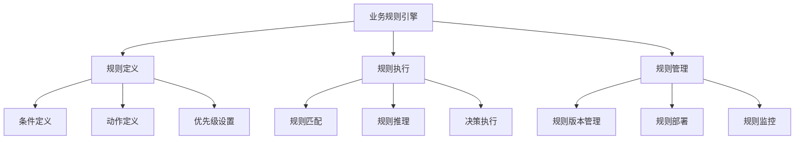

# 8. 业务规则引擎

## 8.1 业务规则引擎概述

### 8.1.1 规则引擎架构

葛洲坝船闸导航系统的业务规则引擎采用现代化的规则引擎架构，支持动态规则配置、复杂规则推理和实时决策：



### 8.1.2 规则引擎目标

**核心目标：**
- **动态配置**：支持规则的动态添加、修改和删除
- **复杂推理**：支持复杂的业务逻辑推理
- **实时决策**：毫秒级的规则执行和决策
- **规则管理**：完整的规则生命周期管理
- **可扩展性**：支持规则引擎的水平扩展

## 8.2 规则引擎设计

### 8.2.1 规则定义

```go
// 规则定义
type Rule struct {
    ID          string                 `json:"id"`
    Name        string                 `json:"name"`
    Description string                 `json:"description"`
    Version     int                    `json:"version"`
    Priority    int                    `json:"priority"`
    Enabled     bool                   `json:"enabled"`
    Conditions  []Condition            `json:"conditions"`
    Actions     []Action               `json:"actions"`
    Metadata    map[string]interface{} `json:"metadata"`
    CreatedAt   time.Time              `json:"created_at"`
    UpdatedAt   time.Time              `json:"updated_at"`
}

// 条件定义
type Condition struct {
    ID       string                 `json:"id"`
    Type     string                 `json:"type"`
    Field    string                 `json:"field"`
    Operator string                 `json:"operator"`
    Value    interface{}            `json:"value"`
    Metadata map[string]interface{} `json:"metadata"`
}

// 动作定义
type Action struct {
    ID       string                 `json:"id"`
    Type     string                 `json:"type"`
    Target   string                 `json:"target"`
    Params   map[string]interface{} `json:"params"`
    Metadata map[string]interface{} `json:"metadata"`
}

// 规则引擎
type RuleEngine struct {
    ruleRepo     RuleRepository
    executor     RuleExecutor
    scheduler    RuleScheduler
    logger       *zap.Logger
    tracer       trace.Tracer
    metrics      *MetricsCollector
}

func NewRuleEngine(deps Dependencies) *RuleEngine {
    return &RuleEngine{
        ruleRepo:  deps.RuleRepository,
        executor:  deps.RuleExecutor,
        scheduler: deps.RuleScheduler,
        logger:    deps.Logger,
        tracer:    deps.Tracer,
        metrics:   deps.Metrics,
    }
}

// 执行规则
func (re *RuleEngine) ExecuteRules(ctx context.Context, context *RuleContext) (*RuleResult, error) {
    ctx, span := re.tracer.Start(ctx, "execute_rules")
    defer span.End()
    
    span.SetAttributes(attribute.String("context.type", context.Type))
    
    // 获取适用的规则
    rules, err := re.ruleRepo.GetRulesByContext(ctx, context.Type)
    if err != nil {
        return nil, fmt.Errorf("failed to get rules: %w", err)
    }
    
    // 按优先级排序
    sort.Slice(rules, func(i, j int) bool {
        return rules[i].Priority > rules[j].Priority
    })
    
    result := &RuleResult{
        ContextID: context.ID,
        Timestamp: time.Now(),
        Decisions: make([]Decision, 0),
    }
    
    // 执行规则
    for _, rule := range rules {
        if !rule.Enabled {
            continue
        }
        
        if matched, err := re.evaluateRule(ctx, rule, context); err != nil {
            re.logger.Warn("规则评估失败",
                zap.Error(err),
                zap.String("rule_id", rule.ID),
            )
        } else if matched {
            // 执行规则动作
            decisions, err := re.executeRuleActions(ctx, rule, context)
            if err != nil {
                re.logger.Error("规则动作执行失败",
                    zap.Error(err),
                    zap.String("rule_id", rule.ID),
                )
            } else {
                result.Decisions = append(result.Decisions, decisions...)
            }
        }
    }
    
    re.metrics.RecordRulesExecuted(ctx, len(rules), len(result.Decisions))
    
    return result, nil
}

// 评估规则
func (re *RuleEngine) evaluateRule(ctx context.Context, rule *Rule, context *RuleContext) (bool, error) {
    ctx, span := re.tracer.Start(ctx, "evaluate_rule")
    defer span.End()
    
    span.SetAttributes(attribute.String("rule.id", rule.ID))
    
    // 评估所有条件
    for _, condition := range rule.Conditions {
        if matched, err := re.evaluateCondition(ctx, condition, context); err != nil {
            return false, fmt.Errorf("condition evaluation failed: %w", err)
        } else if !matched {
            return false, nil
        }
    }
    
    return true, nil
}

// 评估条件
func (re *RuleEngine) evaluateCondition(ctx context.Context, condition *Condition, context *RuleContext) (bool, error) {
    ctx, span := re.tracer.Start(ctx, "evaluate_condition")
    defer span.End()
    
    span.SetAttributes(
        attribute.String("condition.id", condition.ID),
        attribute.String("condition.type", condition.Type),
    )
    
    // 获取上下文值
    contextValue, exists := context.Data[condition.Field]
    if !exists {
        return false, nil
    }
    
    // 根据条件类型评估
    switch condition.Type {
    case "comparison":
        return re.evaluateComparison(ctx, contextValue, condition.Operator, condition.Value)
    case "range":
        return re.evaluateRange(ctx, contextValue, condition.Value)
    case "regex":
        return re.evaluateRegex(ctx, contextValue, condition.Value)
    case "custom":
        return re.evaluateCustom(ctx, condition, context)
    default:
        return false, fmt.Errorf("unsupported condition type: %s", condition.Type)
    }
}

// 执行规则动作
func (re *RuleEngine) executeRuleActions(ctx context.Context, rule *Rule, context *RuleContext) ([]Decision, error) {
    ctx, span := re.tracer.Start(ctx, "execute_rule_actions")
    defer span.End()
    
    span.SetAttributes(attribute.String("rule.id", rule.ID))
    
    var decisions []Decision
    
    for _, action := range rule.Actions {
        decision, err := re.executeAction(ctx, action, context)
        if err != nil {
            re.logger.Error("动作执行失败",
                zap.Error(err),
                zap.String("action_id", action.ID),
                zap.String("rule_id", rule.ID),
            )
        } else {
            decisions = append(decisions, *decision)
        }
    }
    
    return decisions, nil
}
```

## 8.3 动态配置

### 8.3.1 规则配置管理

```go
// 规则配置管理器
type RuleConfigManager struct {
    configRepo ConfigRepository
    ruleRepo   RuleRepository
    logger     *zap.Logger
    tracer     trace.Tracer
    metrics    *MetricsCollector
}

func NewRuleConfigManager(deps Dependencies) *RuleConfigManager {
    return &RuleConfigManager{
        configRepo: deps.ConfigRepository,
        ruleRepo:   deps.RuleRepository,
        logger:     deps.Logger,
        tracer:     deps.Tracer,
        metrics:    deps.Metrics,
    }
}

// 创建规则
func (rcm *RuleConfigManager) CreateRule(ctx context.Context, rule *Rule) error {
    ctx, span := rcm.tracer.Start(ctx, "create_rule")
    defer span.End()
    
    span.SetAttributes(attribute.String("rule.name", rule.Name))
    
    // 验证规则
    if err := rcm.validateRule(rule); err != nil {
        rcm.metrics.RecordRuleCreationFailure(ctx, "validation_error")
        return fmt.Errorf("rule validation failed: %w", err)
    }
    
    // 设置版本和元数据
    rule.Version = 1
    rule.CreatedAt = time.Now()
    rule.UpdatedAt = time.Now()
    
    // 保存规则
    if err := rcm.ruleRepo.Save(ctx, rule); err != nil {
        rcm.metrics.RecordRuleCreationFailure(ctx, "database_error")
        return fmt.Errorf("failed to save rule: %w", err)
    }
    
    rcm.metrics.RecordRuleCreationSuccess(ctx, rule.Type)
    
    rcm.logger.Info("规则创建成功",
        zap.String("rule_id", rule.ID),
        zap.String("rule_name", rule.Name),
    )
    
    return nil
}

// 更新规则
func (rcm *RuleConfigManager) UpdateRule(ctx context.Context, ruleID string, updates *RuleUpdate) error {
    ctx, span := rcm.tracer.Start(ctx, "update_rule")
    defer span.End()
    
    span.SetAttributes(attribute.String("rule.id", ruleID))
    
    // 获取现有规则
    existingRule, err := rcm.ruleRepo.GetByID(ctx, ruleID)
    if err != nil {
        return fmt.Errorf("rule not found: %w", err)
    }
    
    // 应用更新
    if updates.Name != "" {
        existingRule.Name = updates.Name
    }
    if updates.Description != "" {
        existingRule.Description = updates.Description
    }
    if updates.Priority != 0 {
        existingRule.Priority = updates.Priority
    }
    if updates.Conditions != nil {
        existingRule.Conditions = updates.Conditions
    }
    if updates.Actions != nil {
        existingRule.Actions = updates.Actions
    }
    
    existingRule.Version++
    existingRule.UpdatedAt = time.Now()
    
    // 保存更新
    if err := rcm.ruleRepo.Save(ctx, existingRule); err != nil {
        rcm.metrics.RecordRuleUpdateFailure(ctx, "database_error")
        return fmt.Errorf("failed to save rule update: %w", err)
    }
    
    rcm.metrics.RecordRuleUpdateSuccess(ctx, ruleID)
    
    return nil
}

// 启用/禁用规则
func (rcm *RuleConfigManager) ToggleRule(ctx context.Context, ruleID string, enabled bool) error {
    ctx, span := rcm.tracer.Start(ctx, "toggle_rule")
    defer span.End()
    
    span.SetAttributes(
        attribute.String("rule.id", ruleID),
        attribute.Bool("enabled", enabled),
    )
    
    if err := rcm.ruleRepo.UpdateStatus(ctx, ruleID, enabled); err != nil {
        return fmt.Errorf("failed to update rule status: %w", err)
    }
    
    rcm.logger.Info("规则状态更新",
        zap.String("rule_id", ruleID),
        zap.Bool("enabled", enabled),
    )
    
    return nil
}
```

## 8.4 工作流引擎

### 8.4.1 工作流定义

```go
// 工作流定义
type Workflow struct {
    ID          string                 `json:"id"`
    Name        string                 `json:"name"`
    Description string                 `json:"description"`
    Version     int                    `json:"version"`
    Steps       []WorkflowStep         `json:"steps"`
    Transitions []WorkflowTransition   `json:"transitions"`
    Metadata    map[string]interface{} `json:"metadata"`
    CreatedAt   time.Time              `json:"created_at"`
    UpdatedAt   time.Time              `json:"updated_at"`
}

// 工作流步骤
type WorkflowStep struct {
    ID          string                 `json:"id"`
    Name        string                 `json:"name"`
    Type        string                 `json:"type"`
    Action      string                 `json:"action"`
    Params      map[string]interface{} `json:"params"`
    Conditions  []Condition            `json:"conditions"`
    Timeout     time.Duration          `json:"timeout"`
    RetryPolicy *RetryPolicy           `json:"retry_policy"`
    Metadata    map[string]interface{} `json:"metadata"`
}

// 工作流转换
type WorkflowTransition struct {
    ID          string                 `json:"id"`
    FromStep    string                 `json:"from_step"`
    ToStep      string                 `json:"to_step"`
    Conditions  []Condition            `json:"conditions"`
    Priority    int                    `json:"priority"`
    Metadata    map[string]interface{} `json:"metadata"`
}

// 工作流引擎
type WorkflowEngine struct {
    workflowRepo WorkflowRepository
    executor     WorkflowExecutor
    scheduler    WorkflowScheduler
    logger       *zap.Logger
    tracer       trace.Tracer
    metrics      *MetricsCollector
}

func NewWorkflowEngine(deps Dependencies) *WorkflowEngine {
    return &WorkflowEngine{
        workflowRepo: deps.WorkflowRepository,
        executor:     deps.WorkflowExecutor,
        scheduler:    deps.WorkflowScheduler,
        logger:       deps.Logger,
        tracer:       deps.Tracer,
        metrics:      deps.Metrics,
    }
}

// 执行工作流
func (we *WorkflowEngine) ExecuteWorkflow(ctx context.Context, workflowID string, context *WorkflowContext) (*WorkflowResult, error) {
    ctx, span := we.tracer.Start(ctx, "execute_workflow")
    defer span.End()
    
    span.SetAttributes(attribute.String("workflow.id", workflowID))
    
    // 获取工作流定义
    workflow, err := we.workflowRepo.GetByID(ctx, workflowID)
    if err != nil {
        return nil, fmt.Errorf("workflow not found: %w", err)
    }
    
    // 创建工作流实例
    instance := &WorkflowInstance{
        ID:         generateInstanceID(),
        WorkflowID: workflowID,
        Context:    context,
        Status:     WorkflowStatusRunning,
        CurrentStep: workflow.Steps[0].ID,
        StartedAt:  time.Now(),
    }
    
    // 保存实例
    if err := we.workflowRepo.SaveInstance(ctx, instance); err != nil {
        return nil, fmt.Errorf("failed to save workflow instance: %w", err)
    }
    
    // 执行工作流
    result, err := we.executeWorkflowSteps(ctx, workflow, instance)
    if err != nil {
        instance.Status = WorkflowStatusFailed
        instance.Error = err.Error()
        we.workflowRepo.UpdateInstance(ctx, instance)
        return nil, fmt.Errorf("workflow execution failed: %w", err)
    }
    
    instance.Status = WorkflowStatusCompleted
    instance.CompletedAt = time.Now()
    we.workflowRepo.UpdateInstance(ctx, instance)
    
    return result, nil
}

// 执行工作流步骤
func (we *WorkflowEngine) executeWorkflowSteps(ctx context.Context, workflow *Workflow, instance *WorkflowInstance) (*WorkflowResult, error) {
    ctx, span := we.tracer.Start(ctx, "execute_workflow_steps")
    defer span.End()
    
    result := &WorkflowResult{
        InstanceID: instance.ID,
        Steps:      make([]StepResult, 0),
    }
    
    currentStepID := instance.CurrentStep
    
    for {
        // 获取当前步骤
        step := we.getStepByID(workflow, currentStepID)
        if step == nil {
            return nil, fmt.Errorf("step not found: %s", currentStepID)
        }
        
        // 执行步骤
        stepResult, err := we.executeStep(ctx, step, instance.Context)
        if err != nil {
            result.Steps = append(result.Steps, *stepResult)
            return result, err
        }
        
        result.Steps = append(result.Steps, *stepResult)
        
        // 确定下一步
        nextStepID, err := we.determineNextStep(ctx, workflow, currentStepID, stepResult)
        if err != nil {
            return result, err
        }
        
        if nextStepID == "" {
            // 工作流完成
            break
        }
        
        currentStepID = nextStepID
    }
    
    return result, nil
}
```

## 8.5 决策引擎

### 8.5.1 决策树

```go
// 决策树定义
type DecisionTree struct {
    ID          string                 `json:"id"`
    Name        string                 `json:"name"`
    Description string                 `json:"description"`
    RootNode    *DecisionNode          `json:"root_node"`
    Metadata    map[string]interface{} `json:"metadata"`
    CreatedAt   time.Time              `json:"created_at"`
    UpdatedAt   time.Time              `json:"updated_at"`
}

// 决策节点
type DecisionNode struct {
    ID          string                 `json:"id"`
    Type        string                 `json:"type"` // condition, action, leaf
    Condition   *Condition             `json:"condition,omitempty"`
    Action      *Action                `json:"action,omitempty"`
    Children    []*DecisionNode        `json:"children,omitempty"`
    Metadata    map[string]interface{} `json:"metadata"`
}

// 决策引擎
type DecisionEngine struct {
    treeRepo    DecisionTreeRepository
    executor    DecisionExecutor
    logger      *zap.Logger
    tracer      trace.Tracer
    metrics     *MetricsCollector
}

func NewDecisionEngine(deps Dependencies) *DecisionEngine {
    return &DecisionEngine{
        treeRepo: deps.DecisionTreeRepository,
        executor: deps.DecisionExecutor,
        logger:   deps.Logger,
        tracer:   deps.Tracer,
        metrics:  deps.Metrics,
    }
}

// 执行决策
func (de *DecisionEngine) MakeDecision(ctx context.Context, treeID string, context *DecisionContext) (*DecisionResult, error) {
    ctx, span := de.tracer.Start(ctx, "make_decision")
    defer span.End()
    
    span.SetAttributes(attribute.String("tree.id", treeID))
    
    // 获取决策树
    tree, err := de.treeRepo.GetByID(ctx, treeID)
    if err != nil {
        return nil, fmt.Errorf("decision tree not found: %w", err)
    }
    
    // 遍历决策树
    result := &DecisionResult{
        TreeID:    treeID,
        Timestamp: time.Now(),
        Path:      make([]string, 0),
        Actions:   make([]Action, 0),
    }
    
    currentNode := tree.RootNode
    for currentNode != nil {
        result.Path = append(result.Path, currentNode.ID)
        
        switch currentNode.Type {
        case "condition":
            // 评估条件
            if matched, err := de.evaluateCondition(ctx, currentNode.Condition, context); err != nil {
                return nil, fmt.Errorf("condition evaluation failed: %w", err)
            } else if matched {
                currentNode = currentNode.Children[0] // 真分支
            } else {
                currentNode = currentNode.Children[1] // 假分支
            }
            
        case "action":
            // 执行动作
            result.Actions = append(result.Actions, *currentNode.Action)
            currentNode = nil // 动作节点是叶子节点
            
        case "leaf":
            // 叶子节点
            currentNode = nil
        }
    }
    
    de.metrics.RecordDecisionMade(ctx, treeID, len(result.Actions))
    
    return result, nil
}
```

## 8.6 总结

业务规则引擎为葛洲坝船闸导航系统提供了灵活的业务逻辑处理能力。通过规则引擎、工作流引擎、决策引擎等技术，系统获得了：

**核心优势：**
1. **动态配置**：支持规则的动态添加、修改和删除
2. **复杂推理**：支持复杂的业务逻辑推理
3. **实时决策**：毫秒级的规则执行和决策
4. **规则管理**：完整的规则生命周期管理
5. **可扩展性**：支持规则引擎的水平扩展

**实施建议：**
1. 渐进式实施，先简单规则再复杂逻辑
2. 建立完善的规则测试和验证机制
3. 制定规则管理和版本控制策略
4. 建立规则性能监控和优化
5. 培训团队掌握规则引擎技术

这个业务规则引擎为系统的业务逻辑处理提供了强有力的支撑，是现代化业务系统的重要组成部分。 