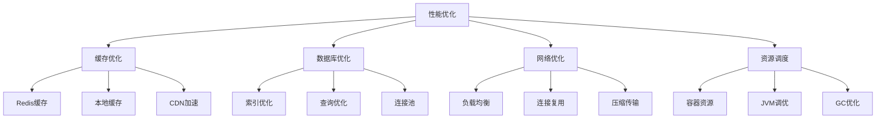

# 9. 性能优化方案

## 9.1 性能优化概述

### 9.1.1 性能目标

葛洲坝船闸导航系统的性能优化目标：

- **响应时间**：API响应时间 < 100ms
- **吞吐量**：支持1000+并发请求/秒
- **可用性**：99.9%系统可用性
- **资源利用率**：CPU < 70%, 内存 < 80%
- **数据库性能**：查询响应时间 < 50ms

### 9.1.2 性能优化策略



## 9.2 缓存策略

### 9.2.1 多级缓存架构

```go
// 多级缓存管理器
type MultiLevelCache struct {
    l1Cache  *LocalCache
    l2Cache  *RedisCache
    l3Cache  *DatabaseCache
    logger   *zap.Logger
    tracer   trace.Tracer
    metrics  *MetricsCollector
}

func NewMultiLevelCache(deps Dependencies) *MultiLevelCache {
    return &MultiLevelCache{
        l1Cache: deps.LocalCache,
        l2Cache: deps.RedisCache,
        l3Cache: deps.DatabaseCache,
        logger:  deps.Logger,
        tracer:  deps.Tracer,
        metrics: deps.Metrics,
    }
}

// 获取数据
func (mlc *MultiLevelCache) Get(ctx context.Context, key string) (interface{}, error) {
    ctx, span := mlc.tracer.Start(ctx, "multilevel_cache_get")
    defer span.End()
    
    span.SetAttributes(attribute.String("cache.key", key))
    
    // L1缓存查询
    if value, err := mlc.l1Cache.Get(ctx, key); err == nil {
        mlc.metrics.RecordCacheHit(ctx, "l1", key)
        return value, nil
    }
    
    // L2缓存查询
    if value, err := mlc.l2Cache.Get(ctx, key); err == nil {
        // 回填L1缓存
        mlc.l1Cache.Set(ctx, key, value, 5*time.Minute)
        mlc.metrics.RecordCacheHit(ctx, "l2", key)
        return value, nil
    }
    
    // L3缓存查询
    if value, err := mlc.l3Cache.Get(ctx, key); err == nil {
        // 回填L1和L2缓存
        mlc.l1Cache.Set(ctx, key, value, 5*time.Minute)
        mlc.l2Cache.Set(ctx, key, value, 30*time.Minute)
        mlc.metrics.RecordCacheHit(ctx, "l3", key)
        return value, nil
    }
    
    mlc.metrics.RecordCacheMiss(ctx, key)
    return nil, fmt.Errorf("key not found: %s", key)
}

// 设置数据
func (mlc *MultiLevelCache) Set(ctx context.Context, key string, value interface{}, ttl time.Duration) error {
    ctx, span := mlc.tracer.Start(ctx, "multilevel_cache_set")
    defer span.End()
    
    span.SetAttributes(attribute.String("cache.key", key))
    
    // 同时设置到所有缓存层
    var errors []error
    
    if err := mlc.l1Cache.Set(ctx, key, value, ttl); err != nil {
        errors = append(errors, fmt.Errorf("l1 cache set failed: %w", err))
    }
    
    if err := mlc.l2Cache.Set(ctx, key, value, ttl); err != nil {
        errors = append(errors, fmt.Errorf("l2 cache set failed: %w", err))
    }
    
    if err := mlc.l3Cache.Set(ctx, key, value, ttl); err != nil {
        errors = append(errors, fmt.Errorf("l3 cache set failed: %w", err))
    }
    
    if len(errors) > 0 {
        return fmt.Errorf("cache set errors: %v", errors)
    }
    
    mlc.metrics.RecordCacheSet(ctx, key)
    return nil
}
```

### 9.2.2 缓存预热

```go
// 缓存预热器
type CacheWarmer struct {
    cacheManager *MultiLevelCache
    dataSource   DataSource
    logger       *zap.Logger
    tracer       trace.Tracer
    metrics      *MetricsCollector
}

func NewCacheWarmer(deps Dependencies) *CacheWarmer {
    return &CacheWarmer{
        cacheManager: deps.CacheManager,
        dataSource:   deps.DataSource,
        logger:       deps.Logger,
        tracer:       deps.Tracer,
        metrics:      deps.Metrics,
    }
}

// 预热设备数据
func (cw *CacheWarmer) WarmupDeviceData(ctx context.Context) error {
    ctx, span := cw.tracer.Start(ctx, "warmup_device_data")
    defer span.End()
    
    // 获取所有活跃设备
    devices, err := cw.dataSource.GetActiveDevices(ctx)
    if err != nil {
        return fmt.Errorf("failed to get active devices: %w", err)
    }
    
    // 并发预热
    semaphore := make(chan struct{}, 10) // 限制并发数
    var wg sync.WaitGroup
    var errors []error
    var mu sync.Mutex
    
    for _, device := range devices {
        wg.Add(1)
        go func(d *Device) {
            defer wg.Done()
            
            semaphore <- struct{}{}
            defer func() { <-semaphore }()
            
            if err := cw.warmupDevice(ctx, d); err != nil {
                mu.Lock()
                errors = append(errors, fmt.Errorf("device %s: %w", d.ID, err))
                mu.Unlock()
            }
        }(device)
    }
    
    wg.Wait()
    
    if len(errors) > 0 {
        cw.logger.Warn("缓存预热部分失败",
            zap.Int("total_devices", len(devices)),
            zap.Int("failed_devices", len(errors)),
        )
    }
    
    cw.metrics.RecordCacheWarmup(ctx, len(devices), len(errors))
    
    return nil
}

// 预热单个设备
func (cw *CacheWarmer) warmupDevice(ctx context.Context, device *Device) error {
    // 预热设备状态
    status, err := cw.dataSource.GetDeviceStatus(ctx, device.ID)
    if err != nil {
        return err
    }
    
    key := fmt.Sprintf("device:status:%s", device.ID)
    if err := cw.cacheManager.Set(ctx, key, status, 5*time.Minute); err != nil {
        return err
    }
    
    // 预热设备配置
    config, err := cw.dataSource.GetDeviceConfig(ctx, device.ID)
    if err != nil {
        return err
    }
    
    key = fmt.Sprintf("device:config:%s", device.ID)
    if err := cw.cacheManager.Set(ctx, key, config, 30*time.Minute); err != nil {
        return err
    }
    
    return nil
}
```

## 9.3 数据库优化

### 9.3.1 查询优化

```go
// 查询优化器
type QueryOptimizer struct {
    db          *sql.DB
    queryCache  *QueryCache
    logger      *zap.Logger
    tracer      trace.Tracer
    metrics     *MetricsCollector
}

func NewQueryOptimizer(deps Dependencies) *QueryOptimizer {
    return &QueryOptimizer{
        db:         deps.Database,
        queryCache: deps.QueryCache,
        logger:     deps.Logger,
        tracer:     deps.Tracer,
        metrics:    deps.Metrics,
    }
}

// 优化查询
func (qo *QueryOptimizer) OptimizeQuery(ctx context.Context, query string, params []interface{}) (*OptimizedQuery, error) {
    ctx, span := qo.tracer.Start(ctx, "optimize_query")
    defer span.End()
    
    span.SetAttributes(attribute.String("query", query))
    
    // 检查查询缓存
    cacheKey := qo.generateCacheKey(query, params)
    if cached, err := qo.queryCache.Get(ctx, cacheKey); err == nil {
        qo.metrics.RecordQueryCacheHit(ctx)
        return cached.(*OptimizedQuery), nil
    }
    
    // 分析查询计划
    plan, err := qo.analyzeQueryPlan(ctx, query)
    if err != nil {
        return nil, fmt.Errorf("query plan analysis failed: %w", err)
    }
    
    // 优化查询
    optimized := qo.optimizeQueryPlan(ctx, plan, params)
    
    // 缓存优化结果
    qo.queryCache.Set(ctx, cacheKey, optimized, 1*time.Hour)
    
    qo.metrics.RecordQueryOptimized(ctx)
    
    return optimized, nil
}

// 分析查询计划
func (qo *QueryOptimizer) analyzeQueryPlan(ctx context.Context, query string) (*QueryPlan, error) {
    // 使用EXPLAIN分析查询计划
    explainQuery := "EXPLAIN (ANALYZE, BUFFERS, FORMAT JSON) " + query
    
    rows, err := qo.db.QueryContext(ctx, explainQuery)
    if err != nil {
        return nil, fmt.Errorf("failed to explain query: %w", err)
    }
    defer rows.Close()
    
    var planJSON string
    if rows.Next() {
        if err := rows.Scan(&planJSON); err != nil {
            return nil, fmt.Errorf("failed to scan plan: %w", err)
        }
    }
    
    // 解析查询计划
    var plan QueryPlan
    if err := json.Unmarshal([]byte(planJSON), &plan); err != nil {
        return nil, fmt.Errorf("failed to parse plan: %w", err)
    }
    
    return &plan, nil
}

// 优化查询计划
func (qo *QueryOptimizer) optimizeQueryPlan(ctx context.Context, plan *QueryPlan, params []interface{}) *OptimizedQuery {
    optimized := &OptimizedQuery{
        OriginalQuery: plan.Query,
        Optimizations: make([]Optimization, 0),
    }
    
    // 检查是否需要索引
    if plan.ScanType == "Seq Scan" && plan.Rows > 1000 {
        optimized.Optimizations = append(optimized.Optimizations, Optimization{
            Type:        "index_suggestion",
            Description: "Consider adding index for better performance",
            Impact:      "high",
        })
    }
    
    // 检查连接优化
    if plan.Joins > 3 {
        optimized.Optimizations = append(optimized.Optimizations, Optimization{
            Type:        "join_optimization",
            Description: "Consider optimizing joins or using materialized views",
            Impact:      "medium",
        })
    }
    
    // 检查分页优化
    if plan.Limit > 1000 {
        optimized.Optimizations = append(optimized.Optimizations, Optimization{
            Type:        "pagination_optimization",
            Description: "Consider using keyset pagination for large result sets",
            Impact:      "medium",
        })
    }
    
    return optimized
}
```

### 9.3.2 连接池优化

```yaml
# 数据库连接池配置
apiVersion: v1
kind: ConfigMap
metadata:
  name: database-pool-config
  namespace: navlock-system
data:
  database.conf: |
    [database]
    # 连接池配置
    max_connections = 100
    min_connections = 10
    connection_timeout = 30s
    idle_timeout = 300s
    max_lifetime = 3600s
    
    # 查询超时配置
    query_timeout = 30s
    statement_timeout = 60s
    
    # 连接池监控
    pool_monitoring = true
    pool_stats_interval = 60s
```

```go
// 连接池管理器
type ConnectionPoolManager struct {
    pool    *sql.DB
    config  *PoolConfig
    logger  *zap.Logger
    tracer  trace.Tracer
    metrics *MetricsCollector
}

func NewConnectionPoolManager(deps Dependencies) *ConnectionPoolManager {
    return &ConnectionPoolManager{
        pool:    deps.Database,
        config:  deps.PoolConfig,
        logger:  deps.Logger,
        tracer:  deps.Tracer,
        metrics: deps.Metrics,
    }
}

// 配置连接池
func (cpm *ConnectionPoolManager) ConfigurePool(ctx context.Context) error {
    ctx, span := cpm.tracer.Start(ctx, "configure_connection_pool")
    defer span.End()
    
    // 设置最大连接数
    cpm.pool.SetMaxOpenConns(cpm.config.MaxConnections)
    
    // 设置最小连接数
    cpm.pool.SetMaxIdleConns(cpm.config.MinConnections)
    
    // 设置连接超时
    cpm.pool.SetConnMaxLifetime(cpm.config.MaxLifetime)
    
    // 设置空闲超时
    cpm.pool.SetConnMaxIdleTime(cpm.config.IdleTimeout)
    
    cpm.logger.Info("连接池配置完成",
        zap.Int("max_connections", cpm.config.MaxConnections),
        zap.Int("min_connections", cpm.config.MinConnections),
        zap.Duration("max_lifetime", cpm.config.MaxLifetime),
    )
    
    return nil
}

// 监控连接池状态
func (cpm *ConnectionPoolManager) MonitorPool(ctx context.Context) {
    ticker := time.NewTicker(cpm.config.StatsInterval)
    defer ticker.Stop()
    
    for {
        select {
        case <-ctx.Done():
            return
        case <-ticker.C:
            cpm.collectPoolStats(ctx)
        }
    }
}

// 收集连接池统计信息
func (cpm *ConnectionPoolManager) collectPoolStats(ctx context.Context) {
    stats := cpm.pool.Stats()
    
    cpm.metrics.RecordPoolStats(ctx, &PoolStats{
        MaxOpenConnections: stats.MaxOpenConnections,
        OpenConnections:    stats.OpenConnections,
        InUse:              stats.InUse,
        Idle:               stats.Idle,
        WaitCount:          stats.WaitCount,
        WaitDuration:       stats.WaitDuration,
        MaxIdleClosed:      stats.MaxIdleClosed,
        MaxLifetimeClosed:  stats.MaxLifetimeClosed,
    })
    
    // 检查连接池健康状态
    if stats.InUse > stats.MaxOpenConnections*80/100 {
        cpm.logger.Warn("连接池使用率过高",
            zap.Int("in_use", stats.InUse),
            zap.Int("max_open", stats.MaxOpenConnections),
        )
    }
    
    if stats.WaitCount > 0 {
        cpm.logger.Warn("连接池等待连接",
            zap.Int64("wait_count", stats.WaitCount),
            zap.Duration("wait_duration", stats.WaitDuration),
        )
    }
}
```

## 9.4 网络优化

### 9.4.1 负载均衡

```yaml
# Istio负载均衡配置
apiVersion: networking.istio.io/v1alpha3
kind: DestinationRule
metadata:
  name: navlock-load-balancing
  namespace: navlock-system
spec:
  host: "*.navlock-system.svc.cluster.local"
  trafficPolicy:
    loadBalancer:
      simple: LEAST_CONN
    connectionPool:
      tcp:
        maxConnections: 100
        connectTimeout: 30ms
        tcpKeepalive:
          time: 7200s
          interval: 75s
          probes: 9
      http:
        http2MaxRequests: 1000
        maxRequestsPerConnection: 10
        maxRetries: 3
        idleTimeout: 1800s
    outlierDetection:
      consecutive5xxErrors: 5
      interval: 10s
      baseEjectionTime: 30s
      maxEjectionPercent: 10
```

### 9.4.2 连接复用

```go
// HTTP客户端优化
type OptimizedHTTPClient struct {
    client  *http.Client
    logger  *zap.Logger
    tracer  trace.Tracer
    metrics *MetricsCollector
}

func NewOptimizedHTTPClient(deps Dependencies) *OptimizedHTTPClient {
    // 配置传输层
    transport := &http.Transport{
        MaxIdleConns:        100,
        MaxIdleConnsPerHost: 10,
        IdleConnTimeout:     90 * time.Second,
        DisableCompression:  false,
        DisableKeepAlives:   false,
        ForceAttemptHTTP2:   true,
    }
    
    // 配置客户端
    client := &http.Client{
        Transport: transport,
        Timeout:   30 * time.Second,
    }
    
    return &OptimizedHTTPClient{
        client:  client,
        logger:  deps.Logger,
        tracer:  deps.Tracer,
        metrics: deps.Metrics,
    }
}

// 优化的HTTP请求
func (ohc *OptimizedHTTPClient) Do(ctx context.Context, req *http.Request) (*http.Response, error) {
    ctx, span := ohc.tracer.Start(ctx, "optimized_http_request")
    defer span.End()
    
    span.SetAttributes(
        attribute.String("http.method", req.Method),
        attribute.String("http.url", req.URL.String()),
    )
    
    // 设置连接复用头
    req.Header.Set("Connection", "keep-alive")
    req.Header.Set("Keep-Alive", "timeout=90, max=1000")
    
    // 设置压缩
    req.Header.Set("Accept-Encoding", "gzip, deflate")
    
    start := time.Now()
    resp, err := ohc.client.Do(req)
    duration := time.Since(start)
    
    if err != nil {
        ohc.metrics.RecordHTTPRequestFailure(ctx, req.URL.Host, duration)
        return nil, err
    }
    
    ohc.metrics.RecordHTTPRequestSuccess(ctx, req.URL.Host, duration, resp.StatusCode)
    
    return resp, nil
}
```

## 9.5 资源调度

### 9.5.1 容器资源优化

```yaml
# 容器资源配置
apiVersion: apps/v1
kind: Deployment
metadata:
  name: navlock-service-optimized
  namespace: navlock-system
spec:
  replicas: 3
  selector:
    matchLabels:
      app: navlock-service
  template:
    metadata:
      labels:
        app: navlock-service
    spec:
      containers:
      - name: navlock-service
        image: navlock/navlock-service:latest
        resources:
          requests:
            memory: "512Mi"
            cpu: "500m"
          limits:
            memory: "1Gi"
            cpu: "1000m"
        env:
        - name: GOMAXPROCS
          value: "2"
        - name: GOGC
          value: "50"
        - name: GOMEMLIMIT
          value: "800MiB"
        livenessProbe:
          httpGet:
            path: /health
            port: 8080
          initialDelaySeconds: 30
          periodSeconds: 10
          timeoutSeconds: 5
        readinessProbe:
          httpGet:
            path: /ready
            port: 8080
          initialDelaySeconds: 5
          periodSeconds: 5
          timeoutSeconds: 3
        lifecycle:
          preStop:
            exec:
              command: ["/bin/sh", "-c", "sleep 10"]
```

### 9.5.2 自动扩缩容

```yaml
# HPA配置
apiVersion: autoscaling/v2
kind: HorizontalPodAutoscaler
metadata:
  name: navlock-service-hpa
  namespace: navlock-system
spec:
  scaleTargetRef:
    apiVersion: apps/v1
    kind: Deployment
    name: navlock-service-optimized
  minReplicas: 3
  maxReplicas: 20
  metrics:
  - type: Resource
    resource:
      name: cpu
      target:
        type: Utilization
        averageUtilization: 70
  - type: Resource
    resource:
      name: memory
      target:
        type: Utilization
        averageUtilization: 80
  - type: Object
    object:
      metric:
        name: requests-per-second
      describedObject:
        apiVersion: networking.k8s.io/v1
        kind: Ingress
        name: navlock-ingress
      target:
        type: Value
        value: "1000"
  behavior:
    scaleDown:
      stabilizationWindowSeconds: 300
      policies:
      - type: Percent
        value: 10
        periodSeconds: 60
    scaleUp:
      stabilizationWindowSeconds: 60
      policies:
      - type: Percent
        value: 100
        periodSeconds: 15
```

## 9.6 性能监控

### 9.6.1 性能指标收集

```go
// 性能监控器
type PerformanceMonitor struct {
    metricsCollector *MetricsCollector
    logger           *zap.Logger
    tracer           trace.Tracer
}

func NewPerformanceMonitor(deps Dependencies) *PerformanceMonitor {
    return &PerformanceMonitor{
        metricsCollector: deps.MetricsCollector,
        logger:           deps.Logger,
        tracer:           deps.Tracer,
    }
}

// 监控API性能
func (pm *PerformanceMonitor) MonitorAPIPerformance(ctx context.Context, handler http.HandlerFunc) http.HandlerFunc {
    return func(w http.ResponseWriter, r *http.Request) {
        start := time.Now()
        
        // 包装ResponseWriter以捕获状态码
        wrappedWriter := &responseWriter{ResponseWriter: w, statusCode: 200}
        
        // 执行处理器
        handler(wrappedWriter, r)
        
        // 记录性能指标
        duration := time.Since(start)
        
        pm.metricsCollector.RecordAPIPerformance(ctx, &APIPerformanceMetrics{
            Path:       r.URL.Path,
            Method:     r.Method,
            StatusCode: wrappedWriter.statusCode,
            Duration:   duration,
            Timestamp:  time.Now(),
        })
        
        // 检查性能阈值
        if duration > 100*time.Millisecond {
            pm.logger.Warn("API响应时间过长",
                zap.String("path", r.URL.Path),
                zap.String("method", r.Method),
                zap.Duration("duration", duration),
            )
        }
    }
}

// 监控数据库性能
func (pm *PerformanceMonitor) MonitorDatabasePerformance(ctx context.Context, query string, duration time.Duration, err error) {
    pm.metricsCollector.RecordDatabasePerformance(ctx, &DatabasePerformanceMetrics{
        Query:     query,
        Duration:  duration,
        Error:     err != nil,
        Timestamp: time.Now(),
    })
    
    if duration > 50*time.Millisecond {
        pm.logger.Warn("数据库查询时间过长",
            zap.String("query", query),
            zap.Duration("duration", duration),
        )
    }
    
    if err != nil {
        pm.logger.Error("数据库查询失败",
            zap.String("query", query),
            zap.Error(err),
        )
    }
}
```

## 9.7 总结

性能优化方案为葛洲坝船闸导航系统提供了全面的性能提升能力。通过缓存优化、数据库优化、网络优化、资源调度等技术，系统获得了：

**核心优势：**
1. **响应速度**：多级缓存和查询优化提升响应速度
2. **吞吐能力**：连接池和负载均衡提升并发处理能力
3. **资源效率**：智能资源调度和自动扩缩容
4. **监控能力**：全面的性能监控和告警
5. **可扩展性**：水平扩展和垂直扩展能力

**实施建议：**
1. 渐进式优化，先瓶颈再全面优化
2. 建立完善的性能监控体系
3. 制定性能基准和SLA
4. 建立性能测试和压测机制
5. 定期进行性能分析和优化

这个性能优化方案为系统的高性能运行提供了强有力的支撑，是现代化系统不可或缺的重要组成部分。 